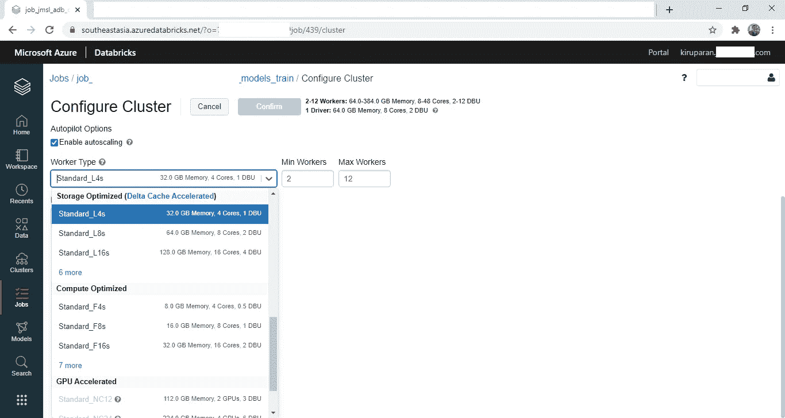
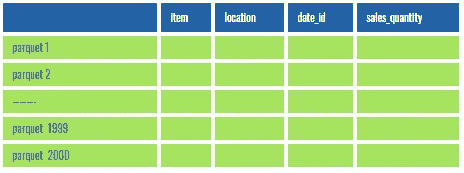
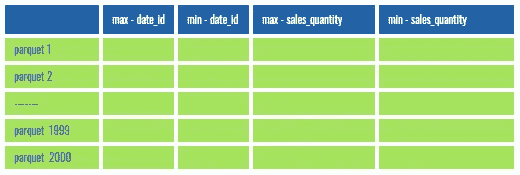

# Delta Lake —除了 ACID 属性之外，还支持有效的缓存机制和查询优化

> 原文：<https://towardsdatascience.com/delta-lake-enables-effective-caching-mechanism-and-query-optimization-in-addition-to-acid-96c216b95134?source=collection_archive---------31----------------------->

## 数据科学家更喜欢使用三角洲湖进行更快的实验。

学会从别人的角度看问题(来自 [Pexels](https://www.pexels.com/) 的[杰米](https://www.pexels.com/@jaime-reimer-1376930?utm_content=attributionCopyText&utm_medium=referral&utm_source=pexels)摄影)

我在目前的工作中从事建立不同粒度的不同机器学习模型，其中有几个粒度很高。更具体地说，这种模型需要对许多假设进行评估。最近，我不得不建立 22 个不同的模型，每个模型都用 6000 万个数据点训练，有 2000 个特征。它还需要多次反复进行超参数调整。作为一个团队，我们有各种各样的假设，我们需要评估每一个假设。为此，我们必须训练一个模型并评估其准确性以验证假设。如果这行得通，我们需要将同样的假设应用于剩余的 21 个模型。

## 我是怎么接近的？

因为我接收的是 parquet 格式的数据，所以我最终使用 parquet 来训练模型。训练一个模型需要几天时间，验证一个假设需要几周时间。我测试了许多减少计算时间的方法，但没有一个是有效的。最后，我使用 Delta 作为数据格式，而不是 parquet。

在本文中，我们将分析有助于减少训练到模型的计算时间的具体特性。

## 三角洲湖

Delta lake 是一个开源存储层，在分布式环境中启用 ACID 属性。在接下来的小节中，我将使用一个简短的介绍来探索更多关于 delta 格式的内容。

## 大多数人普遍关心的问题

***delta lake 的目的是支持 ACID 属性——您如何减少训练模型的计算时间？***

这是我被问到的第一个问题。是的，Databricks 为希望通过多个群集同时读写文件的特定客户开发了此存储层。

三角洲湖不限于以上；它还消除了数据科学家和数据工程师面临的一些其他障碍。

1.  数据跳过:使用增量文件，您不需要扫描整个数据。随着新数据被插入到 Databricks 增量表中，将收集所有列的文件级最小/最大统计信息，这有助于有效地过滤文件。
2.  Z -order:除了数据跳转之外，Z-order 还支持多维数据跳转。
3.  高效缓存:增量缓存通过使用快速中间数据格式在节点的本地存储中创建远程文件的副本来加速数据读取。
4.  可扩展的元数据处理:在大数据世界中，即使元数据也具有大数据的特征。Delta 将元数据视为大数据(即，它使 spark 能够以分布式方式处理元数据)。
5.  时间旅行:Delta 支持数据版本化。
6.  批处理和流的统一平台:delta lake 中的表可以接收(也可以处理)批处理和流数据。
7.  更新和删除:Delta Lake 支持 Scala/Java API 来合并、更新和删除数据集。

delta 文件格式有许多特点。然而，在本文中，我们深入探讨了以下实现更快数据处理的方法:

1.  有效缓存
2.  数据跳过
3.  z 顺序

## 使用增量缓存存储的数据比 Spark 缓存快得多

我们都将缓存作为查询优化的一部分，那么增量缓存有什么不同呢？Azure databricks 提供了两种缓存类型。

1) Apache Spark 缓存

它使用内存中的火花。由于可用内存有限，它会影响 spark 中运行的其他操作。

2)增量缓存

它使用本地磁盘。因为它不使用内存，所以在 spark 中运行的其他操作不会受到影响。尽管 delta 使用本地磁盘来缓存数据，但由于其独特的解压缩算法，它仍然非常有效。这可以通过使用“增量缓存加速”工作线程来进一步优化。默认情况下启用增量缓存，workers 中的 SSD 配置为有效使用增量缓存。下面的屏幕截图详细说明了如何在 databricks 环境中选择启用了“增量缓存加速”的工作线程。你必须选择 L 型工人，如下所示。

增量缓存加速工人-按作者分类的图片

## 数据跳过

**镶木地板**

通常，该表存储为多个拼花文件。假设有一个场景，其中有一个名为“sales”的表

1.  它有如下四列:“项目”、“位置”、“日期标识”和“销售数量”
2.  它拥有分布在 2000 个拼花文件中的 6000 万个数据点。

“销售”表—按作者分类的图像

假设有一个查询要过滤 1 月 1 日到 6 日的销售额。

该查询执行扫描所有 2000 个文件来过滤结果。

**在三角洲**

假设我们使用 delta 格式存储上面的文件。在这种情况下，每个文件的每一列都有一个最小值和最大值，这是 delta 格式的一个固有特性。

带有增量格式附加列的“销售”表—按作者分类的图像

对增量格式运行的相同查询使用这些最小/最大值来跳过文件。因此，需要扫描的拼花文件少于 2000 个(很可能少于 500 个)。因此，它大大减少了计算时间。

## z-排序

z 排序是一种多维(基于多列)聚类拼花文件的方法。它使我们能够跳过更多的扫描。

**Z 排序在哪里效果更好？**

回到我的问题陈述，我被要求构建 22 个不同的模型，但是模型的粒度是相同的(例如，模型预测给定地点给定日期给定商品的销售)。简单来说，Spark 会以相同的粒度多次使用我的训练数据。

您可以使用以下代码简单地优化 Z 顺序:

上面的代码将相关的信息(这里，相似性是根据以下几列决定的——“项目”、“位置”和“日期 id”)放在同一个文件集中。

同样的查询用“ZORDER”优化重新运行，跳过更多的文件，查询执行起来比以前快得多。

## 最后的想法

尽管 databricks 开发了 delta lake 来启用 ACID 属性，但它还包括其他功能，如有效的缓存、数据跳过和 Z 顺序优化。这些附加功能有助于以分布式方式在更短的时间内处理数据。本文关注的是 delta lake 如何加速数据处理，因此，我跳过了 delta lake 提供的其他有趣的功能，如可伸缩的元数据处理、时间旅行、批处理和流的统一平台，以及更新和删除。接下来的文章将详细讨论这些特性。