# 用时态卷积网络研究数字运算

> 原文：<https://towardsdatascience.com/delve-into-number-crunching-of-temporal-convolutional-network-db3c3dc69f63?source=collection_archive---------35----------------------->

## TCN 如何处理你的输入的可视化文档

[蒂姆·约翰逊](https://unsplash.com/@mangofantasy?utm_source=medium&utm_medium=referral)在 [Unsplash](https://unsplash.com?utm_source=medium&utm_medium=referral) 上拍照

时间卷积网络(TCN)是一种神经网络，**专门处理序列数据问题**。**这是除了长短期记忆(LSTM)或门控循环单元(GRU)** 或另一个解决相同问题的循环神经网络(RNN)之外的另一种选择。与另一种神经网络相比，TCN 有什么不同或特别之处？ **TCN 不是 RNN，**它没有使用单元格状态，有一个类似循环的工作流。它使用全卷积网络(FCN)进行处理。FCN 和普通卷积层有什么区别？FCN 根本没有使用密集层(通常是神经网络的隐藏层)。

为了理解神经网络的卷积层，可视化非常重要。和 TCN 一样，在这里我将尝试用真实的数字来想象 TCN“发生了什么”。为了更容易理解和可视化，**我们将只使用 1 个输出通道**。此外，我们将使用 2 个隐藏层和 1 个输出层。好了，我们开始吧。

## 选择一个任意的数字序列(在 0 和 1 的范围内)

我们用 excel 写吧。我们将挑选 11 个数字。

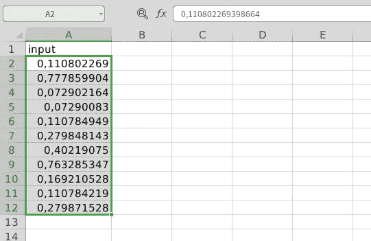

**为我们的卷积层滤波器选择一个任意的数字序列**

因为我们的数据是一维的，所以我们将使用 1×3 维的过滤器。

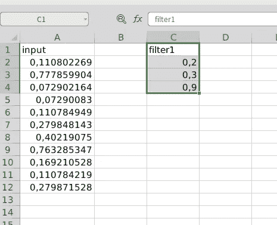

作者图片

**滑动过滤器浏览输入数据**

这里，我们将逐个滑动滤波器，对输入数据进行点积，并在输入数据的末尾添加长度为`(length of filter — 1)*dilation`的填充。在第一层，我们将膨胀设为 1。稍后我会解释膨胀。总之**，我们输出的长度将与输入数据**的长度相同。

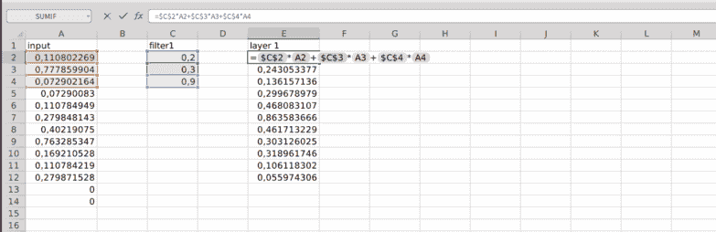

作者图片

**为卷积层的第二个滤波器选择一个任意的数字序列**

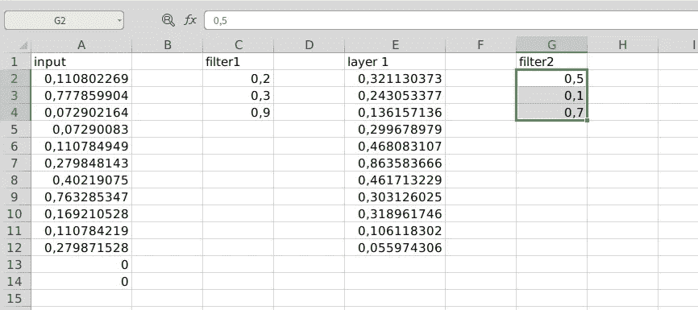

作者图片

并添加填充(在下一层，将膨胀为 2，所以(3–1)* 2 = 4)。

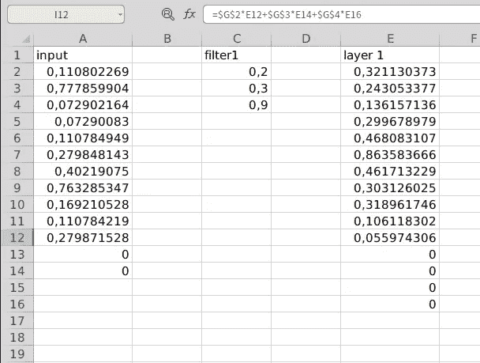

作者图片

**滑动第二个过滤器通过第一层数据**

但是我们将卷积的膨胀增加到 2。层的膨胀在`2^(layer-1)`中增加(2 的层级别的幂减 1)。第一层的膨胀是 1，现在是 2。为了更好地理解膨胀，最好看看下面的动画。

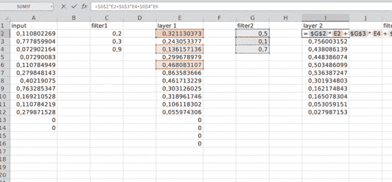

作者图片

**为卷积层的输出层滤波器选择一个任意的数字序列，并添加填充**

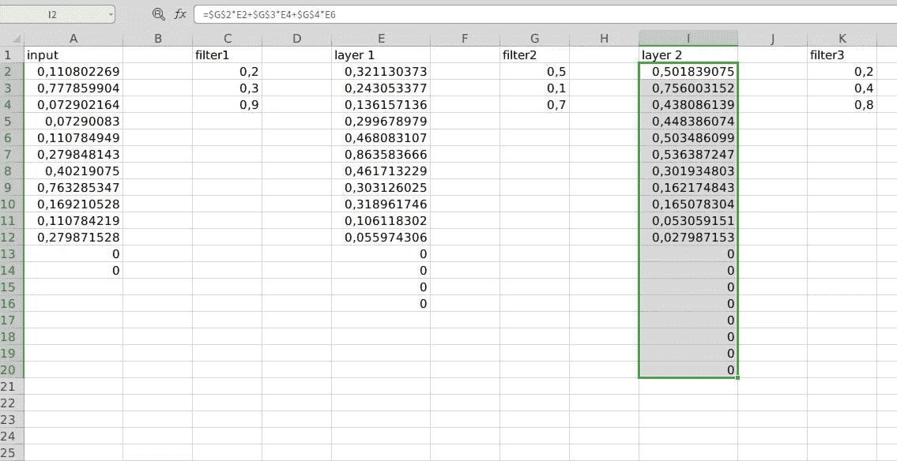

作者图片

**通过第二层数据滑动输出层(第三层)过滤器**

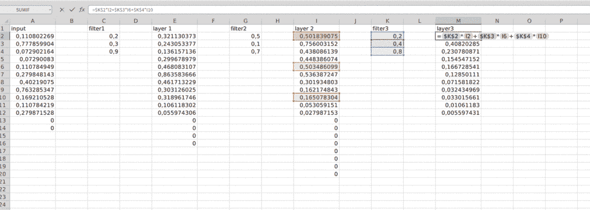

作者图片

**提取输出值**

并且输出值是层 3 中的第一个值。

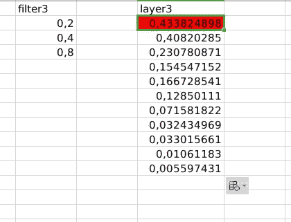

作者图片

为什么？因为只有这个值在计算中涉及到我们所有的输入数据。

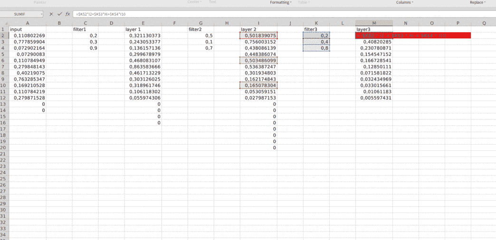

作者图片

将其与输出图层中的第二个值进行比较。

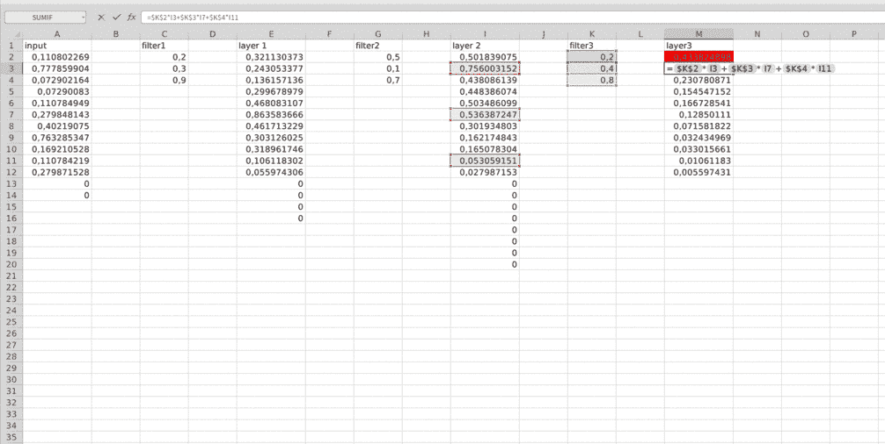

作者图片

它不涉及输入层中的第一个数字。所以为什么输出层的第一个值更适合成为我们模型的输出。

现在，在真实的 TCN 中，人们通常使用残差网络(ResNet)进行层间运算。它是如何工作的，真的很简单。我们**只是将卷积层的输出与经过 1x1 滤波器**处理的前一层中的值相加。这是插图。

**首先，我们为第 1 层**的 1x1 ResNet 过滤器选择一个数字

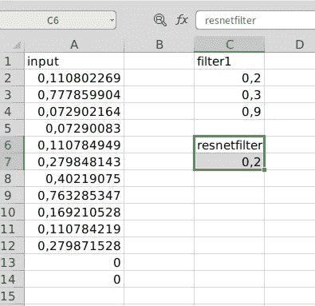

作者图片

**然后将其滑过输入层**

它只是`resnetfilter*input`

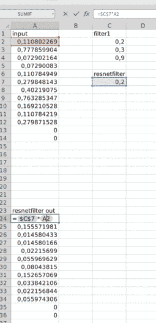

作者图片

**然后将其添加到层 1 的输出**

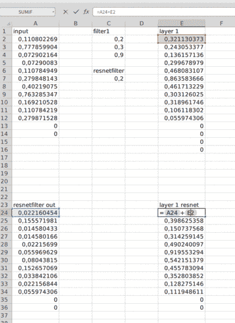

作者图片

**重复此过程，直到最后一层**

通常，在 ResNet 块(使用 ResNet 的层间处理块)中，我们在处理结束时使用 ReLU。所以在添加它们之后，我们将它们提供给 ReLU 层。 **ReLU 只是将所有小于零的值归零，否则我们保持该值**。

这就是 TCN 如何将你输入转化为输出。如果你**使用一个以上的通道进行输出，实际输出层必须是一个密集层**以使用每个通道的所有第一个值计算实际输出**。另一篇文章再见。**