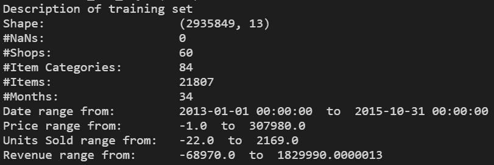
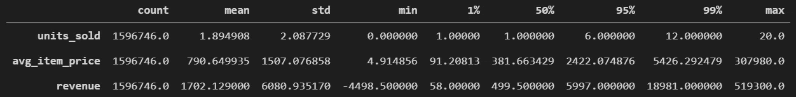
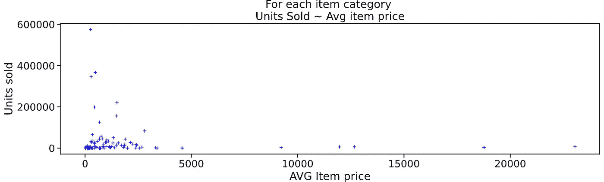
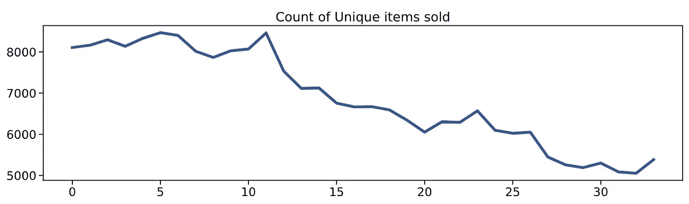
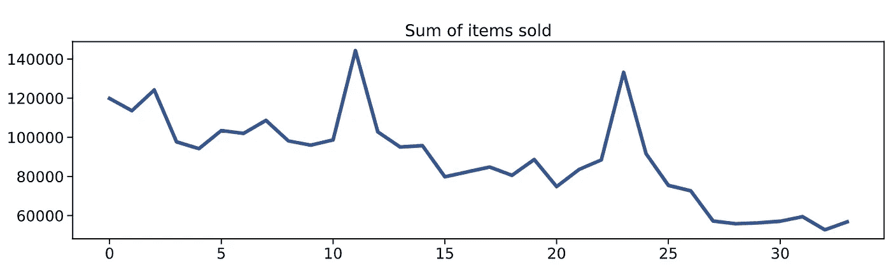
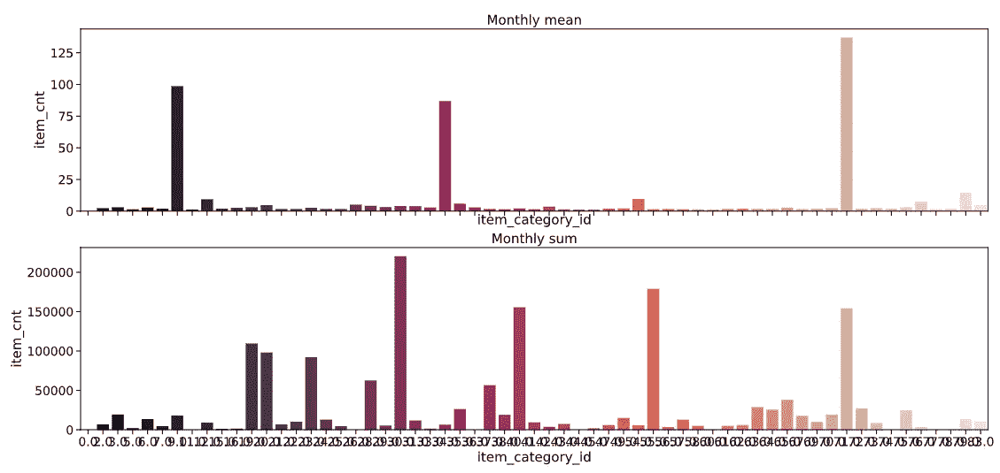
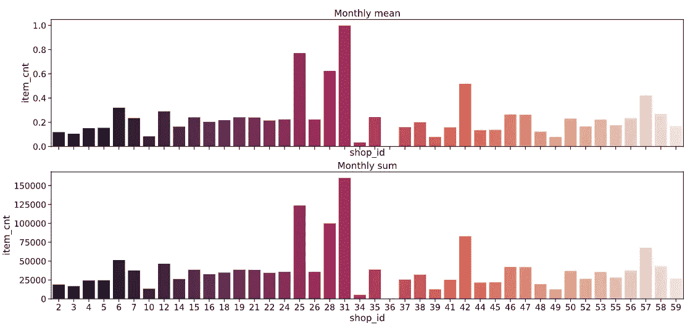
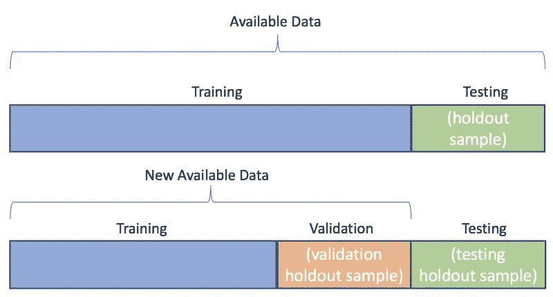
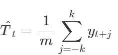
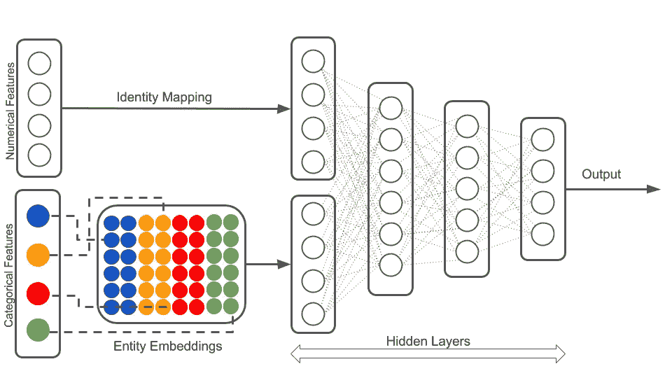

# 用不同的数据科学方法进行需求预测

> 原文：<https://towardsdatascience.com/demand-forecast-with-different-data-science-approaches-ba3703a0afb6?source=collection_archive---------4----------------------->

## 需求预测中的数据科学


杰斯·贝利在 [Unsplash](https://unsplash.com?utm_source=medium&utm_medium=referral) 上的照片

在这个故事中，我将概述常见的数据科学技术和框架，以创建一个需求预测模型。

首先，让我们定义什么是需求预测，它对业务有什么影响。维基[说](https://en.wikipedia.org/wiki/Demand_forecasting)——**需求预测**是预测分析的一个领域，它试图理解和预测客户需求，以优化企业供应链和业务管理的供应决策

需求预测有几种类型:

*   **(它是进行 3 个月到 12 个月的短期。在短期内，需求的季节性模式和战术决策对客户需求的影响被考虑在内。)**
*   ***(一般提前 12 个月以上至 24 个月进行(某些业务 36-48 个月)。长期预测推动业务战略规划、销售和营销规划、财务规划、容量规划、资本支出等。)***
*   *****外部宏观层面*** *(这种类型的预测处理依赖于宏观经济环境的更广泛的市场运动。进行外部预测是为了评估企业的战略目标，如产品组合扩张、进入新的客户群、技术中断、消费者行为模式转变和风险缓解策略。)***
*   ****(这种类型的预测处理企业的内部运作，如产品类别、销售部门、财务部门和制造部门。这包括年度销售预测、COGS 估算、净利润率、现金流等。)****
*   *****被动*** *(针对增长计划非常保守的稳定业务进行。历史数据的简单推断是在最少假设的情况下进行的。)***
*   ****)****

**为什么需求预测如此重要，它改进了什么流程？需求预测是公司制定战略和运营计划的关键业务流程。基于需求预测，制定企业的战略和长期计划，如预算、财务规划、销售和营销计划、容量规划、风险评估和缓解计划。它还会影响以下流程:**

*   **供应商关系管理。**
*   **客户关系管理。**
*   **订单履行和物流。**
*   **营销活动。**
*   **制造流程管理。**

**好了，让我们来解决这个问题，并尝试使用不同的数据科学技术和框架来进行准确的需求预测。**

**在我的实验中，我想使用 Kaggle 的[竞赛](https://www.kaggle.com/c/competitive-data-science-predict-future-sales/data)中的数据集。在每个数据科学任务中，我都使用 CRISP-DM 来跟踪项目工作中所有必要的流程。**

**CRISP-DM 的第一阶段是——业务理解。任务是为测试集预测每个商店销售的产品总量。衡量标准或成功标准是什么？预测由均方根误差(RMSE)评估。**

**对我来说，第二和第三阶段是最重要的阶段之一——数据理解和准备。启动需求预测项目的首要任务是为客户提供有意义的见解。该方法包括以下步骤:**

1.  **收集可用数据**

**在我们的例子中，我们得到了下一个数据集:**

*   **sales _ train.csv 训练集。2013 年 1 月至 2015 年 10 月的每日历史数据。**
*   **test.csv —测试集。你需要预测这些商店和产品在 2015 年 11 月的销售额。**
*   **sample_submission.csv —格式正确的示例提交文件。**
*   **items.csv 关于物品/产品的补充信息。**
*   **item _ categories.csv 关于项目类别的补充信息。**
*   **关于商店的补充信息。**

**简要回顾数据结构、准确性和一致性。让我们制作几个表和图来分析我们的数据集。**

****

**笔记本快照**

**这种基础分析可以帮助我们理解数据集的主要输入参数。例如，我们可以看到，在我们的数据集中，价格为负值，这可能是一个错误，销售为负值，这可能是з购买回报。**

**下表为我们解释了数字列的分布情况:**

****

**笔记本快照**

**这里我们可以看到，一半的销售额等于 1。**

**我们来做一个散点图，分析一下销量和价格的关系。**

****

**笔记本快照**

**这种类型的图通常可以告诉我们，我们有价格低但销量大的单元，也有价格异常高但销量非常低的单元。**

**让我们动态地分析我们的数据—**

*   **第一张图向我们展示了产品组合中独特产品的减少趋势:**

****

**笔记本快照**

*   **第二个图表显示了销售量下降的趋势和两个选择，这可能是一个季度或一些促销活动。这是我们需要从商业和通过定量分析中学习的。**

****

**笔记本快照**

*   **下一步是对我们的类别进行分析，我们将使用它来聚合我们的数据集，第一维是商品/类别名称，第二维是商店 id。该分析向我们展示了商品类别和商店的销量分布，有助于我们了解哪些类别和商店对我们最重要，哪些类别和商店的分析和预测历史较短。**

****

**笔记本快照**

****

**笔记本快照**

**EDA 是一个持续的过程，你可以在不同实验的整个过程中继续进行。让我们停止在这一点上，并开始创建模型。**

**在我们开始创建模型之前，我们需要分割数据集用于训练、验证和测试。请记住，我们需要使用日期列来过滤数据集，**不要对时间序列**使用随机分割。**

****

**数据分割示例**

## **基本方法**

**在这一部分，我将解释和创建基本的方法模型。**

**第一个是平滑移动平均线。平滑移动平均(SMMA)是一种需求预测模型，可用于根据连续期间的一系列平均值来判断趋势。**

**例如，六个月销售额的平滑移动平均值可以通过取 1 月到 6 月销售额的平均值、2 月到 7 月销售额的平均值、3 月到 8 月销售额的平均值等等来计算。**

**这种模型被称为“移动”,因为随着更多数据的出现，平均值会不断重新计算。**

**mm 阶的移动平均值可以写成:**

****

**乳胶快照**

**其中 m=2k+1m=2k+1。也就是说，在 tt 时间的趋势周期的估计是通过对 tt 的 kk 周期内的时间序列的值进行平均而获得的。时间上接近的观测值也可能接近。**

**平滑移动平均线对于查看一段时间内的总体销售趋势和帮助制定长期需求计划非常有用。季节性或其他波动导致的快速变化被消除，因此您可以更准确地分析全局。当你的产品随着时间的推移持续增长或下降时，平滑移动平均模型通常很有效。此外，这种方法的重要缺点是，我们可以制造没有历史的产品。**

**为了用 Python 制作，我们可以使用*熊猫。DataFrame.shift* 创建滞后值，**

```
**full_df['sales_lag_n'] = full_df['sales'].shift(periods=n)**
```

**然后我们可以用熊猫。DataFrame.rolling 根据创建的滞后值创建滚动平均值。**

```
**full_df['sma'] = full_df['sales_lag_n].rolling(n).mean()**
```

**下一个模型是霍尔特·温特的指数平滑法。[霍尔特](https://otexts.com/fpp2/bibliography.html#ref-Holt57) ( [1957](https://otexts.com/fpp2/bibliography.html#ref-Holt57) )和[温特斯](https://otexts.com/fpp2/bibliography.html#ref-Winters60) ( [1960](https://otexts.com/fpp2/bibliography.html#ref-Winters60) )扩展了霍尔特捕捉季节性的方法。霍尔特-温特斯季节性方法包括预测方程和三个平滑方程——一个用于水平ℓtℓt，一个用于趋势 bt，一个用于季节性成分 st，以及相应的平滑参数αα，β∑β∫和γγ。我们用 mm 来表示季节性的频率，即一年中的季节数。例如，季度数据 m=4m=4，月数据 m=12m=12。**

**这种方法有两种不同的变体，如季节性成分。当季节变化在整个系列中大致不变时，最好使用加法方法，而当季节变化与系列水平成比例变化时，最好使用乘法方法。在加法方法中，季节分量在观测序列的标度中以绝对值表示，在水平方程中，通过减去季节分量对序列进行季节调整。在每一年中，季节性因素加起来大约为零。使用乘法时，季节性成分以相对项(百分比)表示，序列通过除以季节性成分进行季节性调整。在每一年内，季节性成分的总和将达到约 100 万毫米**

**这种方法比前一种方法更有效，因为它处理季节成分，但它也有同样的缺点，即不处理分类中的新项目。**

**这个方法在 Python 中有一个实现**

```
****from** statsmodels.tsa.holtwinters **import** ExponentialSmoothing **as** HWES**
```

**这个模型适用于一双鞋，这意味着我们需要为每双鞋创建一个新的模型。**

```
**for index, row in tqdm(df_test.iterrows()): tmp = df_train_aggr[(df_train_aggr['shop_id'] == row['shop_id']) & (df_train_aggr['item_id'] == row['item_id'])] model = ExponentialSmoothing(tmp.item_cnt_day) model_fit = model.fit() forecast = model_fit.forecast(steps=n)**
```

**我的基本方法中的最后一个模型是 ARIMA。ARIMA 是“自回归综合移动平均”的缩写，它实际上是一类模型，根据给定时间序列的过去值(即其自身的滞后和滞后预测误差)来“解释”该时间序列，因此该方程可用于预测未来值。任何显示模式且不是随机白噪声的非季节性时间序列都可以用 ARIMA 模型来建模。**

**ARIMA 模型的特征在于三个项:p，d，q 其中，**

*   **p 是 AR 项的阶数**
*   **q 是 MA 项的顺序**
*   **d 是使时间序列平稳所需的差值数**

**如果一个时间序列有季节模式，那么你需要添加季节项，它就变成了萨里玛，是“季节性 ARIMA”的缩写。等我们结束 ARIMA 后会有更多的报道。和前面的模型一样，我将为每个商店商品对建立一个单独的模型。所以主要的想法是为我们的模型找到合适的参数。我不会详细描述如何计算每一个，但是你可以在这里找到它。在我的例子中，我想使用类似于[***auto . ARIMA***](https://www.rdocumentation.org/packages/forecast/versions/8.13/topics/auto.arima)***的东西。*** 我发现一个有趣的实现——[***pmdarima***](http://alkaline-ml.com/pmdarima/)。**

**" ***pmdarima*** "将 R 钟爱的 auto.arima 引入 Python，更有力地证明了为什么数据科学不需要 R。 ***pmdarima*** 是 100% Python + Cython，不利用任何 R 代码，而是在一组功能强大但易于使用的函数&类中实现，scikit-learn 用户将会很熟悉这些类。**

**代码将与前一个非常相似:**

```
**import pmdarima as pmfor index, row in tqdm(df_test.iterrows()): model = pm.auto_arima(tmp.item_cnt_day, start_p=1, start_q=1,  max_p=3, max_q=3, m=12,
start_P=0, seasonal=False,
d=1, D=1, trace=False,
error_action='ignore',  # don't want to know if an order does not work
suppress_warnings=True,  # don't want convergence warnings
stepwise=True)forecast = model_fit.predict(n_periods = n, return_conf_int=False)**
```

**ARIMA 是一个很强的模型，可以给出很好的预测。ARIMA 在预测极端值方面会受到限制。虽然该模型擅长模拟季节性和趋势，但离群值很难预测 ARIMA 的情况，因为它们不在该模型捕捉的总体趋势之内。**

**因此，经典的时间序列预测方法可能侧重于线性关系，然而，假设你的数据准备充分，方法配置良好，它们是复杂的，并在广泛的问题上表现良好。**

## **机器学习方法**

**机器学习与统计方法相结合的一个最常见的企业应用是预测分析。它不仅可以估计需求，还可以了解什么推动销售，以及客户在特定条件下可能的行为。使用机器学习模型进行需求预测的主要思想是生成许多有用的特征。**

**特征工程是使用领域知识数据和创建特征，使机器学习模型预测更准确。它能够更深入地理解数据和更有价值的见解。**

**该功能可以是:**

*   **产品/商店特征(来自商品字典的信息)**
*   **关于促销活动和任何价格变化的内部信息**
*   **分类变量的不同层次目标编码**
*   **日期功能**

**在我的实验中，我将使用以下 Python 库 CatBoost、XGBoost 和 H2O AML。**

**先说 XGBoost。**

```
**from xgboost import XGBRegressor**
```

**XGBoost 是一个优化的分布式梯度增强库，设计为高效、灵活和可移植。它在梯度推进框架下实现机器学习算法。XGBoost 本身不能处理分类特征，它只接受类似随机森林的数值。因此，在向 XGBoost 提供分类数据之前，必须执行各种编码，如标签编码、均值编码或一键编码。XGboost 拆分到指定的 ***max_depth*** 超参数，然后开始向后修剪树，并移除超出该范围没有正增益的拆分。它使用这种方法是因为有时无损失减少的分割之后可能是有损失减少的分割。XGBoost 还可以执行逐叶树生长。XGBoost 缺失值将被分配到在每次分割中减少损失的一侧。**

```
**# Trainmodel = XGBRegressor(max_depth=8,
n_estimators=1000,
min_child_weight=300,
colsample_bytree=0.8,
subsample=0.8,
eta=0.3,
seed=42)model.fit(X_train,
Y_train,
eval_metric="rmse",
eval_set=[(X_train, Y_train), (X_valid, Y_valid)],
verbose=True,
early_stopping_rounds = 10)**
```

**XGBoost 是用于机器学习的梯度推进算法的一个很好的快速实现，但对我来说，它的主要缺点是不能使用分类因子，并且在结果中，模型可能会丢失一些信息。**

**下一个库是 CatBoost。**

```
**from catboost import CatBoostRegressor**
```

**Catboost 生长一棵平衡树。在这种树的每一层中，产生最低损失(根据罚函数)的特征分裂对被选择并用于该层的所有节点。使用*增长政策*参数可以改变其政策。**

**Catboost 有两种处理缺失值的模式，“最小”和“最大”。在“最小值”中，缺失值被处理为要素的最小值(它们被赋予一个小于所有现有值的值)。这样，可以保证在选择拆分时考虑将缺失值与所有其他值分开的拆分。“最大值”与“最小值”的作用相同，只是具有最大值。**

**Catboost 结合使用一键编码和高级均值编码。对于类别数量较少的功能，它使用一键编码。一键编码的最大类别数可由参数 ***one_hot_max_size*** 控制。对于剩余的分类列，CatBoost 使用一种高效的编码方法，这种方法类似于均值编码，但具有一种旨在减少过度拟合的附加机制。使用 CatBoost 的分类编码带来了模型速度较慢的缺点。**

```
**# Trainmodel=CatBoostRegressor(iterations=100, depth=10, learning_rate=0.03, loss_function='RMSE')model.fit(X_train, Y_train, cat_features = categorical, eval_set=(X_valid, Y_valid))**
```

**CatBoost 提供了有用的工具来轻松处理高度分类的数据。它显示了在未处理的分类特征上训练的可靠结果。**

**最后一个是关于 H2O 反洗钱的。**

```
**import h2ofrom h2o.automl import H2OAutoMLh2o.init(nthreads = 7, max_mem_size = '45g')**
```

**H2O 的 AutoML 可用于自动化机器学习工作流，包括在用户指定的时间限制内自动训练和调整许多模型。堆叠集成—一个基于所有先前训练的模型，另一个基于每个系列的最佳模型—将在单个模型的集合上自动训练，以产生高度预测的集成模型，在大多数情况下，这些模型将是 AutoML 排行榜中表现最佳的模型。**

**AutoML 将迭代不同的模型和参数，试图找到最好的。有几个参数需要指定，但在大多数情况下，您需要做的只是设置最大运行时间(秒)或最大模型数。你可以把 AutoML 想成类似于 GridSearch 的东西，但是是在模型的层次上，而不是在参数的层次上。**

```
**# Run AutoMLaml = H2OAutoML(max_models = 5, seed=1)aml.train(y=y, training_frame=x_train_hf,
validation_frame = x_valid_hf)**
```

**AutoML 旨在自动化管道创建和超参数调整等重复性任务，以便数据科学家可以将更多时间花在手头的业务问题上。AutoML 还旨在让每一个人都能使用这项技术，而不是少数人。AutoML 和数据科学家可以协同工作来加速 ML 过程，以便可以利用机器学习的真正有效性。在我的情况下，我在之前的模型中有最好的结果。**

## **深度学习方法**

**一类强大的机器学习算法，使用人工神经网络来理解和利用数据中的模式。深度学习算法使用多层从原始数据中逐步提取更高级别的特征:这减少了其他机器学习方法中所需的特征提取量。深度学习算法通过使用许多层处理来识别模式，从而自行学习。这也是为什么“深度学习”中的“深”指的是数据被转换的层数。多重转换自动从原始数据中提取重要特征。**

**这项任务的主要挑战是处理分类变量。在深度学习中，我们可以使用[实体嵌入](https://arxiv.org/abs/1604.06737)。嵌入是处理分类变量的一种解决方案，同时避免了一次性编码的许多缺陷。嵌入是分类变量到 n 维向量的映射。那么，我们的神经网络结构是什么样子的呢？**

****

**使用实体嵌入模式的模型架构。**

**首先，这个任务的 Python 框架——[Keras](https://keras.io/)。这里的主要挑战是编写嵌入每个分类特征的代码。**

```
**import tensorflow as tf
from tensorflow import kerasfrom tensorflow.keras.layers import Input, Dense, Activation, Reshape, BatchNormalization, Dropout, concatenate, Embeddingfrom tensorflow.keras.models import Modelfrom tensorflow.keras.optimizers import Adamfrom tensorflow.keras.callbacks import ModelCheckpoint, ReduceLROnPlateau**
```

**Keras 对这种方法的实现相当庞大。**

```
**model_inputs = []
model_embeddings = []for input_dim, output_dim in emb_space:
           i = Input(shape=(1,))
           emb = Embedding(input_dim=input_dim, output_dim=output_dim)(i)
           model_inputs.append(i)
           model_embeddings.append(emb)con_outputs = []
for con in con_feature: elaps_input = Input(shape=(1,))
        elaps_output = Dense(10)(elaps_input)
        elaps_output = Activation("relu")(elaps_output)
        elaps_output = Reshape(target_shape=(1,10))(elaps_output)
        model_inputs.append(elaps_input)
        con_outputs.append(elaps_output)merge_embeddings = concatenate(model_embeddings, axis=-1)
if len(con_outputs) > 1:
merge_con_output = concatenate(con_outputs)
else:
merge_con_output = con_outputs[0]merge_embedding_cont = concatenate([merge_embeddings, merge_con_output])
merge_embedding_contoutput_tensor = Dense(1000, name="dense1024")(merge_embedding_cont)
output_tensor = BatchNormalization()(output_tensor)
output_tensor = Activation('relu')(output_tensor)
output_tensor = Dropout(0.3)(output_tensor)output_tensor = Dense(500, name="dense512")(output_tensor)
output_tensor = BatchNormalization()(output_tensor)
output_tensor = Activation("relu")(output_tensor)
output_tensor = Dropout(0.3)(output_tensor)output_tensor = Dense(1, activation='linear', name="output", kernel_constraint = NonNeg())(output_tensor)optimizer = Adam(lr=10e-3)nn_model = Model(inputs=model_inputs, outputs=output_tensor)
nn_model.compile(loss='mse', optimizer=optimizer, metrics=['mean_squared_error'])reduceLr=ReduceLROnPlateau(monitor='val_loss', factor=0.2, patience=1, verbose=1)checkpoint = ModelCheckpoint("nn_model.hdf5", monitor='val_loss', verbose=1, save_best_only=True, mode='min')#val_mean_absolute_percentage_error
callbacks_list = [checkpoint, reduceLr]history = nn_model.fit(x=x_fit_train, y=y_train.reshape(-1,1,1),
validation_data=(x_fit_val, y_val.reshape(-1,1,1)),
batch_size=1024, epochs=10, callbacks=callbacks_list)**
```

**所有机器学习功能和实体嵌入方法都显示出比以前的模型稍好的结果，但花费了更多的训练时间。使用嵌入的优势在于它们可以被学习，比其他模型更好地表示每个类别。**

**因此，我们看到这种方法是好的，但是主要的缺点是大量的代码。**

**Fastai 是我们的解决方案。Fast.ai 是一种流行的深度学习，它提供高级组件，以在标准深度学习领域获得最先进的结果。Fast.ai 允许从业者进行实验、混合和匹配，以发现新的方法。简而言之，促进无障碍深度学习解决方案。这些库利用了底层 Python 语言的动态性和 PyTorch 库的灵活性。**

```
**from fastai.tabular import ***
```

**训练深度神经网络(DNN)是一个困难的全局优化问题。学习率(LR)是训练 DNNs 时需要调整的一个重要超参数。非常小的学习率会导致非常慢的训练，而非常大的学习率会阻碍收敛，因为损失函数在最小值附近波动，甚至发散。**

**Fastai 在此框架下实施[一周期政策](https://arxiv.org/abs/1708.07120)。超收敛使用 CLR 方法，但只有一个周期——包含两个学习速率步骤，一个增加一个减少——和一个大的最大学习速率界限。周期的大小必须小于迭代/时期的总数。在循环完成之后，对于剩余的迭代/时期，学习率将进一步降低，比其初始值低几个数量级。**

```
**#TabularList for Validationval = (TabularList.from_df(X_train.iloc[start_indx:end_indx].copy(), path=path, cat_names=cat_feature, cont_names=con_feature))test = (TabularList.from_df(X_test, path=path, cat_names=cat_feature, cont_names=con_feature, procs=procs))#TabularList for trainingdata = (TabularList.from_df(X_train, path=path, cat_names=cat_feature, cont_names=con_feature, procs=procs)
.split_by_idx(list(range(start_indx,end_indx)))
.label_from_df(cols=dep_var)
.add_test(test)
.databunch())#Initializing the network
learn = tabular_learner(data, layers=[1024,512], metrics= [rmse,r2_score])#Exploring the learning rates
learn.lr_find()
learn.recorder.plot()# Learn 
learn.fit_one_cycle(10, 1e-02)**
```

**结果，我们得到了更少的代码和更快的找到最佳学习率的方法。结果与之前的神经网络架构非常相似。**

**这种架构工作得很好，但是如果我们想从以前的销售中获得一些信息而不添加滞后功能，该怎么办呢？因此，我们需要添加 LSTM 或 RNN 层到我们的架构。在 Keras 中，这将使代码更加繁琐，并且没有 Fastai 的实现。**

**我找到了解决这个问题的方法——py torch 预测。**

**Pytorch Forecasting 旨在通过神经网络简化最先进的时间序列预测，用于现实世界的案例和研究。目标是为专业人员提供一个具有最大灵活性的高级 API，为初学者提供合理的默认值。具体来说，该包提供**

*   **一个时序数据集类，抽象处理变量转换、缺失值、随机二次抽样、多个历史长度等。**
*   **一个基本模型类，提供时间序列模型的基本训练，以及 tensorboard 登录和一般可视化，如实际 vs 预测和依赖图**
*   **用于时间序列预测的多种神经网络体系结构已针对现实世界部署进行了增强，并带有内置的解释功能**
*   **多地平线时间序列指标**
*   **Ranger 优化器用于更快的模型训练**
*   **使用 [optuna](https://optuna.readthedocs.io/en/stable/) 进行超参数调谐**

**该软件包基于 PyTorch Lightning 构建，允许对 CPU、单个和多个 GPU 进行开箱即用的培训。**

```
**import torchimport pytorch_lightning as plfrom pytorch_lightning.callbacks import EarlyStopping, LearningRateMonitor
from pytorch_lightning.loggers import TensorBoardLogger
from pytorch_forecasting import Baseline, TemporalFusionTransformer, TimeSeriesDataSet
from pytorch_forecasting.data import GroupNormalizer
from pytorch_forecasting.metrics import SMAPE, PoissonLoss, QuantileLoss, RMSE
from pytorch_forecasting.models.temporal_fusion_transformer.tuning import optimize_hyperparameters
from pytorch_forecasting.data.encoders import NaNLabelEncoder**
```

**在我的例子中，我使用了[时间融合转换器](https://arxiv.org/pdf/1912.09363.pdf)【2】。这是一个由牛津大学和谷歌开发的架构，在基准测试中击败了亚马逊的 DeepAR 36–69%。**

**第一步—我们需要创建一个数据加载器，并为我们的模型创建一个特殊的数据对象。**

```
**max_prediction_length = 1
max_encoder_length = 6
training_cutoff = X_train["time_idx"].max() - max_prediction_lengthtraining = TimeSeriesDataSet(X_train[lambda x: x.time_idx <= training_cutoff],
time_idx="time_idx",
target="log_sales",
group_ids=["shop_id", "item_id"],
min_encoder_length=max_encoder_length // 2,  # keep encoder length long (as it is in the validation set)
max_encoder_length=max_encoder_length,
min_prediction_length=1,
max_prediction_length=max_prediction_length,
static_categoricals=["shop_id", "item_id"],
static_reals=['city_coord_1', 'city_coord_2'],
time_varying_known_categoricals=["month"],
time_varying_known_reals=["time_idx", "delta_price_lag"],
time_varying_unknown_categoricals=["shop_category", "city_code", "item_category_id","type_code", "subtype_code", "country_part"],
categorical_encoders = {"shop_id": NaNLabelEncoder(add_nan=True),"item_id": NaNLabelEncoder(add_nan=True),"shop_category": NaNLabelEncoder(add_nan=True),"city_code": NaNLabelEncoder(add_nan=True),"item_category_id": NaNLabelEncoder(add_nan=True),"type_code": NaNLabelEncoder(add_nan=True),"subtype_code": NaNLabelEncoder(add_nan=True),"country_part": NaNLabelEncoder(add_nan=True),},
time_varying_unknown_reals=['date_cat_avg_item_cnt_lag_1','date_shop_cat_avg_item_cnt_lag_1', 'date_shop_type_avg_item_cnt_lag_1','date_shop_subtype_avg_item_cnt_lag_1','date_city_avg_item_cnt_lag_1','date_item_city_avg_item_cnt_lag_1','date_type_avg_item_cnt_lag_1','date_subtype_avg_item_cnt_lag_1', 'item_shop_last_sale', 'item_last_sale','item_shop_first_sale', 'item_first_sale'],
add_relative_time_idx=True,
add_encoder_length=True,
allow_missings=True
)validation = TimeSeriesDataSet.from_dataset(training,X_train, min_prediction_idx=training.index.time.max() + 1, stop_randomization=True)batch_size = 128train_dataloader = training.to_dataloader(train=True, batch_size=batch_size, num_workers=2)val_dataloader = validation.to_dataloader(train=False, batch_size=batch_size, num_workers=2)**
```

**下一步是找到一个最佳的学习率。**

```
**pl.seed_everything(42)trainer = pl.Trainer(
gpus=1,
# clipping gradients is a hyperparameter and important to prevent divergance
# of the gradient for recurrent neural networks
gradient_clip_val=0.1,
)tft = TemporalFusionTransformer.from_dataset(training,
# not meaningful for finding the learning rate but otherwise very important
learning_rate=0.03,
hidden_size=16,  # most important hyperparameter apart from learning rate
# number of attention heads. Set to up to 4 for large datasets
attention_head_size=1,
dropout=0.1,  # between 0.1 and 0.3 are good values
hidden_continuous_size=8,  # set to <= hidden_size
output_size=1,  # 7 quantiles by default
loss=RMSE(),
# reduce learning rate if no improvement in validation loss after x epochs
reduce_on_plateau_patience=4,
)print(f"Number of parameters in network: {tft.size()/1e3:.1f}k")# find optimal learning ratetorch.set_grad_enabled(False)res = trainer.tuner.lr_find(
tft,
train_dataloader=train_dataloader,
val_dataloaders=val_dataloader,
max_lr=10.0,
min_lr=1e-6
)print(f"suggested learning rate: {res.suggestion()}")
fig = res.plot(show=True, suggest=True)
fig.show()**
```

**现在我们可以配置我们的神经网络并训练它。**

```
**early_stop_callback = EarlyStopping(monitor="val_loss", min_delta=1e-4, patience=10, verbose=False, mode="min")lr_logger = LearningRateMonitor()  # log the learning rate
logger = TensorBoardLogger("lightning_logs")  # logging results to a tensorboardtrainer = pl.Trainer(max_epochs=30,
gpus=1,
weights_summary="top",
gradient_clip_val=0.1,
limit_train_batches=30,  # coment in for training, running valiation every 30 batches
# fast_dev_run=True,  # comment in to check that networkor dataset has no serious bugs
callbacks=[lr_logger, early_stop_callback],
logger=logger,
)tft = TemporalFusionTransformer.from_dataset(training,
learning_rate=0.03,
hidden_size=16,
attention_head_size=4,
dropout=0.1,
hidden_continuous_size=8,
output_size=1,  # 7 quantiles by default
loss=RMSE(),
log_interval=10,  # uncomment for learning rate finder and otherwise, e.g. to 10 for logging every 10 batches
reduce_on_plateau_patience=4
)print(f"Number of parameters in network: {tft.size()/1e3:.1f}k")# fit networktrainer.fit(tft,
train_dataloader=train_dataloader,
val_dataloaders=val_dataloader
)**
```

**此外，我们可以调整我们的模型，找到最佳的超参数。**

```
**from pytorch_forecasting.models.temporal_fusion_transformer.tuning import optimize_hyperparameters# create studystudy = optimize_hyperparameters(train_dataloader,
val_dataloader,
model_path="optuna_test",
n_trials=200,
max_epochs=50,
gradient_clip_val_range=(0.01, 1.0),
hidden_size_range=(8, 128),
hidden_continuous_size_range=(8, 128),
attention_head_size_range=(1, 4),
learning_rate_range=(0.001, 0.1),
dropout_range=(0.1, 0.3),
trainer_kwargs=dict(limit_train_batches=30),
reduce_on_plateau_patience=4,
use_learning_rate_finder=False,  # use Optuna to find ideal learning rate or use in-built learning rate finder
)# save study results - also we can resume tuning at a later point in timewith open("test_study.pkl", "wb") as fout:
     pickle.dump(study, fout)# show best hyperparametersprint(study.best_trial.params)**
```

**结果，我得到了一个具有所有特性和方法的良好性能模型，可以用于时间序列预测。**

## **全体**

**堆叠或堆叠概括是一种集成机器学习算法。它使用元学习算法来学习如何最好地组合来自两个或更多基本机器学习算法的预测。**

**我们可以用叠加的方法把几个模型结合起来，做出新的预测。**

**堆叠模型的体系结构包括两个或多个基本模型，通常称为 0 级模型，以及一个组合了基本模型预测的元模型，称为 1 级模型。**

*   ****0 级模型(*基础模型* )** :符合训练数据的模型，其预测被编译。**
*   ****一级模型(*元模型* )** :学习如何最好地组合基础模型预测的模型。**

**元模型是根据基本模型基于样本外数据所做的预测来训练的。也就是说，未用于训练基本模型的数据被馈送到基本模型，进行预测，并且这些预测与预期输出一起提供了用于拟合元模型的训练数据集的输入和输出对。用作元模型输入的基础模型的输出在回归的情况下可以是真实值，在分类的情况下可以是概率值、类概率值或类别标签。**

**对于堆叠，我们可以使用 sk learn . ensemble . Stacking regressor。**

```
**from mlxtend.regressor import StackingCVRegressor
from sklearn.datasets import load_boston
from sklearn.svm import SVR
from sklearn.linear_model import Lasso
from sklearn.ensemble import RandomForestRegressor
from sklearn.model_selection import cross_val_scorestack = StackingCVRegressor(regressors=(svr, lasso, rf),    meta_regressor=lasso,random_state=RANDOM_SEED)**
```

**堆叠回归是一种集成学习技术，通过元回归器组合多个回归模型。基于完整的训练集来训练各个回归模型；然后，基于集合中各个回归模型的输出(元特征)来拟合元回归量。**

## **结论**

**这种分析的结果是，我们可以看到时间序列预测并没有停留。每天我们都能找到新的方法和新的框架。在本文中，我试图收集其中的一些，并展示如何在真实案例中实现它们。从我的经验来看，组合策略在需求预测问题上有潜在的应用，在趋势和平稳序列方面优于其他最先进的模型，并且具有与其他模型相当的准确性。所有这些都取决于输入数据和业务目标，但是我希望这些模型能够帮助您为您的业务创建自己的最先进的方法。**

**感谢阅读。**

**你能在 Git 仓库中找到的所有代码— [链接](https://github.com/AndriiShchur/Demand_Forecast)。**