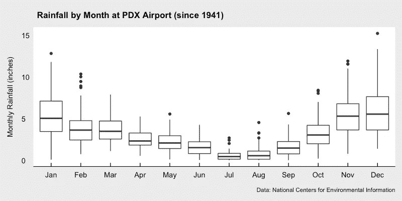
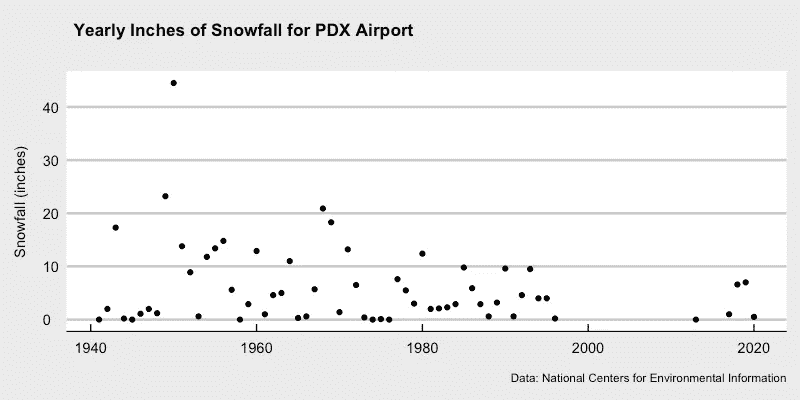
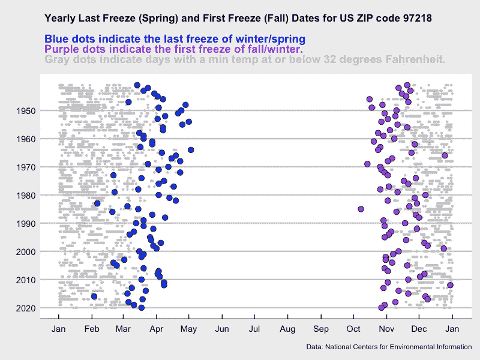

# 用 R 民主化历史天气数据分析

> 原文：<https://towardsdatascience.com/democratizing-historical-weather-data-with-r-cc3c76dde7c5?source=collection_archive---------11----------------------->

## [实践教程](https://towardsdatascience.com/tagged/hands-on-tutorials)

## 园丁指南、移居到不同气候的人或任何其他可能对分析天气数据感兴趣的人


由[叶戈尔·迈兹尼克](https://unsplash.com/@vonshnauzer?utm_source=medium&utm_medium=referral)在 [Unsplash](https://unsplash.com?utm_source=medium&utm_medium=referral) 上拍摄的照片

# 动机

作为一名数据科学家，我对寻找天气数据来对销售进行回归分析很感兴趣。也就是说，我想了解天气是否对网上或店内销售有可衡量的影响。在过去的十年里，我研究过与天气相关的类似商业问题，我希望下面的教程可以帮助其他人解决类似的问题。

当我开始园艺并为一个地区选择合适的植物时，我发现下面的地图作为经验法则提供了有用的信息。现在，我和我的伴侣在我们的住所周围拥有土地，并可以投资于我们的园艺雄心，我更深入地研究了这些统计数据的含义和数据的来源。有了今天的公开数据，就有可能计算出你附近某个邮政编码(ZIP code)的这些统计数据。我发现数据分析很有趣，而且比在打印出来的地图上使用放大镜更准确。拥有可用于回答特定问题的数据也是有帮助的。

*   美国农业部植物抗寒区域地图——这是我在美国园艺中心和苗圃看到的最常见的地图；用于选择能熬过冬天的植物
*   [冷却时间图](https://mrcc.illinois.edu/VIP/indexChillHours.html)——如果你想种植桃树、樱桃树和其他需要最短冷却时间才能结果的植物
*   [美国降水地图](https://gisgeography.com/us-precipitation-map/)——即使你有稳定的水源，规划景观时，降雨也会影响许多考虑因素
*   [去年春季冻结](https://www.ncdc.noaa.gov/news/when-expect-your-last-spring-freeze)——农民年鉴和该地区的园丁和农民也是了解什么时候可以在春天开始种植的好资源。
*   [霜冻深度图](https://www.hammerpedia.com/frost-line-map/)——如果你计划在栅栏柱或灌溉线中挖掘，了解土地上预期的霜冻深度会很有帮助。
*   [植物热区地图](http://solanomg.ucanr.edu/files/245158.pdf)——某些植物过热可能是个问题。

# 数据

对于以下地块，每日降水和温度数据已通过[在线搜索&下载](https://www.ncdc.noaa.gov/cdo-web/search)选项从 [NOAA 国家环境信息中心(Climate.gov)](https://www.climate.gov/maps-data/dataset/past-weather-zip-code-data-table)以逗号分隔值(CSV)文件的形式获得。该数据包含以下各列:

*   日期=年-月-日
*   STATION =气象站 ID
*   NAME =气象站的描述
*   PRCP =降雨量(英寸)
*   雪=降雪量中的降水量(英寸)
*   TMIN =每日最低温度

这些数据可以在电子表格中进行分析，但是如果您希望对于任何邮政编码只需点击一个按钮就可以重复这个过程，那么用 R 编写程序可能是一个更好的方法。

如果你想继续，你可以用一个免费的 GitHub 账户复制我的 GitHub“天气”库(towardsDS 文件夹)。或者你可以直接下载 CSV 文件，如果你去[这个链接，并保存页面为…](https://raw.githubusercontent.com/wpbSabi/weather/main/towardsDS/weather_towardsds.csv)

# R 和 RStudio 快速提示(包括安装)

如果您已经使用 R，您可以跳过这一部分。对于新用户来说，安装过程在很多网站上都有记录，但这应该会给你指明正确的方向。对于数据分析和建模，我推荐使用 RStudio 和 r。

1.  从克兰库下载并安装 R，你可以在[r-project.org/](https://www.r-project.org/)找到。为下载选择你选择的克兰镜子。
2.  从 [RStudio 下载](https://rstudio.com/products/rstudio/download/)页面下载并安装 RStudio。免费的桌面版是最好的开始。
3.  打开 RStudio 创建一个新文件，如果您想继续操作，请选择`File > New File > R Script`。R Markdown 和其他选项也很棒，但在本教程中，我们将使用一个简单的 R 脚本。
4.  或者，当您使用 RStudio 打开现有文件时，如果 RStudio 尚未打开，RStudio 会自动将您的目录路径设置为该文件的路径。
5.  在 RStudio 中，点击`Tools > Install Packages…`安装脚本中使用的库。
6.  要一次执行一行代码，将光标放在那一行上，在 Mac 上按下`Command+Enter`，在 PC 上按下`Control+Enter`。如果代码使用管道符或右括号扩展到另一行，则执行整个代码块，并移动光标。
7.  要查看或复制完整的 R 脚本而不是下面的片段，请访问 Github 上的[完整 R 脚本。](https://github.com/wpbSabi/weather/tree/main/towardsDS)

# 历史天气分析:雨和雪

首先，导入`tidyverse`库，使用它的`read_csv()`函数导入天气数据。`tidyverse`是包括`dplyr`、`tidyr`、`ggplot2`和其他库的集合。要了解更多关于`tidyverse`的信息，请阅读数据科学的 [R。](https://r4ds.had.co.nz/)

该脚本中的其他库提供了与日期(`lubridate`)进行数据交换的函数，以及使用图形库`ggplot2` ( `ggthemes`，`ggtext`)的语法定制绘图的函数。

输出:

```
spec_tbl_df [29,342 × 6] (S3: spec_tbl_df/tbl_df/tbl/data.frame)
 $ STATION: chr [1:29342] "USW00024229" "USW00024229" "USW00024229" "USW00024229" ...
 $ NAME   : chr [1:29342] "PORTLAND INTERNATIONAL AIRPORT, OR US" "PORTLAND INTERNATIONAL AIRPORT, OR US" "PORTLAND INTERNATIONAL AIRPORT, OR US" "PORTLAND INTERNATIONAL AIRPORT, OR US" ...
 $ DATE   : Date[1:29342], format: "1940-10-14" "1940-10-15" ...
 $ PRCP   : num [1:29342] 0 0 0 0.13 0 0 0.14 0.05 0 0.63 ...
 $ SNOW   : num [1:29342] 0 0 0 0 0 0 0 0 0 0 ...
 $ TMIN   : num [1:29342] 53 52 50 58 58 59 54 48 41 53 ...
 - attr(*, "spec")=
  .. cols(
  ..   STATION = col_character(),
  ..   NAME = col_character(),
  ..   DATE = col_date(format = ""),
  ..   PRCP = col_double(),
  ..   SNOW = col_double(),
  ..   TMIN = col_double()
  .. )
```

天气数据现已导入数据框`csv_data`。检查的一个关键点是数据中气象站的数量，因为我们希望一次只研究一个气象站。`str()`函数显示了数据框的结构，以及至少有四个气象站的数据在这个邮政编码中。

在下一步中，我们将选择一个气象站进行剩余的分析，方法是对一个气象站进行过滤，并执行由管道`%>%`语法(由`tidyverse`启用)分隔的其他数据争论任务。

输出:

```
# A tibble: 1 x 3
  NAME                                  min_date   max_date  
* <chr>                                 <date>     <date>    
1 PORTLAND INTERNATIONAL AIRPORT, OR US 1940-10-14 2021-02-12
```

CSV 文件包含该站从`1940–10–14`到`2021-02–12`的数据。因为我们只想查看整年的数据，所以在下面的代码块中，数据被过滤到从 1941 年到 2020 年的范围内。

现在我们有了 80 年的可用数据，我们可以回答诸如“降雨量最多的一天是哪一天，那天测得的降雨量是多少英寸？”

输出:

```
# A tibble: 2 x 6
  STATION     NAME                      DATE        PRCP  SNOW  TMIN
  <chr>       <chr>                     <date>     <dbl> <dbl> <dbl>
1 USW00024229 PORTLAND INTERNATIONAL... 1943-01-21  1.1   14.4    19
2 USW00024229 PORTLAND INTERNATIONAL... 1996-11-19  2.69  NA      34
```

俄勒冈州波特兰机场(PDX)气象站记录的最高降雨量是`1996–11–19`年`2.69`英寸。有记录以来最高降雪量出现在`1943–01–21`，测量值为`14.4`英寸。

我最喜欢的了解一个地区气候的方法是查看月降雨量的方框图。你也许能找到你所在地区的数据，或者至少类似于维基百科上的[气候图表，但是有了 R，你可以通过邮政编码或任何其他可能没有公布图表的粒度来聚焦数据。此外，您可能想知道图表中包含的数据的时间段，并尝试使用不同的日期范围的影响。](https://en.wikipedia.org/wiki/Template:Climate_chart/How_to_read_a_climate_chart)

输出:



*这个图像是由它上面的代码块创建的*

使用过去 80 年的数据合适吗，还是只使用最近 20 年的数据更能反映气候？对于这个特定的邮政编码，额外的(或更少的)数据并没有显著地改变图形，但是我选择显示完整的 80 年，因为图中显示的额外异常值很有趣。

现在让我们来看看降雪图。由于降雪在这个邮政编码区不太常见，下面的图是基于每年的降雪。

输出:



*这个图像是由它上面的代码块创建的*

有趣的是，仅检查过去 20 年的数据与检查整个 80 年的数据会产生非常不同的结果。在过去的二十年里，这个地区很少出现可测量的降雪量，尽管最近五年已经恢复了上个世纪的趋势。

# 历史天气分析:冰冻温度

园丁会关注天气预报，而敏锐的园丁也会想了解历史趋势。一个特别有趣的地方是每年春天的最后一次冰冻。如果种子或种子种植过早，它们可能会被晚霜冻坏。在生长季节的另一端，每年秋季的第一次冰冻是一个很好的迹象，表明何时确保无法承受早期霜冻的作物完成收获。

输出:



*这个图像是由它上面的代码块创建的*

从视觉上吸收这一数据，似乎最近几年的最后一次冻结发生在 3 月份。当地人认为在 4 月中旬之前播种是有风险的，这似乎得到了过去 30 年数据的支持。尽管在最近几年，土壤已经被冬雨和春雨浸透，无论如何也不允许提早种植。

# 历史天气分析:植物耐寒区

我要分享的最后一个分析是关于植物的抗寒性。与俄勒冈州立大学(OSU)合作制作的美国农业部植物抗寒区域地图显示了 1976 年至 2005 年的年平均极端最低温度。虽然重建这样一个地图的工作量很大，但我们可以为特定的邮政编码重建一个更新的数据点。

大多数苗圃都在每一种树木、灌木和其他多年生植物上贴上植物耐寒区的标签，以表明每一种植物可能在哪里熬过寒冷的月份，进入下一年。97218 邮政编码似乎属于 8b 区的颜色，这意味着种植可能在 15 至 20 华氏度的年极端低温下存活的品种是安全的。让我们将 1976 年至 2005 年的数据与 1991 年至 2020 年的更新数据进行比较，看看是否有任何重大变化。

产量(1976 年至 2005 年):

```
year           annual_extreme_low
 Min.   :1976   Min.   : 9.00     
 1st Qu.:1983   1st Qu.:14.00     
 Median :1990   Median :19.00     
 Mean   :1990   Mean   :19.20     
 3rd Qu.:1998   3rd Qu.:24.75     
 Max.   :2005   Max.   :27.00
```

产出(1991 年至 2020 年):

```
year           annual_extreme_low
 Min.   :1991   Min.   :11.00     
 1st Qu.:1998   1st Qu.:18.00     
 Median :2006   Median :22.00     
 Mean   :2006   Mean   :20.77     
 3rd Qu.:2013   3rd Qu.:25.75     
 Max.   :2020   Max.   :27.00
```

较新的 30 年平均水平的年平均极端低气温上升了 1.6 华氏度(现在是 20.8 华氏度，相比之下是 19.2 华氏度)。这一变化，现在高于 20，足以将这个邮政编码放入 9a 耐寒区。事实上，如果你注意到颜色之外的注释，该地区的小气候可能已经被标注在美国农业部/OSU 地图的 9a 耐寒区。也许这可能是由于大都市区的热岛效应。

# 学习和分享

我希望你喜欢这篇教程——如果这是你第一次使用 R——我希望这能激励你学习更多，并使数据分析民主化！

如果你想读(写)更多这样的文章，请考虑使用我的推荐链接注册媒体:【https://sabolch-horvat.medium.com/membership 

[2021–12–18 更新]:在“数据”中，添加了有关如何直接从 GitHub 访问 CSV 数据文件的信息。