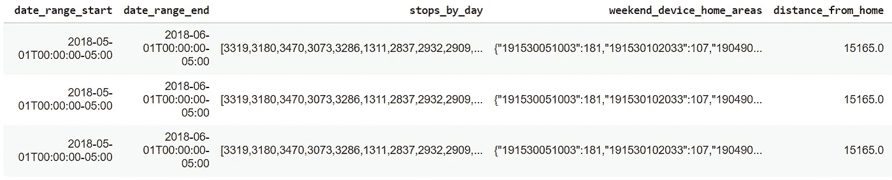
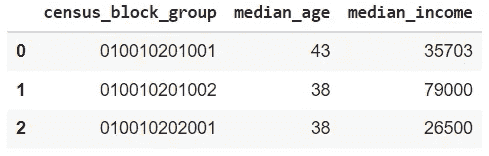
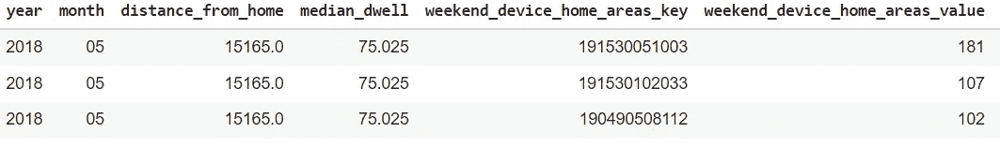
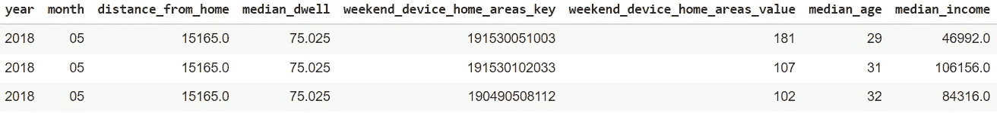
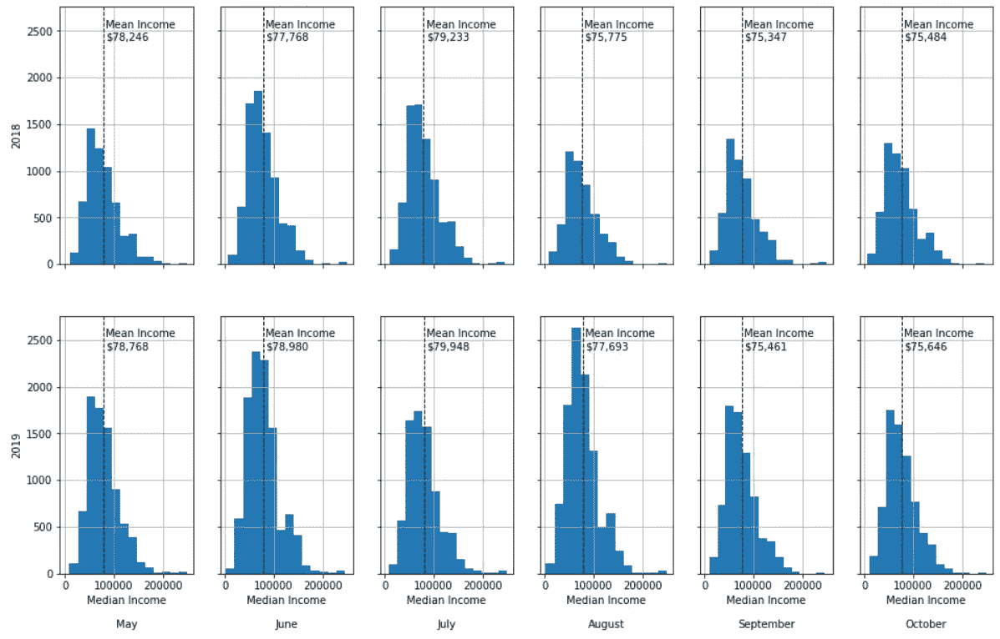
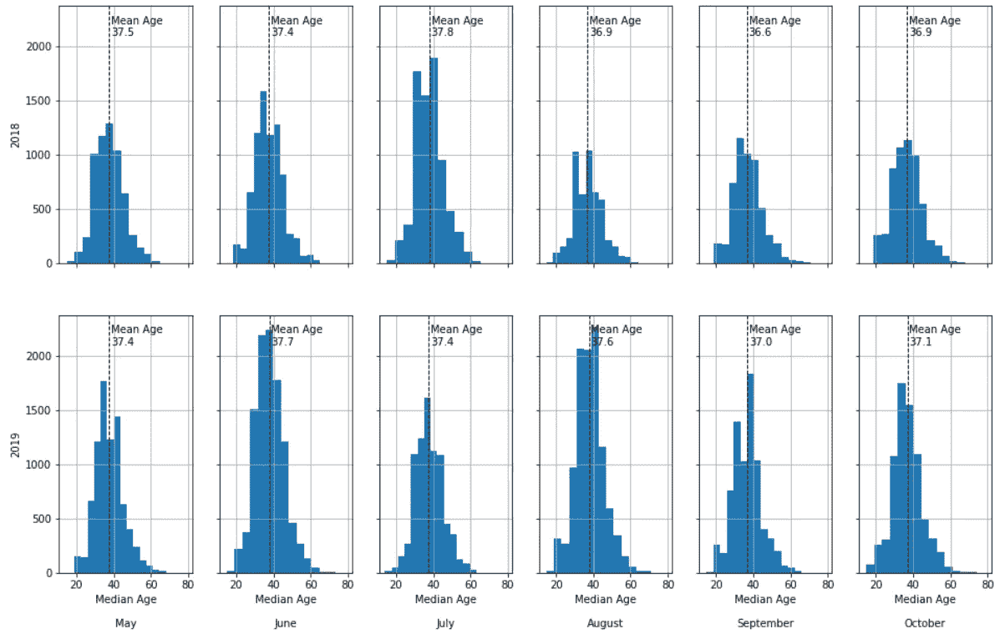

# 基于客流量数据的得梅因农贸市场人口统计分析

> 原文：<https://towardsdatascience.com/demographic-analysis-of-the-des-moines-farmers-market-with-foot-traffic-data-ca998e0786dc?source=collection_archive---------39----------------------->

## 了解如何分析非 POI 事件的客流量，如农贸市场、示威游行、博览会等

在 [Unsplash](https://unsplash.com?utm_source=medium&utm_medium=referral) 上由 [Dane Deaner](https://unsplash.com/@danedeaner?utm_source=medium&utm_medium=referral) 拍摄的照片

有些活动，如传说中的[得梅因农贸市场](https://www.dsmpartnership.com/desmoinesfarmersmarket/)，并不局限于特定的兴趣点，即传统上可用的客流量数据的级别。许多实体可能对分析农贸市场的客流量感兴趣，例如当地酒店/餐馆、得梅因市、潜在供应商和学术研究人员。

以下是分析得梅因农贸市场客流量时遇到的一些挑战:

*   它对应于包含更多传统兴趣点的大区域，如餐馆、银行等
*   在某些月份，农贸市场只在周六占据该区域
*   农贸市场内的摊贩位置每周都在变动

*别害怕，* [*邻里模式*](https://docs.safegraph.com/v4.0/docs/neighborhood-patterns-2020) *就在这里！*

有了邻居模式，我们可以回答关于游客数量、他们来自哪里、他们停留了多长时间等问题。更好的是，这个数据集和其他数据集对学者是免费的。如果您想扩展这一分析，或者使用步行交通数据研究您自己的问题，请访问 [SafeGraph 社区](https://www.safegraph.com/community)。

*要自己运行代码和处理数据，请查看随附的 Colab 笔记本**[*！*](https://colab.research.google.com/drive/1f5Jkie2fUTFmFO-ZH8A2Nw0FjWdPcNNo?usp=sharing)*

# *设置*

*之前的每一次激动人心的分析都是有点无聊的(然而重要！)设置部分。为了简单起见，我们将跳过一些无聊的东西(导入、安装、读取数据等)。请随意查看 Colab 笔记本中的代码片段！*

*来看看我们的数据吧！第一个数据框架是得梅因市中心的安全图社区模式。具体来说，我们已经过滤到包含得梅因农贸市场的人口普查区块组。*人口普查区块组(CBG)是聚集邻里模式数据的地理区域，方便的是，人口普查数据也聚集在 CBG 级别。**

**

*安全图邻域模式中列的子集。*

*Neighborhood Patterns 有很多有用的专栏。在本文中我们将只使用`weekend_device_home_areas`，但是您可以编辑代码以使用您认为合适的其他列！完整的列列表可在[文档](https://docs.safegraph.com/v4.0/docs/neighborhood-patterns-2020)中找到。*

*`weekend_home_device_areas`列很重要，所以让我们把它分解一下。每个条目都是一个 JSON 对象(或 Python 字典)，其中的键是一个 CBG，值是居住在该 CBG 的访问者数量。此外，这些访问都发生在周末。该行指定了访问发生的日期范围。总之，这个专栏告诉我们周末去得梅因市中心的游客的家。*

*我们的下一个数据集是人口普查数据。这些数据让我们可以提出关于访客人口统计的问题。农贸市场访客的平均年龄是多少？收入分配是什么样的？人口普查数据有很多列；为简单起见，我们将只使用年龄中位数和收入中位数。同样，如果您想研究其他专栏，请随意[更改代码](https://colab.research.google.com/drive/1f5Jkie2fUTFmFO-ZH8A2Nw0FjWdPcNNo?usp=sharing)——您可以在几秒钟内访问重新创建该分析所需的所有代码/数据！*

**

*普查数据中列的子集。*

*注意第一列:`census_block_group`。**该列使我们能够将人口统计数据与邻里模式访问数据结合起来。**为了做到这一点，我们需要首先从`weekend_device_home_areas`中提取 CBG 级别的访问者数量。我们垂直分解该列，以便每行中的每个键值对都有自己的行。*我们还将重新格式化日期列，以便于阅读。**

**

*垂直展开“周末 _ 设备 _ 家庭 _ 区域”列后的邻域模式子集*

*现在，我们可以将两个数据集连接起来，查看周末去过得梅因市中心的每个 CBG 的平均年龄和平均收入。*

**

*我们的合并数据集。*

# *分析*

*我们的分析将保持相当简单。我们会看看 2018 年和 2019 年每个月的年龄中位数和收入中位数分布*(注:得梅因农贸市场只在 5 月到 10 月营业)*。为了做到这一点，我们创建了直方图，其中每一行根据访问者的数量进行加权(`weekend_device_home_areas_value`)。*

**

*得梅因市中心周末游客的收入中位数分布。*

*平均值从 75，347 美元到 79，948 美元不等。有趣的是，平均收入在九月和十月下降。*

*现在让我们来看看同样的中位年龄可视化。*

**

*得梅因市中心周末游客的平均年龄分布。*

*平均年龄从 36.6 岁到 37.8 岁不等。同样，相对于 6 月和 7 月，我们看到 9 月和 10 月有所下降！*

*有人可能会假设，我们在 9 月和 10 月看到的收入和年龄下降是由大学生返校造成的。**我们将在第二部分测试这个假设:绘制得梅因农贸市场的游客地图！***

# *结论*

*在本文中，我们介绍了如何分析得梅因农贸市场游客的人口统计数据，该市场仅限于一个区域，而不是传统的兴趣点。这一切都是通过 [SafeGraph 的邻居模式](https://docs.safegraph.com/docs/neighborhood-patterns-2020)(对学术界免费)和美国人口普查数据(对所有人免费)实现的。*

*我们的分析表明，9 月和 10 月的收入和年龄都略有下降。我们假设这是由得梅因的大学生返校造成的。虽然我们不会从统计上检验这个假设，但在地图上可视化可能会给我们一些启示！敬请关注第二部分，即将推出！*

***疑问？***

*我邀请你在 [SafeGraph 社区](https://www.safegraph.com/community)的 **#safegraphdata** 频道问他们，这是一个面向数据爱好者的免费 Slack 社区。获得支持、共享您的工作或与 GIS 社区中的其他人联系。通过 SafeGraph 社区，学者们可以免费访问美国、英国和加拿大 700 多万家企业的数据。*