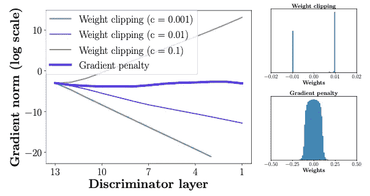
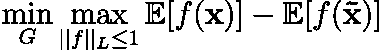
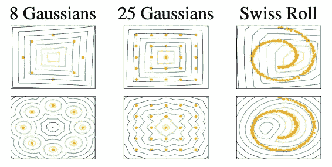
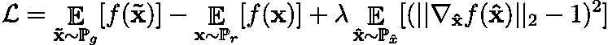
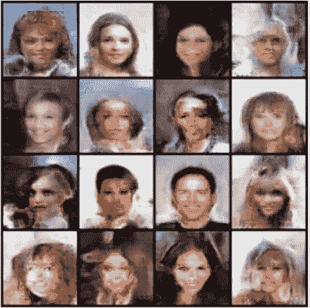

# 揭秘:Wasserstein GAN 与梯度惩罚(WGAN-GP)

> 原文：<https://towardsdatascience.com/demystified-wasserstein-gan-with-gradient-penalty-ba5e9b905ead?source=collection_archive---------5----------------------->

## 什么是梯度惩罚？为什么比渐变裁剪好？如何实施梯度惩罚？

图 1(左)使用权重剪裁时的梯度范数不是爆炸就是消失，不使用 GP。(右)与 GP 不同，权重剪裁将权重推向两个值。图像来源:[1]

在这篇文章中，我们将研究 Wasserstein GANs 的梯度惩罚。虽然最初的 Wasserstein GAN[2]提高了训练的稳定性，但仍然存在产生差的样本或不能收敛的情况。概括一下，WGAN 的成本函数是:

情商。1: WGAN 值函数。

其中 *f* 是1-Lipschitz 连续。WGAN 出现的问题主要是因为用于在 critical 上加强 Lipschitz 连续性的权重裁剪方法。WGAN-GP 用对 critic 的梯度范数的约束来代替权重裁剪，以加强 Lipschitz 连续性。这允许比 WGAN 更稳定的网络训练，并且需要非常少的超参数调整。WGAN-GP，这篇文章建立在 Wasserstein GANs 的基础上，这已经在 [*揭秘系列*](https://asankar96.medium.com/list/demystified-deep-learning-1273a227565c) 的上一篇文章中讨论过了。查看下面的帖子来了解 WGAN。

 [## 揭秘:瓦瑟斯坦·甘斯(WGAN)

### 什么是瓦瑟斯坦距离？用 Wasserstein 距离训练 GANs 背后的直觉是什么？怎么样…

towardsdatascience.com](/demystified-wasserstein-gans-wgan-f835324899f4) 

## 报表 1

> 可微的最优 1-Lipschitz 函数， ***f**** 最小化等式。1 在ℙr 和ℙg.下几乎处处都有单位梯度范数

ℙr 和ℙg 分别是真实和虚假的分布。陈述 1 的证明可以在[1]中找到。

# 渐变剪辑的问题

## 容量未充分利用

图 WGAN critic(上)使用梯度裁剪(下)使用梯度惩罚学习的值表面。图像来源:[1]

> 使用权重剪辑来加强 k-Lipschitz 约束导致评论家学习非常简单的函数。

从陈述 1 中，我们知道最优评论家的梯度范数几乎在ℙr 和ℙg.的任何地方都是 1。在权重剪辑设置中，评论家试图获得其最大梯度范数 *k* ***，*** ，并最终学习简单的函数。

图 2 显示了这种效果。批评者被训练为收敛于固定生成的 distribution(ℙg)作为真实的 distribution(ℙr)+单位高斯噪声。我们可以清楚地看到，用权重裁剪训练的评论家最终学习简单的函数，并且不能捕捉更高的矩，而用梯度惩罚训练的评论家没有遭受这个问题。

## 爆炸和消失渐变

> 权重约束和损失函数之间的相互作用使得 WGAN 的训练变得困难，并导致爆炸或消失梯度。

这可以在图 1(左)中清楚地看到，对于不同的削波值，评论家的权重爆炸或消失。图 1(右)还示出了梯度剪切将评论家的权重推至两个极端剪切值。另一方面，受过梯度惩罚训练的批评家不会受到这些问题的困扰。

# 梯度惩罚

> 梯度惩罚的思想是实施一个约束，使得批评家的输出相对于输入的梯度具有单位范数(陈述 1)。

作者提出了这种约束的软版本，对样本上的梯度范数进行惩罚 **x̂** ∈ ℙ **x̂** 。新的目标是

情商。2:批评家损失函数

在 Eq 中。2 总和左边的项是原始临界损失，总和右边的项是梯度损失。

ℙ **x̂** 是通过沿着真实分布和生成分布ℙr 和ℙg.之间的直线均匀采样而获得的分布。这样做是因为最佳评论家在从ℙr 和ℙg.耦合的样本之间具有单位梯度范数的直线

λ，惩罚系数用于加权梯度惩罚项。在这篇论文中，作者为他们所有的实验设定λ=10。

**batch normalization 不再用于 critic**，因为 Batch norm 将一批输入映射到一批输出。在我们的案例**中，我们希望能够找到每个输出相对于各自输入的梯度。**

# 密码

## 梯度惩罚

梯度惩罚的实现如下所示。

## WGAN-GP

训练 WGAN-GP 模型的代码可在此处找到:

 [## GitHub-aadhithya/GAN-zoo-py torch:GAN 实现的动物园

### GAN 实现的动物园。在 GitHub 上创建一个帐户，为 aadhithya/gan-zoo-pytorch 的发展做出贡献。

github.com](https://github.com/aadhithya/gan-zoo-pytorch) 

# 输出

图 3:WGAN-GP 模型生成的图像。请注意，这些结果是早期结果，一旦确认模型正在按预期进行训练，就停止训练。图片来源:[3]

图 3 显示了训练 WGAN-GP 的一些早期结果。**请注意，图 3 中的图像是早期结果，一旦确认模型正在如预期那样训练，就停止训练。该模型没有被训练收敛。**

# 结论

Wasserstein GANs 在训练生成性对抗网络方面提供了急需的稳定性。然而，使用梯度裁剪导致各种问题，如爆炸和消失梯度等。梯度惩罚约束没有这些问题，因此与原始 WGAN 相比，允许更容易的优化和收敛。这篇文章着眼于这些问题，介绍了梯度惩罚约束，并展示了如何使用 PyTorch 实现梯度惩罚。最后提供了训练 WGAN-GP 模型的代码以及一些早期输出。

如果你喜欢这篇文章，可以考虑关注作者， [Aadhithya Sankar](https://medium.com/u/82053676fe58?source=post_page-----ba5e9b905ead--------------------------------) 。

# 参考

[1] Gulrajani，Ishaan 等，“改善 wasserstein gans 的训练” *arXiv 预印本 arXiv:1704.00028* (2017)。

[2] Arjovsky、Martin、Soumith Chintala 和 Léon Bottou。"沃瑟斯坦生成性对抗网络."*机器学习国际会议*。PMLR，2017。

[3][https://github.com/aadhithya/gan-zoo-pytorch](https://github.com/aadhithya/gan-zoo-pytorch)

# 作者的更多帖子

如果你喜欢这篇文章，你可能也会喜欢:

 [## 主成分分析第 1 部分:不同的公式。

### 什么是主成分分析？PCA 的最大方差和最小误差公式有哪些？我们如何…

towardsdatascience.com](/principal-component-analysis-part-1-the-different-formulations-6508f63a5553)  [## 阿特鲁卷积和深度可分卷积的初步研究

### 什么是萎缩/扩张和深度方向可分卷积？与标准卷积有何不同？什么…

towardsdatascience.com](/a-primer-on-atrous-convolutions-and-depth-wise-separable-convolutions-443b106919f5)  [## 使用深度学习的实时艺术品生成

### 用于任意内容样式图像对之间的样式转换的自适应实例标准化(AdaIN)。

towardsdatascience.com](/real-time-artwork-generation-using-deep-learning-a33a2084ae98)