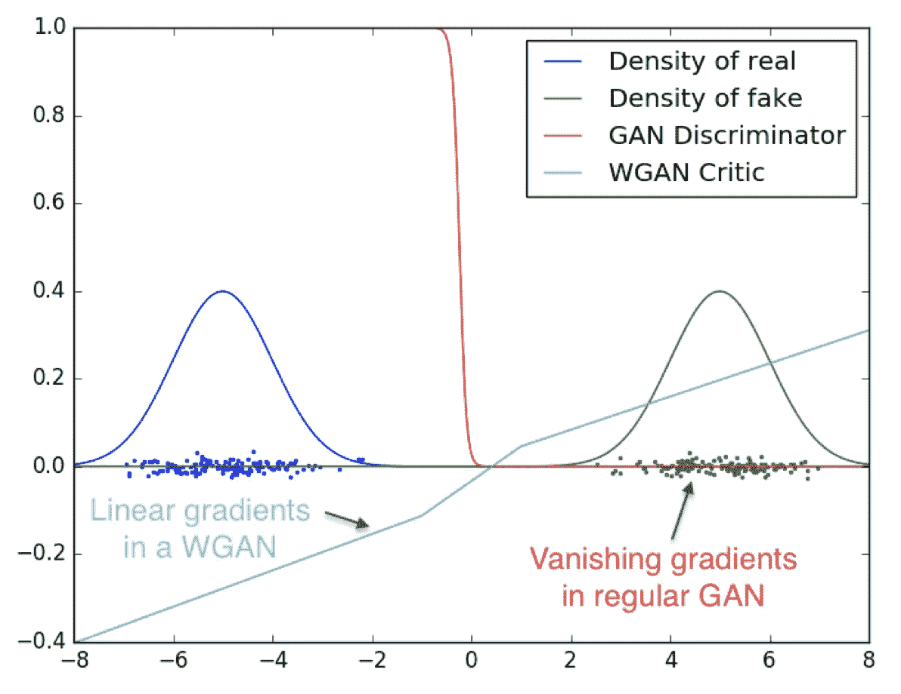
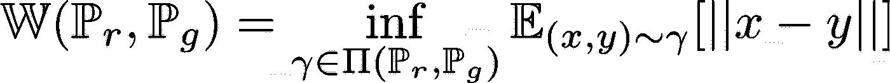
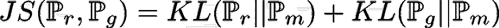
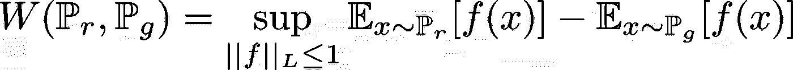
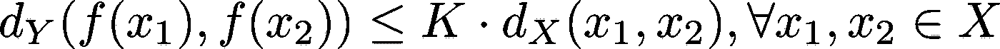
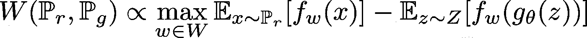
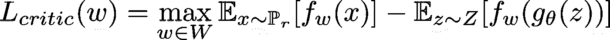
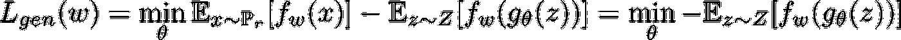
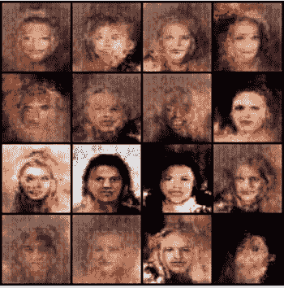

# 揭秘:瓦瑟斯坦·甘斯(WGAN)

> 原文：<https://towardsdatascience.com/demystified-wasserstein-gans-wgan-f835324899f4?source=collection_archive---------5----------------------->

## 什么是瓦瑟斯坦距离？用 Wasserstein 距离训练 GANs 背后的直觉是什么？是如何实现的？

**图 1:学习区分两个高斯函数时的最佳鉴别器和批判器[1]。**

在这篇文章中，我们将了解 Wasserstein GANs。具体来说，我们将关注以下内容:I)什么是 Wasserstein 距离？，ii)为什么使用它？iii)我们如何使用它来训练 GANs？

# 瓦瑟斯坦距离

Wasserstein 距离(推土机距离)是给定度量空间上两个概率分布之间的距离度量。直观上，它可以被视为将一种分布转换为另一种分布所需的最小功，其中功被定义为必须移动的分布的质量与移动距离的乘积。数学上，它被定义为:

**情商。1:分布 P_r 和 P_g 之间的 Wasserstein 距离**

在 Eq 中。1，π(P_r，P_g)是在 **x** 和 **y** 上的所有联合分布的集合，使得边际分布等于 P_r 和 P _ g。γ(x，y)可以被视为必须从 x 移动到 y 以将 P _ r 转换为 P_g[1]的质量量。瓦瑟斯坦距离就是最优运输计划的成本。

# 瓦瑟斯坦距离与詹森-香农散度

最初的 GAN 目标是 Jensen-Shannon 散度的最小化[2]。JS 散度定义为:

**情商。2:P _ r 和 P_g 之间的 JS 背离 P_m = (P_r + P_g)/2**

与 JS 相比，Wasserstein 距离具有以下优势:

*   Wasserstein 距离是连续的，几乎处处可微，这允许我们将模型训练到最优。
*   随着鉴别器变得更好，JS 发散局部饱和，因此梯度变为零并消失。
*   Wasserstein 距离是一个有意义的度量，即，当分布彼此接近时，它收敛到 0，而当它们远离时，它发散。
*   Wasserstein 距离作为目标函数比使用 JS 散度更稳定。当使用 Wasserstein 距离作为目标函数时，也减轻了模式崩溃问题。

从图 1 中我们可以清楚地看到，最佳 GAN 鉴频器饱和并导致梯度消失，而优化 Wasserstein 距离的 WGAN critic 始终具有稳定的梯度。

要获得数学证明和对这个话题更详细的了解，请点击这里查看论文！

# 瓦瑟斯坦·甘

现在可以清楚地看到，优化 Wasserstein 距离比优化 JS 散度更有意义，还需要注意的是，等式 1 中定义的 Wasserstein 距离非常难以处理[3]，因为我们不可能计算所有γ∈π(Pr，Pg)的下确界(最大下界)。然而，从 Kantorovich-Rubinstein 对偶来看，

**情商。3:1-lip schitz 条件下 Wasserstein 距离。**

这里我们有 W(P_r，P_g)作为所有 1-Lipschitz 函数 f: X → R 上的上确界(最低上界)

**K-Lipschitz 连续:**给定 2 个度量空间(X，d_X)和(Y，d_Y)，变换函数 f: X → Y 是 K-Lipschitz 连续的若

**情商。3: K-Lipschitz 连续性。**

其中 d_X 和 d_Y 是它们各自度量空间中的距离函数。当函数是 K-Lipschitz 时，从等式。2，我们最后得到 K ∙ W(P_r，P_g)。

现在，如果我们有一族 K-Lipschitz 连续的参数化函数{f_w}，其中 w∈W，我们可以得到

**情商。4**

即 w∈W 最大化 Eq。4 给出 Wasserstein 距离乘以一个常数。

## WGAN 评论家

为了达到这个效果，WGAN 引入了一个批评家，而不是我们已经知道的 GANs 的歧视者。critic 网络在设计上类似于鉴频器网络，但通过优化来预测 Wasserstein 距离，以找到将使等式 4 最大化的 **w*** 。为此，评论家的客观职能如下:

**情商。5:批评家目标函数。**

这里，为了在函数 f 上加强 Lipschitz 连续性，作者求助于将权重 w 限制到紧空间。这是通过将砝码夹紧在一个小范围内(论文[1]中的[-1e-2，1e-2])来实现的。

鉴别器和鉴别器的区别在于，鉴别器被训练来正确地识别来自 P_r 的样本和来自 P_g 的样本，鉴别器估计 P_r 和 P_g 之间的 Wasserstein 距离。

下面是训练评论家的 python 代码。

## **WGAN 发生器目标**

自然，生成器的目标是最小化 P_r 和 P_g 之间的 Wasserstein 距离。生成器试图找到θ ***** ，使 P_g 和 P_r 之间的 Wasserstein 距离最小化。为此，生成器的目标函数如下:

**情商。6:发电机目标函数。**

这里，WGAN 发生器和标准发生器之间的主要区别还是 WGAN 发生器试图最小化 P_r 和 P_g 之间的 Wasserstein 距离，而标准发生器试图用产生的图像欺骗鉴别器。

下面是训练生成器的 python 代码:

# 培训结果

图 WGAN 训练的早期结果[3]。

图 2 显示了训练 WGAN 的一些早期结果。**请注意，图 2 中的图像是早期结果，一旦确认模型正在如预期那样训练，就停止训练。**

# 密码

瓦塞尔斯坦甘的完整实现可以在这里找到****【3】。****

# **结论**

**WGANs 提供稳定的训练和有意义的训练目标。本文介绍并直观地解释了 Wasserstein 距离是什么，Wasserstein 距离相对于标准 GAN 使用的 Jensen-Shannon 散度的优势，以及 Wasserstein 距离如何用于训练 WGAN。我们还看到了训练批判者和生成器的代码片段，以及训练模型的早期阶段的大量输出。尽管 WGAN 相对于标准 GAN 有许多优势，但 WGAN 论文的作者明确承认，权重裁剪并不是增强 Lipschitz 连续性的最佳方式[1]。为了解决这个问题，他们提出了 Wasserstein GAN 梯度罚函数[4]，我们将在以后的文章中讨论。**

**如果你喜欢这篇文章，看看这个系列的下一篇文章[关于](https://asankar96.medium.com/demystified-wasserstein-gan-with-gradient-penalty-ba5e9b905ead) [WGAN-GP](https://asankar96.medium.com/demystified-wasserstein-gan-with-gradient-penalty-ba5e9b905ead) ！**

# **参考**

**[1] Arjovsky、Martin、Soumith Chintala 和 Léon Bottou。"沃瑟斯坦生成性对抗网络."*机器学习国际会议*。PMLR，2017。**

**[2]伊恩·古德费勒等，“生成性对抗性网络”*美国计算机学会的通讯*63.11(2020):139–144。**

**[3]甘-动物园-py torch([)https://github.com/aadhithya/gan-zoo-pytorch](https://github.com/aadhithya/gan-zoo-pytorch))。**

**[4] Gulrajani，Ishaan 等，“改善 wasserstein gans 的训练” *arXiv 预印本 arXiv:1704.00028* (2017)。**