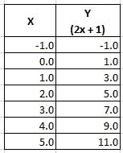
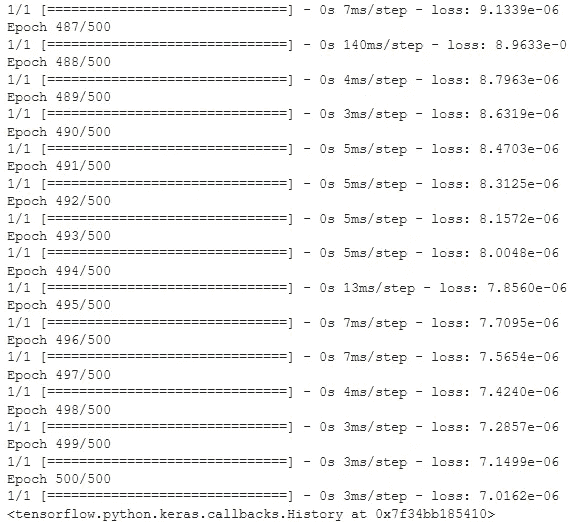

# 构建您的第一个神经网络，并学习深度学习术语

> 原文：<https://towardsdatascience.com/demystify-deep-learning-terminologies-and-build-your-first-neural-network-c408d2456df2?source=collection_archive---------27----------------------->

## 深度学习、神经网络、Tensorflow 和 Keras 的初学者入门，包括实际操作


图片由[皮克斯拜](https://pixabay.com/?utm_source=link-attribution&utm_medium=referral&utm_campaign=image&utm_content=63527)的 Gerd Altmann 提供

深度学习是[机器学习](https://en.wikipedia.org/wiki/Machine_learning)的一个分支，通过它，你向机器输入**数据**和**答案**，机器计算出**规则**，并由此得出答案。答案是数据代表的*标签*，例如关于房价的数据，*标签是价格*，数据是影响价格的房子的各个*方面。另一个例子是关于猫和狗的图像数据，标签*是动物是猫还是狗。**

## 定义关键术语

人工神经网络，或称 ann，是深度学习的基石。人工神经网络于 1943 年首次推出，由于大量的大数据、计算能力的大幅提高以及大量的关注和资金投入，它们的应用最近已经起飞。

**神经网络的组成部分**

下图是神经网络的基本表示。


图片来自 [Pixabay](https://pixabay.com/?utm_source=link-attribution&utm_medium=referral&utm_campaign=image&utm_content=3637503) 的 [Ahmed Gad](https://pixabay.com/users/ahmedgad-9403351/?utm_source=link-attribution&utm_medium=referral&utm_campaign=image&utm_content=3637503)

**神经元**—[人工神经元](https://en.wikipedia.org/wiki/Artificial_neural_network)是具有一个或多个输入和一个输出的单元或节点。每个输入都有一个相关的权重，可以在训练过程中进行修改。上面的*笑脸圈*各代表一个**神经元。**

**层**——这是指在神经网络中特定深度一起工作的神经元的集合。在上图中，每一列代表一个**层**，网络有 3 层；第一层(输入层)有 3 个神经元，第二层(隐藏层)有 2 个神经元，第三层(输出层)有 1 个神经元。

**密集层** —这是指一组完全连接的神经元，其中*层中的每个神经元*都与下一层中的每个神经元连接*。密集层是最常见的[类型的层](https://deeplizard.com/learn/video/FK77zZxaBoI)。*

**深层神经网络(DNN)——**这是指一个神经网络包含一个隐藏层的*深层堆栈*(中间的几列)。[深度学习](https://en.wikipedia.org/wiki/Deep_learning)因此是一个研究包含深度计算堆栈的模型的领域。

[**tensor flow**](https://www.tensorflow.org/)——这是一个开源平台，包含了很多机器学习所需的常用算法。在这里，您可以创建和使用机器学习模型，而不必学习幕后进行的所有底层数学和逻辑。

[**Keras**](https://keras.io/) —这是一个简单灵活的高级深度学习 API，用于构建、训练、评估和运行神经网络。Tensorflow 捆绑了自己的 Keras 实现`tf.keras`。

[**损失函数**](https://deepai.org/machine-learning-glossary-and-terms/loss-function) —通过比较期望输出(y)和网络实际输出(ŷ)来测量网络的输出误差，并返回误差。[损失函数的例子](https://keras.io/api/losses/)是[均方误差](https://en.wikipedia.org/wiki/Mean_squared_error)和交叉熵。

[**优化器**](https://www.kdnuggets.com/2020/12/optimization-algorithms-neural-networks.html) —这是一种修改神经网络属性的技术，如*权值*和*学习率*以减少损失。[示例](https://www.kdnuggets.com/2020/12/optimization-algorithms-neural-networks.html)是随机梯度下降和 Adam。

**训练一个模型**

在这种情况下，机器使用一套算法从一组给定的数据中学习输入，并可以识别区分它们的底层模式。让我们举一个简单的例子，数据有 2 列 x 和 y，6 行，x 和 y 之间的关系是 y=2x+1。因此，x 是输入数据，y 是标签。

首先，神经网络做一个胡乱的猜测，也许是 y=9x+9，通过计算**损失函数**(如均方误差)将 Y 的实际输出与猜测进行比较。然后**优化器函数**(比如随机梯度下降)通过最小化损失来进行另一个猜测，可能会得出类似 y=4x+4 的结果。然后，它将重复给定数量的时期(重复上述过程)。我们将在下面的代码中实现这一点。

## 神经网络的简单实现

**数据**

下表显示了上述数据。我们有两列，x 和 y，这两个集合之间有一个关系，即对于任何给定的行，y 的值=2x+1。



按作者分类的表格

我们将向我们的神经网络提供数据，并让它确定这两个集合之间的关系。x 是输入数据(或输入要素), y 是标注。因此，我们在这里向神经网络提供**数据** (x)和**答案** (y)，它的任务是识别将 x 映射到 y 的**规则**(公式)，以便它能够在给定 x 值之前预测 y 值。

**安装软件包**

由于 Keras 捆绑了 Tensorflow 2.0 及以上版本，我们只需安装 Tensorflow 即可。如果您的机器上安装了 [python 环境](https://realpython.com/installing-python/)，您可以使用下面的代码行安装 CPU 版本。省略`-cpu`会安装 GPU 版本。

`pip install tensorflow-cpu`

按照[这个](/https-medium-com-ekapope-v-install-tensorflow-and-keras-using-anaconda-navigator-without-command-line-b0bc41dbd038)教程在 [anaconda](https://www.anaconda.com/products/individual) 上安装 Tensorflow 和 Keras。

另一个很好的入门选项是在 [Google colab](https://colab.research.google.com/notebooks/intro.ipynb) 上编写和运行代码，这是一个基于浏览器的免费 Jupyter 笔记本，运行在云上，不需要任何设置，因为包括 Tensorflow 在内的大多数软件包都是预装的。

**导入库**

接下来是导入项目所需的库。

```
import tensorflow as tf
import numpy as np
from tensorflow import keras
```

**定义模型**

为了定义我们的模型，我们调用**顺序**构造函数。[顺序](https://www.tensorflow.org/api_docs/python/tf/keras/Sequential)将层的线性堆栈分组，并指定每个层的外观。在一个顺序构造函数中，可以有多个密集层作为一个列表。

```
model = tf.keras.Sequential([
keras.layers.Dense(units=1, input_shape=[1])
])
```

上面的代码构造了一个非常简单的神经网络，它只有一个密集层，只有一个神经元，由于这是第一层，我们必须包括输入数据的形状。在这种情况下，对于每个实例(行)，x 是一个值，因此是`input-shape=[1]`。

在此步骤中包含输入形状非常重要，因为 Keras 中的所有图层都需要知道其输入的形状来创建权重。没有包含`input-shape`会导致模型构建时没有权重，只有当模型第一次看到一些输入数据时才会初始化权重。在这之后，模型被构建，您可以调用`model.get_weights()`和`model.summary()`方法来显示它的内容。

**编译模型**

下一步是编译神经网络，这里我们提供了两个函数；一个`loss`功能和一个`optimizer`。损失函数通过模型预测的好坏来评估权重集，而优化器修改权重以减少损失。`‘sgd’`下图代表随机梯度下降。

```
model.compile(optimizer='sgd', loss='mean_squared_error')
```

这一行基本上定义了在下面的步骤中训练模型时将在后端发生的数学计算的类型。

**根据数据训练模型**

这是模型学习 X 和 y 之间关系的地方。

```
x = np.array([-1.0,0.0,1.0,2.0,3.0,4.0,5.0],dtype=float)
y = np.array([-1.0,1.0,3.0,5.0,7.0,9.0,11.0],dtype=float)model.fit(x,y,epochs=500)
```

我们称之为`model.fit(x,y,epochs=500)`来训练模型。查看[该 Keras 文档](https://keras.io/api/models/model_training_apis/)了解其他可选参数。我们提供 x 和 y 作为模型所期望的 Numpy 数组。x 是输入数据，y 是标签。时期定义迭代的次数。猜测、减少损失以及使用优化器做出下一个最佳猜测的过程就发生在这一步。下面是在 Jupyter 笔记本中训练模型时显示的输出截图。注意损失是如何随着时代接近 500/500 而减少的。



**做预测**

既然已经根据我们提供的数据训练了一个模型，我们现在可以通过调用`model.evaluate([value])`方法来预测给定的 x 的`value`的 y。该值被括在方括号中，因为预期的参数是一个数组。

```
print(model.predict([10.0]))###Results
[[21.006134]]
```

我们从 y=2x+1 关系中知道答案应该是 21，但是这里我们看到结果与预期值略有不同。这是因为该模型是在只有 6 行的小数据集上训练的，也因为损失不完全是 0。注意*您的*值可能会因为模型的初始随机权重而有所不同。

**模型概要**

模型中的每个神经元学习一个权重和一个偏差。我们上面的模型只有一个单个神经元，因此它将学习关系为`y = Wx + b`的*权重*和*偏差*，其中 *W 是权重*，而 *b 是偏差*。使用 Tensorflow，这些是模型学习的值，可以通过调用`model.get_weights()`来查看它们。

```
model.get_weights()###Results
[array([[**2.000743**]], dtype=float32), array([**0.9972024**], dtype=float32)]
```

这返回包含权重的两个数组，使得学习到的关系是 y = 2.000743 x + 0.9972024，这非常接近 y=2x+1 的真实关系。

## 总结

这是对深度学习、Tensorflow 和 Keras 的基本介绍，其中我们使用神经网络来确定两组值之间的线性关系。虽然这看起来可能是一个非常简单的问题，但我们学到的概念和工作流对于处理深度学习中更有趣和复杂的问题是必不可少的。查看下面的参考资料，我发现这些资料对刚进入这个领域的初学者非常有用。

**参考文献**

吴恩达在 YouTube 上发表的《神经网络和深度学习》。

[麻省理工学院深度学习入门 6。S191](http://introtodeeplearning.com/)

[使用 Scikit-Learn、Keras 和 TensorFlow 进行机器实践学习:第二版](https://www.amazon.com/Hands-Machine-Learning-Scikit-Learn-TensorFlow-ebook-dp-B07XGF2G87/dp/B07XGF2G87/ref=mt_other?_encoding=UTF8&me=&qid=)

[程序员的人工智能和机器学习:人工智能程序员指南第一版，作者劳伦斯·莫罗尼](https://www.amazon.com/Hands-Machine-Learning-Scikit-Learn-TensorFlow-ebook-dp-B07XGF2G87/dp/B07XGF2G87/ref=mt_other?_encoding=UTF8&me=&qid=)