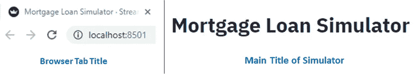
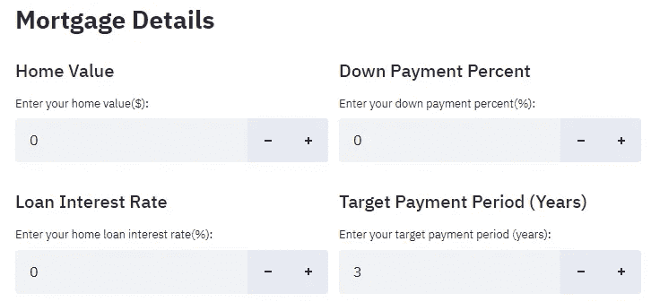
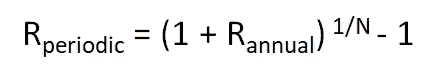
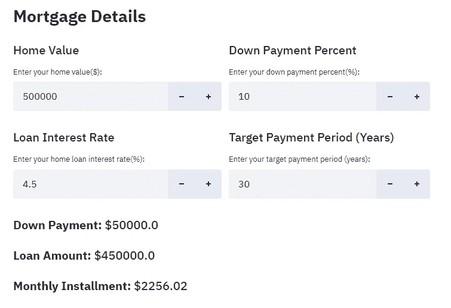
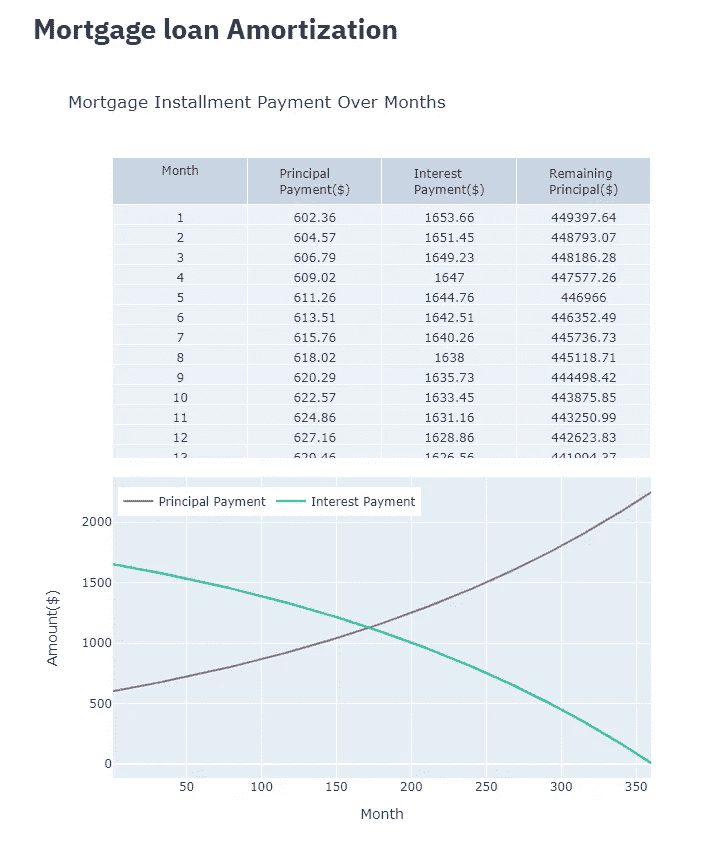
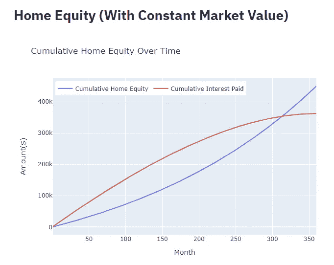
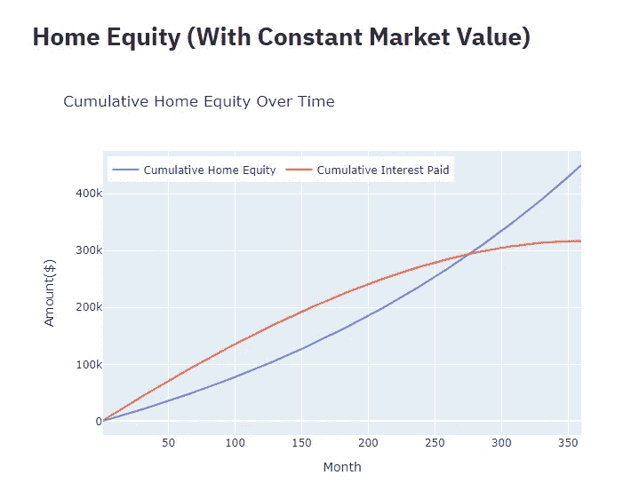
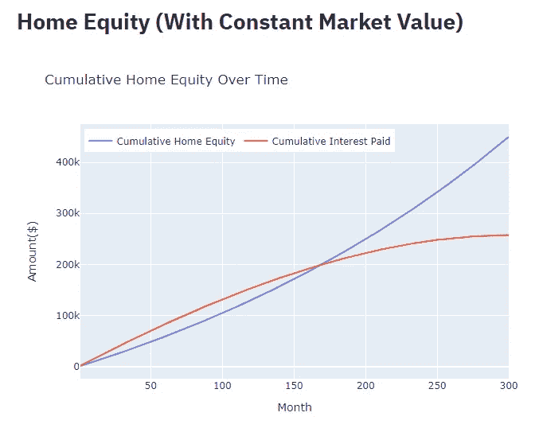
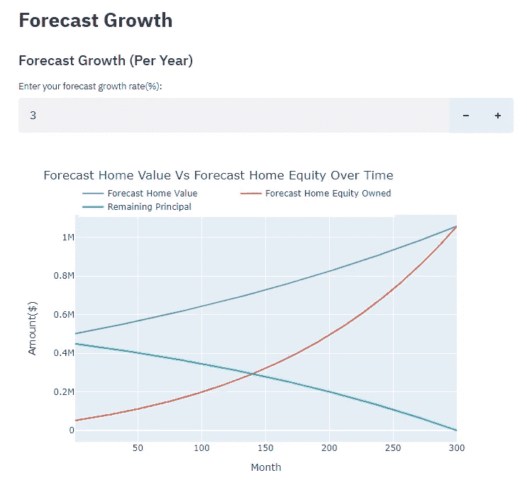
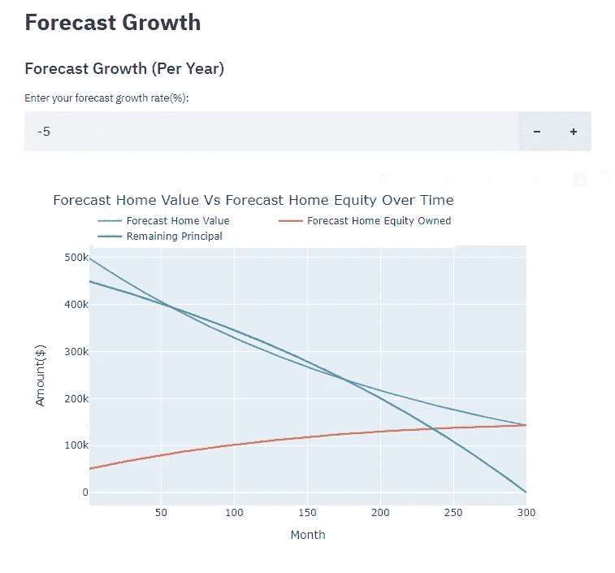

# 通过构建 Python 模拟器来揭开抵押贷款的神秘面纱

> 原文：<https://towardsdatascience.com/demystify-mortgage-loan-by-building-a-python-simulator-7c192d201cf6?source=collection_archive---------13----------------------->

## 一步一步的指南，建立一个有用的 Python 模拟器，帮助你更好地了解你的房屋净值及其潜在的未来增长。


托德·肯特在 [Unsplash](https://unsplash.com/s/photos/house?utm_source=unsplash&utm_medium=referral&utm_content=creditCopyText) 上的照片

抵押贷款不仅仅是在规定的支付期限内根据商定的金额每月还款。如果没有很好地了解其还款机制和潜在风险，抵押贷款很容易危及我们的财务。

在这里，我们将通过一步一步的实践指南来开发一个可以模拟长期抵押贷款偿还的 **Python 模拟器**。该模拟器还将使我们能够可视化贷款摊销和我们的房屋净值的未来增长。你可能会惊讶地发现，看似略高的贷款利率会严重影响房屋净值。

# 必备 Python 库

在开始开发过程之前，我们需要确保以下库在我们的机器中可用:

1.  细流—[https://www.streamlit.io/](https://www.streamlit.io/)
2.  阴谋地—[https://plotly.com/python/](https://plotly.com/python/)
3.  numpy—[https://numpy.org/](https://numpy.org/)

# GitHub 回购

如果您希望使用我的代码来跟踪这篇文章，您可以在我的 [Github Repo](https://github.com/teobeeguan/MortgageSimulator) 获得完整的源代码。

你也可以运行我从 GitHub repo(mortgage simulator . py)获得的代码来预览这个应用。确保您已在机器中正确设置了 Streamlit。您可以参考 [Streamlit 网站](https://docs.streamlit.io/en/stable/index.html)了解更多信息。

# 抵押贷款模拟器的开发

## 1.导入库

首先，我们在程序中导入所有需要的库。

## 2.设置页面标题

在这里，我们将开始使用 Streamlit 来构建我们的模拟器。 [Streamlit](https://streamlit.io/) 是一个开发数据 app 的开源 Python 框架。

首先，让我们为浏览器选项卡和主页设置页面标题。

**第 1 行:**使用 Streamlit*set _ page _ config*中的 *page_title* 为我们的浏览器标签页定义一个标题。

**第 2 行:**创建我们模拟器的主标题。

此时，我们可以尝试运行 Streamlit 应用程序来可视化输出。为此，我们在终端/命令提示符下键入以下命令。

```
streamlit run YourPythonFileName.py
```

*(注意:* *在运行应用程序之前，请确保您已经导航到保存脚本文件的目录。)*

我们应该会看到如下输出:



作者准备的图像

## 3.为抵押详细信息创建输入字段

为了模拟按揭付款，我们需要四条信息，它们是***房屋价值、首付比例、贷款利率和付款期限*** 。

在本节中，我们将使用 Streamlit 构建四个数字输入字段，以获取用户对上述四条信息的输入。

**第 1 行:**创建标题。

**第 2 行:**定义两列来放置我们的输入字段。

**第 4–9 行:**在第一列中，创建相关的副标题，并使用 Streamlit *number_input* 方法创建房屋价值和利率的数字输入字段。我们将最小值设置为零，并将输入格式设置为十进制数。

**第 11–16 行:**在第二列中，重复上述类似过程，为首期付款百分比和付款期(年)创建相关副标题和数字输入字段。



作者准备的图像

## 4.每月分期付款计算

有了这四条信息，我们现在可以开始计算每月分期付款。这将会给我们一个粗略的概念，我们每月的抵押贷款还款承诺。

**第 1–4 行:**从房屋价值中扣除首付款，计算贷款金额。将付款年数乘以 12，得到付款月总数。将利率转换成小数。

**第 5–6 行:**根据输入的利率，我们使用以下公式计算定期利率



作者准备的图像

定期利率是在较短时间内(如 1 个月)表示的年利率。由于抵押贷款是按月偿还的，这里我们的目标是获得每月定期利息，因此 N=12。最后，使用 *Numpy pmt* 方法，根据周期利率、还款总月数和贷款金额计算每月的还款金额。 *Numpy pmt* 方法将封装计算逻辑并自动得出每月分期付款金额。

**第 8–10 行:**向我们的模拟器显示首期付款、贷款金额和每月分期付款。

让我们尝试在抵押详细信息的数字输入字段中输入一组示例值:

*房屋价值— 500000*

*首付比例— 10*

*贷款利率— 4.5*

*目标付款年限— 30 年*



作者准备的图像

模拟器处理我们的样本输入，结果是每月分期付款 2256.02 美元。

## 5.抵押贷款分期偿还

在这个阶段，我们的模拟器能够根据我们提供的抵押贷款详细信息的输入值来估计每月分期付款金额。然而，每月分期付款金额本身并不能让我们知道我们的付款分别对贷款本金和贷款利息产生了多大的影响。虽然每月的分期付款总额是相同的，但包含贷款本金和贷款利息的金额部分会随着时间的推移而有所不同。


由 [Alexander Mils](https://unsplash.com/@alexandermils?utm_source=unsplash&utm_medium=referral&utm_content=creditCopyText) 在 [Unsplash](https://unsplash.com/s/photos/loan?utm_source=unsplash&utm_medium=referral&utm_content=creditCopyText) 上拍摄

在本节中，我们将为抵押贷款生成一个 [**分期偿还计划**](https://www.investopedia.com/terms/a/amortization_schedule.asp) 。摊销时间表是一个表，显示了贷款本金和贷款利息的金额，包括每个月的分期付款，直到贷款全部还清。此外，我们还将绘制一个图表，以显示构成我们每月分期付款的贷款本金和贷款利息的每月变化。

**第 4–6 行:**创建三个 Numpy 系列来保存每月剩余本金、已付本金和已付利息的值。用零初始化每个 Numpy 系列。

**第 8–23 行:**创建一个循环来迭代计算构成当月分期付款的本金和利息。当前的利息支付是基于定期利率与先前剩余本金的乘积计算的(第 15 行)。从每月分期付款中减去由此产生的利息付款将得到该特定月份的本金付款(第 16 行)。将当前的利息支付、本金支付和剩余本金存储到前面创建的三个 Numpy 系列中(第 21–23 行)。

**第 31–37 行:**使用 Python Plotly*make _ subplots*方法创建一个包含表格和图表的合成图形。

**第 39–49 行:**使用 Plotly *go。Table* 对象创建一个显示每月本金支付、利息支付和剩余本金的表。将之前创建的 Numpy 系列插入到单元格的值中(第 44–46 行)。使用 *add_trace* 方法将表格添加到复合图形对象中。

**第 51–58 行:**使用 Plotly *go。散点图*对象为几个月内的本金支付创建一个折线图。将本金支付的 Numpy 系列设置为 y 轴值。再次使用 *add_trace* 方法将绘图添加到复合图形对象。

**第 60–67 行:**以类似的方式，使用 Plotly *go。散点图*对象为几个月的利息支付创建一个折线图。此时，我们使用 *append_trace* 方法添加线图，这样它将与同一图表中本金支付的线图重叠。

**第 69–81 行:**通过设置相关的标题、尺寸和图例来配置组合图的布局。

**第 83 行:**使用 Streamlit *plotly_chart* 方法渲染合成图。



作者准备的图像

从上面的分期偿还表和线图中，我们可以观察到我们每月分期付款的大部分用于支付我们付款计划早期阶段的贷款利息。在最初几年里，我们分期付款中只有一小部分用于支付本金。

然而，随着时间的推移，这种趋势正在改变。由于利息支付是根据之前剩余本金的定期利率计算的，因此持续还款将导致利息支付从一个月到另一个月稳步减少。在分期偿还计划的后期，我们会发现每月分期付款的大部分用于支付我们的贷款本金。

## 6.房屋净值(市场价值不变)

持续偿还抵押贷款不仅可以减少我们不时支付的利息，还可以不断增加我们的房屋净值。基本上，房产净值是我们在任何给定时间实际拥有的房产现值的一部分。


罗尼·乔治在 [Unsplash](https://unsplash.com/s/photos/real-estate?utm_source=unsplash&utm_medium=referral&utm_content=creditCopyText) 上的照片

假设我们以 50 万美元的市场价购买了一处房产，我们的首付是 10%。这意味着我们最初的房屋净值相当于我们的首付 50，000 美元。当我们开始偿还抵押贷款时，无论何时分期付款，我们的房屋净值都会累积。例如，如果我们支付了三个月的分期付款，累计本金支付总额为 2700 美元，我们最新的房屋净值为 50，000 美元+2700 美元= 52700 美元。

假设房子的市场价值在我们的还款期内保持不变，我们的房屋净值将相当于我们抵押贷款期限结束时 500，000 美元的市场价格。

让我们给我们的模拟器添加一个情节，以显示一个更清晰的画面。

**第 4–5 行:**使用 Numpy *cumsum* 方法获得本金支付和利息支付系列的累计和。本金支付的累计金额相当于累计房屋净值(假设房产的市场价值保持不变)。

**第 7 行:**创建一个 plottly*Fig*对象来显示线条图。

**第 8–14 行:**使用 Plotly *go。散点图*对象创建一个折线图来显示几个月内的累计房屋净值。使用 *add_trace* 方法将线图添加到 *fig* 对象中。

**第 16–22 行:**以类似的方式，使用 Plotly *go。散点图*对象创建另一个折线图来显示几个月来支付的累计利息，并将其添加到*图*对象中。

**第 24–36 行:**通过设置图表图形的标题名称、x 轴& y 轴标题、尺寸和图例来配置布局。



作者准备的图像

从上面的线图中，我们可以看到我们的累计房屋净值逐月增加，直到在还款期结束时达到顶峰。此外，我们还可以观察到，我们的累计房屋净值大约在第 314 个月后(接近还款期结束时)才会超过累计利息支付。

假设我们在模拟器中调整贷款年利率，从 4.5 降到 4。一旦一个值被改变，我们的图将自动更新如下。



作者准备的图像

年利率降低 0.5%，我们可以观察到最终支付的累计利息明显减少。大约在 278 个月后，我们的累计房屋净值将超过累计利息。这就是为什么我们总是寻找一个金融机构，可以为我们提供最好的抵押贷款利率。

现在，如果我们把我们的付款期从 30 年调整到 25 年呢？让我们看看它将如何影响我们的累计房屋净值随着时间的推移。



作者准备的图像

随着贷款偿还期限的缩短，累计支付的利息大幅减少。我们的累积房屋净值将会高于大约在我们的抵押贷款期中期后支付的累积利息。这表明，虽然我们可以支付较低的每月分期付款和较长的任期，但从长远来看，我们承担了巨大的利息成本。在控制我们当前的财务承诺和长期利润之间应该有一个平衡。

## 7.房屋净值增长预测

最后，让我们为我们的抵押贷款模拟器添加一个增长预测特性。在上一节中，我们的房屋净值的演变完全基于我们在整个贷款期限内的本金支付，没有考虑房屋市场价值的增长。


沃洛季米尔·赫里先科在 [Unsplash](https://unsplash.com/s/photos/chart?utm_source=unsplash&utm_medium=referral&utm_content=creditCopyText) 上的照片

如果我们房屋的市场价值每年都在变化(这种情况经常发生)，我们的房屋净值会发生什么变化。值得注意的是，增长不一定是正的。也可能出现负增长。

在这里，我们添加了另一个输入字段，让用户输入我们模拟器中的预测增长率，并创建一个折线图来显示一段时间内的预测房屋价值和预测房屋净值。

**第 4–5 行:**创建一个相关的副标题和一个新的数字输入字段，用于表示国内市场价值的年增长率。

**第 7–8 行:**将年度预测增长率转换为月度增长率。使用 Numpy *full* 方法创建一个增长数组，并用月增长率填充它。

**第 9–10 行:**使用 Numpy *cumprod* 方法计算各月增长率的累计乘积。将由此产生的累积增长乘以原始房屋价值。这将产生一个预测家庭价值系列。

**第 11–12 行:**计算几个月内房屋所有权的累计百分比。将该累计百分比乘以预测房屋价值系列，这将得到预测房屋净值系列。

**第 14–51 行:**重复上一节介绍的类似步骤，创建线形图，以显示几个月内的预测房屋价值、几个月内的预测房屋净值和几个月内的剩余本金。使用 Plotly *add_trace* 方法将三个线图添加到同一个图表中。通过设置相关标题、x 轴& y 轴标题、尺寸和图例来配置图表图形布局。

**第 53 行:**渲染图表图形。



作者准备的图像

通过设定每年 3%的增长率，我们将看到我们的国内市场价值在 300 个月后(25 年)将翻一番。当我们还在用同样的月供还房贷时，202 个月后，我们的房屋净值已经超过了原始房屋价值(500，000 美元)。在我们的还款期结束时，我们的房屋净值相当于预测房屋价值，是原始房屋价值的 200%。这种房屋净值的增加可以为我们提供一个申请[房屋净值贷款](https://www.investopedia.com/terms/h/homeequityloan.asp)的机会，可以将我们的股权转换为现金。

现在，让我们尝试用负值-5 再次调整增长率，看看它如何影响我们的房屋净值。



作者准备的图像

从上面的线图中，我们可以观察到房屋价值在 300 个月(25 年)后严重贬值到原始市场价值的 30%左右。这也意味着我们的房屋净值也将在抵押贷款期限结束时贬值。我们因财产贬值遭受了巨大损失。

此外，有相当长的一段时间(大约第-57 个月到第-169 个月)，我们的房屋价值属于剩余本金金额。这样的情况被称为 [**水下抵押**](https://www.investopedia.com/terms/u/underwater-mortgage.asp) 。在此期间，我们将没有任何股本可用于信贷，甚至可能阻止我们出售房屋，除非我们有足够的现金支付损失。水下抵押贷款是 2008 年金融危机期间的一个普遍问题。


来自 [Pexels](https://www.pexels.com/photo/sad-mature-businessman-thinking-about-problems-in-living-room-3772618/?utm_content=attributionCopyText&utm_medium=referral&utm_source=pexels) 的 [Andrea Piacquadio](https://www.pexels.com/@olly?utm_content=attributionCopyText&utm_medium=referral&utm_source=pexels) 的照片

# 结论

家庭投资可以是非常有益的，但这是一个长期的过程，充满了风险。在我们自己的财务规划中，它需要仔细的市场分析和良好的自制力。希望这里展示的 Python 模拟器能给你一些关于抵押贷款的生动想法。任何投资都不会是一种随意的猜测活动，而是需要对未来情景进行一些可靠的预测，这将有助于我们做出更明智的决定。

我希望你喜欢阅读这篇文章。

# 参考

1.  [https://www.investopedia.com/terms/h/home_equity.asp](https://www.investopedia.com/terms/h/home_equity.asp)
2.  https://www.investopedia.com/terms/h/homeequityloan.asp
3.  【https://www.cnbc.com/id/100543831 
4.  [https://www . investopedia . com/terms/u/under water-mortgage . ASP](https://www.investopedia.com/terms/u/underwater-mortgage.asp)
5.  [https://www . investopedia . com/terms/a/摊销 _ 时间表. asp](https://www.investopedia.com/terms/a/amortization_schedule.asp)