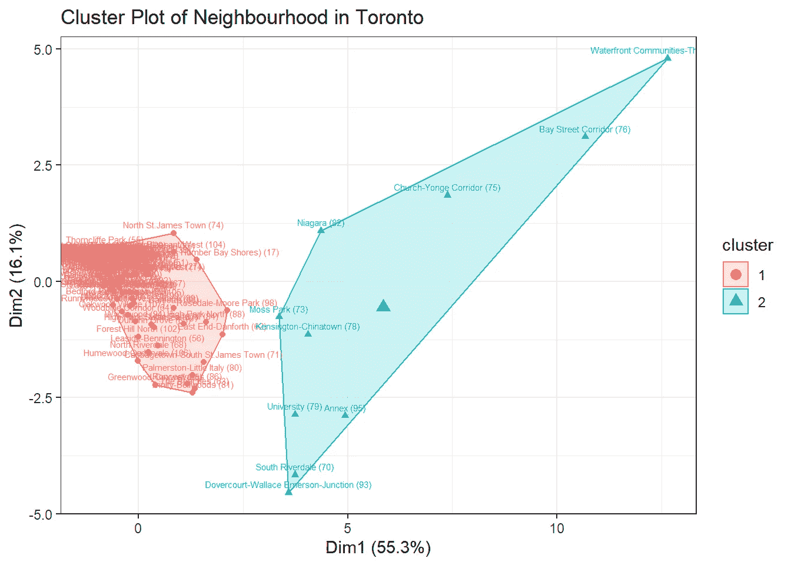
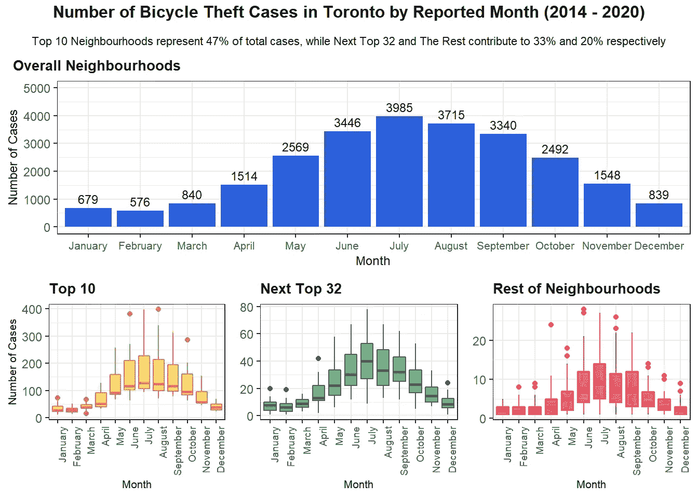

# 揭秘多伦多自行车盗窃案:哪些街区应该得到更多关注？

> 原文：<https://towardsdatascience.com/demystifying-bicycle-theft-cases-in-toronto-which-neighborhoods-should-get-more-attention-1ff273115474?source=collection_archive---------12----------------------->

## 根据历史数据，发现多伦多警察局应该关注哪些街区的潜在自行车盗窃事件。

# **总结**

这项研究旨在根据多伦多警察局公布的 2014 年至 2020 年报告的自行车盗窃案件清单，找出多伦多哪些街区在自行车盗窃方面应该引起注意。这项研究表明，多伦多警察局应该关注 6 年内占自行车盗窃案件总数约 47%的 10 个街区，此外还有其他 3 个街区的公寓，它们对 2020 年自行车盗窃案件的增长趋势有重要贡献。

# **简介**

自行车是[一种历史悠久的交通方式](https://en.wikipedia.org/wiki/History_of_the_bicycle)，给人类社会带来显著的好处。自行车不仅有利于运送人或货物，而且对保持身体健康非常有益，有助于增进精神健康。

由于在新冠肺炎疫情期间[骑自行车成为一种流行的生活方式](https://www.bbc.com/future/bespoke/made-on-earth/the-great-bicycle-boom-of-2020.html)和[自行车供应可能赶不上需求的增长](https://www.bicycling.com/news/a34587945/coronavirus-bike-shortage/)，毫无疑问[自行车价格可能会继续上涨](https://www.bicycleretailer.com/international/2021/02/05/take-hike-bike-prices-expected-go-again#.YW_WABpBy5c)。因此，丢失你可爱的自行车可能是最大的遗憾之一，如果发生的话。

这篇文章探讨了 2014 年至 2020 年发生在多伦多的自行车盗窃案件。用于执行分析的数据集由多伦多警察局提供，可在此处访问[。](https://data.torontopolice.on.ca/datasets/bicycle-thefts/explore?location=43.727864%2C-79.122754%2C9.64)

这篇文章回答了以下问题:

*   在过去的 6 年里，多伦多哪些社区的自行车盗窃案最多？
*   有没有一些有助于发现潜在盗窃案件的常规行为？
*   2020 年，有没有哪个街区的自行车盗窃案数量会大幅增加？

使用 r 执行分析。执行分析的详细步骤请参考此处的。

# **数据特征**

以下是本次研究考虑的特征。

*   邻域(总邻域数= 140)
*   报告日期
*   被盗自行车的类型(如山地车、普通自行车等。)
*   自行车最后一次停放的场所(称为“场所类型”)

# **调查结果**

> **在过去 6 年里，多伦多哪些社区的自行车失窃案最多？**

[帕累托分析](https://en.wikipedia.org/wiki/Pareto_analysis)用于根据社区在过去 6 年多伦多自行车盗窃案件总数中的重要性对社区进行排序。这些社区被分为三组:

*   十大社区
*   不在前 10 个街区，但仍占自行车盗窃案总数的 80%
*   其余街区

**图 1**—2014–2020 年多伦多街区自行车盗窃案贡献的帕累托图**(图片由作者提供)**

据了解，10 个街区贡献了大约 47%的盗窃案件。与此同时**其他 32 个小区加起来的数字达到 80%** 。其余 20%的盗窃案件分散在其他 98 个社区。

从现在开始，假设邻域可以被分成 3 组:

*   **“前 10 名”** : 10 个社区贡献了大约 47%的案例
*   **“下一个 32 强”** : 32 个社区贡献了大约 33%的案例
*   **“其余社区”** : 98 个社区，约占案件的 20%

> **哪些街区被归为“前 10 名”？**

以下是 2014 年至 2020 年落入“前 10 名”群体的社区列表，以及它们各自的自行车盗窃案件数量。

**图 2**—2014–2020 年自行车盗窃案件数量排名前十的社区**(图片由作者提供)**

> **是什么让“十佳”邻里团脱颖而出？**

深入到楼宇类型，注意到**一般情况下**，上次停放在楼宇外的**自行车容易被盗**。一个**相似的模式**也显示在**的“前 10”邻居组**中。

然而，**除了“前 10 名”**之外，发生在户外和住宅区(即公寓和房屋)的案件中值数量几乎相似。

**图 3**—2014-2020 年多伦多自行车盗窃案件数量(按房屋类型划分)**(图片由作者提供)**

房屋类型的不同模式可能是使“前 10 名”在其他邻里群体中脱颖而出的模式。为了证明这一论点， **K-means 聚类被用于跨邻域可视化群体分割**。

[‘剪影法’和‘肘法’用于确定最佳聚类数( *k* )](/silhouette-method-better-than-elbow-method-to-find-optimal-clusters-378d62ff6891) 。建议最佳的*k*-值为 2，因为这是平均距离突然下降的点(根据肘法)和剪影分数达到其峰值的点(根据剪影法)。

**图 4** —肘部和剪影方法**(图片由作者提供)**

根据下面包含两个聚类的聚类图，“前 10 名”社区被归类到与其他社区不同的聚类中。**这显示了“前 10 名”的重要性，在过去 6 年中，多伦多所有自行车盗窃案件中，这一邻里群体的贡献最大，这些案件主要发生在建筑物外。**

**图 5** —丛状地块**(图片由作者提供)**

> **有没有一些有助于发现潜在自行车盗窃案件的常规行为？**

从下图可以了解到，多伦多的**自行车盗窃案大多发生在工作日**。

**图 6**—2014–2020 年按报告日统计的多伦多自行车盗窃案件数量 **( *图片作者* )**

从逐月趋势来看，**病例数在春季**开始堆积，**在夏季**达到高峰，然后**趋势显示从秋季到冬季持续下降。**

**图 7**—2014–2020 年**报告月份的自行车盗窃案件数量(图片由作者提供)**

山地车和普通自行车是 2014 年至 2020 年期间报告失窃的两种最常见的自行车类型。

**图 8**—2014–2020 年多伦多自行车失窃案件数量(按自行车类型划分)**(图片由作者提供)**

> **2020 年，有哪些街区的自行车盗窃案数量出现大幅跃升？**

虽然“前 10 名”邻里小组对案件数量的贡献最大，但其他邻里的重要性也不容忽视。

从同比趋势来看，据了解，2020 年多伦多的自行车盗窃案件数量有所增加[，尽管新冠肺炎实施了限制](https://en.wikipedia.org/wiki/COVID-19_pandemic_in_Toronto)。此外，与其他组相比,“下一个前 32 名”邻近组中的病例中值数显示出显著增加。

**图 9**—2014–2020 年报告年度多伦多自行车失窃案件数量**(作者图片)**

还值得注意的是，2019 年至 2020 年，“下一个 32 强”组的病例数量增加了 20%左右。另一方面,“前 10 名”下降了 14%左右。

此外，在对 2020 年病例的增量趋势数量贡献最大的 10 个街区中，其中 6 个属于“下一个前 32 名”。同时，只有一个地区(河谷镇)代表“前 10 名”。**这表明“下一个前 32 名”群体中的社区对自行车盗窃案件数量的重要性。**

**图 10**—2020 年各街道组对同比总病例数的贡献以及对增量病例数贡献前 10 名**(作者图片)**

**公寓自行车盗窃案件的数量对 2020 年案件数量的增长起到了重要作用。**此外，这一数字也是芒特普莱森特西(49 例)、柳谷东(28 例)和湾景村(22 例)病例增加的主要原因。**这些街区的公寓案件数量与其他街区**增加的案件总数相似，甚至更多，如 Englemount-Lawrence、Yonge-Eglinton 等。

**图 11** —房屋类型对同比案件总数的贡献以及前 10 名贡献者中每个贡献者的案件增量**(图片由作者提供)**

这表明**芒特普莱森特西、柳谷东和湾景村**的公寓，不属于“前 10 名”邻里群体，**在 2020 年自行车盗窃案件的增量趋势数字中发挥了重要作用。**

# **结论**

这项研究建议多伦多警察局应该更加注意在以下地方防止自行车被盗，希望能够减少多伦多的自行车被盗案件。

*   在过去的 6 年中，10 个街区的自行车盗窃案占了 47%,尤其是停在大楼外面的自行车。
*   芒特普莱森特维尤、柳谷东区和湾景村的公寓；因为这些对 2020 年自行车盗窃案件数量的增加做出了重要贡献。

此外，建议在春夏季节到来时，特别是在工作日，要警惕潜在的自行车盗窃犯罪。

如果您对本文有任何反馈，请通过[***LinkedIn***](https://www.linkedin.com/in/adhiprathama/)*联系我们。还有，可以随意查看我的* [***GitHub 资源库***](https://github.com/adhiprathama92) *来探索我的项目。*