# 揭开 boto3 的神秘面纱:如何在 Python 中使用任何 AWS 服务

> 原文：<https://towardsdatascience.com/demystifying-boto3-how-to-use-any-aws-service-with-python-b5c69593bcfa?source=collection_archive---------19----------------------->

## 深入探究 boto3 以及 AWS 如何构建它

来自 [Pexels](https://www.pexels.com/photo/desk-industry-technology-computer-8566472/?utm_content=attributionCopyText&utm_medium=referral&utm_source=pexels) 的[金德媒体](https://www.pexels.com/@kindelmedia?utm_content=attributionCopyText&utm_medium=referral&utm_source=pexels)的照片

AWS 将 boto3 定义为一个 Python 软件开发工具包，用于创建、配置和管理 AWS 服务。在本文中，我们将了解 boto3 如何工作，以及它如何帮助我们与各种 AWS 服务进行交互。

**目录:**

[1。Boto3 引擎盖下](#b00f)
[2。客户端与资源](#f609)
∘ [为什么资源通常比客户端容易使用](#7374)
∘ [为什么你仍然会在大部分工作中使用客户端](#b2f3)
[3 .等待者](#a7e6)
∘ [等到特定的 S3 对象到达 S3](#a7ba)
[4。收藏](#1448)
[5。会话:如何将 IAM 凭证传递给你的 boto3 代码？](#4272)
∘ [如何更改默认的 boto3 会话？](#190b)
结论

# 1.引擎盖下的 Boto3

[AWS CLI](https://github.com/aws/aws-cli) 和 [boto3](https://github.com/boto/boto3) 都建立在 [botocore](https://github.com/boto/botocore) 之上——一个低级 Python 库，负责向 AWS 发送 API 请求和接收响应所需的一切。**肉毒杆菌:**

*   处理**会话**，凭证和配置，
*   为所有操作提供细粒度的**访问**。ListObjects，DeleteObject )在特定服务( *ex)内。S3* )，
*   负责**将**输入参数、**签名请求**，以及**将**响应数据反序列化到 Python 字典中，
*   提供低级**客户端**和高级**资源**抽象，以与 Python 中的 AWS 服务进行交互。

你可以把 botocore 看作是一个包，它允许我们忘记底层的 JSON 规范，在与 AWS APIs 交互时使用 Python (boto3)。

# 2.客户端与资源

在大多数情况下，我们应该使用 boto3 而不是 botocore。使用 boto3，我们可以选择与较低级的**客户端**或者较高级的面向对象的**资源**抽象交互。下图显示了这些抽象之间的关系。

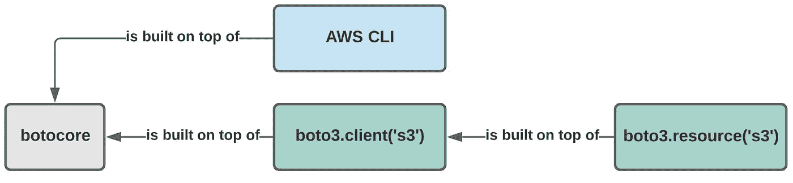

boto3、aws-cli 和 botocore 中的抽象级别，以 S3 为例—图片由作者提供

为了理解这些组件之间的区别，让我们看一个简单的例子，它将展示 S3 **客户端**和 S3 **资源**之间的区别。我们想要列出来自`images`目录的所有对象，即所有带有前缀`images/`的对象。

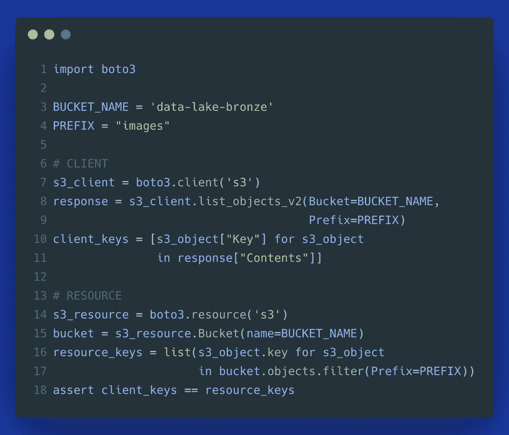

Boto3:客户端 vs 资源——作者图片

通过这个简单的例子，您可能已经发现了不同之处:

*   使用**客户端**，您可以从反序列化的 API 响应中直接与**响应字典**进行交互，
*   相比之下，使用**资源**，你可以与标准的 **Python 类**和对象交互，而不是原始的响应字典。

您可以使用`help()`和`dir()`来调查**资源**对象的功能:

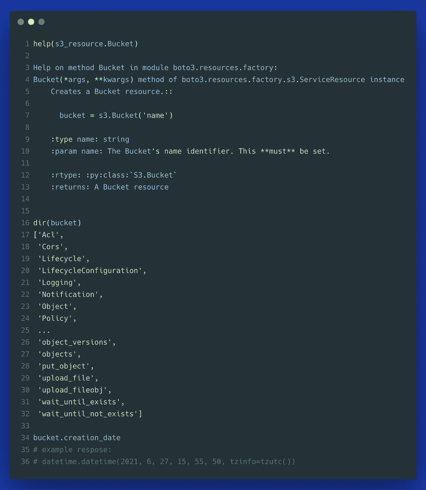

Boto3:探索资源对象—作者图片

总的来说，**资源**抽象产生了可读性更好的代码(*与 Python 对象交互，而不是解析响应字典*)。它还处理许多底层细节，如分页。资源方法通常会返回一个生成器，这样你就可以轻松地遍历大量返回的对象，而不用担心分页或者内存不足。

> ***有趣的花絮:*** *无论是客户端还是资源代码，都是基于描述各种 AWS APIs 的 JSON 模型动态生成的。对于客户端，AWS 使用* ***JSON 服务描述*** *，对于资源 a* ***资源描述*** *，* *作为自动生成代码的基础。这有助于更快的更新，并为您与 AWS 交互的所有方式提供一致的界面(* CLI、boto3、管理控制台*)。JSON 服务描述和最终的 boto3 代码之间唯一真正的区别是，* `*PascalCase*` *操作被转换为更 Pythonic 化的* `*snake_case*` *符号。*

## 为什么资源通常比客户端更容易使用

假设您需要列出 S3 存储桶中的数千个对象。我们可以尝试在初始代码示例中使用的相同方法。唯一的问题是`s3_client.list_objects_v2()`方法只允许我们列出一个[最多一千个对象](https://boto3.amazonaws.com/v1/documentation/api/latest/reference/services/s3.html?highlight=list_objects_v2#S3.Client.list_objects_v2)。为了解决这个问题，我们可以利用**分页**:

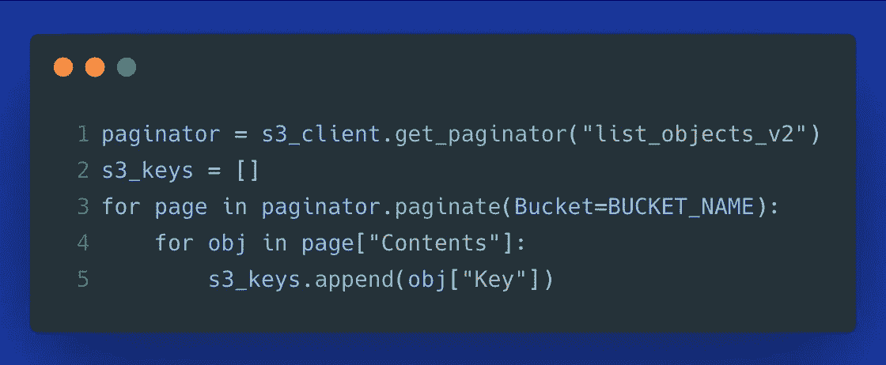

boto 3:S3 客户端分页——图片由作者提供

虽然分页器代码非常简单，但是**资源**抽象只用两行代码就完成了工作:

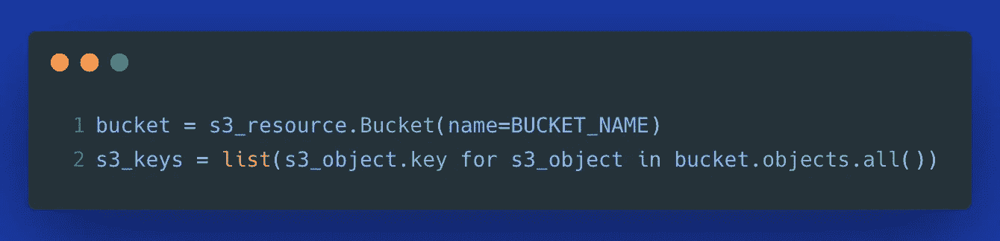

Boto3: S3 资源—作者图片

## 为什么您仍然会在大部分工作中使用客户端

尽管有资源抽象的好处，**客户机**提供了更多的功能，因为它们与 AWS 服务 API 几乎是 1:1 的映射。因此，根据特定的用例，您很可能最终会同时使用**客户端**和**资源**。

除了功能上的不同，**资源**不是**线程安全的**，所以如果你计划使用多线程或多重处理来加速 AWS 操作，比如文件上传，你应该使用客户端而不是资源。更多关于那个[这里](https://boto3.amazonaws.com/v1/documentation/api/latest/guide/resources.html#multithreading-or-multiprocessing-with-resources)。

> **注意:**有一种方法可以直接从资源对象访问客户端方法:`s3_resource.meta.client.some_client_method()`。

# 3.服务员

等待者正在轮询特定资源的状态，直到它达到您感兴趣的状态。例如，当您使用 boto3 创建 EC2 实例时，您可能希望等到它达到“运行”状态，直到您可以对这个 EC2 实例做一些事情。以下是展示这个特定示例的示例代码:

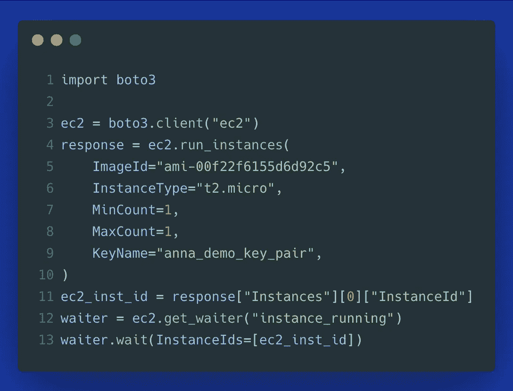

Boto3:使用 waiter 轮询新 EC2 实例的运行状态——图片由作者提供

请注意，上例中的`ImageId`对于每个 AWS 区域是不同的。您可以按照 AWS 控制台中的“启动实例”向导找到 AMI 的 ID:

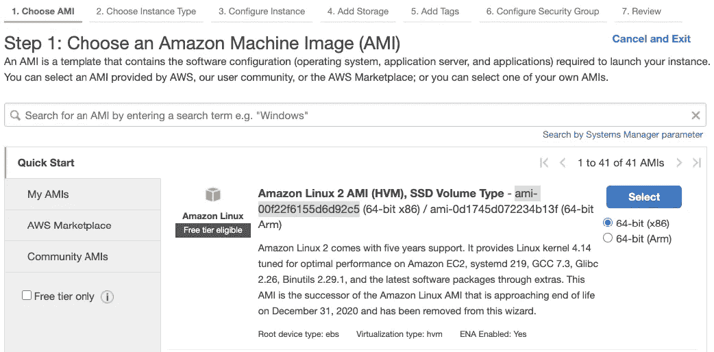

寻找阿美族——作者图片

## 等到一个特定的 S3 对象到达 S3

实话实说吧。您多长时间发布一次新实例？可能不经常。所以让我们建立一个更真实的服务员例子。

假设您的 ETL 过程一直在等待，直到一个特定的文件到达 S3 桶。在下面的例子中，我们一直等到市场部的人上传一个包含当前活动成本的文件。虽然您可以使用带有 S3 事件触发器的 AWS Lambda 实现相同的功能，但是下面的逻辑并不依赖于 Lambda，可以在任何地方运行。

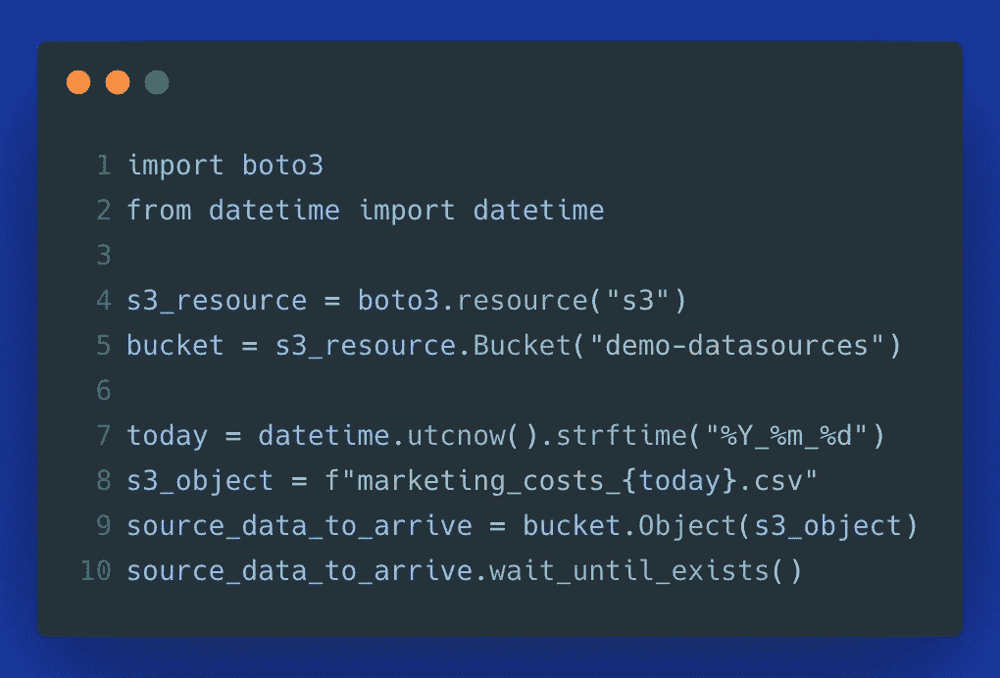

使用 S3 资源中的服务员—图片由作者提供

或者同样使用更可配置的**客户端**方法:

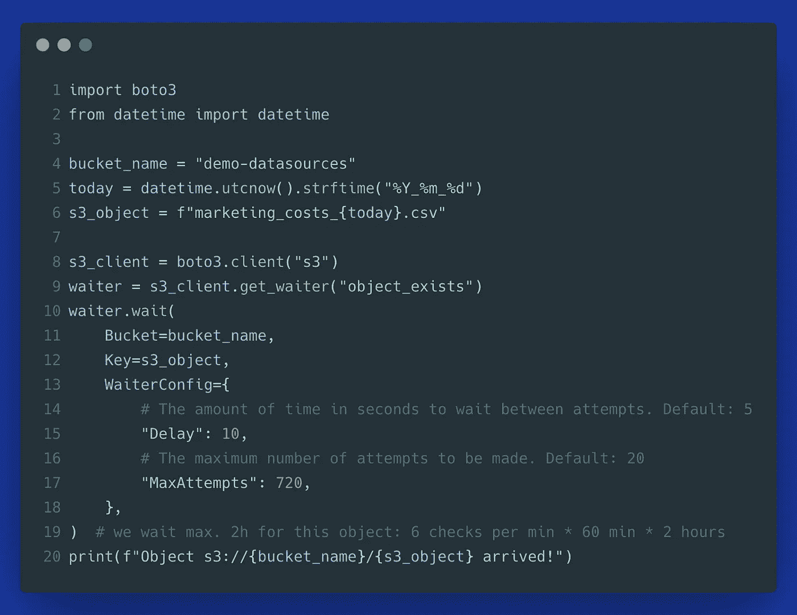

在 S3 客户端使用服务员—作者图片

从上面的代码片段可以看出，使用客户端的服务员抽象，我们可以指定:

*   **MaxAttempts** :我们应该检查多少次特定对象是否到达——这将防止僵尸进程，如果对象在预期时间内没有到达，将会失败，
*   **延迟**:每次尝试之间等待的秒数。

文件一到达 S3，进程就停止等待，这允许您对新到达的数据做一些事情。

# 4.收集

集合表示一组资源，如桶中的一组 S3 对象或一组 SQS 队列。它们允许我们在单个 API 调用中对一组 AWS 资源执行各种操作。**收藏可用于:**

*   获取带有特定对象前缀的**所有 S3** **对象**:

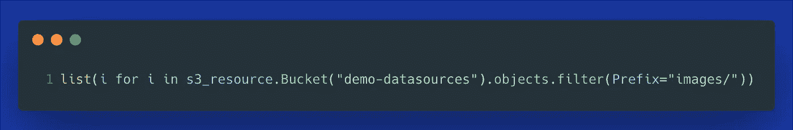

Boto3 系列—作者图片

*   获取具有特定内容类型的所有 S3 对象，例如，**查找所有 CSV 文件**:

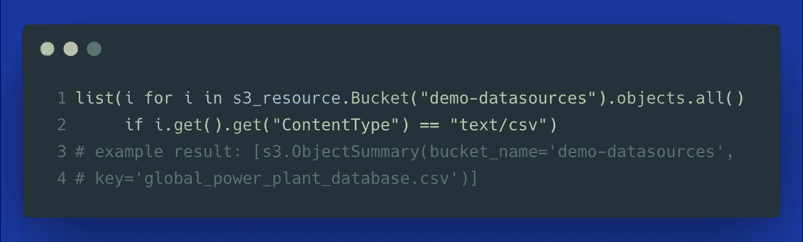

Boto3 系列—作者图片

*   获取所有 S3 **对象版本**:

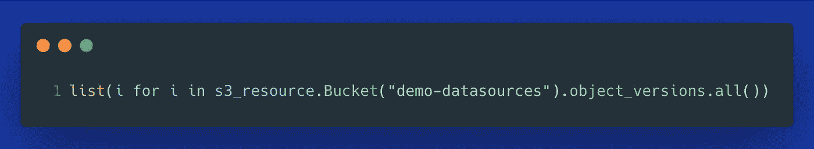

Boto3 系列—作者图片

*   指定要迭代的对象的**块大小**，例如，当 1000 个对象的默认页面大小对于您的应用程序来说太大时:

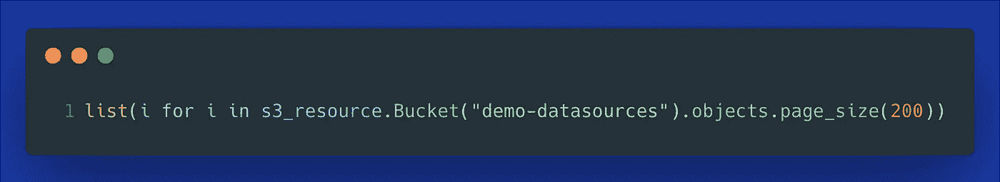

Boto3 系列—作者图片

*   在一个 API 调用中删除所有对象(*小心点！):*

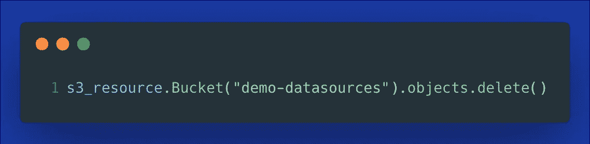

Boto3 集合:删除所有对象—作者图片

更常见的操作是删除带有特定前缀的所有对象:

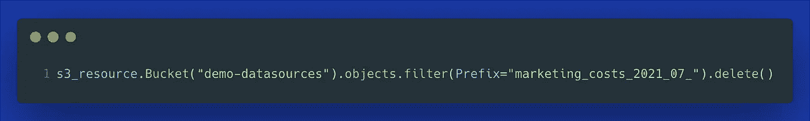

Boto3 集合:删除带有特定前缀的所有对象—图片由作者提供

# 5.会话:如何将 IAM 凭证传递给你的 boto3 代码？

在与 boto3 交互时，有许多方法可以传递访问键。以下是 boto3 尝试查找凭据的位置顺序:

#1 显式传递给`boto3.client()`、`boto3.resource()`或`boto3.Session()`:

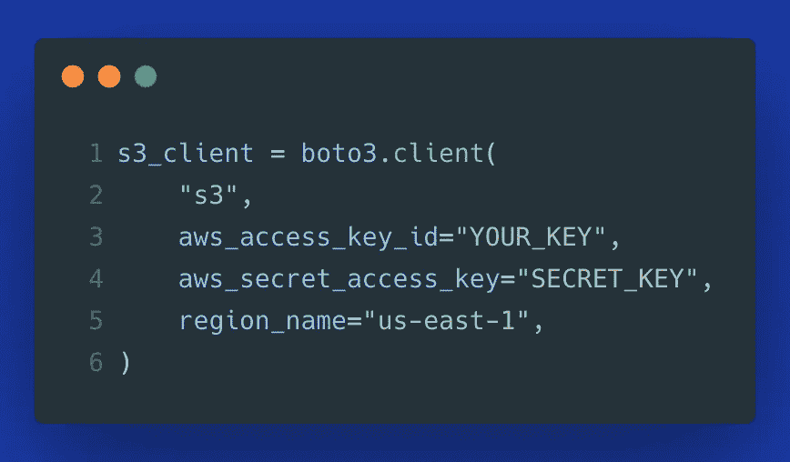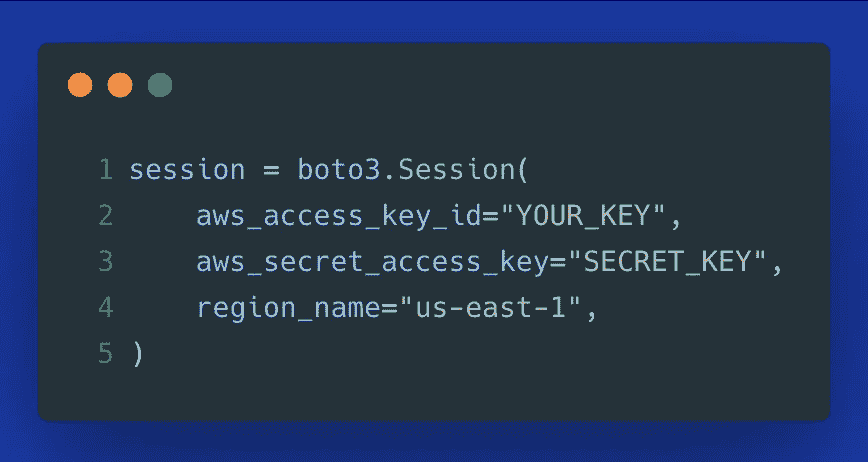

Boto3:访问键—作者图片

#2 设置为环境变量:

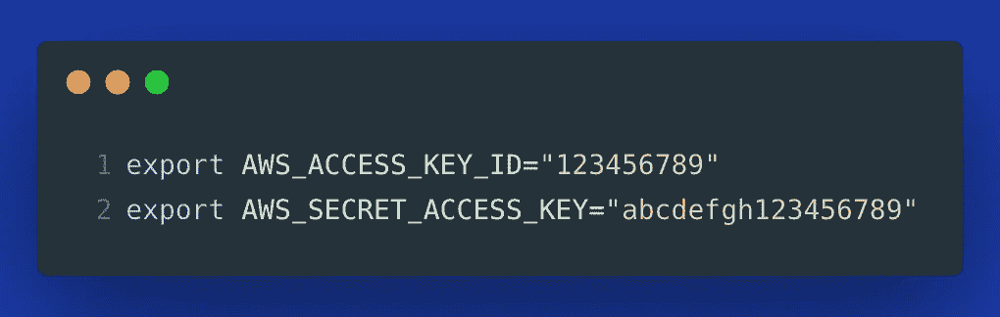

将访问键作为环境变量—图片由作者提供

#3 在`~/.aws/credentials`文件中设置为凭证(*该文件由 AWS CLI* 中的 `*aws configure*` *自动生成):*

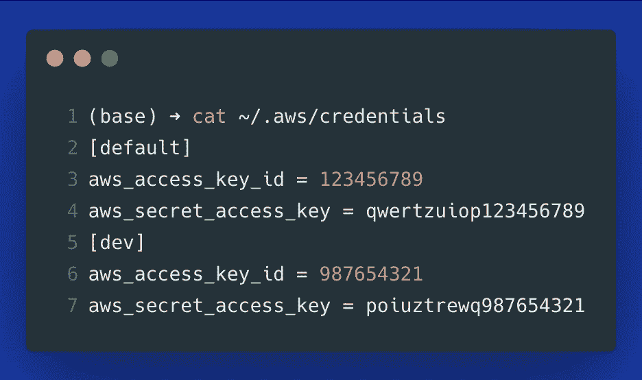

AWS 凭据—图片由作者提供

#4 如果您将具有适当权限的 **IAM 角色**附加到您的 AWS 资源，您根本不需要传递凭证，而是分配一个具有所需权限范围的策略。这是它在 AWS Lambda 中的样子:

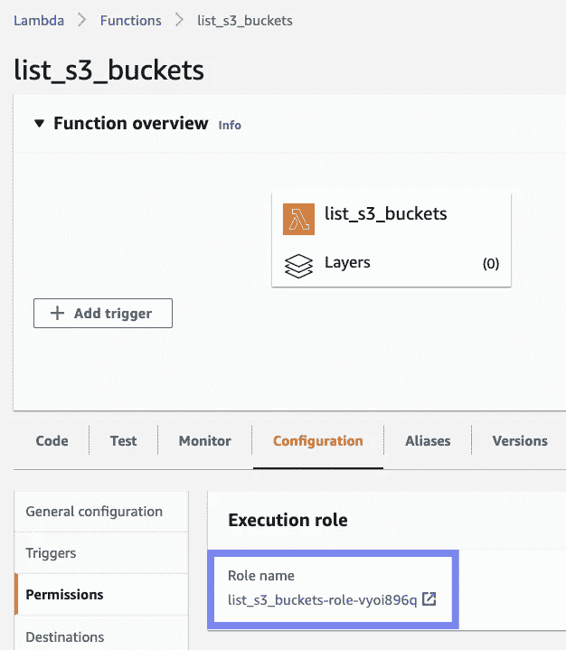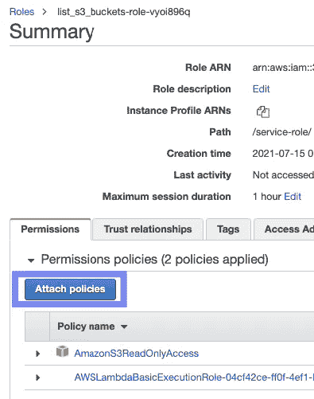

我在 AWS Lambda 中的角色—图片由作者提供

这意味着通过将 **IAM roles** 附加到 Lambda 函数等资源上，您不需要手动传递或配置任何长期访问键。相反，IAM 角色动态地生成临时访问密钥**，使得这个过程更加安全。**

**如果你想利用 **AWS Lambda** 与 **Python** 和 **boto3** 的特定用例，请看下面的链接:**

*   **如何构建[事件驱动的 ETL](/7-reasons-why-you-should-consider-a-data-lake-and-event-driven-etl-7616b74fe484) 和[事件驱动的数据测试](https://betterprogramming.pub/put-a-stop-to-data-swamps-with-event-driven-data-testing-203d9c1be073)，**
*   **如何使用 Amazon Rekognition 从图像中提取文本，**
*   **如何[使用社交网络、SQS 和 Kinesis](https://betterprogramming.pub/aws-kinesis-vs-sns-vs-sqs-a-comparison-with-python-examples-6fc688bfd244) 构建解耦服务，**
*   **如何[使用 NoSQL DynamoDB 读写数据](https://levelup.gitconnected.com/are-nosql-databases-relevant-for-data-engineering-e631abe473f5)，**
*   **如何使用机密管理器管理凭证[，](/how-i-manage-credentials-in-python-using-aws-secrets-manager-1bd1bf5da598)**
*   **如何[使用 S3 选择来提高从 S3 检索数据的性能](/how-i-improved-performance-retrieving-big-data-with-s3-select-2bd2850bc428)。**

**AWS Lambda 的一个有用特性是 boto3 已经预装在所有 Python 运行时环境中。这样，您可以直接在 Lambda 函数中运行本文中的任何示例。只需确保添加与您想要在 Lambda 的 IAM 角色中使用的服务相对应的适当策略(例如，*，S3 只读策略*):**

**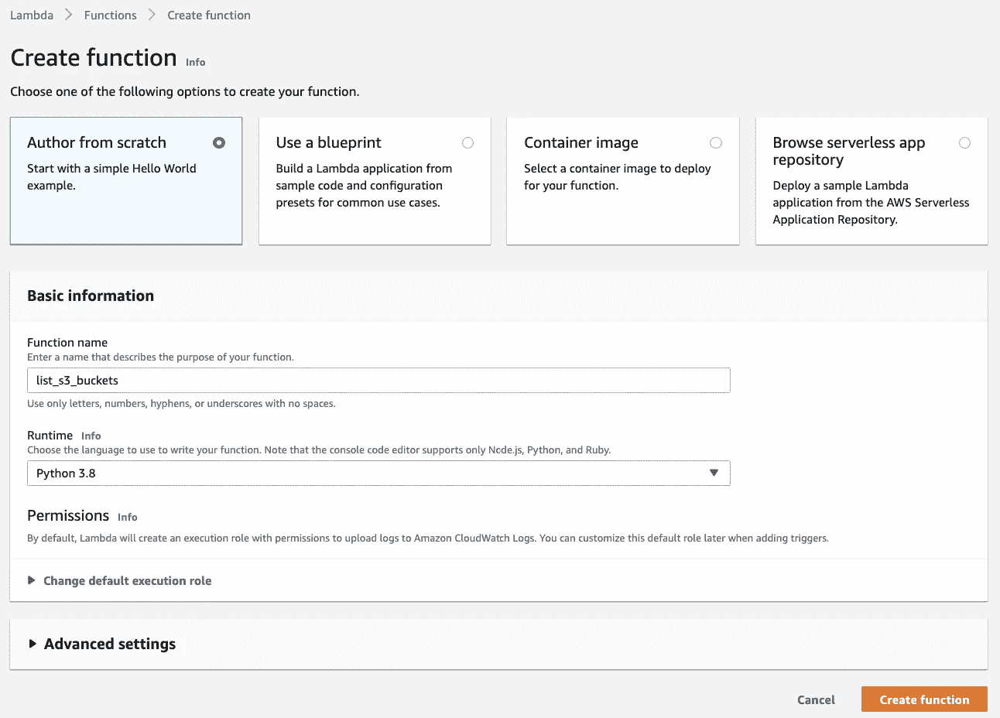**

**在 AWS Lambda 中创建函数-作者图片**

**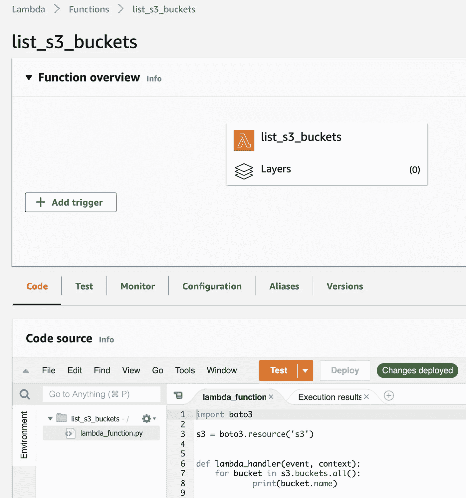**

**测试来自 AWS Lambda 的 boto3 图片由作者提供**

**如果你计划在生产中运行一些 Lambda 函数，你可以探索一下[dash bird](https://dashbird.io/)——一个可观察性平台，它将帮助你[监控和调试你的无服务器工作负载](https://dashbird.io/serverless-observability/)。它对于构建[故障自动警报](https://dashbird.io/failure-detection/)、[基于项目或域对相关资源](https://dashbird.io/blog/group-aws-lambda-functions-dashbird-project/)进行分组、提供所有无服务器资源的概览、交互式浏览日志以及可视化操作瓶颈尤其有价值。多亏了 CloudFormation 模板，整个设置只需要 2 分钟。**

**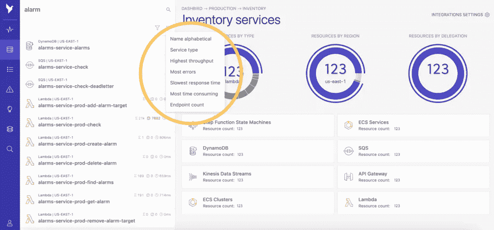**

**Dashbird 提供的所有无服务器资源概述—图片由 [Dashbird.io](https://dashbird.io/) 提供**

## **如何更改默认的 boto3 会话？**

**Boto3 使更改默认会话变得很容易。例如，如果您有几个概要文件(*，比如一个用于* `*dev*` *，一个用于* `*prod*` *AWS 环境*，您可以使用一行代码在它们之间切换:**

**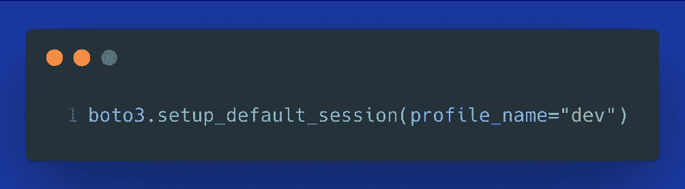**

**Boto3: session —作者图片**

**或者，您可以将凭据直接附加到默认会话，这样您就不必为每个新客户端或资源单独定义凭据。**

**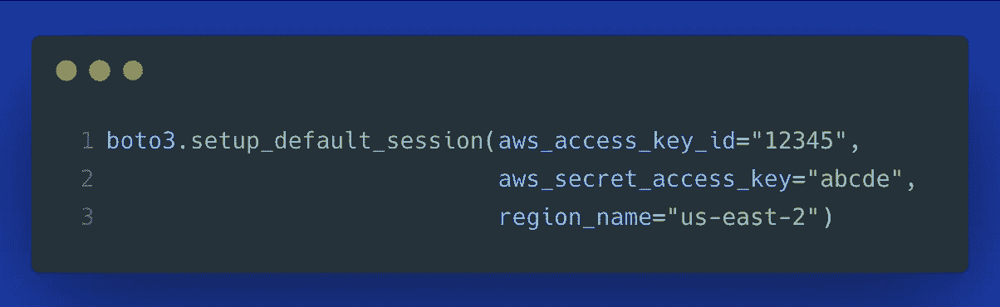**

**Boto3: session —作者图片**

# **结论**

**在本文中，我们研究了如何使用 boto3 以及它是如何在内部构建的。我们研究了**客户端**和**资源**之间的差异，并调查了它们各自如何处理**分页**。我们探索了**等待者**如何在继续我们代码的其他部分之前帮助我们轮询 AWS 资源的特定状态。我们还研究了**集合**如何允许我们在多个 AWS 对象上执行操作。最后，我们探索了向 boto3 提供凭证的不同方法，以及如何使用 IAM 角色和 IAM 用户访问键来处理这些凭证。**

****感谢您的阅读！****

****参考文献:****

**[1][AWS re:Invent 2014 |(dev 307)针对 Python (Boto)的 AWS SDK 第 3 版简介](https://www.youtube.com/watch?v=Cb2czfCV4Dg)**

**[2] [Boto3 文档](https://boto3.amazonaws.com/v1/documentation/api/latest/index.html)**