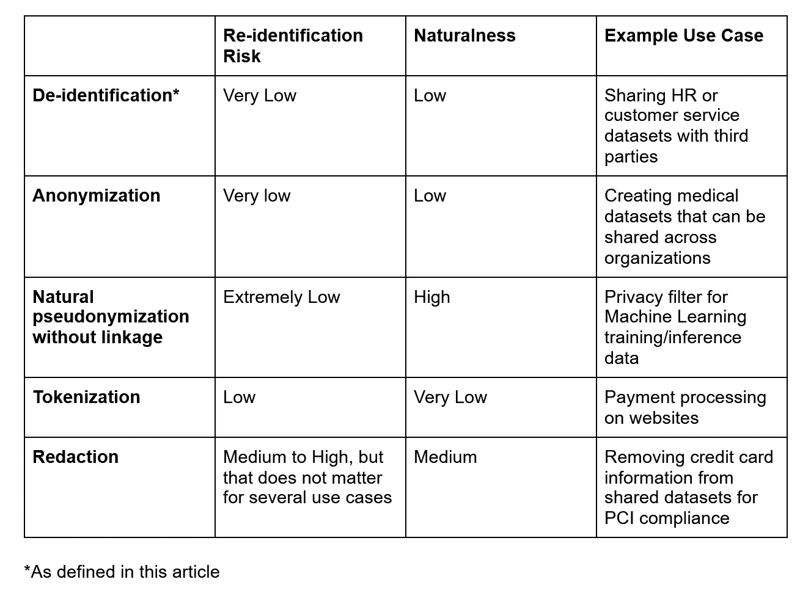

# 揭开去认同的神秘面纱

> 原文：<https://towardsdatascience.com/demystifying-de-identification-f89c977a1be5?source=collection_archive---------22----------------------->

## 了解数据保护法规遵从性的关键技术

来源:https://unsplash.com/photos/B2SRwbYWLuI

数据匿名化、去标识化、编辑、假名化和标记化是满足数据保护法规(如 GDPR 和即将出台的 CPRA)的关键技术。但是区分匿名化、去标识化、编辑、假名化和标记化比看起来更复杂:存在足够多的混淆和错误信息，甚至可以迷惑最有经验的数据科学家。

## **匿名化 vs 去标识化 vs 编辑 vs 假名化 vs 标记化**

获得正确的定义是做出正确决策以最有效地保护和使用数据的关键一步。我们将看看每一个的定义，并给出一个运行的实际例子来直观地展示每一个的样子。

在围绕这些术语的讨论中，重新识别的风险经常交织在一起。*再识别*是指对数据集中有直接识别信息(如全名、社会安全号)或准识别信息(如年龄、大概地址)的个体进行身份确定的行为。当组合在一起时，准识别符会导致重新识别的指数风险。在某些情况下，去识别机构需要重新识别的能力，在这种情况下，另一层风险在于恶意方访问将直接和准标识符与它们被替换的数据相链接的数据的可能性。

## **匿名化**

*匿名化*是指删除个人可识别信息和准可识别信息(即当与其他信息结合时，可导致重新识别的数据；例如年龄、大概地址等。)以使得个体变得永久不可识别。参见[匿名化和 GDPR 合规；概述](https://www.gdprsummary.com/anonymization-and-gdpr/)了解它如何融入 GDPR。

匿名化通常是使结构化医疗数据集安全共享的首选方法。非结构化数据呢？可以匿名吗？虽然这样做比较棘手，但答案是肯定的。这是一封经过适当匿名处理的电子邮件样本:

“你好[姓名]，

抱歉，它已经在我的垃圾邮件中结束了！

我明天[时间]有预约，但是[时间]可以。届时，我将发送更新的邀请。如果这对你不起作用，请告诉我。

谢谢你，

[姓名]"

## **取消识别**

*去识别*也需要删除个人和准识别符，但通过一个过程，使原始数据重新连接到去识别结果。参见[数据去识别或匿名化指南](https://www.educause.edu/focus-areas-and-initiatives/policy-and-security/cybersecurity-program/resources/information-security-guide/toolkits/guidelines-for-data-deidentification-or-anonymization)。

实际上，取消身份通常用于描述删除直接标识符(全名、地址、SSN 等)的过程。)和有时的准标识符(年龄、性别等)。)但与匿名化相比，它对数据不能追溯到个人的保证更少，尽管它有时也被用作包含匿名化和假名化的术语。

你可能会想，如果你不能保证数据是匿名的，那么解密数据又有什么意义呢？这取决于用例。

将上面的匿名电子邮件改为:

“你好[姓名 1]，

抱歉，它已经在我的垃圾邮件中结束了！

我明天在[TIME_1]有预约，但是[TIME_2]也可以。届时，我将发送更新的邀请。如果这对你不起作用，请告诉我。

谢谢你，

[姓名 2]"

现在，假设一家公司决定加密与 NAME_1、NAME_2、TIME_1 和 TIME_2 相关联的直接和潜在标识符，并单独存储它们，以防它们需要重新识别电子邮件(可能用于法庭)。那封电子邮件将不再被视为匿名邮件，因为标识符可以链接回它。

但这并不意味着隐私受到了损害。例如，如果分析和机器学习团队使用去身份化的电子邮件(而不是明文原件)，他们实际上为他们的用户和他们的公司提供了很好的服务。有可能获得洞察力，同时降低用户隐私风险，并最大限度地降低将个人数据发送到组织的另一部分的安全风险，在那里个人数据可能变得无法跟踪。

## **修订版**

为了增加匿名化和取消身份识别之间的混淆，术语“编辑”也经常被错误地使用。根据[国际隐私专业人员协会的术语表](https://iapp.org/resources/glossary/#redaction)，编辑是“识别和删除或阻止正在生成的文档中的信息的做法[…]”。

编辑在去标识化方面扮演了一个有趣的角色。修订不一定涉及完全删除个人数据，而是有选择地删除特别敏感的信息。一个例子是从客户服务对话中删除信用卡号码。如果电子邮件、电话记录或聊天记录泄露了关于如何使用吸尘器的问题，那可能不会造成很大的损害。但是如果那些聊天记录里有信用卡号并且没有被删除呢？大买卖。

## **假名化**

现在有一个术语经常被误解。即假名化。假名化是指替换某些数据(如姓名、地址等)。)带有假数据，这些假数据通常被表示为与原始数据相链接。这为一个术语留下了一个相当大的漏洞，这个术语意味着用与原始数据无关的虚假数据替换信息。我们将杜撰一个短语 ***无链接的自然假名化*** 来定义这一点。

如上所述，与去识别相比，无关联的自然假名化有许多优点。首先，数据对于机器学习训练和推理变得更加友好。在下面的示例中，PII 已被替换为斜体的假数据:

“嗨*凯特*，

抱歉，它已经在我的垃圾邮件中结束了！

我预约了明天下午 5 点，但是上午 9 点也可以。届时，我将发送更新的邀请。如果这对你不起作用，请告诉我。

谢谢你，

琳达

此外，意外留下的任何个人或准可识别信息都变得像大海捞针一样难以与虚假数据区分开来(或者更像大海捞针)；例如，假设在取消识别上述电子邮件时，意外遗漏了“Linda ”:

“你好[姓名 1]，

抱歉，它已经在我的垃圾邮件中结束了！

我明天在[TIME_1]有预约，但是[TIME_2]也可以。届时，我将发送更新的邀请。如果这对你不起作用，请告诉我。

谢谢你，

琳达"

在 Private AI，我们已经花了大量的时间来找出如何正确地进行自动假名化。这里有一个提示:字典查找不起作用。我们必须创建自己的 transformer 模型架构(一种为自然语言处理而构建的机器学习模型)，以便以上下文化、非确定性的方式生成真实的单词和数字。仔细选择训练数据对于产生真实的替代物是至关重要的，这也是其他的交易技巧之一。

标记化也经常被称为一种假名化。

## **标记化**

最后一个术语是*标记化*，它通常用于具体描述替换某些数据的标记类型。也就是说，用随机令牌替换个人数据。通常，在原始数据和令牌之间保持链接(例如，用于网站上的支付处理)。例如，令牌可以由单向函数(例如加盐散列)生成，或者可以是完全随机数。例如，如果某些类型的令牌化依赖于加密，那么它们甚至是可逆的，在这种情况下，只需要存储解密密钥，而不需要存储每条个人数据与其替代数据之间的链接。

让我们在运行的电子邮件示例中标记直接和准可识别的信息:

“Hi 748331d 230 BF 99d 9 a 39 ed 0 e 6 c 6668 cdd，

抱歉，它已经在我的垃圾邮件中结束了！

我明天订了 3388 e 06178d 0634 fc 03 ffbdecce 677 f 8，不过 f6f 7755d 5141d 5 b 7308 df 2516 aa 9 a 82 c 也行。届时，我将发送更新的邀请。如果这对你不起作用，请告诉我。

谢谢你，

ce5a 40345609 b 81 a5e 7c 973 C1 F3 d 93 EB "

虽然标记化对支付处理特别有用，但它不太可能成为非结构化数据保护的赢家，因为与没有链接的自然假名化相比，它相对缺乏相关的上下文信息。

## **把所有的放在一起**

尽管直接和准标识符通过匿名化、去标识化、编辑、假名化和标记化中的每一种方式被删除，但它们在维护原始数据的上下文信息方面都非常有效。请继续关注我们下一篇关于匿名化是如何被误解的文章。

同时，这里有一个方便的表格来指导你的决策:

**致谢**

感谢 John Stocks 和 Pieter Luitjens 对本文早期草稿的反馈。