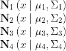
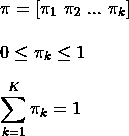
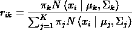

# 揭秘高斯混合模型和期望最大化

> 原文：<https://towardsdatascience.com/demystifying-gaussian-mixture-models-and-expectation-maximization-a66575deaea6?source=collection_archive---------17----------------------->

## 以简化的方式解释高斯混合模型及其期望最大化的基本算法

照片由 [Aaron Burden 拍摄，Unsplash](https://unsplash.com/photos/V6nzK_QYN4g?utm_source=unsplash&utm_medium=referral&utm_content=creditShareLink)

在您学习了如何使用最简单的聚类算法 [k-means](https://en.wikipedia.org/wiki/K-means_clustering) 对未标记数据点的样本进行聚类之后，我们开始看到 k-means 在将该技术应用于真实数据集时的一些缺点。ML 工程师将采取的下一步是应用更复杂的算法来理解他/她的数据样本中的[各种分组(集群)](https://en.wikipedia.org/wiki/Cluster_analysis)，并且该算法很可能是高斯混合建模(GMM)。由于开源软件和多种 ML 框架的存在，比如 [Scikit-learn](https://scikit-learn.org/stable/) ，使用这种算法只需要几行代码。然而，对许多人来说，理解这一过程中使用的数学基础是很难的。在本文中，我们将更直观地研究这个算法的内部工作原理。

## **GMM 相对于 k-means 的优势**

让我们开始构建高斯混合模型的概念，直接研究 k-means 的缺点。

*   **聚类大小不成比例:** k-means 的工作原理是将数据样本分配到最近的假设聚类中心，从而在超平面中形成 [Voronoi 图](https://en.wikipedia.org/wiki/Voronoi_diagram)。因此，如果一个聚类的分布距离其正确的聚类中心太远，几个数据样本将会被错误分类。使用 GMM，数据点在集群中的分布不需要从集群中心开始保持一致。

Voronoi 分割重叠的 GMM 不同分布的集群(图片由作者提供)

*   **不同形状的聚类:**看待上述问题的另一种方式是 k-means 可能扰乱聚类的形状，尽管数据样本被紧密地打包在聚类内。随着聚类方向的改变，k-means 的结果可能会显著改变。

在 GMM 形成的集群，集群中心和相应的 Voronoi 分区重叠(图片由作者提供)

*   **重叠聚类:**有时，属于不同聚类的数据点可以非常紧密地打包，k-means 算法会毫不犹豫地在样本分配到其聚类之间进行推测。k-means 将在聚类之间绘制硬边界，即使样本可能无限接近该边界。对于 GMM，你用一个假设来阐述你的模型，即集群中不存在硬边界，这将我们引向 GMM 的下一个主要优势。

GMM 的重叠集群(图片由作者提供)

*   **软分配:**利用 k-means 的[标准算法](https://en.wikipedia.org/wiki/K-means_clustering#Standard_algorithm_(naive_k-means))，你以 100%的概率将一个数据点分配给一个聚类。但是，在 GMM 中，您可以为数据集中的每个数据样本分配一组可能性，以确定该数据样本属于系统中每个聚类的概率。例如，在下面由 4 个聚类组成的分布中，如果要求 GMM 对数据样本进行聚类，则为出现在中心的数据样本分配相等的概率(各 25%)。

GMM 将做软作业(图片由作者提供)

## 正态分布

那么，从数学上来说，我们如何表示这些大小、形状、方向可能不同，并且可能相互重叠的集群的功能呢？正如这项技术的名称所暗示的，我们利用[高斯分布](https://en.wikipedia.org/wiki/Normal_distribution)来分别表示系统中的每个集群。在我们研究它是如何成为可能之前，让我们简单回顾一下 1D 的高斯分布。

各种高斯分布的 PDF(图片来源:[维基百科](https://en.wikipedia.org/wiki/Normal_distribution#/media/File:Normal_Distribution_PDF.svg))

这里我们展示了一些高斯分布的概率密度函数(PDF)。该单峰函数的峰代表平均值，并且也出现在该分布的中心。这种分布在平均值周围的分布由标准差来确定。标准差的平方项被称为该分布的方差。

但是由于我们的数据集将处于更高维度(比如 n)，我们将不得不利用 n 维高斯分布函数来表示我们的聚类。由于存在多个特征(由图像中的轴表示)对高斯的影响，我们将从简单的方差上升到协方差矩阵，这将有助于我们捕获关于分布(通过方差)和方向(通过相关性)的信息。

## 使用高斯函数创建集群

接下来让我们用高斯分布函数创建不同位置、大小、形状和方向的集群。让我们考虑我们有一个 2 维特征集，它将产生一个 2×2 维协方差矩阵。为了创建一个简单的圆形集群，这里是我们的协方差矩阵。

方差相等的协方差矩阵(图片由作者提供)

对角线项表示轴的每个方向上高斯分布的方差，它们应该相等以得到圆形。现在，如果我们改变方差的尺寸，圆形将被转换成如图所示的椭圆。

协方差矩阵中方差不相等的椭圆聚类(图片由作者提供)

上面的星团是在一个基于笛卡尔坐标的 X-Y 坐标系中排列的轴。为了改变规则轴对齐的方向，我们在非对角线位置添加相关项。

带方向的椭圆群集(图片由作者提供)

我们如何改变这些集群的位置？我们利用 n 维平均向量(用μ表示)来实现这一点。例如，下面是数据样本的四个高斯模型聚类的集合，每个聚类都有其均值向量和协方差矩阵。

四个独立的高斯分布

四个分布上的四个独立集群(图片由作者提供)

## 我们如何组合这些高斯模型的集群？

虽然我们已经描述了上面的四个集群，但是我们是如何将它们组合在一起的呢？难道不应该有一种关系来捕捉每个集群相对于其他集群的重要性吗？这就引出了另一个由π表示的参数，它量化了系统中每个簇的权重的相对比例。由于这是一个相对标度，我们将确保系统中所有π的总和等于 1。

比例权重参数

因此，为了表示我们的聚类(或混合)分量，我们将不得不使用总共三个参数(均值μ、协方差∑和比例权重π),它们统称为聚类参数。

## 我们如何跟踪软分配？

我们将不得不增加一个术语。我们需要表达将每个数据样本分配给系统中所有现有聚类的概率。我们将通过由 rᵢₖ表示的责任向量来捕获该软分配，该责任向量超越了集群 k 将为数据样本 I 承担的责任量。由于这些是概率，与单个数据点相关联的责任的总和将等于 1。所以，我们有，

软分配参数

## 模型的表述

既然我们已经有了表示集群的高斯分布，让我们从模型中提取一些有用的信息。我们将尝试回答的第一个问题是，如果你随机选择一个数据样本(比如样本 I)，它以什么概率属于这些聚类中的每一个(比如总共 k 个聚类)？答案很简单，就是我们对每个集群的权重比例分量π，因为它转化为每个集群在系统中的重要性/优势。数学上，

换句话说，这个等式对应于将数据样本分配给聚类 k 的先验概率

现在让我们向前迈出一步。假设我们知道之前看到的 iᵗʰ样本(由 zᵢ表示)属于聚类 k，那么让我们尝试计算数据样本 zᵢ中存在的输入向量(由 xᵢ表示)的特定配置属于聚类 k 的概率是多少？如果你想象一下，这个问题的答案等于聚类 k 的高斯分布函数，因为该分布函数换句话说是存在于其中的样本的个体集合。这里的样本是由输入向量组成的。所以数学上，我们有，

假定 zᵢ属于群集 k，这个等式对应于 xᵢ出现的可能性

现在，我们已经定义了由聚类参数和软分配组成的模型，我们需要设计一种算法来建立各种聚类参数之间的关系，并最终将软分配分配给所有单个数据点。让我们分两步利用假设的数学能力来解决这个问题。

## 步骤 1:假设，集群参数是已知的

尽管我们实际上并不知道，但让我们暂时假设，我们知道所有簇的簇参数{μ，∑和π}的值，因此高斯函数的分布是已知的。我们现在必须计算软分配概率。聚类 k 中的特定数据样本 zᵢ的责任向量内的个体概率值转化为观察到聚类 k 中的数据样本 zᵢ的可能性，该可能性被该聚类 k 的加权因子(先验概率)放大。因此，在数学上，这被表示为:

因为这是一个概率值，我们必须在责任向量的每个元素的所有可能的集群分配上标准化这个等式。

## 步骤 2:假设，软分配是已知的

以前，我们假设集群参数是已知的，然后，我们找到了一种计算软分配的方法。现在让我们以相反的方式完成这一步。让我们通过假设软分配是已知的来找到计算集群参数的方法。

为了简化计算过程，我们将暂时考虑每个数据样本到一个聚类的分配是绝对的(硬的),类似于 k-means。现在，我们需要分别使用属于每个聚类的数据样本来计算所有聚类的{μ，∑和π}。这是[最大似然估计](https://en.wikipedia.org/wiki/Maximum_likelihood_estimation)的直接应用，我们试图找到目标函数中参数的最佳值，然后用最佳值拟合函数。

然而，我们将采取一种捷径，因为我们已经知道高斯分布中的平均向量和协方差矩阵的值，并且我们将不使用带有优化器的 MLE 的标准过程来导出这些值。因此，均值和协方差的估计值为:

使用硬分配估计聚类参数

Nₖ表示聚类 k 中样本的数量，n 对应于数据集中样本的总数。π的估计聚类比例参数是属于聚类 k 的数据样本出现的直接概率值。因此，

使用硬分配的估计比例权重

现在估计的簇参数方程准备好了，让我们假设簇分配是软的而不是硬的或绝对的来解决原始问题。为此，我们可以使用硬赋值在已经导出的方程的基础上构建。在硬任务中，我们对 xᵢ在群集 k 中的全部观察进行了处理，但现在我们只需缩减其相对责任份额(0.0 到 1.0)的绝对(100%或 0%)贡献。具有软分配的更新的集群参数估计将是:

使用软分配估计集群参数

出于好奇，您可以通过将责任向量更改为 absolute (1.0 或 0.0)，将这些等式逆向工程为硬分配的等式。

## 期望值最大化算法

我们已经观察到，如果我们将我们的集群参数固定为某些值，我们可以在该时间步长瞬间计算软分配。类似地，当我们固定软分配时，我们可以在该时间步获得集群参数值。这形成了两个基本步骤，我们可以迭代运行有限次来创建期望最大化算法。在这一点上唯一的挫折是我们应该从什么值开始时间步长 0。就像在 k-means 聚类过程的开始，我们可以随机分配一些聚类参数，然后开始 EM 算法。

让我们正式定义我们看到的两个步骤。

**电子步骤**:这在我们解释的步骤 1 中有描述。在这一步中，我们估计在该时间步中给定聚类参数估计的聚类责任向量。

**M 步**:这在我们解释的第 2 步中有描述。在这一步中，我们最大化该时间步中给定责任向量的聚类参数的可能性。

最后，我们反复不断地重复上述步骤，直到聚类参数和软分配的似然值收敛到局部模式。更简单地说，这意味着当分别在 E-step 和 M-step 之间迭代时，软分配和集群参数值的振荡低于阈值水平。

在这篇文章中，我们探讨了无监督学习方法的聚类与高斯混合建模及其潜在的算法的期望最大化。请分享你对这篇文章内容的看法。