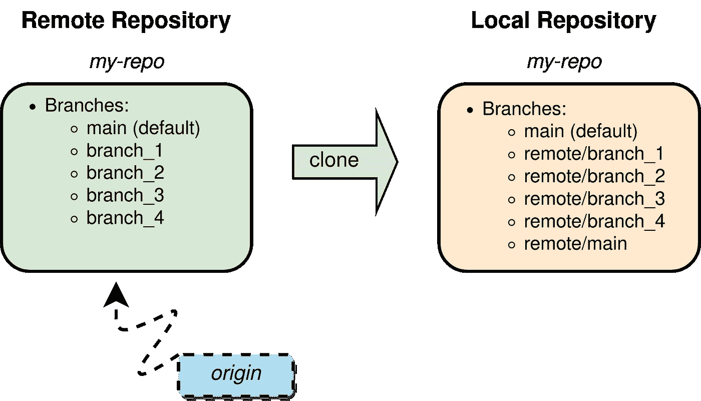

# 揭开 Git 引用的神秘面纱

> 原文：<https://towardsdatascience.com/demystifying-git-references-aka-refs-bdd09029d072?source=collection_archive---------22----------------------->

## 支持核心 Git 操作的真正主力


图片由作者提供，使用[图](https://diagrams.net)制作。

作为一名数据科学家或数据工程师，当他/她知道所有的核心元素都被像 *git-clone* 或 *git-push* 这样的 *Git* 操作所利用时，与 *Git* 一起工作总是轻而易举的。尽管核心 *Git* 操作已经得到了爱好者们的充分关注，但这里特别关注的是一个名为 *Git* 引用*的核心实体，它支持几个这样的核心 *Git* 操作。*

为了理解 Git 引用及其重要性，让我们考虑下面的复杂结构的远程仓库


展示了一个包含五个分支(包括主分支)的远程存储库结构。图片由作者提供，使用[图](https://diagrams.net)制作。

并如下克隆上面所示的远程存储库

```
$ git clone https://github.com/<git_username>/my-repo.git
```

正如预期的那样，克隆操作会产生一个本地存储库，其中有一个默认的本地主分支链接到远程主分支*上，还有一个远程连接*源分支*和所有远程分支，如下所示*



说明了包含五个分支(包括主分支)的远程存储库的克隆操作。图片由作者提供，使用[图表](https://diagrams.net)制作。

然而，在您的本地机器上仔细观察，本地目录 *my_repo* 恰好包含您的远程 *main* 分支中存在的文件的副本。尽管像 *branch_1* 和 *branch_2* 这样的远程分支的内容被克隆并存在于您的本地存储库中，但是它们的文件内容在您的本地机器上似乎还不可见。因此，引出了一个问题

如何访问远程分支的内容？

好啦好啦，别担心，这就是 *Git 引用*发挥作用的地方。为了能够访问除远程*主*分支之外的其他远程分支的内容， *git-clone* 不仅仅是创建远程*主*分支和远程连接*源*的本地副本。根据亚特兰蒂斯人的 [git-clone](https://www.atlassian.com/git/tutorials/setting-up-a-repository/git-clone) 文档，

> 为了方便起见，克隆会自动创建一个名为“origin”的远程连接，指向原始存储库。这使得与中央存储库交互变得非常容易。这种自动连接是通过在`refs/remotes/origin`下创建到远程分支负责人的 Git refs 并初始化`remote.origin.url`和`remote.origin.fetch`配置变量来建立的。

换句话说，除了简单地创建一个远程连接*源，*见上图， *git-clone* 操作还创建 *Git* *引用*又名 *refs* 到远程分支 *branch_1* 、 *branch_2* 等。这些*参考*位于您本地的 *my_repo* 目录*下*文件夹 *refs/remotes/origin* 下。进一步简化，默认情况下， *git-clone* 操作创建一个本地分支 *main* ，其文件内容位于您的本地目录 *my_repo* 中。对于其余的远程分支，它获取其内容，存储在本地*。git* 目录，并创建 *Git* *引用*，而不是创建多个本地分支及其自己的特定于分支的本地 *my_repo* 目录。所有 *Git* *引用*到这些远程( *origin* )分支可以列出如下

```
my_repo $ cd .git/refs/remotes/origin
origin $ lsHEAD        branch_1        branch_2        branch_3        branch_4
```

注意*。git* 在 *refs* 目录前面。一般来说，所有的 *Git* 元数据都存储在*下。git* 目录在你本地的 *my_repo* 目录下，除了*之外。gitignore* 文件，这是用户特定的。使用 *ls -a* 列出隐藏文件。

列出上述远程 *Git* *引用* ( *refs* )的另一种方式是利用 *git 分支*命令以及标志 *-a* 或 *- remote* 。我们使用- *-remote* 标志，它列出了所有的 *refs* 上面的 *git-clone* 操作，这些操作是为远程存储库中的所有远程分支创建的，如下所示

```
my_repo $ git branch --remote remotes/origin/HEAD -> origin/main
  remotes/origin/branch_1
  remotes/origin/branch_2
  remotes/origin/branch_3
  remotes/origin/branch_4
  remotes/origin/main
```

*Git* *引用* *remotes/origin/HEAD* ，默认指向 remote ( *origin) main* 分支。注意 *origin/main* 只是引用*Git**reference**remotes/origin/main*的另一种方式。或者， *-a* 标志列出了本地和远程 *Git* *引用*，见下文

```
my_repo $ git branch -a* main
  remotes/origin/HEAD -> origin/main
  remotes/origin/branch_1
  remotes/origin/branch_2
  remotes/origin/branch_3
  remotes/origin/branch_4
  remotes/origin/main
```

请注意，默认情况下，本地 *Git* *引用* *main* 是在 *git-clone* 操作期间创建的，并且在 *refs/heads* 文件夹下可用，与位于 *refs/remotes/origin* 文件夹中的远程 *Git* *引用*相反。

鉴于所有的远程*参考*都已设置，**我们将我们之前的问题**重新表述为

**我们如何使用远程 *Git 引用*来访问远程分支的内容，比如本地机器上的 *branch_1* ？**

假设我们想要访问本地机器上的远程 *branch_1* 的内容，即在我们的本地存储库中，我们需要做的就是利用 *refs/remotes/origin* 中为 *branch_1* 设置的远程 *Git 引用*，并执行以下操作

```
my_repo $ git checkout branch_1
```

上面的命令在幕后做了很多事情。首先在 *refs/remotes/origin* 文件夹中寻找 *Git* *引用* *branch_1* 。如果没有找到，它抛出一个错误。其次，它在您的本地存储库中创建了一个名为 *branch_1* 的本地分支，它是基于远程 *branch_1* 的。本地*分支 _1* 也链接到远程*分支 _1* ，即用于执行*拉*或*推*操作。第三，在文件夹 *refs/heads* 下创建一个本地*Git**reference**branch _ 1*。最后，它将本地目录 *my_repo* 中的文件内容替换为远程 *branch_1* 中的文件内容，即本地目录 *my_repo* 中的文件不再是远程 *main* 分支中文件的副本。因此，我们现在有两个本地分支，即 *main* 和 *branch_1* ，链接到相应的远程分支，但仍然只有一个本地 *my_repo* 目录，如下所示

```
my_repo $ git branch -a* branch_1
  main
  remotes/origin/HEAD -> origin/main
  remotes/origin/branch_1
  remotes/origin/branch_2
  remotes/origin/branch_3
  remotes/origin/branch_4
  remotes/origin/main
```

本地*Git**reference**branch _ 1*前面的星号“*”表示本地存储库中当前活动的分支。类似地，我们也可以*检出*(访问)其他远程分支的内容，比如本地存储库中的 *branch_2* 和 *branch_3* 。用这种方式做的一件很酷的事情是，您只在需要的时候基于远程分支创建一个本地分支。因此，避免了本地存储库中不必要的本地分支混乱。

要从本地*分支 _1* 切换回本地*主*分支，您需要做的就是

```
my_repo $ git checkout main
```

这将在本地*主*分支旁边放置星号“*”。为了确保本地*主*分支中的文件内容与远程*主*分支中的文件内容相同，执行 *git-pull* 。

这就是我们的结局。希望以上见解有所加强🏋️‍♀️你对 *Git 引用*及其好处的理解。享受 Gitting！🙏

还是那些好奇的人。为了查看本地 *Git* *引用*如 *main* 或 *branch_1* 如何链接到其对应的远程分支，我们列出了本地存储库的配置变量

```
my_repo $ git config --list... skipped other variables ...

remote.origin.url=https://github.com/<git_username>/my_repo.git
remote.origin.fetch=+refs/heads/*:refs/remotes/origin/*
**branch.main.remote=origin**
branch.main.merge=refs/heads/main
**branch.branch_1.remote=origin**
branch.branch_1.merge=refs/heads/branch_1
```

如你所见，以粗体显示的本地配置变量 *branch.main.remote* 和 *branch.branch_1.remote* 是用远程连接 *origin* 初始化的。意味着本地分支*主*和*分支 _1* 链接到远程分支*主*和*分支 _1* 。请注意，每当在本地计算机上签出新的远程分支时，相应的配置变量将被添加到本地存储库的配置文件中。