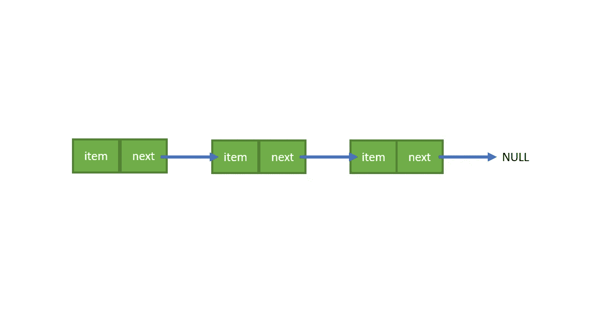
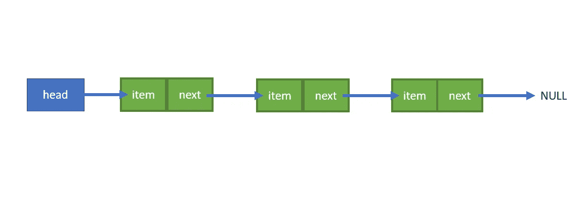
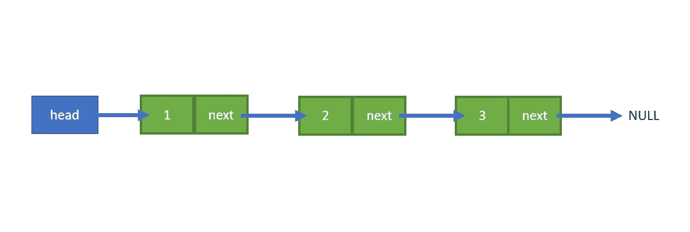

# 揭秘链表

> 原文：<https://towardsdatascience.com/demystifying-linked-list-258dfb9f2176?source=collection_archive---------29----------------------->

## 开始使用这种数据结构而不是数组！

选择正确的方式存储数据是一项艰巨的任务。有许多数据结构，但没有一种数据结构适合所有问题。你能做的最好的事情就是识别每一种数据结构的用法，并确定哪一种对于特定的情况是最有效的。

链表一直是我和我的同行在学习数据结构时的噩梦。有时我会感到困惑，既然我们已经有了简单的“数组”，为什么还要有这样的数据结构。如果你和我想的一样，那么你还没有从根本上理解它。所以，我们将直接进入并回答这个百万美元的问题:到底什么是链表？

照片由[郭佳欣·阿维蒂西安](https://unsplash.com/@kar111?utm_source=medium&utm_medium=referral)在 [Unsplash](https://unsplash.com?utm_source=medium&utm_medium=referral) 上拍摄

# 什么是链表？

链表被归类为线性数据结构。线性数据结构具有顺序排列的数据元素，并且每个成员元素都与其前一个和下一个元素相连接。我们可能没有意识到，但众所周知的“数组”或“列表”也被归类为线性数据结构。线性数据结构最适合用于存储顺序数据(有序数据)。

# 动态规划

但是简单的“数组”有什么问题呢？在编译之前需要数组声明，因为编译器需要知道需要为每个变量留出多少内存空间。因此，当我们在开始声明数组大小时，我们不能在代码运行时改变数组大小。天真的解决方案是选择一个大的数组大小，但这将是低效的，浪费内存。

这就是动态内存分配的用武之地！首先，我们需要了解内存分配有两种类型，静态和动态。静态内存中的元素被分配到堆栈中，这样声明的变量以各自的顺序连续存储。另一方面，动态内存中的元素在堆中分配。与堆栈不同，在堆中，你不知道内存被分配到了哪里，对于你的每个请求，一个随机选择的内存块将被分配来存储这个值。

幸运的是，在 C 中，它们为动态内存分配提供了最有用的函数， *malloc()。*下面是这个函数的语法。

> void *malloc (size_t size)

该函数为所请求的变量/结构保留所需字节的大小，并返回堆中分配的地址。如果请求的内存大小不可用，该函数将返回 NULL。还有其他一些支持动态内存分配的函数，*即**【calloc()】*和*【realloc()】*，但我们不会深入讨论这些函数。

# 链表的结构

链表是一种基于动态内存分配的数据结构。基本上，链表是由节点和链接组成的。我们可以创建一个简单的结构，由一个存储值的容器和指向下一个节点的指针组成。

在 ListNode 结构中， *int item* 被声明为存储节点中的值，而 *struct _listnode *next* 被声明为存储下一个节点的地址。如果是最后一个节点，那么下一个的*将指向空。*

不错！现在，我们可以通过第一个节点跟踪第二个节点，也可以通过第二个节点跟踪第三个节点。但是我们如何跟踪第一个节点呢？没有第一个节点的地址，第二个和第三个节点将无法访问。因此，我们将引入头指针。头指针不是节点，而是存储第一个绿色块的地址的指针，该绿色块是第一个节点。

# 链接列表示例

我们最终定义了链表的结构以及它是如何工作的。现在，让我们开始编码部分。我将通过一个简单的代码来指导你。

下面是执行代码后链表的结果。

从代码中可以看出，链表很大程度上依赖于 *malloc()* 函数来为新节点动态分配一些内存。我们需要使用临时变量的原因是，我们不想改变头指针中存储的地址。随后，在这段代码执行之后，头指针将仍然指向第一个节点，而临时指针将指向最后一个节点。

# Python 中的链表

另外:链表也可以用其他编程语言创建，比如 Python、Java 等等。虽然 Python 没有指针或结构，但类可以帮助 Python 程序员制作链表。

我们可以创建两个类。第一个是 ListNode 类，用于存储值和下一个指针。第二个是 LinkedList 类，它的用法类似于 c 中的头指针。

# 最后的话

链表是计算机科学中最重要的数据结构之一。它是创建堆栈和队列等其他数据结构的基础。链表的结构也不限于简单链表(我们在本文中讨论的那个)。还有更复杂的链表类型，包括双向链表和循环链表，以适应相应的需要。

开始学习不同的数据结构，帮助你选择正确的数据结构(甚至是它们的组合！)来解决一个特定的问题。

问候，

胡安·塞缪尔·潘嗣敬