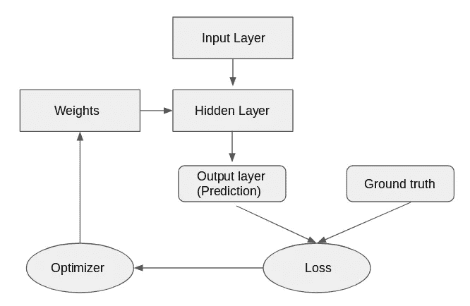
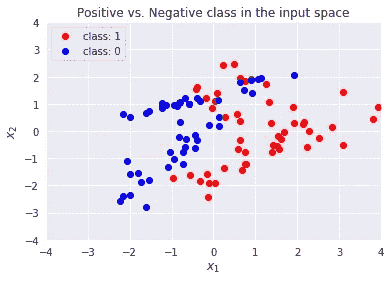
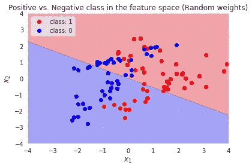
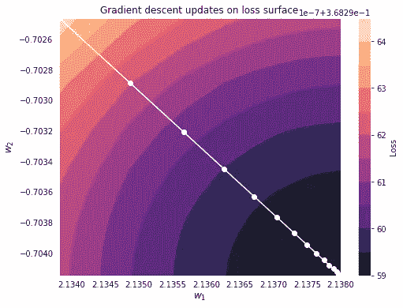
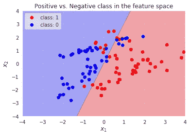

# 揭开神经网络的神秘面纱

> 原文：<https://towardsdatascience.com/demystifying-neural-networks-8a30d09684d?source=collection_archive---------21----------------------->

## 用 Python 和 NumPy 从头开始实现

杰斯温·托马斯在 [Unsplash](https://unsplash.com?utm_source=medium&utm_medium=referral) 上的照片

就像生活中的许多事情一样，学习的最好方法是自己动手。我自学了神经网络，我认为对理解它们的内部工作最有帮助的是从头开始构建一个。事实上，可以手动导出所有公式，并用基本的 Python 库实现它们。

让我们看看逻辑回归是如何工作的，这是神经网络的一个非常简单的例子。我将把数学保持在最低限度——我认为有时看代码更容易——但是你仍然需要熟悉矩阵代数和导数。

所有机器学习模型都学习如何将输入映射到输出。在深度学习中，“学习”是通过一系列变换或*层*来完成的，每个变换都由该层的*权重*来定义。下图说明了简单网络的工作原理。

最初，随机实现权重，并通过网络的隐藏层( ***【正向传播】*** )传播到最终层、输出层或*预测*。然而，此时的转换是没有意义的，结果可能还很遥远。该网络实现了一个损失函数，该函数测量输出与地面实况的距离，并将该值反馈给各层以调整权重值，从而减少损失。在每一次迭代中，模型学习更多，更接近最优值。这个过程称为 ***反向传播*** ，由优化器实现。

神经网络图

当然，上图非常简单，现实世界的应用程序可能会非常复杂。尽管如此，它们的构造块都是一样的。

## 从零开始的逻辑回归

逻辑回归是一个*浅层*神经网络。它只有一个输入层和一个输出层，没有隐藏层。然而，这是开始理解神经网络内部工作的一个非常好的地方，并且从头实现起来相当容易。

首先，让我们为二元分类器创建一些人工数据。

*X* 的形状为(100，2)*y*的形状为(100，1)。数据如下图所示。

现在让我们来实现网络的构建模块:前向传播和反向传播。

**正向传播**

让我们随机初始化用于正向传播的权重矩阵 W。在本例中，输出层需要具有与*y*(100，1)相同的尺寸。由于没有隐藏层，所以输出层只是 X 和 W 的点积。根据矩阵积的规则，权重矩阵 W 需要具有维度(1，2)，使得(100，2) x (2，1) = (100，1)。然而，为了便于计算，我们用 shape (1，2)定义 W，并进行转置。

分类器的输出需要限制在 0 和 1 之间，因此我们还需要一个 ***激活函数*** 应用于输出层。对于逻辑回归，激活函数就是简单的*逻辑*(或 *sigmoid* )函数。输出激活是我们的预测。

让我们想象一下决策边界。背景颜色指的是未训练分类器的分类决策。由于权重仍然是随机的，我们还没有优化它们，我们预计分类器在这一点上相当糟糕。事实上，它不能正确区分积极的阶级和消极的阶级。

我们现在需要优化权重。在我们进入反向传播之前，让我们先谈谈我们将使用的优化器，梯度下降。

**梯度下降**

GD 基于一个 ***梯度*** 的概念，可以看作是导数对多维输入的概括。如果一个函数是*可微的*，即它的导数存在，那么就有可能找到它的最小值，也就是导数等于零的点。

函数的导数给出了它在任意给定点的斜率。如果当权重向某个方向移动(增加或减少)时损失减少，导数将返回负值。梯度下降算法在负梯度方向(沿着损失函数向下)更新参数。然后重复这个过程一定次数的迭代或直到收敛。

在数学术语中，这意味着求解 N 个参数的多项式方程(其中 N 是网络中权重的总数)，以找到使损失最小化的参数组合。

请注意，在真实情况下，N 很容易以百万计，而求解这样的方程是不可能的。这就是为什么我们通常实现批量梯度下降，即随机抽取一批训练数据，并只计算这一批的梯度。

幸运的是，我们不必在简单的逻辑回归中这样做，因此，为了简单起见，我们将实现常规梯度下降，而不是批量下降。

**反向传播**

我们将在反向传播中实现的主要步骤如下:

1.计算激活层(预测)和地面真实之间的损失

2.计算梯度

3.更新权重。

为了计算**损失**，我们首先需要定义它。在二进制分类问题中，通常使用二进制*交叉熵*(或对数损失)，所以我们将使用它。

***梯度*** 是损失函数相对于每个权重的导数(偏导数)。可以证明交叉熵函数 w.r.t. W 的导数为(y _ hat y)X，其中 y_hat=sigmoid(z)。我们不打算在本文中演示它，但是这里有一个很好的解释。

一旦我们有了梯度，我们就可以更新**权重**。对于这一步，我们需要定义*步*或*学习率*。它决定了模型学习的速度，并调整 GD 的步长。

我们还需要为算法收敛定义一定的迭代次数。在我们的例子中，15 次迭代足以使算法收敛。随着我们越来越接近最佳值，损耗将减少，梯度的步长变得更小。

**拼凑一切**

我们现在可以把所有的部分放在一起，运行模型。

我们可以想象梯度下降在每次迭代中的表现。从下图中，我们可以看到模型如何在接近最小损失时采取越来越小的步骤。

我们再来看看决策边界。现在权重已经过优化，分类器的性能也有了很大提高。仍然有一些错误分类的点，但总的来说，分类器在分离这两个类别方面做得很好。

训练分类器的决策边界

完整的代码可在[这里](https://github.com/f3dec/NNFromScratch/blob/main/LogisticRegressionFromScratch.ipynb)获得。

在下一篇文章中，我们将通过给模型添加一个隐藏层来增加复杂性。请在评论中告诉我你的想法！