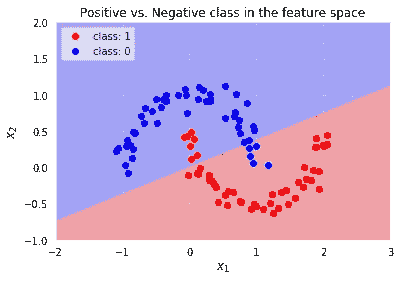
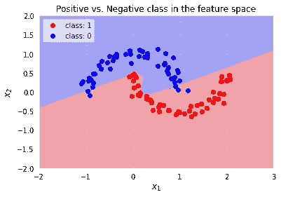

# 揭开神经网络的神秘面纱第二部分

> 原文：<https://towardsdatascience.com/demystifying-neural-networks-pt-2-cc358fa8efdd?source=collection_archive---------22----------------------->

## 用 Python 和 NumPy 实现 NN 中的隐藏层


哈桑·阿尔马西在 [Unsplash](https://unsplash.com?utm_source=medium&utm_medium=referral) 上的照片

在[以前的一篇文章](/demystifying-neural-networks-8a30d09684d)中，我们从零开始构建了一个逻辑回归作为浅层神经网络的例子。现在让我们增加一点复杂性，增加一个隐藏层。即使数学变得稍微复杂一些(我希望你喜欢导数！)，我们仍然可以只用 Python 和 NumPy 来编码整个网络。

逻辑回归在数据是线性可分的情况下工作得很好，但我们可以看到，当它不再是线性可分时，它就不好用了。作为一个例子，让我们再次使用 *scikit-learn* 来生成一些数据。


作者图片

显然，没有一条直线会完全符合上述数据，我们预计逻辑回归在这种情况下表现不佳。让我们将前一篇文章中编写的逻辑模型应用到这些数据中。

正如我们从决策边界看到的，相当多的点被模型错误分类。很明显，我们需要一个能够提出非线性决策边界的模型。



作者图片

# 1-隐层神经网络

让我们添加一个隐藏层到我们的网络。

我们现在有一个输入层，一个隐藏层和一个输出层。我们将使用 *sigmoid* 作为输出和隐藏层的激活函数，交叉熵作为损失，就像我们对逻辑回归所做的一样。然后，我们可以重新使用上面为 sigmoid 和交叉熵定义的函数。

正如我们对 LR 所做的那样，让我们实现神经网络的构建模块:前向传播和反向传播。

# 正向传播

这一步与逻辑回归示例非常相似，除了我们有两个权重矩阵——一个用于隐藏层，一个用于输出层。对于这个特殊的例子，我在每一层的重量旁边添加了预期的尺寸。我认为这有助于确定它们应该是什么样的。

# 反向传播

我们可以重用上一节的代码，但是在梯度计算上有一些显著的不同。损失(交叉熵)相对于权重的偏导数根据层具有不同的函数形式，因此我们需要两个不同的梯度函数。

输出层的梯度与我们为逻辑回归定义的梯度相同(完整的推导见[。](https://peterroelants.github.io/posts/cross-entropy-logistic/)

交叉熵相对于 Wₕ的梯度可以使用 *δ规则*获得。如果 *l* 为输出层，δ*ₗ*=σ(*z*)*y*。可以证明(此处[见](https://rinterested.github.io/statistics/backpropagation.html)推导)δ*ₗ*₋₁=δₕ=((*wₗ*₋₁)ᵗδ*ₗ*)*σ’(*zₗ*₋₁)，其中*为元素间乘积。然后梯度是点积δᵗ *ₗ* ₋₁⋅ *x* 。注意，σ′(*zₗ*₋₁)=σ(*zₗ*₋₁)*(1−σ(*zₗ*₋₁))但是，根据定义，σ( *zₗ* ₋₁)是隐藏层激活*á*͂。因此σ′(*zₗ*₋₁)=*aₗ*₋₁*(1−*aₗ*₋₁).

我们现在可以像往常一样实现梯度。唯一的区别是我们必须更新输出和隐藏层的权重。

请注意， *δ规则*即使在我们添加多个层时也能很好地工作，并且可以很容易地用一个循环进行编码:在每一层 *n* ，我们只需要给定层的激活和权重——我们已经有了——为层 *n+1* 和 *n+1* 激活计算的δ。

让我们看看它是如何工作的。通用层的导数*l*-*n*，其中*n*∈【1，..，N]，就是σ’(*zₗ₋ₙ*)=*aₗ₋ₙ**(1*aₗ₋ₙ*)，其中 *aₗ₋ₙ* 是该层的激活。δ *ₗ₋ₙ* 是上面的导数和(*wₗ*₋ₙ)ᵗδ*ₗ*₋ₙ₊₁.)的元素乘积 *wₗ* ₋ₙ是层*l*—*n*的权重，而δ *ₗ* ₋ₙ₊₁是在前一轮计算的 *δ* (记住，在反向传播中，顺序相反，层 *n+1* 在层 *n* 之前)。最后，我们使用来自 *n+1* 层的激活，而不是仅用于输出层的 X。

**把一切拼凑在一起**

让我们把所有的东西放在一起。

让我们比较一下这两种型号的损耗。1 隐层神经网络实现了比 LR 更小的损失。

```
Logistic Regression Min Loss: 0.28
1-Hidden Layer NN Min Loss: 0.18
```

# 想象结果

我们需要为我们的模型定义一个预测函数，以便以后使用它。

我们再来看看决策边界。我们的 1-隐层分类器的性能比逻辑回归好得多。非线性判定边界能够正确地分类所有红点。仍然有一些错误分类的蓝点，但总的来说，分类器在分离这两个类别方面做得很好。



作者图片

完整的代码可在[这里](https://github.com/f3dec/NNFromScratch/blob/main/1HiddenLayerNNFromScratch.ipynb)获得。请在评论中告诉我你的想法！