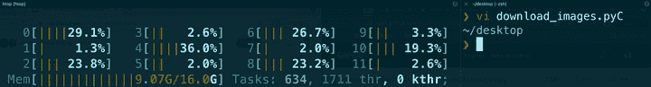
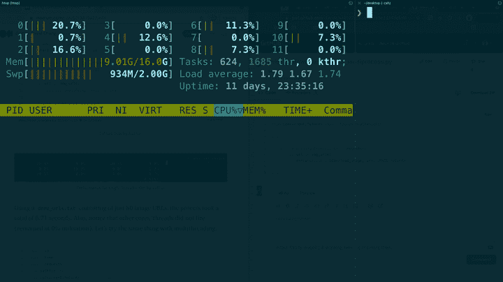

# 揭开 Python 多重处理和多线程的神秘面纱

> 原文：<https://towardsdatascience.com/demystifying-python-multiprocessing-and-multithreading-9b62f9875a27?source=collection_archive---------0----------------------->

## …和全局解释器锁

由[奥克萨·洛克萨](https://unsplash.com/@oxaroxa?utm_source=medium&utm_medium=referral)在 [Unsplash](https://unsplash.com?utm_source=medium&utm_medium=referral) 拍摄的照片

> ***TLDR*** *:如果你的程序是网络绑定的，你应该使用*线程*或者*多处理*如果是 CPU 绑定的。*

就我个人而言，这些年来我多次试图理解多重处理和多线程，但总是无法完全理解这些概念。为此，我们需要理解几个重要的术语以及 Python 编程语言特有的东西——全局解释器锁(GIL)。

如果您已经知道这些术语，请随意跳到下一节。

# 术语

**核心**:CPU 的处理器。这个术语指的是 CPU 的硬件组件。核心可以处理单个任务；多核处理器可以同时执行多项任务。

**线程**:管理任务的**虚拟组件**。如果您的 CPU 启用了多线程/超线程，每个 CPU 内核最多可以有两个线程。您可以搜索自己的 CPU 处理器来了解更多信息。对于 Mac 用户，可以从*了解关于>系统报告*。这意味着我的 6 核 i7 处理器有 6 个内核，最多可以有 12 个线程。

作者图片

我们可以使用`htop`(见下图 GIF)来重新确认我的机器拥有的线程数量，从 0 到 11。

进程:由一个或多个线程执行的计算机程序的实例。根据操作系统的不同，一个进程可能由多个执行线程组成，这些线程同时执行指令[1][2]。

**多线程**:中央处理器(CPU)(或多核处理器中的单核)提供多个线程并发执行的能力，由操作系统支持[3]。

**多重处理**:在一个计算机系统中使用两个或多个 CPU[4][5]。该术语也指系统支持一个以上处理器的能力或在它们之间分配任务的能力。

# 什么是全局解释器锁(GIL)？

如果我们用谷歌搜索“*什么是 Python* 中的全局解释器锁”，我们得到的答案是这样的:

> Python 全局解释器锁(GIL)是**一种进程锁，每当 python 处理进程**时都会使用它。一般来说，Python 只使用一个线程来执行这组写好的语句。这意味着在 python 中一次只能执行一个线程。

通过在每次运行一个 Python 进程时只允许使用一个线程，这确保了一次只有*一个线程可以访问一个特定的资源*，并且还防止了同时使用对象和字节码。

# 多线程操作

GIL 和多线程有什么关系？没什么，但它有助于我们理解何时使用多线程。让我们看一个例子。

作者 Github 要点

如果我们看一下上面的函数，变量`final`在`range(100_000_000)`上被求和。在我的机器上执行这个需要大约 7.88 秒——现在，你认为多线程会加速这个操作吗？

作者 Github 要点

如果你猜的是“不”，那你就对了！使用 8 个线程的`ThreadPoolExecutor`，我们注意到这并没有加速进程！为什么会这样，引擎盖下发生了什么？

即使我们指定使用 8 个线程，也没有加速这个过程。以下是事情经过的详细分析:

*   python 解释器创建一个新的进程并产生线程
*   线程 1 开始运行，获取 GIL
*   线程 2 到 8 想要协助线程 1，但是必须等待线程 1 释放 GIL，然后其他线程才能处理它
*   由于没有 I/O 操作，线程 1 将继续处理整个`sum_square(100_000_000)`操作

## 为什么需要 GIL？

在上面的例子中，我们在每次迭代中不断更新`final`变量。如果多个线程能够同时*访问该代码的执行，则由每个线程检索和修改的`i`的值可以在其他线程访问它时发生变化。那么，`i`和`final`在任一时间点的真实值是什么呢？这是一个程序不希望的状态，称为**竞争条件**。*

## *那么，什么时候应该使用多线程呢？*

*正如我们在前面的`sum_square`中看到的，一个 100%计算密集型任务无法利用多线程，因为一次只能使用一个线程(由于 GIL)。如果我们执行一个很大程度上受 I/O 限制的任务，我们就可以利用多线程。这里有一个我们试图从网上下载图片的例子:*

*作者 Github 要点*

**

*单线程性能—作者 GIF*

*使用一个仅由 80 个图片 URL 组成的`demo_urls.txt`，这个过程总共花费了 6.71 秒。此外，请注意，其他核心/线程没有启动(保持 0%的利用率)。让我们用多线程做同样的事情。*

*作者 Github 要点*

**

*多线程性能—作者 GIF*

*同样是 80 个图片网址，使用多线程在 1.38 秒内完成了整个过程。请注意，所有 12 个线程(从 0 到 11)都被利用了(非零)。*

# *多重处理*

*如果我们使用`ProcessPoolExecutor`(即多进程)运行上述相同的进程，您认为速度会大于还是小于 1.38 秒？*

*作者 Github 要点*

*如果你猜大于 1.38 秒，你就对了！由于`download_image`功能主要由 I/O 操作组成，我们在等待这些操作完成时，大大节省了时间。*

**

*多进程性能—作者 GIF*

*尽管如此，多重处理仍然允许我们在 3.34 秒内相当快地下载 80 张图片，尽管这更加占用内存。这是因为 Python 多处理在进程间传递对象时使用 *pickle* 来序列化对象，要求每个进程创建自己的数据副本，这增加了大量的内存使用，更不用说昂贵的反序列化了。*

# *关键要点*

1.  *Python 不是单线程语言。*
2.  *由于 GIL，Python 进程通常使用单线程。*
3.  *尽管有 GIL，但执行计算繁重任务的库，如 *numpy、scipy* 和 *pytorch* 利用基于 C 的实现，允许使用多个内核。*
4.  *根据经验，大部分 I/O 受限的进程受益于多线程，而计算量大的任务受益于多处理。*

# *最后的想法*

*感谢您的阅读，如果您发现任何错误，一定要让我知道！*

****支持我！*** —如果你喜欢我的内容并且*没有*订阅 Medium，请考虑支持我并通过我在这里的推荐链接[订阅](https://davidcjw.medium.com/membership) ( *注意:你的一部分会员费将作为推荐费分摊给我*)。*

# *参考*

*[1] [亚伯拉罕·西尔伯沙茨](https://en.wikipedia.org/wiki/Abraham_Silberschatz)；格雷格·卡涅；高尔文，彼得·贝尔(2004)。“第四章。流程”。*操作系统概念与 Java* (第六版。).[约翰·威利&儿子们](https://en.wikipedia.org/wiki/John_Wiley_%26_Sons)。国际标准书号 0–471–48905–0*

*[2]瓦哈里亚，乌雷什(1996 年)。“第二章。过程和内核”。 [*UNIX 内部:新前沿*](https://archive.org/details/unixinternalsnew00vaha) 。普伦蒂斯-霍尔公司[国际标准书号](https://en.wikipedia.org/wiki/ISBN_(identifier))[0–13–101908–2](https://en.wikipedia.org/wiki/Special:BookSources/0-13-101908-2)。*

*[3] [多线程(计算机体系结构)](https://en.wikipedia.org/wiki/Multithreading_(computer_architecture))*

*[4]拉杰·拉贾戈帕尔(1999 年)。 [*微软 Windows NT 集群服务器简介:编程与管理*](https://books.google.com/books?id=kUJnHJJlnpUC&pg=PA4) 。CRC 出版社。第 4 页。[国际标准书号](https://en.wikipedia.org/wiki/ISBN_(identifier))[978–1–4200–7548–9](https://en.wikipedia.org/wiki/Special:BookSources/978-1-4200-7548-9)*

*[5]迈克·埃伯斯；约翰·凯特纳；韦恩·奥布莱恩；比尔·奥格登(2012)。 [*新主机介绍:z/OS 基础知识*](https://books.google.com/books?id=c-a1AgAAQBAJ&pg=PA96) 。IBM。第 96 页。[国际标准书号](https://en.wikipedia.org/wiki/ISBN_(identifier))978–0–7384–3534–3*

*[6] Youtube: [Python 不是单线程的(以及如何绕过 GIL)](https://www.youtube.com/watch?v=m2yeB94CxVQ)*