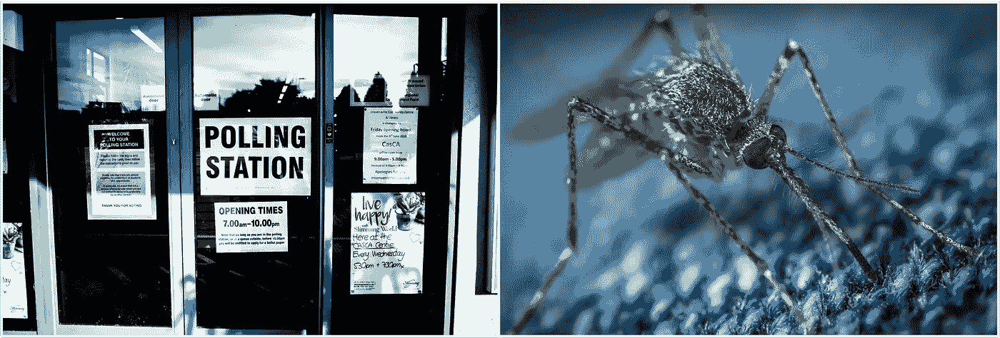
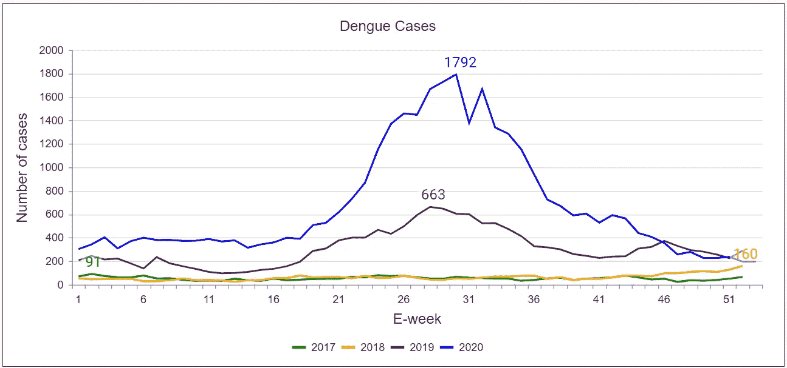
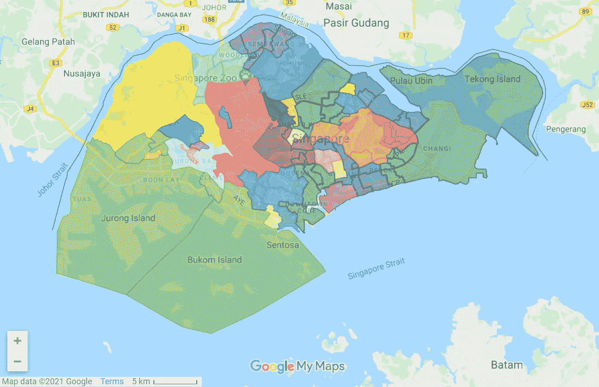
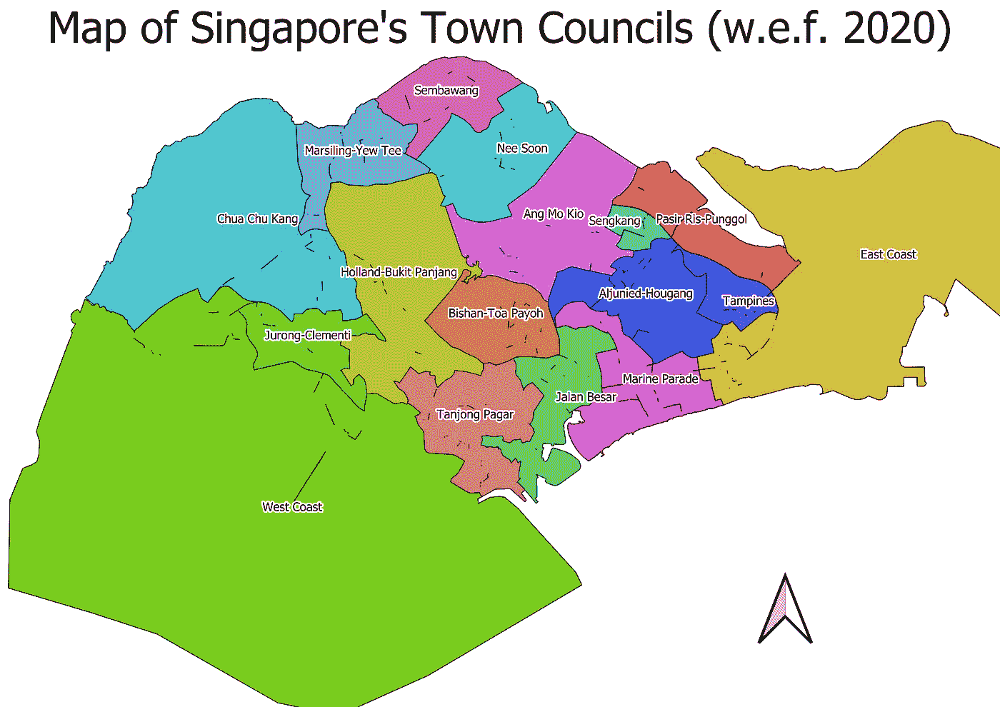
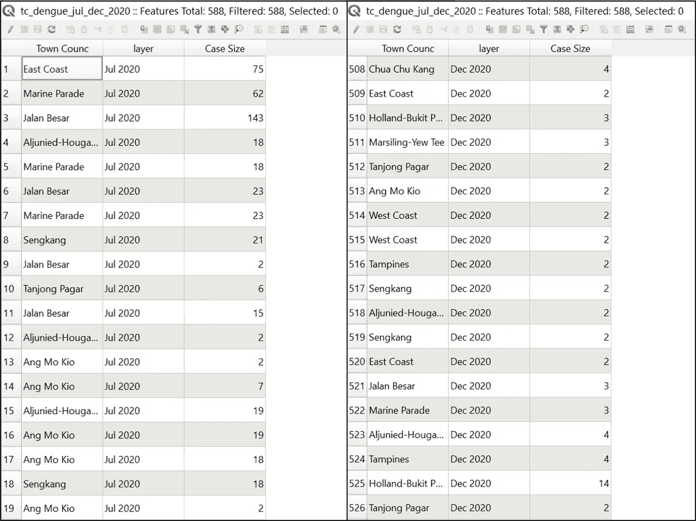
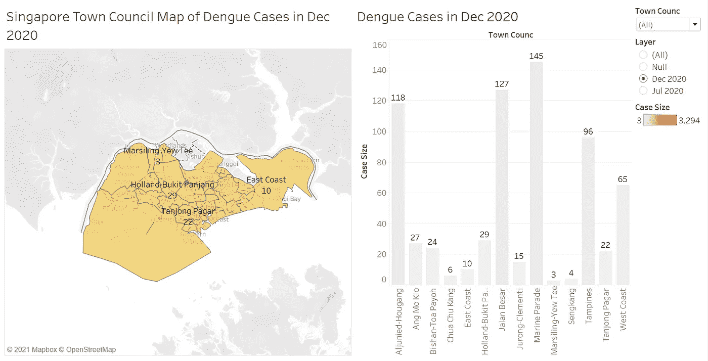
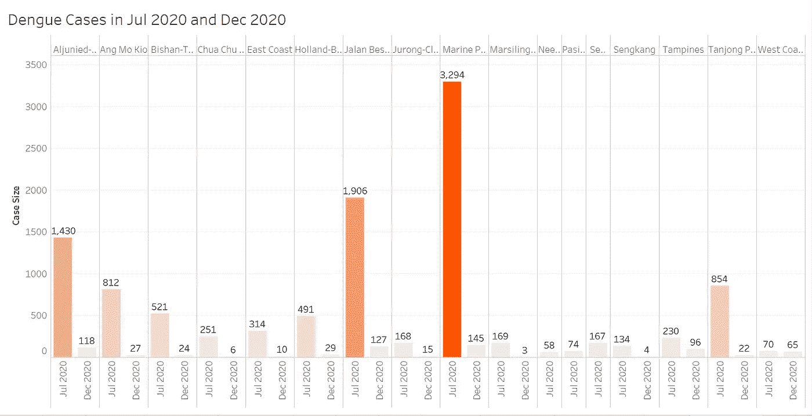

# 每个镇议会的登革热病例

> 原文：<https://towardsdatascience.com/dengue-cases-of-each-town-council-19aac360e0ed?source=collection_archive---------56----------------------->

## 2020 年 7 月和 12 月新加坡的登革热病例

Unsplash 上 Elliott Stallion 的照片| Unsplash 上[егоркамелев的照片](https://unsplash.com/@ekamelev?utm_source=unsplash&utm_medium=referral&utm_content=creditCopyText)

# 背景

新加坡的民选议员有责任通过主持由其选区组成的市议会来管理市政事务(1988 年《市议会法》)。为了居民的利益，新加坡市议会对住宅和商业物业的共同财产负责，并确保这些物业处于最佳状态(国家发展部，2020 年)。这包括**维护小区卫生**。

新加坡最近一次大选是在 2020 年 7 月 10 日。在 30 天内，必须成立一个镇议会(1988 年镇议会法)。因此，截至 2020 年 7 月 30 日，**以下 17 个镇议会**根据其各自的选区组成(镇议会(宣布)令，2020 年)，这些选区包括团体代表选区和单一成员选区:

*   **阿琼尼-后港:**阿琼尼 GRC 和后港 SMC
*   **Ang Mo Kio:** Ang Mo Kio GRC、Kebun 巴鲁 SMC 和 Yio Chu Kang SMC
*   **璧山-大巴窑:**璧山-大巴窑 GRC 和玛丽蒙特 SMC
*   **蔡珠康:**蔡珠康 GRC，和洪家北 SMC
*   **东海岸:**东海岸 GRC
*   **Holland-Bukit Panjang:**Holland-Bukit Timah GRC 和 Bukit Panjang SMC
*   贝萨尔街:贝萨尔街 GRC 和 Potong Pasir SMC
*   **裕廊-克莱门蒂:**裕廊 GRC、武吉巴托克 SMC 和裕华 SMC
*   **海上游行:**海上游行 GRC，麦克弗森 SMC，蒙巴顿 SMC
*   **马息林红豆杉球座:**马息林红豆杉球座 GRC
*   需要很快:需要很快
*   Pasir Ris-pung gol:Pasir Ris-pung gol GRC 和 Punggol West SMC
*   三巴旺
*   **僧康:**僧康 GRC
*   坦帕因斯:坦帕因斯 GRC
*   **丹戎巴葛:**丹戎巴葛 GRC 和 Radin Mas SMC
*   **西海岸:**西海岸 GRC 和先锋 SMC

巧合的是，2020 年 7 月有一个高峰，有 1792 例登革热病例(亚洲新闻频道，2020)。

截至流行病学第 51 周，2017 年至 2020 年的登革热病例数(国家环境署，2021 年)

从那时起，在过去的 6 个月里，登革热病例数量急剧线性下降，到 2020 年 12 月接近 200 例。

在这次活动中，我有兴趣了解自 2020 年新加坡大选以来新成立的哪些镇议会在 2020 年的最后六个月成功战胜了登革热病例。

# 使用的数据

*   来自 Data.gov.sg**的两个[登革热集群](https://data.gov.sg/dataset/dengue-clusters)数据集:分别更新于 2020 年 7 月 23 日**的**和 2020 年 12 月 30 日**的
*   **[大选 2020 选举地图](https://www.google.com.sg/maps/d/u/0/viewer?mid=1p4VfSRkaNZViwdsr-KRvpiEjQESuP3vP&hl=en_GB&ll=1.3163127711512492%2C103.84451134999999&z=11)来自**谷歌我的地图****

# **整理和转换**

****QGIS** 用于进行预处理，这包括根据 Google My Map 的选举地图创建显示市议会分区的地图。**

****

**2020 新加坡大选行政区划选举地图(来源:谷歌我的地图)**

****

**使用 QGIS 创建新加坡市议会地图，图片由作者提供**

**此外，还根据 2020 年 7 月和 2020 年 12 月每个镇议会的每个登革热集群汇编了登革热病例数。**

****

**前 19 行分别显示了 2020 年 7 月和 2020 年 12 月每个镇议会的登革热病例数(基于每个登革热集群)，图片由作者提供**

# **形象化**

**通过使用 **Tableau** ，构建了以下三个图表:**

*   **显示登革热病例在市议会各部门分布的 Choropleth 地图。**
*   **条形图分别显示了 2020 年 7 月和 2020 年 12 月每个镇议会的登革热病例数，可以进行过滤。**
*   **与生成的条形图类似，创建了另一个条形图来比较每个镇议会两个月的登革热病例数。这是为了让用户看一看哪个镇议会为战胜登革热病例付出了努力。**

****

**Choropleth 地图和条形图的仪表板显示了 2020 年 7 月镇议会的登革热病例数，图片由作者提供**

**从 choropleth 地图来看，与 2020 年 7 月的其他地区相比，登革热病例的高发区集中在新加坡的**东南部**地区(即**海洋游行镇委员会**和**贝萨尔镇委员会**)。**

**从柱状图来看，登革热病例数量最多的**前 3 个镇议会**是:**

1.  **海军游行镇议会**
2.  **贝萨尔镇议会路**
3.  **阿尔朱尼德-后港镇议会**

**丹戎巴葛镇议会和昂莫乔镇议会的登革热病例数量相似。**

****

**Choropleth 地图和条形图的仪表板显示了 2020 年 12 月镇议会的登革热病例数，图片由作者提供**

**从 choropleth 地图来看，整个新加坡的登革热病例不太集中，2020 年 12 月，新加坡的**北部**地区(即 **Nee Soon 镇议会**、 **Pasir Ris-Punggol** 和**森巴旺镇议会**)的登革热病例为零。**

**然而，即使在 2020 年 12 月，前面提到的**三个镇议会仍然是登革热病例高发的前三个镇议会。****

****

**2020 年 7 月和 2020 年 12 月各镇议会登革热病例数对比柱状图，图片作者**

**从对比柱状图中可以推断出**海上游行镇议会**确实在抗击登革热方面投入了巨大的努力，将**的数量从 2020 年 7 月的 3294 只减少到 2020 年 12 月的 145 只** (~ **95.6%** )。**

**让我们检查一下贝萨尔镇议会和阿尔朱尼德-后港镇议会。在 **Jalan Besar 镇委员会**的登革热病例数量已经从 2020 年 7 月的**1906 例下降到 2020 年 12 月**的 127 例(～**93.3%**)，而在**阿茹尼达-后港镇委员会**的登革热病例数量已经从 2020 年 7 月的**1430 例下降到 2020 年 12 月的**(～在两个亚军之间，贝萨尔镇议会在战胜登革热方面的表现优于阿尔朱尼德-后港镇议会。**

**让我们比较一下 Ang Mo Kio 镇议会和 Tanjong Pagar 镇议会，这两个地方在 2020 年 7 月和 12 月的登革热病例数相似。昂莫乔镇委员会的登革热病例数从 2020 年 7 月的 812 例下降到 2020 年 12 月的 27 例，丹戎巴葛镇委员会的登革热病例数从 2020 年 7 月的 854 例下降到 2020 年 12 月的 22 例这表明丹戎巴葛镇议会在战胜登革热方面比昂莫桥镇议会做得更好，因为两个月的登革热病例数量相似。**

**最后，**西海岸市议会**的病例数似乎没有相对变化，2020 年 7 月**有 70 例登革热病例，2020 年 12 月**有 65 例登革热病例。镇议会可能需要加强努力，了解登革热的严重性，以防止未来登革热在该地区的传播。**

# **推荐**

**由于 Marine Parade 镇议会、Jalan Besar 镇议会和 Aljunied-Hougang 镇议会有大量登革热热点，这些镇议会可以与国家环境局(NEA)合作**向其居民宣传登革热的严重性**以对抗登革热传播。这包括**社交媒体广告**，如 Instagram 广告，通过利用**地理围栏**瞄准镇议会周围的人。**

**此外，这些镇议会可以增加熏蒸的使用来消灭蚊子。**

**最后，NEA 可以启动沃尔巴克氏体项目，将这些镇议会作为减少登革热蚊子数量的首要任务(国家环境署，2020 年)，然后是其他镇议会。**

# **限制**

**来自 Data.gov.sg 的*登革热群集*数据集经常更新。因此，一旦用户获得了数据集，他/她就拥有了登革热聚类的最新数据集，而无法访问同一数据集的历史数据。这是因为数据集是基于最新的流行病学周。因此，如果我有更多的历史*登革热集群*数据集，以便在不同时期和不同镇议会之间进行更多的比较，那就太好了。**

**坦率地说，我已经在那个月下载了 2020 年 7 月的*登革热集群*数据集，因为我打算开始这项练习。然而，在此期间，由于选举刚刚结束，一些市议会尚未正式成立。因此，它当时不会带来价值。**

# **未来的工作**

**尽管新加坡是世界上犯罪率较低的最安全的国家之一(经济发展委员会，2020 年)，但这项工作可以用于确定每个镇议会发现的犯罪数量。此后，各自的市议会可以找到打击这种特定类型犯罪的方法。这包括与新加坡警方合作，向居民宣传打击犯罪的方法。**

**关于这项工作，分析这些地区的人口统计数据，如人口的年龄组以及人口密度，将有助于理解为什么这些地区会出现登革热热点。此外，该地区的房屋类型或设施也是分析中需要考虑的因素。**

# **闭幕词**

**总而言之，预防胜于治疗。因此，在新的一年里，让我们团结起来，继续抗击登革热和另一个威胁——新冠肺炎！坚强点，新加坡！**

# **参考**

**亚洲新闻频道。(2020).每周登革热病例降至“历史爆发年”最低水平，NEA 敦促继续保持警惕。十二月十八日。检索自[https://www . channel news Asia . com/news/Singapore/dengue-cases-Singapore-lowest-weekly-count-2020-nea-13799726](https://www.channelnewsasia.com/news/singapore/dengue-cases-singapore-lowest-weekly-count-2020-nea-13799726)**

**经济发展委员会。(2020).*居住的好地方。*十二月十六。检索自[https://www . EDB . gov . SG/en/why-Singapore/a-great-place-to-live . html](https://www.edb.gov.sg/en/why-singapore/a-great-place-to-live.html#:~:text=Singapore%20is%20widely%20regarded%20as,force%20supported%20by%20proactive%20citizens)。**

**国家发展部。(2020).*关于市议会。7 月 30 日。检索自[https://www . MND . gov . SG/our-work/regulating-town-councils/about-town-councils](https://www.mnd.gov.sg/our-work/regulating-town-councils/about-town-councils)***

**国家环境署。(2021).*登革热病例。1 月 6 日。从 https://www.nea.gov.sg/dengue-zika/dengue/dengue-cases[取回](https://www.nea.gov.sg/dengue-zika/dengue/dengue-cases)***

**国家环境署。(2020).*沃尔巴克氏体-伊蚊灭蚊策略。*十二月十六日。检索自[https://www . nea . gov . SG/corporate-functions/resources/research/Wolbachia-Aedes-mosquito-suppression-strategy](https://www.nea.gov.sg/corporate-functions/resources/research/wolbachia-aedes-mosquito-suppression-strategy)**

**1988 年镇议会法案。(c.329A)。新加坡:新加坡总检察长办公室立法处。从 https://sso.agc.gov.sg/Act/TCA1988[取回](https://sso.agc.gov.sg/Act/TCA1988)**

**第 2020 号城镇议会(宣布)令。新加坡:新加坡总检察长办公室立法处。从 https://sso.agc.gov.sg/SL/TCA1988-S641-2020?取回 DocDate=20200730#Sc1-**