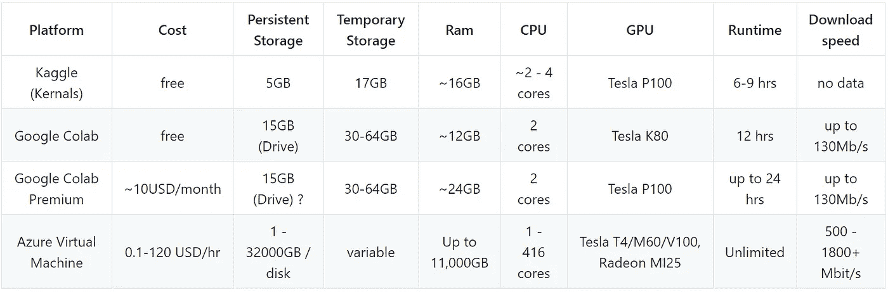
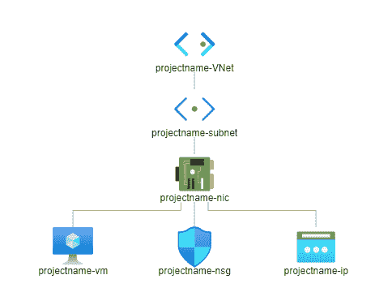
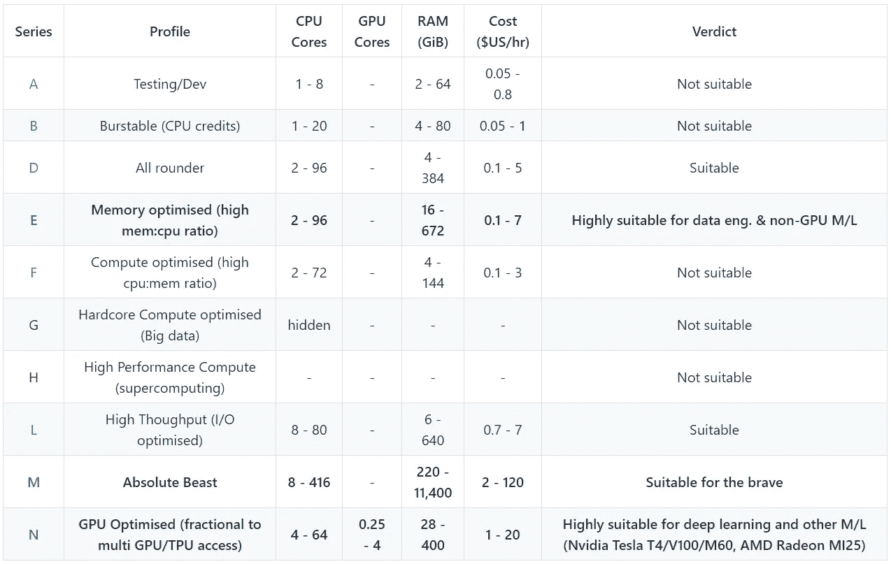
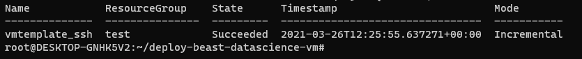
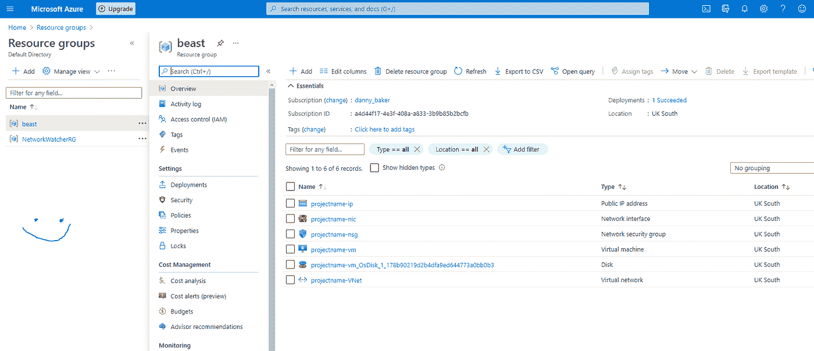
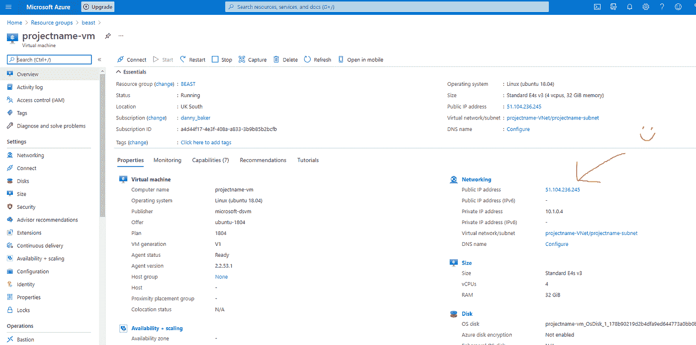
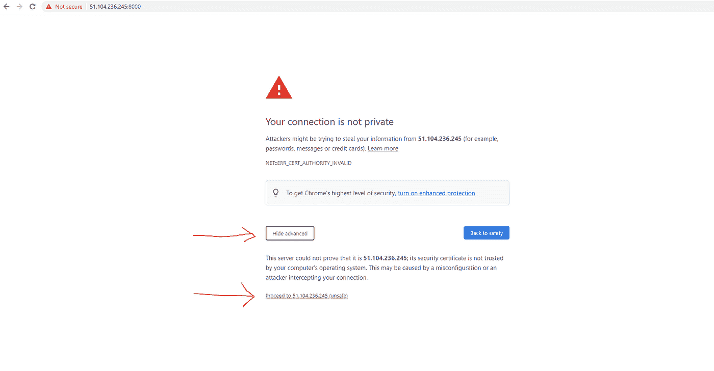
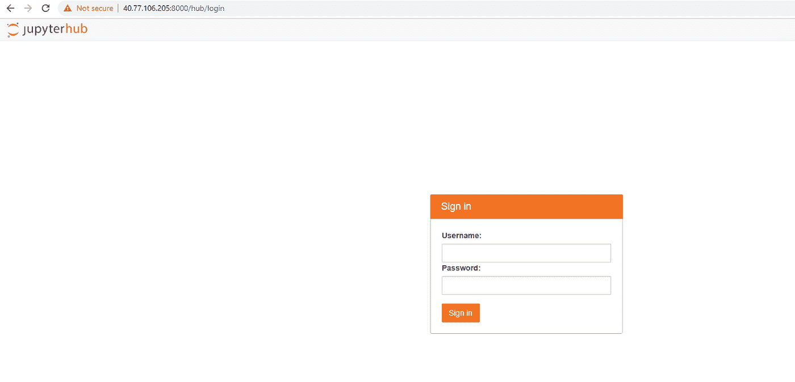
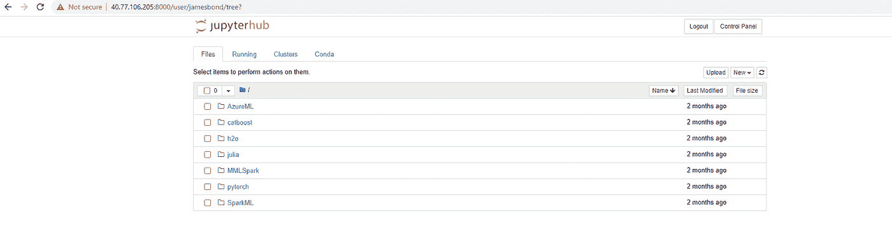

# 为数据科学部署 beast 虚拟机

> 原文：<https://towardsdatascience.com/deploy-a-beast-virtual-machine-420b8756190e?source=collection_archive---------21----------------------->

## [理解大数据](https://towardsdatascience.com/tagged/making-sense-of-big-data)

## 使用 Jupyter Hub 在 Azure 中构建定制数据科学虚拟机的指南，在一个命令中即可运行。

(图片来自 pixilart.com来源:[https://www.pixilart.com/art/little-laptop-1b5bef298dcee31](https://www.pixilart.com/art/little-laptop-1b5bef298dcee31))

你梦想有一天拥有超越你笨重的笔记本电脑 J-Hub 或 Google Colab 会话的能力吗？幻想您的 M/L 实验使用 64+内核和 500+GB RAM 的专用硬件？直接访问英伟达特斯拉 T4，M60，V100 和 AMD 镭龙 MI25 GPU 设备，或 1800+MBit/秒的互联网速度来下载数据进行处理怎么样？(底线:如果这些让你的瞳孔放大，像我一样，你可能需要多出去走走。)

今天我要把那个书呆子梦变成现实。我将向您展示如何在 Azure 中部署任何针对数据科学预配置的虚拟机，以及运行 Jupyter Hub 服务器，只需一个命令。

如果你一直想进入专用云硬件的神秘世界，现在是时候了。有一种新的语言叫做 [Bicep](https://github.com/Azure/bicep) ，来自微软(2020 年 8 月推出)。它提供了一种简单而优雅的方式来描述 Azure 云组件，您可以在命令行轻松部署这些组件。

我在 GitHub 上专门为数据科学家构建了一个[二头肌模板集。手动选择您的虚拟机规格，包括型号(内核和 ram 选项)，选择操作系统磁盘大小(高达 4TB)，使用一个命令部署脚本，您的虚拟机在 90 秒内即可启动。它带有一个定制的 Linux Ubuntu 18.04 操作系统映像，专门为数据科学设置，预装了 150GB 的好东西，包括对 Python、R、Julia、SQL、C#、Java、Node.js、F#的原生支持。](https://github.com/danny-baker/deploy-beast-datascience-vm)

如果你不了解 Linux，不要担心。开箱即用，该机器运行 Jupyter Hub 服务器，让您可以通过 HTTPS(使用自签名 TLS 证书)即时(安全)访问该机器。一旦机器启动，你就可以通过 JHub 访问它。零设置。零麻烦。零笑话。

对于 Python JHub 的粉丝来说，我敢肯定，你们中的许多人都对从本地机器上运行的硬件限制感到沮丧，或者实际上是来自像 Google Colab Premium 这样的云笔记本服务的限制。

**非常清楚:这个 VM 是你自己的私有 JHub 服务器，拥有你愿意支付的所有能力和存储。**

需要 500GB Ram、4TB 存储和 64 个 CPU 内核运行 6 小时？在几秒钟内部署您需要的确切虚拟机，并像专业人员一样完成工作。也许你和一些朋友需要一个 128GB 内存的中等规格钻机和一个英伟达特斯拉 T4 一个月；分担成本并获得协作。或者试试 Azure 30 天免费试用版(200 美元信用),体验一下基本的 4 核机器、32GB 内存和 1TB 存储。选择权在你。

你的虚拟机将会为你运行，毫不妥协，不受限制。听，并理解。这台机器就在外面。这是不能讨价还价的。这是无法讲道理的。它不会感到怜悯、悔恨或恐惧。而且它绝对不会停止，直到你的[信用卡]死亡。(抱歉，终结者。忍不住。)

在以下部分，我将尝试总结和对比现代数据科学家的硬件选项和局限性。我将提供云基础设施的快速速成课程(基于我不完善的理解)，我还将通过数据科学的视角描述 Azure 的整个 VM 目录。我的目标是揭开云基础设施的神秘面纱(至少对 Azure 来说是这样)，并描绘出有哪些选择，何时你可能想使用它们，以及你预计会支付多少钱。

要是云技术像这样就好了。(图片来自 pixilart.com[)。来源:https://www.pixilart.com/art/rainbow-cloud-c07afa838edaa20](https://www.pixilart.com/)

**问题:云很可怕**

我认为现实是有大量的数据科学家对本地硬件或免费云服务的局限性感到沮丧，渴望尝试专用的虚拟硬件，但不知道如何轻松开始。(即智力进入成本太高)

谁不会被所有可笑的供应商专用术语和难以比较的定价吓跑呢？此外，还有与“云”远程机器相关的其他可怕的东西，如 linux、git、ssh-keygen 公共/私有加密、网络协议、TLS 证书和 VPN 安全考虑。这是一个字面上的噩梦，这就是为什么整个行业都在努力摆脱所有这些痛苦，提供笔记本电脑即服务类型的产品。

> 有趣的是,“云”技术就像它的名字来源于大气云一样不透明。

令人悲伤的事实是，如果你召集一个顶级工程师团队，把他们关在一个房间里两周，并让他们设计他们能想象到的最复杂、最不连贯、最难以理解的云生态系统，你就会得到我们今天所拥有的。

供应商们不再以功能来命名事物，而是被激励去创造像“EFA fabric adapter”或“infiniband”这样的公司流行语(顺便说一下，这些都是真实的)来锁定客户。从短期来看，这可能会保护市场和客户份额，但从长期来看，我认为缺乏术语的功能标准化对行业来说确实是有害的。当硬件基本上在做同样的事情时，事情不应该这么复杂。在汽车行业，世界上每一个机械师都称“燃油泵”为“燃油泵”。它泵送燃料，因此根据它的功能准确地命名。当然有不同品牌的燃油泵，有些泵的压力比其他泵高，但它们基本上做的是一样的。可悲的是，这并没有发生在云世界，我认为现实的混淆是非常可悲的。这是一个很难想象云虚拟硬件原理上如何工作的抽象概念，更不用说在不同“制造商”对每个组件都有不同命名的情况下理解它了。

第二个问题是:硬件不是免费的。现代数据科学家几乎总是会遇到硬件限制。无论是在本地机器上，还是在 Kaggle Kernals 或 Google Colab 中令人沮丧的会话超时，以及 ram 和存储的持续压力。你升级你的本地机器吗？选择托管服务(如 [Google Colab Premium](https://colab.research.google.com/signup#) 或 [Google AI platform](https://cloud.google.com/ai-platform) )还是勇往直前进入专用虚拟硬件的最终领域？成本和限制如何比较，学习曲线会有多陡？

如果你需要更好的规格，你需要做好支付的准备。句号。但我认为，如果做得明智，云是一个比升级本地机器更具成本效益的选择，而且就您卧室的本地硬件而言，您可以远远超出即使是最好的钱也能买到的规模。

我希望这篇文章能让你对这些问题有一个大致的了解，并提供一个简单的选项，用最少的设置让 Azure data science vm 超快地运行起来。

**带回家的消息**

1.  为数据科学建立一个专用的虚拟机不再像过去那样可怕，打开了访问你一直梦想的庞大硬件规格的大门。
2.  微软发布了一种叫做 Bicep 的新语言，它可以帮助你优雅地描述和构建他们的基础设施。他们还发布了一个定制的数据科学操作系统映像。(很爽)。
3.  Bicep 和 data science 操作系统映像的结合意味着您可以在 90 秒内按下按钮构建一个 data science 虚拟机，并通过 JHub 连接到它。我已经[构建了模板](https://github.com/danny-baker/deploy-beast-datascience-vm)来帮助您做到这一点:像老板一样手动选择您的虚拟机规格并部署基础架构代码。
4.  虽然专用硬件通常必须付费，但你可以使用 200 美元的信用进行 30 天的免费试用，但有一些重要的警告。

# **快速入门**

如果你知道如何使用 ARM 模板(和 Bicep)部署 Azure 资源，那么克隆我的 [GitHub repo](https://github.com/danny-baker/deploy-beast-datascience-vm) ，打开适当的 Bicep 模板文件，设置你的 VM 规格，创建一个资源组，然后用一个命令在 Azure CLI 中部署。

**使用单一命令部署**

`az deployment group create -f vmtemplate.bicep --resource-group <RESOURCE GROUP NAME> --parameters adminUsername="USERNAME" adminPassword="PASSWORD"`

这将使用针对免费帐户优化的默认模板虚拟机规格(E 系列、4 核、32GB 内存、64GB 临时固态硬盘、1TB 固态硬盘操作系统磁盘):

或者使用最多六个参数指定虚拟机规格:

`az deployment group create -f vmtemplate.bicep --resource-group <RESOURCE GROUP NAME> --parameters adminUsername="USERNAME" adminPassword="PASSWORD" vmModel="Standard_E4s_v3" osDiskSize=1000 osDiskType="Premium_LRS" projectName="myproject"`

**通过 JHub 访问虚拟机**

部署完成后，获取新虚拟机的公共 IP 地址(从门户或 CLI)并通过`[https://xxx.xxx.xxx.xxx:8000](https://xxx.xxx.xxx.xxx:8000)`在浏览器中访问 Jupyter Hub 服务器

**通过安全外壳(SSH)访问虚拟机**

通过终端直接访问:`ssh USERNAME@xxx.xxx.xxx.xxx`

注意事项:

*   二头肌模板部署就像手臂。json 模板(你只需要先安装 Bicep)
*   用户名和密码应该用“引号”括起来，否则特殊字符将无法正确检测
*   密码需要很强(1 个大写字母、1 个数字、1 个特殊字符)
*   对于 JHub 和其他暴露在互联网上的服务，vm 为 HTTPS 创建一个自签名证书(TLS/SSL)。当你试图连接时，现代浏览器仍然会大发脾气。只需点击通过安全警告，你可以连接确定，并相信你是通过加密协议访问服务。
*   如果你不需要 JHUB，并且希望使用密钥对你的虚拟机进行更安全的 SSH 访问，我有一个专门针对 T4 的模板。
*   对于高级用户，我也有一个模板，用于将您的虚拟机放在高级 VPN 网关后面`vmtemplate_vpn.bicep`。请参阅文档或 GitHub 自述文件中的详细说明。
*   请注意，具有公共 IP 和暴露端口的虚拟机确实会引入易受攻击的漏洞。这对于短期任务来说可能是可以的，但是最佳实践是将虚拟机私有地放在 VPN 后面。我已经在我的 repo 中为此提供了一个模板，尽管注意它是为高级用户提供的，因为它需要手动步骤来创建根/客户端证书。我认为对于短期工作来说，攻击的风险是相当低的，使用默认设置应该没问题，但要知道这是有风险的。

# **初学者指南**

如果你是云基础设施的新手，并假装在这一点上不害怕，不要担心。遵循本指南和下面的逐步说明，您将很快拥有一个完全专用的虚拟机。

下面是你要做的:在一条命令中，你将把 Bicep 文件(描述云基础设施的高级语言)编译成 Azure Resource Manager (ARM)模板(JSON 格式的基础设施的低级抽象)，然后在 Azure 中构建所需的资源。部署大约需要 2 分钟，您就可以启动并运行了。如果你是微软云的新手，我建议你获得一个[免费的微软 Azure 账户](https://azure.microsoft.com/en-gb/free/)，这样你就可以在试用的限制内免费玩了。

真正需要强调的是，我们在此次部署中使用的操作系统映像完全是(由微软)为数据科学而设置的。这意味着几乎不需要任何设置(或 Linux 技能)。它提供了对所有通用语言的支持，并且它本机运行 Jupyter Hub 服务器和 R Studio lab 服务器作为开箱即用的服务！这意味着一旦虚拟机启动，您就可以通过 HTTPS 安全地立即连接到虚拟机。

## 现代数据科学家的硬件选择

在选择硬件时，我认为实际上有三个主要选项:

1.  本地机器
2.  托管服务(例如笔记本电脑即服务产品)
3.  专用远程硬件(即虚拟机)

每一种都有其优势和局限性，还有许多其他因素，如协作和共享工作的能力，这些因素更适合一些选项。下面我提供了众所周知的笔记本工具与专用云硬件的快速对比。很难从 Kaggle 和 Colab 那里知道确切的数字，因为许多限制都没有确切地说明或公布，所以我从其他人那里了解了一些情况。

Kaggle、Colab 和云虚拟机(在本例中为 Azure)的快速比较。

## 为什么选择虚拟机？

*   可扩展性和选择:访问数百个内核、数千 GB 内存和海量存储。
*   按需付费(按秒计费)
*   完全控制(完全控制您的硬件)
*   疯狂的网速(我用一个典型的 4 核虚拟机达到了 1854 MBit/秒的下载速度)

## 专用虚拟机的替代方案

*   您的本地硬件
*   [Google Colab](https://colab.research.google.com/notebooks/intro.ipynb#recent=true)
*   [Kaggle kernels](https://www.kaggle.com/kernels)
*   [天蓝色笔记本](https://notebooks.azure.com/)(虽然我认为这已经不存在了)
*   [深度笔记](https://deepnote.com/)
*   [曲线板](https://curvenote.com/)
*   [等。](https://www.dataschool.io/cloud-services-for-jupyter-notebook/)

## **Google Colab(以及类似服务)是如何免费的？？**

事实是，他们不是真的。硬件不是免费的。但是硬件可能没有得到充分利用，我怀疑，这正是这些服务可以零成本提供给你的原因。你在 Kaggle Kernals 和 Google Colab 上获得的将是现货市场闲置的产能；啤酒杯底的渣滓。您无法锁定超过 6-12 小时的硬件的原因可能是因为在企业客户早上醒来并以全价按需启动硬件之前，组件通常不会被使用。当这种情况发生时，你将被踢出你的硬件，以支持付费用户。我不确定，但这是我最好的猜测。我在这里想说明的一点是，当你想要适当地访问硬件时，你需要付费，要么通过一个很棒的本地平台，一个托管服务，要么通过云中的专用虚拟机。免费服务很棒，但是有充分的理由严格限制。

## 我可以在我的虚拟机上安全地访问 Jupyter Hub 吗？

是的……嗯*合理地*安全地。事实上，这可能是这个特殊设置中最重要的事情。微软已经完成了构建特殊数据科学 linux 操作系统映像的所有工作，该映像可以自动运行 Jupyter Hub 服务器。不需要设置。他们还处理自签名 TLS 证书，这意味着您可以使用 HTTPS 连接到您的虚拟机的 JHub 服务器。在大多数浏览器中，您需要点击通过安全警告，但这只是因为您在虚拟机和您的 pc 之间使用自签名证书。这意味着您可以立即启动 JHub 并以强劲的马力运行，如果您愿意，还可以在您的新硬件上与其他人实时协作。我要再次强调，让一台机器的端口对公共互联网开放是有风险的。最好的选择是将机器放在 VPN 后面的私有网络上，但这要复杂得多，而且更难让 JHub 工作(我在 GitHub repo 中为高级用户准备了一个专用模板)。对于初学者，我认为你可以使用默认的虚拟机设置和公共 IP。只是要意识到风险。

## 什么是基础设施即代码？

这个例子演示了如何将云基础设施构建为代码，这是一种将您需要的组件描述为“代码”的方式。真的就是这样。许多(或所有)大公司都有某种 API，用于解释要部署的基础设施。无论你是从浏览器还是直接从*代码*构建一台机器，它都被转换成一种特定于领域的格式，供供应商吸收，就像一个蓝图，以便构建组件并将它们连接起来。微软 Azure 使用被称为 ARM 模板的东西。您想要构建的所有基础设施的 json 表示。AWS 使用. json 和。yaml 喜欢的界面。我不确定谷歌和其他公司。微软发布了一种新的开源语言，名为[Bicep](https://github.com/Azure/bicep)(2020 年 8 月)，它极大地简化了你描述他们基础设施的方式。它真的很棒，我们要用它了！

## 当我部署虚拟机时，实际构建的是什么？？

重要的是要明白，当您调配虚拟机时，还需要其他云资源；它不仅仅是一个孤立配置的神奇虚拟机。例如，要部署一个具有一些暴露于互联网的端口的虚拟机，您在 Azure 中实际做的是构建一个虚拟网络、网络内的子网、虚拟网络接口卡、网络安全组(控制打开/关闭哪些端口之类的事情)、具有持久磁盘的存储帐户(预加载了操作系统)、虚拟机本身(实际上是计算 cpu-ram 组件)和一个面向公众的 IP 地址，以绑定到网络接口卡，以便您可以通过互联网访问虚拟机。在你把自己从最近的阳台上扔下去之前，我保证一旦你掌握了基本知识，它不会太糟糕。所有这些神奇的事情都发生在一个干净的步骤中，因此您不需要担心复杂性，可以专注于您最擅长的事情:数据的*科学【T1:)*

这里是网络拓扑，只是给你一个你将在 Azure 中构建的最终产品的图片。

这些是您将构建的组件，只需一个命令，即可创建您的数据科学虚拟机。

## 在 Azure 中理解虚拟机类型

我认为大多数重量级数据科学应用程序需要高内存处理，以及 CPU 或 GPU 的并行处理。如果你是像我一样的黑客数据科学家，你会知道生活中的所有问题都可以用更多的 RAM 来解决。因此，我认为最令人感兴趣的虚拟机类型是来自 Azure 的 D/E/M/N 系列。

下表列出了我对 Azure 机器类型以及数据科学应用程序需要关注的快速而粗略的描述。有许多子变型，所以这只是一个味道，让你对规格和成本范围的想法。

关于数据科学的 Azure VM 类的快速浏览

需要注意的一件重要事情是:RAM 数量是基于 CPU 内核进行扩展的。所以你不能只有一个 256GB 内存的 4 核机器，以防你想知道。不同的类有不同的核心:内存比率，这是值得理解的。E 系列拥有最高的内存:内核比率。

更多信息[在这里](https://azure.microsoft.com/en-gb/pricing/details/virtual-machines/linux/)。有用的网站 [azurepricenet](https://azureprice.net/) 可以让你快速找到你需要的 VM 家族和具体型号，以及定价。

对于数据工程和 M/L 中的非 GPU 应用，我认为 D/E 系列为您提供了一个可靠的全能设置，单个实例中最多可有 96 个内核和 672GiB RAM，外加许多选项来适应特定项目。例如，一个“E16as_v4”将为您提供 16 个 2.35Ghz 内核、128GiB RAM 和 256GB 临时 SSD 存储，每小时约 1 美元。

如果您正在做一些疯狂的事情，M 系列是直截了当的猛兽，单个实例可以时钟输出到 416 个核心和 11，400Gb RAM。我的意思是，我不知道你会在数据科学中使用这些。公平地说，这些更适合核心企业应用程序。但是他们在那里。

对于快速发展的深度学习人群，新的 [N 系列](https://docs.microsoft.com/en-us/azure/virtual-machines/sizes-gpu?context=/azure/virtual-machines/context/context)适合你。内有许多变体和类，但本质上，您可以自定义虚拟机以获得对 GPU 的部分访问(例如，每个节点 0.25 个 GPU 核心到 4 个专用 GPU 核心)。您可以直接访问 Nvidia Tesla T4 和 M60、Volta V100、AMD Radion MI25，这些虚拟机采用最新一代 cpu 内核库，包含 4 至 64 个 CPU 内核。我应该强调这些在免费试用中不可用，你*必须*加入付费计划。这些都是严肃的，我想你们中的许多人可能想尝试。

这里还值得一提的是，微软并不是 GPU 云产品领域的巨头。公平地说，这是谷歌和其他公司。底线是他们中的大多数都提供 GPU 选项，如果这对你的工作至关重要，那么就值得研究选项。无论如何，我认为 Azure 是尝试专用云硬件的一个很好的选择，因为现在使用新的 Bicep 语言很容易部署。

另一件值得注意的重要事情是，在标准 PAYG 帐户上，您将无法提供开箱即用的资源。所有 Azure 帐户都有软和硬 vcpu(核心)配额，因此如果您想要超过 4 个核心，您需要向服务台提出配额增加请求，这可能需要 48 小时来处理。您可以在 Az CLI 中根据给定区域检查所有虚拟机类型的当前限制，更多信息[请点击](https://docs.microsoft.com/en-us/azure/virtual-machines/linux/quotas)。

## 我的虚拟机在哪里？

微软在世界各地都有数据中心，你可以在这张[地图](https://azure.microsoft.com/en-gb/global-infrastructure/geographies/)上看到。根据您将创建的“资源组”的位置，您的虚拟机将驻留在您选择的数据中心。Azure 资源组只是一个方便的桶，可以放入所有的资源，就像桌面电脑上的文件夹一样。您可以在“文件夹”级别控制访问，并通过一次删除来删除其所有内容。地区之间存在边际价格差异，但是对于这个用例，最重要的因素是为您的资源组选择离您当前位置最近的位置。这将最小化你和机器之间的延迟。例如“美国中部”或“英国南部”。

## 我可以在浏览器中使用 Azure 门户构建一个数据科学虚拟机吗？

是的。事实上，我建议你使用 [Azure 门户](http://portal.azure.com/)，选择[数据科学操作系统映像](https://docs.microsoft.com/en-us/azure/machine-learning/data-science-virtual-machine/dsvm-ubuntu-intro)，构建你的第一个虚拟机。这与我在这个构建模板中使用的操作系统映像完全相同。使用门户有一些限制，所以你不能指定太多的选项，但是你肯定可以在 JHub 等上启动并访问你的虚拟机。我希望这篇指南向您展示将基础设施作为代码部署是多么容易，无论如何，当您从 Azure 门户进行部署时，这是在幕后实际发生的事情。

## 我的虚拟机如何计费？

你按秒付费。是的，让虚拟机开着会比周五晚上喝龙舌兰酒更快地积累你的信用卡(你在免费账户上受到保护，别担心)。

大多数其他基础设施基本上是免费的(虚拟网络、子网、公共 IP 等)。关键成本是计算(虚拟机)和存储(连接到虚拟机的持久磁盘)。

请注意，小时费率是 PAYG，如果您对虚拟机有持续需求，通常可以在 3 年预订期内将按需价格降低 60–70%(您可以随时取消预订)。许多虚拟机还可以现货价格购买，这非常有吸引力。不要上当。我认为这对于数据科学应用来说不是一个好主意，因为你通常需要长的不间断的处理管道。在现货市场上，你的 VM 可以在没有任何警告的情况下被拉出来，毁掉你所有的工作。PAYG 是在使用资源时获得有保证的独占性的唯一途径。

黄金法则是:永远记住关闭虚拟机(取消配置)或拆除所有资源(删除所有内容)您可以暂时取消配置，保留操作系统磁盘，就像关闭 PC 一样，或者您可以在完成后删除整个资源组。

## 免费试用版中最好的虚拟机是什么？

30 天的免费试用可以获得 200 美元的积分，这很好，但请注意以下一些重要限制:

*   最大核心数=每个区域 4 个(意味着免费帐户上没有大灰狼虚拟机)
*   无法访问 GPU 虚拟机系列(升级到 PAYG 帐户以访问 N 系列 GPU 优化的虚拟机，起价约为 1 美元/小时)

最残忍的免费帐户设置:

*   e 系列“标准 E4s_v3”(我的模板中的默认值)
*   4 个内核(英特尔至强白金 8272CL 基本内核时钟 2.5GHz，可提升至 3.4Ghz 所有内核)
*   32GB 内存
*   1tb 高级固态硬盘(最快的操作系统磁盘类型)
*   疯狂的网速(通常 1000 多兆比特/秒)

这个包将燃烧约 10 美元的信用/天，你可以运行它 24-7 全速，不间断，没有 cpu 的限制，为 20 天，直到你的免费信用耗尽。您可以将操作系统磁盘大小设置为高达 4，095 GB(4tb)的任何值，但 1tb 最大限度地提高了 30 天试用期的存储容量。

## 存储如何与虚拟机协同工作？

所有虚拟机都需要一个用于操作系统映像的托管永久磁盘。您可以附加额外的磁盘(通常是几个)并把它们挂载到文件系统上，但是请注意，如果您不熟悉 linux 的话，这是非常麻烦的。到目前为止，最快、最简单的选择是将操作系统磁盘大小(高达 4TiB SSD)增加到您手头任务所需的大小，因为这是自动安装的。

许多 VM 类提供临时高速存储也没有什么价值。这通常在地理位置上靠近数据中心的计算硬件(cpu 核心),基本上是您可以获得的最快的存储。我认为这有时被称为“暂存”存储。请注意，它是短暂的，仅持续几天，因此对于数据处理阶段非常有用。如果您的 VM 类提供临时存储，它会自动安装在您的 VM 上的位置`/mnt`。

## 如何在虚拟机之间来回传输数据？

这是一台合适的远程 Linux 机器，所以它不像将文档复制粘贴到你的笔记本电脑上运行 JHub 的 windows 文件系统那样简单。但是，美妙之处在于，你可以通过浏览器直接通过 Jupyter Hub 服务器进行大部分上传/下载，这应该可以满足大多数人的需求。别忘了，你可以从虚拟机上以闪电般的速度从互联网上下载数据。因为你的虚拟机位于数据中心，它的数据传输速度通常比你的家庭互联网或 Colab 快十倍(1800+ Mbit/s)。

**将数据放入虚拟机:**

*   从您的 pc:从 linux 终端使用浏览器或类似于`rsync`的工具中的 JHub 上传功能(要求您在 windows 中有 WSL)
*   来自互联网:wget/curl/github(就像你在云笔记本工具中一样)

**从您的虚拟机中获取数据:**

这比你想象的要复杂一些，因为机器运行的是 Linux，而你可能运行的是 Windows，但是我没有什么标准的建议。它还取决于你计划在哪里存储数据，以及你有多少数据。

*   小(<30GB): use the JHub file download feature in browser (the simplest)
*   medium: (<1TB): use a linux data transfer application like 【 (requires linux on your local machine, native for MacOS but Windows you will need [WSL](https://docs.microsoft.com/en-us/windows/wsl/install-win10)
*   大型:(+1TB):直接传输到云数据存储服务，如 Azure Blob 或网络文件系统(NFS)。这将允许您快速从虚拟机中获取数据并将其关闭(以节省成本)，然后您可以直接连接到云存储服务以下载或更长期地存储数据。

# 说明

既然速成课程已经完成，我们可以从一步一步的指导开始，以代码的形式部署您的虚拟机基础架构。注意这都在 my[GitHub repo](https://github.com/danny-baker/deploy-beast-datascience-vm)中有详细说明

## 先决条件

*   微软 Azure 账户(例如[免费试用](https://azure.microsoft.com/en-gb/free/)或现收现付)

## 1.安装 VS 代码和二头肌/手臂延伸(可选)

这是为我们打开和编辑项目文件做准备，主要是`vmtemplate.bicep`文件或类似的模板。Microsoft Visual Studio 代码非常适合这个项目，因为它是开源的，并且有可下载的 bicep 和 ARM 模板扩展，这意味着它很好地着色了代码，使其更具可读性。下载并安装 [VS 代码](https://code.visualstudio.com/)以及[手臂工具](https://marketplace.visualstudio.com/items?itemName=msazurermtools.azurerm-vscode-tools)和[二头肌](https://marketplace.visualstudio.com/items?itemName=ms-azuretools.vscode-bicep)延伸。注意，一旦 VS 代码运行，就可以很容易地从代码中安装这些扩展。当然这是可选的。您可以使用任何编辑器(例如 Notepad++和 VIM 等)。)并且您根本不需要编辑文件，因为您可以在 build 命令中将 vm 规范作为参数传递。

## 2.安装 Azure CLI

什么是 Azure CLI？这是一个专门的程序，它提供了一个命令行界面(即 CLI)来直接与 Azure 资源进行交互。这意味着您可以像老板一样在命令行上构建和拆除基础设施，而不是从 web 浏览器门户进行。最直接的方法是[安装 Azure CLI](https://docs.microsoft.com/en-us/cli/azure/install-azure-cli) ，它可以在 Windows、MacOS 和 Linux 上运行。

我真的需要使用 Azure CLI 吗？对于这个完整的例子，是的。因为门户界面有一些限制。一般情况下:不需要。如果您只想使用用户名/密码和 data science 操作系统映像构建虚拟机，您可以根据需要从门户一次性完成所有操作。

## 3.安装二头肌

Bicep 是一种很酷的新的领域特定语言，用于以比使用 ARM 模板更简单的方式部署 Azure 资源，ARM 模板是 JSON 格式的，阅读起来很痛苦。Bicep 文件编译成 Azure 资源管理器(ARM)模板，然后 Azure 可以直接接收这些模板来构建基础设施。因此，Bicep 脚本是 ARM 模板之上的高级抽象，它简化了您想要构建的基础设施的描述。安装二头肌只需要几分钟。此处遵循安装指南[。](https://github.com/Azure/bicep)

在 Azure CLI 最新版本中，它基本上是:

`az bicep install`

`az bicep upgrade`

## 4.克隆此回购

将这个项目 repo 复制到你的本地机器上，或者直接从 Github 浏览器下载，或者通过`git clone`等。如果你不熟悉 GitHub 和 git，实际上，你只需要把`vmtemplate.bicep`文件放到你的本地机器上，你就可以在 Azure CLI 中访问它。

## 5.配置虚拟机规格(有趣的部分)

在 visual studio 代码中打开`vmtemplate.bicep`文件。

在文件的开头，我总结了所有你可能想要调整虚拟机设置的旋钮和转盘。默认情况下，我选择了我能在免费帐户的限制内找到的最艰难的设置(这是一个 E4s_v3，带有 32GB RAM，64GB 临时 SSD 存储和 1TB 高级 SSD 操作系统驱动器)。当然，你可以在免费账户上混合搭配几乎任何多达 4 个内核的虚拟机，并尝试不同大小和类型的硬盘。

您可以在。bicep 文件本身，或者通过在 build 命令中将所需的值作为参数传递来覆盖默认值。完全由你决定。进一步提供的例子。

**关键决策点:**

*   虚拟机型号—这一点至关重要，因为它决定了内核、RAM、临时存储的数量以及与 I/O 相关的其他限制。实际上有数百个选项。在 [Azure docs](https://azure.microsoft.com/en-gb/pricing/details/virtual-machines/linux/) 或 [azurenet](https://azureprice.net/) 上查找您想要的内容。你只需要文本字符串，比如“Standard_E4s_v3”。
*   操作系统磁盘大小—默认为 1TB 高级 SSD，但您可以选择高达 4tb(4095 GB)的任何容量作为单个磁盘。
*   操作系统磁盘类型请特别注意，有 3 种不同的存储类别，即固态硬盘“高级 _LRS”，“标准固态硬盘 _LRS”，即受限制的固态硬盘介质，然后是传统的硬盘驱动器“标准 _LRS”。标准 ssd 是高级 ssd 价格的一半，标准 HDD 是高级 SSD 价格的 1/4。在此参考文件[。在所有的数据科学应用程序中，为了获得最佳性能，我只会使用“高级 LRS”。](https://azure.microsoft.com/en-gb/pricing/details/managed-disks/)

## 6.登录 Azure

从 azure CLI:

`az login --use-device-code`

这将打开浏览器，让您输入 CLI 中显示的代码

检查可用帐户

`az account list --output table`

设置订阅(如果默认帐户不正确)

`az account set --subscription <name>`

列出资源组(查看订阅中的任何现有资源组)

`az group list --output table`

可选:将 Azure CLI 输出格式永久设置为 table，该格式比 JSON 更易于阅读，这是默认设置。我强烈建议这样做。

`az configure`(并按照提示操作。确保选择输出为表格格式)

## 7.创建 Azure 资源组

在地理位置靠近您当前位置的区域创建一个新的资源组。

要查看可用区域:

`az account list-locations`

在本例中，我在“美国中部”地区创建了一个名为“beast”的资源组。通常需要几秒钟。

`az group create --name beast --location "Central US"`

检查资源组是否已创建

`az group list --output table`(如果您已经更改了 Az CLI 配置，则不需要每次都附加- output 表)

几秒钟后，它应该会出现。您可以通过搜索“资源组”或在 CLI 中键入`az group list`来直接在 portal.azure.com 进行检查。

## 8.设置访问

我们几乎准备好构建资源了。我们需要做的最后一件事是设置如何访问机器。有两种主要方法可以做到这一点:用户名/密码凭证或 SSH 公共/私有密钥加密。我有一个单独的二头肌文件为每个选项。我现在推荐 user/pass default，因为这是 JHub 兼容的选项。

选择用户名和密码

*   注意密码必须至少包含 1 个大写字母、1 个数字和 1 个特殊字符。
*   我建议你用类似 [keepass](https://keepass.info/) 的东西生成一个强密码。
*   对于我们将使用的默认模板，您必须创建用户名和密码。这是因为 Jupyter Hub 需要用户/通行证，不支持 SSH 密钥。因为我假设大多数人希望在他们的虚拟机上运行笔记本，所以我设置了允许用户名/密码的模板，这并不是连接到 Linux 主机的最安全的方式。

可选:创建 SSH 密钥对

仅适用于您不打算使用 JHub 并且想要最安全的方式来访问您的 VM 的情况。如果您在 Windows 或 MacOS 中运行 linux、WSL，并且您基本上有一个 linux 终端，那么您可以为虚拟机的安全 shell 访问(SSH)创建公钥/私钥加密文件。这是最安全的访问方式，尽管 Jupyter Hub 不支持它。所以不管怎样，如果你打算主要使用 JHub，你就需要使用推荐的`vmtemplate.bicep`模板。从 JHUB 你可以访问一个完整的根终端来做你需要的任何事情。因此，这实际上只适用于那些希望能够用加密密钥直接 SSH 到虚拟机的铁杆用户。如果您确实需要这个选项，那么创建 SSH 密钥对时要准备好公钥以供复制。

## 9.伟大的建筑

这是你们一直在等待的时刻:我们已经准备好建设基础设施。从 Azure CLI 中，确保导航到当前工作目录，即`vmdeploy.bicep`文件所在的目录。您还必须通过 Az CLI 登录您的 Azure 帐户(步骤 6)。通过运行下面适当的命令，传入用户名/密码或公钥的参数来构建虚拟机。

让我们假设您决定使用用户名:jamesbond /密码:G0|den3y3，并且已经创建了一个名为“beast”的资源组。

**使用用户名/密码部署**

使用中的默认虚拟机规范进行构建。二头肌锉:

`az deployment group create -f vmtemplate.bicep --resource-group beast --parameters adminUsername="jamesbond" adminPassword="G0|den3y3"`

构建将自定义虚拟机规格作为参数传递:

`az deployment group create -f vmtemplate.bicep --resource-group beast --parameters adminUsername="jamesbond" adminPassword="G0|den3y3" vmModel="Standard_D2s_v3" osDiskSize=180 osDiskType="Premium_LRS" projectName="myproject"`

**使用 SSH 公钥部署**

`az deployment group create -f vmtemplate_ssh.bicep --resource-group beast --parameters adminUsername="jamesbond" adminPublicKey="INSERT FULL ASCII PUBLIC KEY HERE"`

笔记

*   对于 SSH，您调用的是另一个名为`vmtemplate_ssh.bicep`的 bicep 模板文件。
*   始终用引号将用户名和密码(以及公钥)括起来，以确保正确解析特殊字符。有时没有它们你会得到一个错误。

如果它工作了，你应该看到类似这样的东西

如果你在耐心等待 2 分钟后在 Azure CLI 中看到类似这样的东西，那么你看起来不错。

登录 Azure 门户网站，看看你的新基础设施！

导航到门户中的资源组，您可以看到所有新创建的组件(在右边)

获取虚拟机的公共 IP 地址

单击虚拟机本身，查看其公共和私有 IP 地址(右上角)

## 10.通过 Jupyter Hub 通过浏览器连接到机器！

您的新虚拟机预配置了一系列服务。部署后，它立即运行一系列容器化服务(通过 Docker ),包括在端口 8000 上公开的 Jupyter Hub 服务。Jupyter Hub(在某种程度上)是一个网络服务器，所以你可以从互联网上的任何浏览器直接连接到它。

首先获取新虚拟机的 IP 地址:

*   从 Azure 门户:搜索资源组，导航到正确的组，点击虚拟机(你可以在右上角看到公共 IP)
*   来自 Azure CLI: `az vm show -d -g <RESOURCE GROUP NAME> -n <VM NAME> --query publicIps -o tsv`

打开浏览器并访问 Jupyter Hub webserver(它运行在通过端口 8000 暴露的虚拟机上)，其中 IP 地址替换了 x。：

`[https://xxx.xxx.xxx.xxx:8000](https://xxx.xxx.xxx.xxx:8000)`

浏览浏览器安全警告。您的虚拟机已经生成了自己的自签名 SSL 证书，以允许加密的浏览器流量(HTTPS)。但是，由于这不是一个公共证书，当您第一次连接时，浏览器通常会发出警告。不要担心，你通常可以点击“接受风险”，然后“转到网站”。

你仍然可以通过 HTTPS 安全地传输数据，只不过你使用的是一个来自 Linux 虚拟机的自签名证书，它不能被浏览器公开识别。

完成后，您应该会看到一个 Jupyter hub 登录屏幕:

如果你看到这个屏幕。开始庆祝吧。

使用您在部署时为虚拟机提供的用户名和密码登录 Jupyter Hub

如果成功了，您将看到如下所示的 Jhub 会话。

Jupyter Hub 会话由运行在本地机器浏览器中的远程虚拟机托管！

## 你被录取了。在这一点上，你可以开始玩笔记本电脑或与朋友合作，以数据科学了！

我真诚地希望这对某人有用；这对一年前的我肯定是有用的。请注意，在我的 [Github repo](https://github.com/danny-baker/deploy-beast-datascience-vm) 中，我在`READEME.md`的结尾提供了额外的细节，比如如何将你的虚拟机放在 VPN 后面(如果安全是最重要的),以及如何测试你的虚拟机的一些基本规格，如互联网速度，如果你不熟悉 Linux，检查处理器和 RAM 的利用率等。

最后要说明的是，我不是云方面的权威，我只是碰巧花了六个月的时间与各种 Azure 虚拟机一起工作，觉得是时候分享一些我一路走来所学到的东西了。

我欢迎更正和澄清，我也希望看到了解 AWS 和谷歌云的人写类似的文章。

享受❤