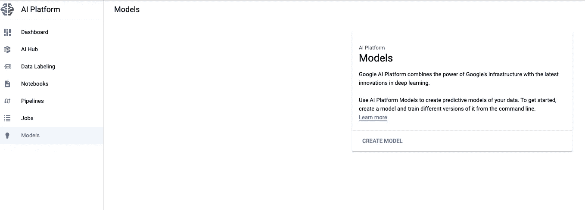

# 在谷歌人工智能平台上部署机器学习模型

> 原文：<https://towardsdatascience.com/deploy-a-machine-learning-model-on-google-ai-platform-b77b6b35f742?source=collection_archive---------27----------------------->


照片由 [NASA](https://unsplash.com/@nasa?utm_source=medium&utm_medium=referral) 在 [Unsplash](https://unsplash.com?utm_source=medium&utm_medium=referral) 拍摄

## 谷歌 ML 教程

## 如何轻松创建一个云服务来查询你训练好的 ML 模型

在上一篇文章中，我们[为我们的机器学习模型找到了最佳超参数](/tuning-a-model-with-bayesian-optimization-on-google-ai-platform-d9fe63b78576)，然后[对其进行训练](/training-a-model-on-google-ai-platform-84ceff87b5f3)。
下一步是部署它:我们必须创建一个服务，我们可以用新数据查询该服务，以从我们的模型中获得预测。
我们将使用 [Google AI 平台预测服务](https://cloud.google.com/ai-platform/prediction/docs)来存储我们的模型，对其进行版本化，并创建服务来获得预测。

对于本教程，您需要:

*   一个活跃的谷歌云平台账户(你可以通过访问[主页](https://cloud.google.com/)建立一个新账户)和一个 GCP 项目。
*   [gcloud](https://cloud.google.com/sdk/docs) 和 [gsutil](https://cloud.google.com/storage/docs/gsutil_install) 安装在您的工作站上。
*   您想要部署的经过训练的模型。你可以在这个系列的其他[教程](https://towardsdatascience.com/tagged/google-ml-tutorials)之后创建一个，或者你可以下载[这个](https://drive.google.com/file/d/1FXMMMtXC_EJ_imyAbmUTwHb2nE85_CBh/view?usp=sharing)作为例子。

到目前为止，您只能部署一个 **scikit-learn、XGBoost 或 Tensorflow** 模型。
我将使用[银行营销](/training-a-model-on-google-ai-platform-84ceff87b5f3) scikit-learn 管道，但是所有框架的过程都是一样的。

# 第一步:将训练好的模型存储在谷歌云存储中

您必须将实际的模型对象存储在云中的某个地方:存储桶是正确的方式！

如果您还没有存储您的模型，您可以直接从浏览器上传[或使用`gsutil`:](https://console.cloud.google.com/storage/browser)

```
gsutil cp local-path/to/model.joblib gs://bank-marketing-model/
```

请记住，模型对象必须具有以下名称之一:

*   `model.joblib`如果是用`joblib`库创建的
*   `model.pkl`如果用`pickle`库创建

# 步骤 2:在本地测试预测

至于训练模型，我们可以在实际部署之前在本地测试我们的预测服务。
为此，我们需要一个 json 文件，其中包含用于查询模型的输入数据。该文件的格式非常特殊，它是这样的:

```
[56, “housemaid”, “married”, “basic.4y”, “no”, “no”, “no”, “telephone”, “may”, “mon”, 261, 1, 999, 0, “nonexistent”, 1.1, 93.994, -36.4, 4.857, 5191, “no”]
[57, “services”, “married”, “high.school”, “unknown”, “no”, “no”, “telephone”, “may”, “mon”, 149, 1, 999, 0, “nonexistent”, 1.1, 93.994, -36.4, 4.857, 5191, “no”]
```

所以我们对每条记录都有一行要预测；每一行都是由模型输入要素的值组成的列表，按原始数据集排序。
现在您可以使用这个命令运行本地测试:

```
gcloud ai-platform local predict \
 — model-dir gs://your-bucket/path-to/model-directory \
 — json-instances ./your-input-file.json \
 — framework scikit-learn
```

*   `model-dir`必须是包含`model.joblib`对象的 GCS **目录**的路径(不是模型本身的路径)
*   `framework`是用于训练模型的实际框架。它可以是 scikit-learn、TensorFlow 或 xgboost。

请记住，现在我们使用我们自己的笔记本电脑来运行这个预测作业，所以这个作业依赖于您当前的 Python 环境。为了避免依赖性或版本问题，最好使用与用于训练模型的[运行时版本](https://cloud.google.com/ai-platform/training/docs/runtime-version-list)具有相同库的`conda`或`virtualenv`创建一个环境。

# 步骤 3:在人工智能平台上部署模型

如果最后一步成功，我们现在可以在 AI 平台上创建一个新的**模型**！
你可以看看平台上的[具体板块](https://console.cloud.google.com/ai-platform/models)，不过如果是第一次，应该是空的……



作者图片

要部署我们的管道，我们必须遵循两个步骤:

*   首先，我们创建一个**模型**实例
*   然后，一个**版本的**型号出现了

一个*模型实例*就像一个*模型版本*的容器。其思想是:用例(如信用卡欺诈检测、交叉销售推荐或收入预测)是模型；用特定数据子集和特定算法(随机森林而不是逻辑回归)训练的实际`joblib`是版本。通过这种方式，您可以保持同一个用例的多个在线版本，甚至可以从不同的用例中获得预测。

第一步非常简单:要创建一个新的模型实例，只需运行

```
gcloud ai-platform models create your_model_name \
 — region your-region
```

*   型号名称只能包含字母、数字和下划线(没有连字符！)
*   和往常一样，要选择地区，一个好的经验法则是选择离你当前位置最近的[。](https://cloud.google.com/compute/docs/regions-zones)

您可以使用检查模型是否开启

```
gcloud ai-platform models list —-region your-region
```

现在第二步:创建我们模型的第一个版本。

```
gcloud ai-platform versions create your_version_name \
 — model your_model_name \
 — origin gs://your-bucket/path-to/model-directory \
 — region your_region \
 — framework scikit-learn \
 — python-version 3.7 \
 — runtime-version 2.2 \
 — machine-type n1-standard-4
```

*   至于型号名称，*版本名称*应该只包含字母、数字和下划线
*   `origin`参数与本地测试中使用的 GCS 路径相同
*   使用为您的云培训工作指定的相同的`python-version`和`runtime-version`。如果您没有使用培训作业来创建您的模型，请选择与您所使用的包版本相同的运行时版本。
*   提供的`machine-type`的[列表](https://cloud.google.com/ai-platform/prediction/docs/machine-types-online-prediction)提供了广泛的选择。
    要做出正确的调用，你得了解你是否需要 GPU，你的模型神器有多大，你预计你的模型会收到多少预测请求。我选择了一个最简单的机器类型，有 4 个节点。

这可能需要一段时间，所以如果您必须等待几分钟，请不要担心…
与之前一样，您可以检查您的版本是否与在线

```
gcloud ai-platform versions list \
 — model your_model_name \
 — region your_region
```

# 第四步:实际使用模型！

现在，我们终于可以用新数据查询我们的模型，并获得我们应得的预测。用`gcloud`命令，超级简单！快跑吧

```
gcloud ai-platform predict \
 — model your_model_name \
 — version your_version_name \
 — region your_region \
 — json-instances ./your-input-file.json
```

json 输入文件应该与用于本地培训的文件具有相同的结构。例如，使用上面的 2 条记录，我得到

```
[0, 0]
```

# 步骤 5:清除模型

如果您的模型必须保持在线，您就不应该遵循这个步骤，但是出于学习和测试的目的，您应该删除模型和版本，以免产生不必要的成本(从经验上讲…)

运行两者

```
gcloud ai-platform versions delete your_version_name \
 — model your_model_name \
 — region your_regiongcloud ai-platform models delete your_model_name \
 — region your_region
```

就是这样！现在你可以在谷歌上管理整个模型的创建，从[调优](/tuning-a-model-with-bayesian-optimization-on-google-ai-platform-d9fe63b78576)到[培训](/training-a-model-on-google-ai-platform-84ceff87b5f3)再到部署。

享受，并感谢阅读这篇文章！