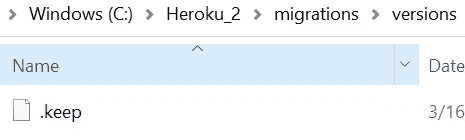
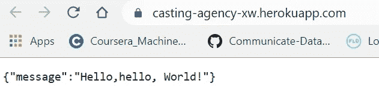

# 重点放在将一个简单的 Flask 应用程序部署到 Heroku 中，与 PostgreSQL 交互和故障排除

> 原文：<https://towardsdatascience.com/deploy-a-micro-flask-application-into-heroku-with-postgresql-database-d95fd0c19408?source=collection_archive---------5----------------------->

## 专注于后端，没有前端和认证

Flask 是可以用来创建 API 服务器的工具。它是一个微框架，这意味着它的核心功能保持简单，但有许多扩展，允许开发人员添加其他功能(如身份验证和数据库支持)。

Heroku 是一个云平台，开发者可以在这里用多种语言托管应用程序、数据库和其他服务。开发者可以使用 Heroku 来部署、管理和扩展应用。Heroku 也是免费的，只需付费的专业会员资格，而且大多数服务，比如数据库，都提供免费层。

**备注:**

这个故事将集中在没有前端和认证的应用程序部署和数据库交互上。将提供一个经过测试的示例应用程序，因此您不需要在本地测试它。

我们开始吧。

首先，**依赖:**基于我的本地设置如下:

1.  python 3.8(或高于 python 3)
2.  PostgreSQL 客户端和服务器安装在 Windows 中
3.  Ubuntu (Windows 子系统):Ubuntu 20.04.2 LTS
4.  PostgreSQL 客户端和服务器安装在 Ubuntu 中
5.  Heroku CLI

## **准备好的烧瓶应用样品**

您可以使用下面的示例进行部署。

在我们开始之前，**在 PostgreSQL 中创建一个数据库**，给出名称，不需要进一步的操作。

```
create databse local_db_name;
```

创建应用程序所需的 6 个以下文件

1.  **models.py** 定义 PostgreSQL 数据库、表和配置

```
import os
from sqlalchemy import Column, String, Integer, create_engine
from flask_sqlalchemy import SQLAlchemydb = SQLAlchemy()
'''
setup_db(app):
    binds a flask application and a SQLAlchemy service
'''
def setup_db(app): database_name ='local_db_name'
    default_database_path= "postgres://{}:{}@{}/{}".format('postgres', 'password', 'localhost:5432', database_name)
    database_path = os.getenv('DATABASE_URL', default_database_path)
    app.config["SQLALCHEMY_DATABASE_URI"] = database_path
    app.config["SQLALCHEMY_TRACK_MODIFICATIONS"] = False
    db.app = app
    db.init_app(app)'''
    drops the database tables and starts fresh
    can be used to initialize a clean database
'''def db_drop_and_create_all():
    db.drop_all()
    db.create_all()class Movie(db.Model):
    __tablename__ = 'movies'
    id = Column(Integer, primary_key=True)
    title = Column(String(80), unique=True)
    release_date = Column(db.DateTime) def __init__(self, title, release_date):
        self.title = title
        self.release_date = release_date def details(self):
        return {
            'id': self.id,
            'title': self.title,
            'release_date': self.release_date,
        } def insert(self):
        db.session.add(self)
        db.session.commit() def delete(self):
        db.session.delete(self)
        db.session.commit() def update(self):
        db.session.commit()
```

models.py 中有两个数据库路径:

*   default_data_path 是本地测试的本地 PostgreSQL 路径
*   DATABASE_URL 是 Heroku 数据库 URL，它将由 Heroku 命令生成并保存在 setup.sh 文件中
*   使用 os.getenv()，如果 DATABASE_URL 为空，将直接获取 default_data_path

2. **app.py:** 主应用

```
import os
from flask import Flask, request, abort, jsonify
from flask_cors import CORS
from models import setup_db, Movie, db_drop_and_create_alldef create_app(test_config=None):
    # create and configure the app
    app = Flask(__name__)
    setup_db(app)
    CORS(app) """ uncomment at the first time running the app """
    db_drop_and_create_all() @app.route('/', methods=['GET'])
    def home():
        return jsonify({'message': 'Hello,hello, World!'}) @app.route("/movies")
    def get_movies():
        try:
            movies = Movie.query.order_by(Movie.release_date).all()
            movie=[]
            movie=[mov.release_date for mov in movies]
            return jsonify(
                {
                    "success": True,
                    "movie name": movie
                }
            ), 200
        except:
            abort(500) @app.errorhandler(500)
    def server_error(error):
        return jsonify({
            "success": False,
            "error": 500,
            "message": "server error"
        }), 500 return appapp = create_app()if __name__ == '__main__':
    port = int(os.environ.get("PORT",5000))
    app.run(host='127.0.0.1',port=port,debug=True)
```

3. **manage.py** :它可以管理数据库模式以及您对它所做的更改。有了这个，Heroku 就可以运行到托管在平台上的数据库的迁移。

```
from flask_script import Manager
from flask_migrate import Migrate, MigrateCommandfrom app import app
from models import dbmigrate = Migrate(app, db)
manager = Manager(app)manager.add_command('db', MigrateCommand)if __name__ == '__main__':
    manager.run()
```

4. **Procfile** file:指定应用程序启动时执行的命令。

```
web: gunicorn app:app
```

5. **requirements.txt** 文件来包含所有的依赖项。

```
angles==2.0
certifi==2020.4.5.1
chardet==3.0.4
Flask==1.1.2
Flask-Cors==3.0.8
Flask-Migrate==2.5.3
Flask-Script==2.0.6
Flask-SQLAlchemy==2.4.1
Jinja2==2.11.2
jose==1.0.0
Mako==1.1.2
MarkupSafe==1.1.1
psycopg2-binary==2.8.5
pyasn1==0.4.8
python-dateutil==2.8.1
python-editor==1.0.4
python-jose==3.1.0
requests==2.23.0
rsa==4.0
six==1.14.0
SQLAlchemy==1.3.16
urllib3==1.25.9
Werkzeug==1.0.1
xacro==1.13.3
gunicorn==20.0.4
boto==2.49.0
botocore==1.16.5
```

如果依赖项尚未安装，请使用下面的进行本地安装。这是本地运行。对于在 Heroku 部署，Heroku 将远程搜索，而不是从您的本地端。

```
pip install -r requirements.txt
```

6.并且我们还需要创建 **setup.sh** 文件来保存环境变量(DATABASE_URL)，目前添加一行并让其为空。

```
export DATABASE_URL = ''
```

现在，文件应该如下所示:


## **运行本地迁移**

对于迁移，运行以下命令:

```
python3 manage.py db init
python3 manage.py db migrate
python3 manage.py db upgrade
```

我们可以使用我们的文件运行我们的本地迁移，以反映当我们部署我们的应用程序时 Heroku 将如何在幕后为我们运行。在本地开发环境中，如果数据库有任何变化，我希望同时使用 migrate 和 upgrade 命令，但是在生产环境中，在 Heroku 中，应该在您的本地端使用 migrate，然后在 Heroku 中升级。

现在，文件应该如下所示:


文件夹 migrations 和 __pycache__ 是自动生成的。

**现在检查下面的文件夹:**

迁移->版本

如果它是空的，创建一个名为'的空文件。保持'(或另一个带点的名称)如下:



如果版本为空，运行 git push 命令时将会出错

```
manage.run()
......FileNotFoundError: [Errno 2] No such file or directory: '/app/migrations/versions'
```

## 部署到 Heroku

假设已经安装了 Heroku CLI。以下命令在 Ubuntu 中运行。

1.  开始运行 Heroku 命令

```
heroku login
```

它会提示 Heroku 登录页面，点击登录(假设你之前已经注册过)，Ubuntu 应该会自动让你登录并提示另一个命令行

2.创建名为 casting-agency-xw 的 Heroku 应用程序

```
heroku create casting-agency-xw
```

3.在 Heroku 中创建一个 PostgreSQL 数据库:您需要给出的唯一参数是应用程序名。这个命令将自动生成数据库。

```
heroku addons:create heroku-postgresql:hobby-dev --app casting-agency-xw
```

4.检查配置

```
heroku config --app casting-agency-xw
```

您将找到如下所示的数据库 URL:

```
=== casting-agency-xw Config Vars                                                                                                                                           DATABASE_URL: postgres://boozofewcboexi:fXXXXXX
```

## **修复 Heroku 上的配置**

回到应用程序 setup.sh 文件，将上一步中的 DATABASE_URL 复制到 setup.sh 文件中，如下所示

```
export DATABASE_URL='postgres://boozofewcboexi:fXXXXXX'
```

## **现在部署**

你可以在 Heroku-deploy 中使用 Heroku Git 进入下面的页面，如下所示，这与网站上的过程有些不同。

```
git init
heroku git:clone -a casting-agency-xw
git add . 
git commit -am "add new files"
git push heroku master
```


如果一切正常，应用程序部署如下:


但是如果你去资源，点击 Heroku 数据库，它将显示 0 个表。接下来，我们需要迁移数据库。

**迁移数据库**

在以下命令下运行:

```
heroku run python3 manage.py db upgrade --app casting-agency-xw
```

您将看到表 movies 被添加到数据库中，但是它是空的。接下来，我们给它添加一条记录。

**通过 Heroku psql 与数据库交互**

确保不仅安装了客户端，还安装了服务器。

如果尝试:psql 版本，结果如下:

```
psql (PostgreSQL) 12.6 (Ubuntu 12.6-0ubuntu0.20.04.1)
```

但是运行 psql 返回如下错误，可能是服务器没有安装。

```
psql: error: could not connect to server: No such file or directory          
Is the server running locally and accepting                           
connections on Unix domain socket "/var/run/postgresql/.s.PGSQL.5432"?
```

[stack overflow](https://stackoverflow.com/questions/66628365/multiple-installation-of-postgresql-in-windows-10-and-subsystem-ubuntu)中的这个链接可能会帮你安装。

正确安装服务器后，它应该如下所示:

```
Password:                                                         
Welcome to Ubuntu 20.04.2 LTS (GNU/Linux 4.4.0-18362-Microsoft x86_64)
postgres=#
```

现在使用下面的命令连接到 Heroku 数据库:

```
heroku pg:psql postgresql-clear-05212 --app casting-agency-xw
```

postgresql-clear-05212 是 Heroku 数据库的名称

现在插入两条记录:


让我们检查一下端点:

开放端点:



获取电影端点:/movies，它看起来像:


现在删除一条 id =1 的记录:


端点将如下所示:


结果和我们预料的一样。

## 小费:

1.  首先，在 deployment 中，取消对 db_drop_and_create_all()的注释以生成表，但是如果您已经进行了更改，并且希望 git 推送这些更改，请注释此命令，因为它将与 Heroku 中的现有表冲突。

```
""" uncomment at the first time running the app """
    db_drop_and_create_all()
```

2.如果部署正常，数据库也可以工作，但是错误代码 503，一种可能是它可能有以前的流量冲突。使用下面的比例动态

```
heroku ps:scale web=0
```

等待一会儿(可能 30 秒)，然后尝试以下操作:

```
heroku ps:scale web=1
```

2.如果需要更新该表，请在本地运行 db migrate 并在 Heroku 上升级。

3.了解表格生成过程:

init:创建 alembic _versoin 表，供 alembic 内部使用

migrate:检查 models.py，并将其与数据库中的实际内容进行比较。

根据本地设置，部署可能会有所不同。

感谢您的阅读。

参考:

1.  Udacity 全栈 web 开发人员课程