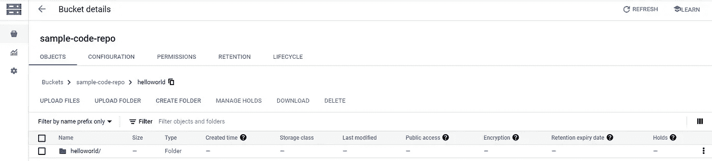
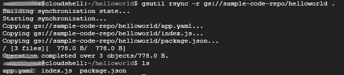
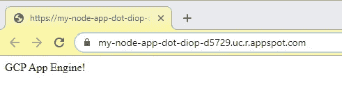

# 用 App Engine 在 10 分钟内部署一个 Node.js 应用！

> 原文：<https://towardsdatascience.com/deploy-a-node-js-application-with-app-engine-in-10-minutes-69b03e4d54f0?source=collection_archive---------10----------------------->

## 在 Google 云平台的应用程序引擎上部署简单 node.js 应用程序的演练。


埃米尔·佩龙在 [Unsplash](https://unsplash.com/s/photos/web?utm_source=unsplash&utm_medium=referral&utm_content=creditCopyText) 上的照片

谷歌云的[应用引擎](https://cloud.google.com/appengine)允许你在一个完全由谷歌管理的平台上部署可扩展的网络应用。这些应用的范围可以从后端服务和 API 层到运行在 Angular 和 React 框架上的前端应用。谷歌免费提供每天 28 小时的运行时间，这样你就可以免费托管了！

在本文中，我将带您在这个 App Engine 平台上部署一个简单的 Node.js 应用程序。

# 先决条件

要跟进，您应该具备以下条件:

1.  [对 Node.js 工作原理的基本理解](https://www.google.com/search?q=node.js+getting+started&rlz=1C1CHBF_enCA882CA882&oq=node.js+getting+started&aqs=chrome.0.69i59j0i22i30l9.3739j0j4&sourceid=chrome&ie=UTF-8)
2.  [安装在本地机器上的节点](https://nodejs.org/en/download/)
3.  一个谷歌云平台[账户](https://cloud.google.com/apigee/docs/hybrid/v1.1/precog-gcpaccount)和一个[项目](https://cloud.google.com/resource-manager/docs/creating-managing-projects)

# 让我们构建并部署我们的应用程序吧！

## 创建项目

在本地机器上初始化一个新的 Node.js 项目。

```
mkdir helloworld
cd helloworld
npm init
```

在`helloworld`文件夹中创建一个包含以下内容的简单执行文件`index.js`:

```
*const* express = require('express');
*const* app = express();app.get('/', (*req*, *res*) *=>* {
  *res*.send('GCP App Engine!');
});*const* PORT = process.env.PORT || 8080;app.listen(PORT, () *=>* {
  console.log(`Server listening on port ${PORT}...`);
});
```

我们的应用程序不会做太多事情，只是在被调用时返回一个`'GCP App Engine!'`字符串。

将以下启动脚本和 express 依赖关系添加到创建的`package.json`文件中:

```
{
 ...
 *"scripts"*: {
   *"start"*: "node index.js"
 },
 *"dependencies"*: {
   *"express"*: "^4.16.3"
 }
}
```

Express 不是必需的，我使用它来简化部署。应用程序引擎将使用启动脚本来启动您的应用程序。请注意，`index.js`与我上面创建的主执行文件的名称相匹配。

安装依赖项(快速)并确保您的应用在本地运行:

```
npm install
node index.js
```

导航到 [http://localhost:8080](http://localhost:8080/) ，您应该会看到:


作者图表

应用程序已经准备就绪，但我们需要向应用程序引擎提供一些信息，以便它知道如何部署我们的代码。我们使用一个 [YAML](https://en.wikipedia.org/wiki/YAML#:~:text=YAML%20%28a%20recursive%20acronym%20for,is%20being%20stored%20or%20transmitted.) 文件来完成这项工作。这个文件中的配置会变得非常复杂，有很多选项需要配置，但是在我们的例子中，我会保持简单。在`helloworld`文件夹中创建一个名为`app.yaml`的文件，并添加以下内容:

```
runtime: nodejs14
env: standard
instance_class: F1
automatic_scaling:
  min_idle_instances: automatic
  max_idle_instances: automatic
  min_pending_latency: automatic
  max_pending_latency: automatic
```

我的 Node.js 运行时版本是 14.16.0，如果您的版本不同，请随意更改运行时。我们将使用一个[标准环境和一个 F1 实例](https://cloud.google.com/appengine/docs/standard#instance_classes)，因为这些都包含在 GCP 的[免费配额](https://cloud.google.com/free)中。

在这一点上，你应该有下面的文件结构，我们准备开始迁移我们的代码到 GCP。

```
├── helloworld
│ ├── index.js
│ ├── package.json
│ ├── app.yaml
```

## 迁移您的代码

在部署应用程序之前，您需要将代码提供给 GCP。您可以通过在本地机器上利用 [Cloud SDK](https://cloud.google.com/sdk) 或使用 [Cloud Shell](https://cloud.google.com/shell) 来实现这一点，正如我将在本演练中所做的那样。

在将代码推送到应用引擎之前，我将使用一个[云存储](https://cloud.google.com/storage)桶来存放我的代码。[创建一个新的存储桶来存放您的源代码](https://console.cloud.google.com/storage/create-bucket)(如果需要，您可以重用现有的存储桶)。对于区域，您应该设置 Regional，其他设置可以保留默认值。在我的例子中，我正在创建一个名为`sample-code-repo`的桶，并将整个 helloworld 文件夹上传到根目录。



作者图表

接下来，我们需要将代码上传到[云壳虚拟机](https://cloud.google.com/shell)，你可以通过从任何 GCP 控制台页面打开云壳终端或点击[此处](https://shell.cloud.google.com/)来完成。


作者图表

要在云 Shell 虚拟机上创建所需的文件夹结构，并同步 bucket 中的代码，请运行以下命令，将`sample-code-repo/helloworld`替换为`<source-code-bucket-name>/<app-folder-name>`:

```
mkdir helloworld
cd helloworld
gsutil rsync -r gs://sample-code-repo/helloworld .
```

您将被要求授权存储桶访问(弹出窗口),一旦完成，运行`ls`命令将确认数据复制:



作者图表

如果您有其他将代码迁移到云 Shell 的首选方法(例如 git)，请随意使用。至此，我们的项目已经可以部署了。

## 部署应用程序

要在 App Engine 上部署应用程序，我们需要返回到我们的[云外壳虚拟机](https://cloud.google.com/shell)并运行以下程序:

```
cd helloworld
gcloud app deploy
```

对于您的第一个应用引擎部署，您将需要指定一个区域——我使用了`us-central`作为我的区域。代码将需要一分钟的时间来编译，一旦完成运行`gcloud app browse`将输出一个链接，您可以使用它来访问您现在部署的应用程序！



作者图表

# 结论

谷歌的应用引擎是一个免费快速在线部署应用程序的伟大平台。在本文中，我向您介绍了如何将这个平台用于 Node.js 应用程序，但是使用 Java、Python、PHP 和 Go 也可以获得相同的结果。我希望你能从这篇文章中学到一些东西。

**祝好运，编码快乐！**

*原载于 2021 年 4 月 11 日 https://theappliedarchitect.com*[](https://theappliedarchitect.com/deploy-a-node-js-application-with-app-engine-in-10-minutes/)**。**