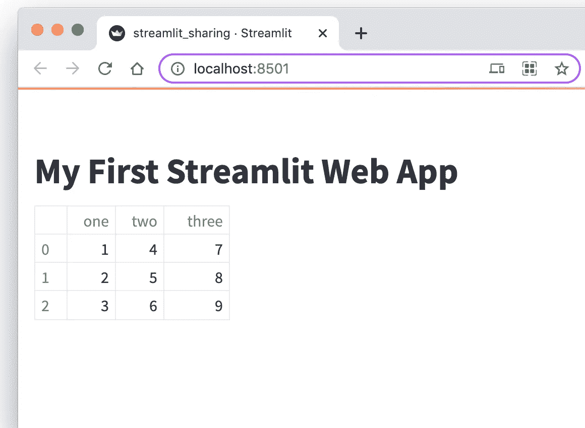
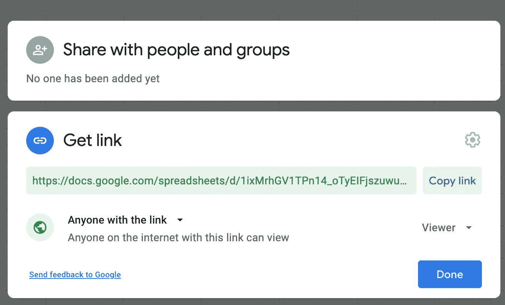
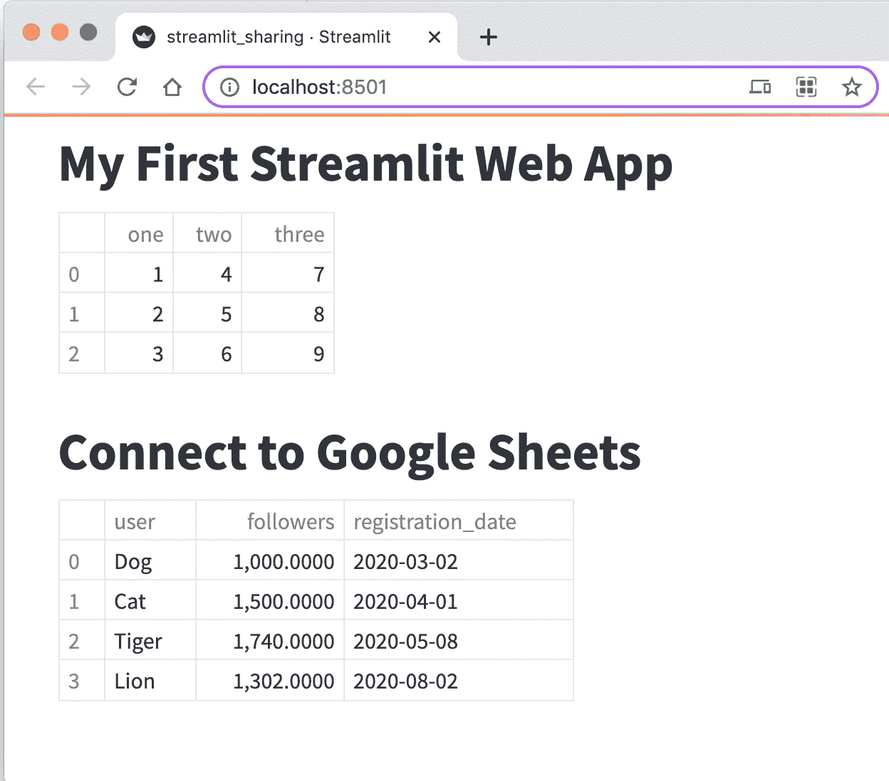
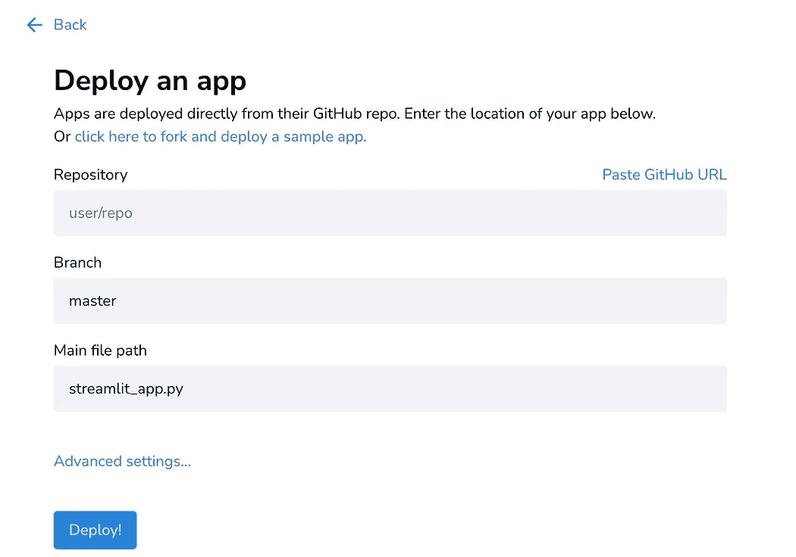
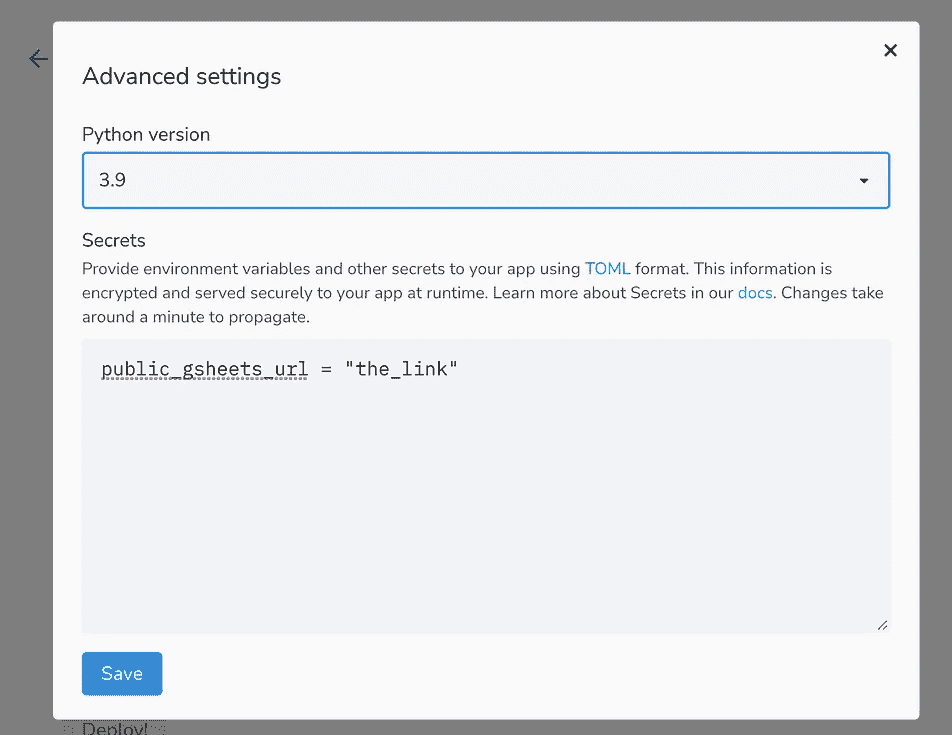
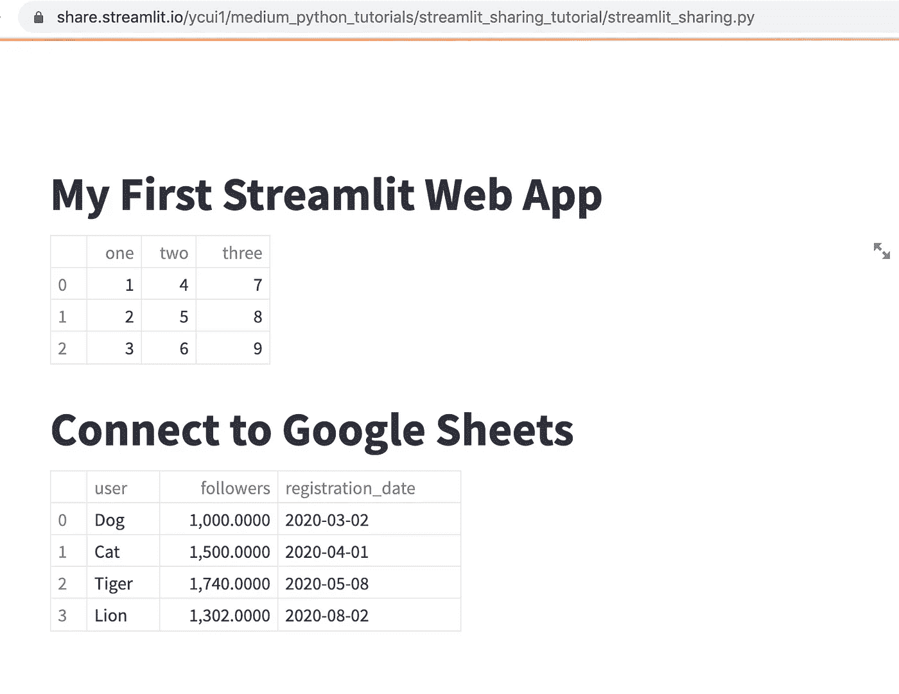

# 免费部署一个公共的 Streamlit Web 应用程序—方法如下

> 原文：<https://towardsdatascience.com/deploy-a-public-streamlit-web-app-for-free-heres-how-bf56d46b2abe?source=collection_archive---------2----------------------->

## Google Sheets 作为其后端，由 Streamlit Sharing 托管


[泰蒂亚娜·西罗娃](https://unsplash.com/@smiletania?utm_source=medium&utm_medium=referral)在 [Unsplash](https://unsplash.com?utm_source=medium&utm_medium=referral) 上的照片

随着 Python 越来越受欢迎，成为许多数据科学家的首选，传播他们的发现已经成为一种迫切的需要。Web 应用程序代表了一种跨平台的解决方案，它提供了足够的交互性。然而，传统的开发需要 Python 用户充分熟悉相对复杂的 web 框架，如 Flask 和 Django。尽管对于任何有经验的 Python 用户来说，学习这些框架并不是最难的事情，但对于数据科学家来说，展示他们的数据科学项目可能有点过头了。

幸运的是，我们数据科学家现在有了一个更好的选择——Streamlit 框架。它只需在几分钟内将简单的 Python 脚本转换成实用的、交互式的、可共享的 web 应用程序。因为它是为展示数据科学产品而设计的，所以它本身支持主要数据科学库的数据模型和图形，如 pandas 和 matplotlib。因此，如果您已经非常了解 Python，那么它不需要什么学习曲线。如果您还没有尝试过，这里有一些我以前发表的文章，可以帮助您开始使用 streamlit。

[](/build-your-first-interactive-data-science-web-app-with-streamlit-d4892cbe4792) [## 使用 Streamlit 构建您的首个交互式数据科学 Web 应用

### 突出一些最常见的特征

towardsdatascience.com](/build-your-first-interactive-data-science-web-app-with-streamlit-d4892cbe4792) [](/8-simple-and-useful-streamlit-tricks-you-should-know-ad16c6691b84) [## 你应该知道的 8 个简单有用的 Streamlit 技巧

### 编写更好的简化应用

towardsdatascience.com](/8-simple-and-useful-streamlit-tricks-you-should-know-ad16c6691b84) 

在本文中，我想进一步向大家展示如何发布 web 应用程序，以便其他人可以公开访问您的数据科学项目。更重要的是，我将向您展示如何将 Google Sheets 集成为我们项目的免费数据库主机。请注意，Google Sheets 不是一个行业级的数据库，但它足以容纳一个小型数据集。更重要的是，它是免费的。

事不宜迟，让我们开始吧。

# 第一步。在本地构建 Web 应用程序

首先，我想确保你已经在电脑上安装了 streamlit，并且能够在本地启动 web 应用程序。

## 1.1.安装 Streamlit

您可以使用 pip 工具安装 streamlit 框架:`pip install streamlit`。

只需查看版本:`streamlit --version`即可检查是否安装。这个命令应该告诉您所安装的 streamlit 包的版本。在我写这篇教程的时候，显示的版本信息是`Streamlit, version 0.89.0`。

## 1.2.创建应用程序的脚本

创建一个 Python 脚本文件，我们姑且称之为`streamlit_sharing.py`。因为本教程的目标是向您展示如何发布 web 应用程序，所以我们将尽量减少应用程序中的内容。假设该脚本包含以下代码行。

简化共享—基本设置

## 1.3.在本地启动应用程序

要在本地启动应用程序，在终端中，您可以运行以下命令:`streamlit run streamlit_sharing.py`。请确保您需要导航到保存 Python 脚本的目录。否则，您必须指定文件的完整路径。



本地 Streamlit Web 应用程序

上面的屏幕截图显示了在本地主机上运行的 web 应用程序。太好了！您已经启动了您的第一个 Streamlit web 应用程序。

## 第二步。连接到 Google 工作表

我们应该理解，Streamlit 支持到许多不同类型的数据库的连接，但是在线数据库主机通常不是免费的。为了向您提供概念证明，我们将使用一个公开的 Google 工作表作为我们 web 应用程序的数据源。假设我们的工作表有以下数据。

## 2.1.创建一个 Google 表单

谷歌表单中的数据

## 2.2.分享工作表

创建 Google 工作表后，请打开公开共享，以便我们的 web 应用程序可以直接访问它。



启用公共共享

**重要提示:**为了保持应用程序的简单，我们将只考虑使用公共谷歌表单的设置。如果你想使用一个私人的谷歌表单，它需要启用谷歌 API，感兴趣的读者可以参考 [Streamlit 的网站](https://docs.streamlit.io/en/latest/tutorial/private_gsheet.html)获取更多说明。

## 2.3.使用 gsheetsdb 连接板材

为了以编程方式访问 Google sheet，我们需要通过运行`pip install gsheetsdb`来安装包`[gsheetsdb](https://github.com/betodealmeida/gsheets-db-api)`。安装完成后，我们可以将脚本更新到以下版本:

整合谷歌表单

上述代码涉及以下更改:

*   我们使用`gsheetsdb`来连接到谷歌表单。
*   为了使用该表，我们使用类似 SQL 的语法来检索数据。值得注意的是，我们需要指定工作表的 URL，而不是指定工作表的名称。不要忘记工作表 URL 的双引号。
*   我们从检索到的行中创建一个`DataFrame`对象。

有了所有这些变化，我们的 web 应用程序现在看起来如下。如您所见，我们确实能够从创建的 Google sheet 中检索数据。



更新的 Web 应用程序

# 第三步。公开部署应用程序

## 3.1.创建 Streamlit 共享帐户

有不同的选项来托管一个 Streamlit 应用程序，比如 Heroku(你可以在一篇[中型文章](/a-quick-tutorial-on-how-to-deploy-your-streamlit-app-to-heroku-874e1250dadd)中找到教程)。在这里，我想向您展示如何使用 Streamlit Share——Streamlit 提供的免费 Streamlit web 应用程序共享服务。你可以在它的官方[博客](https://blog.streamlit.io/introducing-streamlit-sharing/)找到更多信息。以下是一般步骤。

1.  由于 Streamlit 团队仍在开发该平台，您需要请求邀请才能在 Streamlit Share 上部署该应用程序。您可以在这里提交请求:【https://streamlit.io/cloud 
2.  一旦你提交了你的请求，他们很快就会批准你的请求。就我而言，不到一天就收到了邀请。
3.  您现在可以使用您的 GitHub 身份验证登录 Streamlit 共享([https://share.streamlit.io/](https://share.streamlit.io/))。

## 3.2.更新您的脚本文件

接下来你会看到，我们将在一个公共的 GitHub 存储库中共享我们的应用，因此我们不想暴露 Google sheet 的 URL，这可能是一个潜在的安全问题。当然，使用私有的谷歌表单或其他数据库进行认证更加安全。

您可以将 URL 存储在共享应用程序的设置中，而不是直接在脚本中指定 URL，这样您就可以使用设置的名称进行访问。

```
# Original
gsheet_url = "the_link"# Updated, when the URL is saved in the settings
gsheet_url = st.secrets["public_gsheets_url"]
```

## 3.3.创建一个公共 GitHub 库

一旦你更新了你的脚本，就终于到了公开你的应用程序的时候了(在某种程度上)。您要做的是创建一个公共的 GitHub 存储库。在这里，我不打算详述您如何做到这一点。我使用 PyCharm，我只需要使用内置的 Git 工具就可以轻松地创建一个存储库。

## 3.4.分享 Web 应用程序！

转到 Streamlit Share 网站，你可以通过点击“新建应用”来创建一个新的 web 应用，它会弹出如下图所示的窗口(左图)。



如果你已经链接了你的 GitHub 账户，Streamlit 足够智能，可以拉出存储库列表，你可以简单地选择一个并指定文件路径。

重要的是，您单击“高级设置”并在那里指定链接，因为如前所述，这是我们的 streamlit 脚本文件访问机密信息的方式。需要时，您需要为您的项目选择合适的 Python 版本，因为默认情况下，它被设置为 3.7。

之后，单击“部署！”按钮，等待几分钟，您应该能够看到您的应用程序启动并运行！



公共 Web 应用程序

因为它是由 Streamlit Share 作为公共网站托管的，所以你可以将链接分享给你的队友或客户，他们可以从他们想要的任何地方访问它。

# 最后的话

Streamlit 使数据科学家开发 web 应用程序变得容易，因为它负责 web 元素的布局，而我们数据科学家只负责我们应用程序的核心部分——数据。

如果您从未尝试过 Streamlit，我强烈建议您尝试一下，我敢打赌您会爱上它。

感谢阅读这篇文章。通过[注册我的简讯](https://medium.com/subscribe/@yong.cui01)保持联系。还不是中等会员？[用我的会员链接](https://medium.com/@yong.cui01/membership)支持我的写作。