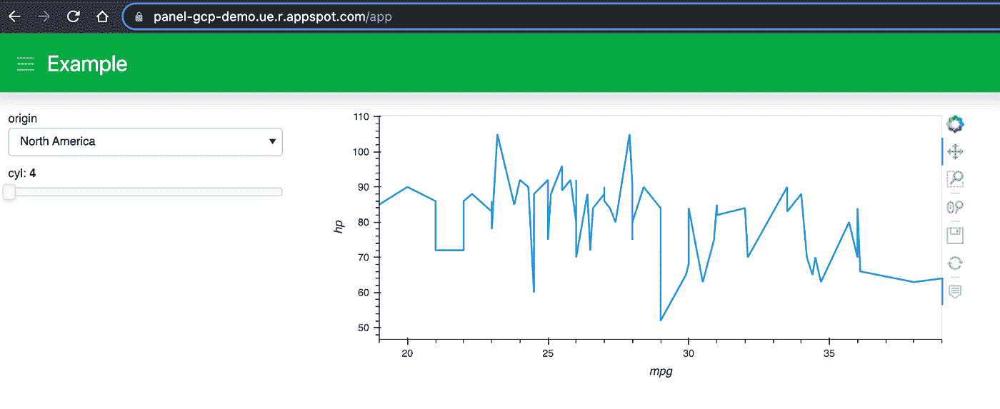
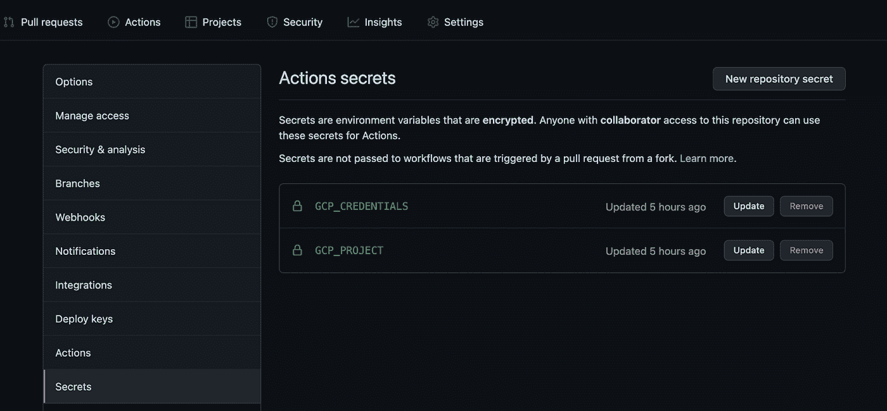
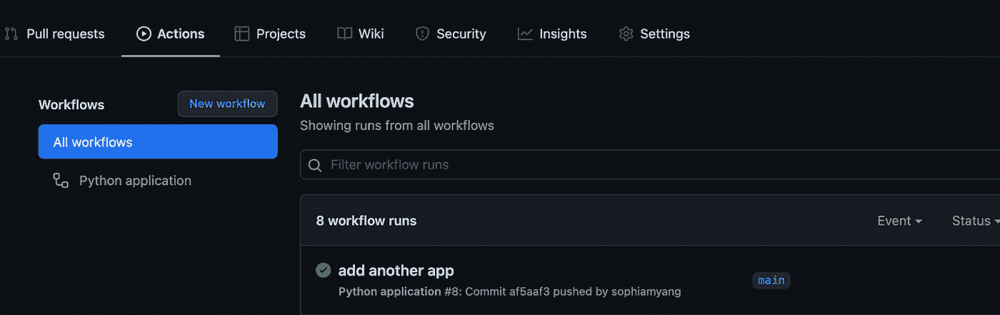
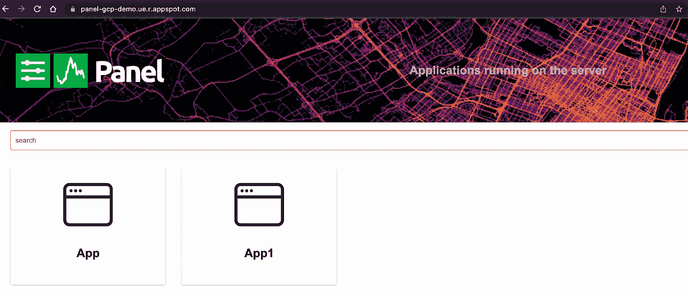

# 将 Python 可视化面板应用程序部署到谷歌云应用程序引擎

> 原文：<https://towardsdatascience.com/deploy-a-python-visualization-panel-app-to-google-cloud-cafe558fe787?source=collection_archive---------6----------------------->

## 谷歌云应用引擎和 Github 操作


由[pix poeties](https://unsplash.com/@blackpoetry?utm_source=unsplash&utm_medium=referral&utm_content=creditCopyText)在 [Unsplash](https://unsplash.com/?utm_source=unsplash&utm_medium=referral&utm_content=creditCopyText) 拍摄的照片

相关文章: [Python 可视化面板 App to Google Cloud Run:Google Cloud Run、Google Cloud Build、Terraform](https://sophiamyang.medium.com/deploy-a-python-visualization-panel-app-to-google-cloud-ii-416e487b44eb?sk=aac35055957ba95641a6947bbb436410)

在不了解 Docker 或 Kubernetes 以及不使用 Docker 文件的情况下，有可能将 Python 应用程序或仪表板部署到云上吗？是的，这是可能的，而且使用谷歌云应用引擎非常简单！本文将向您展示如何使用三个简短的脚本将 Panel 应用程序部署到 Google Cloud，并展示如何使用 Github 操作自动化您的工作流程。

这是我的非常简单的示例应用程序的样子。这里托管(我会保持 3 个月的直播)。关于面板应用的更多例子和灵感，请查看[awesome-panel.org](http://awesome-panel.org)、[panel.holoviz.org](https://panel.holoviz.org/)，以及我之前关于 [HoloViz 工具](/visualization-and-interactive-dashboard-in-python-c2f2a88b2ba3?sk=c78ed971426bbccb89798759779aa303)的博文。



这篇文章中提到的所有代码都可以在这个回购:[https://github.com/sophiamyang/panel_gcp](https://github.com/sophiamyang/panel_gcp)。

# **1。设置**

## **设置您的 Google Cloud 帐户以启用应用程序引擎:**

应用引擎文档([https://cloud . Google . com/App Engine/docs/standard/python 3/quick start](https://cloud.google.com/appengine/docs/standard/python3/quickstart))描述了运行项目所需的四个步骤:

*   [选择或创建一个 Google Cloud 项目](https://console.cloud.google.com/projectselector2/home/dashboard)(我们假设项目名称和 ID 都是“您的项目”)
*   [启用应用引擎 API](https://console.cloud.google.com/apis/library/appengine.googleapis.com)
*   [启用云构建 API](https://console.cloud.google.com/flows/enableapi?apiid=cloudbuild.googleapis.com)
*   [启用计费](https://console.cloud.google.com/billing/projects)

## 在本地机器上安装并初始化 Google Cloud SDK:

*   [安装 Google Cloud SDK](https://cloud.google.com/sdk/docs/install) :操作系统不同，说明也会有所不同，或者您可以简单地

```
conda install -c conda-forge google-cloud-sdk
```

*   初始化 gcloud: `gcloud init`
*   将项目设置为“您的项目”(或您用于您的项目的任何名称/ID):

`gcloud config set project your-project`

# 2.**创建面板应用**

创建一个新目录，或者在这个目录中创建以下三个文件，或者从我的 repo 中获取:[https://github.com/sophiamyang/panel_gcp](https://github.com/sophiamyang/panel_gcp)

## **app.py**

这是创建 Panel 应用程序的 Python 文件。要在本地运行这个应用程序，你可以简单地做`conda install panel hvplot`并运行`panel serve app.py`

## **requirements.txt**

该文件列出了我们的 Panel 应用程序的所有包依赖项。

## **app.yml**

这是应用程序引擎配置文件。面板应用是散景应用的一种，散景应用需要指定`env:flex`和`entrypoint: panel serve app.py --adddress 0.0.0.0 --port 8080 --allow-websocket-origin="*"`，因为应用引擎灵活环境支持 WebSockets。其他类型的应用可能不需要 flex 环境和入口点。

# **3。将 Panel 应用部署到谷歌云应用引擎**

*   初始化您的应用引擎应用:`gcloud app create`
*   部署您的应用:`gcloud app deploy`

在 gcloud 努力设置好你的项目几分钟后，你应该可以在`your-project.ue.r.appspot.com`上看到你的仪表盘直播了。

就是这样！现在，你可以与任何想使用你的应用的人共享该网址。
如果您的部署有任何问题，检查日志和调试可能会有所帮助:[https://console.cloud.google.com/debug](https://console.cloud.google.com/debug?project=panel-gcp)

查看整体信息:[https://console.cloud.google.com/appengine](https://console.cloud.google.com/appengine/)

查看版本:[https://console.cloud.google.com/appengine/versions](https://console.cloud.google.com/appengine/versions)

# 4.**为自动化设置 Github 动作**

在实践中，当您开发和改进 Panel 应用程序时，您通常会希望随着时间的推移重新部署它的不同版本，同时保留文件的每个版本的记录。为了简化这个过程，您可能会发现 Github 动作非常有用。有了 Github Actions，我们可以建立一个工作流，每当我们推送变更、标记发布或获得 PR 时，一些构建、测试或部署流程就会运行。

*   首先，我们需要按照这些[文档](https://cloud.google.com/iam/docs/creating-managing-service-accounts)到[中的步骤创建一个服务帐户](https://console.cloud.google.com/projectselector/iam-admin/serviceaccounts/create)，向您的服务帐户添加一个[密钥](https://cloud.google.com/iam/docs/creating-managing-service-account-keys)，并将密钥下载到一个 JSON 文件中。
*   [启用应用引擎管理 API](https://console.developers.google.com/apis/api/appengine.googleapis.com/overview)
*   现在，如果您还没有这样做，创建一个新的 Github repo，并将第 3 节中的所有三个文件添加到这个 repo 中，并将其推送到 Github。
*   进入你的 Github repo-Settings-Secrets，添加两个秘密

GCP 凭据:从您刚刚下载的 JSON 文件中复制并粘贴密钥

GCP 项目:你的项目的名字，在上面的例子中是“你的项目”。



*   增加一个[。您目录中的 github](https://github.com/sophiamyang/panel_gcp/tree/main/.github) / [工作流](https://github.com/sophiamyang/panel_gcp/tree/main/.github/workflows) /python-app.yml 文件

这是一个 Github 操作配置文件。在这个例子中，每当有主分支的推送时，我们将应用部署到 Google Cloud 应用引擎。

现在您的 Github 操作应该已经准备好了。您可以在“操作”选项卡上查看跑步信息。在这里，我尝试添加另一个应用程序，工作流程自动开始运行。



现在，您可以看到我们有两个应用程序正在运行



总的来说，本文使用三个简单的脚本将可视化面板应用程序部署到 Google Cloud App Engine，并使用另一个配置文件来设置 Github 操作。你可能会想，为什么我不用 Google Cloud Run 或者 AWS？我写了另一篇关于 Google Cloud Run 的文章。来看看: [Python 可视化面板应用到 Google Cloud Run: Google Cloud Run，Google Cloud Build，和 Terraform](https://sophiamyang.medium.com/deploy-a-python-visualization-panel-app-to-google-cloud-ii-416e487b44eb?sk=aac35055957ba95641a6947bbb436410) 。就 AWS 而言，我在 Anaconda 的朋友们正在研究一些非常酷的东西，以帮助简化 AWS 的部署过程，预计将在 2022 年的某个时候推出。敬请期待！

对于那些对视频教程感兴趣的人，这里是本文的视频版本:

**参考文献**:

*   [https://cloud . Google . com/app engine/docs/standard/python 3/runtime # application _ startup](https://cloud.google.com/appengine/docs/standard/python3/runtime#application_startup)
*   [https://cloud . Google . com/app engine/docs/flexible/python/quick start](https://cloud.google.com/appengine/docs/flexible/python/quickstart)

**鸣谢**:感谢 Jim Bednar 和 Philipp Rudiger 的支持和指导。

作者索菲亚·杨 2021 年 12 月 18 日