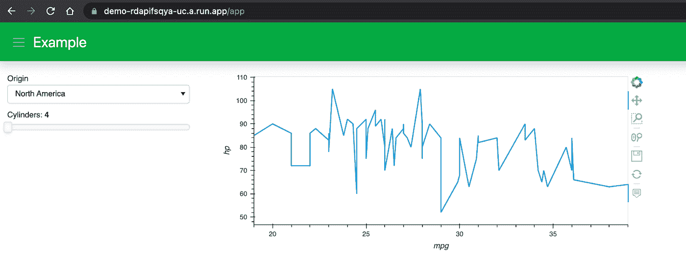

# 将 Python 可视化面板应用程序部署到 Google Cloud Run

> 原文：<https://towardsdatascience.com/deploy-a-python-visualization-panel-app-to-google-cloud-ii-416e487b44eb?source=collection_archive---------7----------------------->

## Google 云运行、Google 云构建和 Terraform


小塔德乌在 [Unsplash](https://unsplash.com/?utm_source=unsplash&utm_medium=referral&utm_content=creditCopyText) 上的照片

相关文章:[部署一个 Python 可视化面板 App 到 Google Cloud App Engine:Google Cloud App Engine 和 Github Actions](/deploy-a-python-visualization-panel-app-to-google-cloud-cafe558fe787?sk=98a75bd79e98cba241cc6711e6fc5be5) 。

在我上一篇[博客文章](/deploy-a-python-visualization-panel-app-to-google-cloud-cafe558fe787?sk=98a75bd79e98cba241cc6711e6fc5be5)中，我写了如何将 Python 可视化面板应用部署到谷歌云应用引擎。App Engine 运行良好，但它可能很贵，因为无论是否有人使用它，应用程序都会持续运行。幸运的是，有一个更便宜的选项叫做 Cloud Run，它只在收到请求时运行。

在本文中，我将带您了解如何使用三个简单的脚本将 Python 应用程序或仪表板部署到 Google Cloud Run，以及如何通过 Cloud Build 和 Terraform 自动化您的 Google Cloud 设置。

这是我的非常简单的示例应用程序的样子。它被托管在[这里](https://demo-he54wmmt4q-uc.a.run.app)，在这篇文章发表后，它将在这里生存 3 个月。关于面板应用的更多例子和灵感，请查看[awesome-panel.org](http://awesome-panel.org/)、[panel.holoviz.org](https://panel.holoviz.org/)，以及我之前关于 [HoloViz 工具](/visualization-and-interactive-dashboard-in-python-c2f2a88b2ba3?sk=c78ed971426bbccb89798759779aa303)的博文。



# 1.设置

**设置您的 Google Cloud 帐户**:

[云运行文档](https://cloud.google.com/run/docs/quickstarts/build-and-deploy/python)描述了运行项目所需的以下步骤:

*   [选择或创建一个谷歌云项目](https://console.cloud.google.com/projectselector2/home/dashboard)(我们假设项目名称和 ID 都是“你的项目”)
*   [启用计费](https://console.cloud.google.com/billing/projects)

**在本地机器上安装并初始化 Google Cloud SDK**:

*   [安装谷歌云 SDK](https://cloud.google.com/sdk/docs/install) :操作系统不同，说明也会有所不同，或者你可以简单地

```
conda install -c conda-forge google-cloud-sdk
```

*   初始化 gcloud:

```
gcloud init
```

*   将项目设置为“您的项目”(或您用于您的项目的任何名称/ID):

```
gcloud config set project your-project
```

# 2.创建面板应用程序

创建一个新目录，或者在这个目录中创建以下三个文件，或者从我的 repo 中获取:[https://github.com/sophiamyang/panel_cloud_run](https://github.com/sophiamyang/panel_cloud_run)。

**app.py**

这是创建 Panel 应用程序的 Python 文件。要在本地运行这个应用程序，您可以简单地执行`conda install panel hvplot`并运行`panel serve app.py`。

**requirements.txt**

该文件列出了我们的 Panel 应用程序的所有包依赖项。

**Dockerfile**

Dockerfile 安装 Python 和这个项目的依赖项，然后运行命令`panel serve`来运行我们的面板应用程序。

# 3.将应用程序部署到 Google Cloud Run

部署您的应用程序(选择服务文件夹):

```
gcloud run deploy
```

在 gcloud 努力设置您的项目几分钟后，您应该能够在命令行中看到的服务 URL 上看到您的仪表板，该 URL 将类似于“service-xxx-uc.a.run.app”。

# 4.通过云构建和 Terraform 将应用程序部署到 Google Cloud Run

这一步对于我们这个简单的 app 来说是没有必要的。但是当你的应用变得复杂，并且有很多应用需要管理时，使用 Terraform 通常是一个好的做法。Terraform 是一个“作为编码软件工具的开源基础设施”。

在步骤 3 中，当我们通过`gcloud run deploy`部署应用程序时，我们在命令行中做了很多决定。例如，我们设置了项目的区域，启用了一些需要的 API，并允许未经身份验证的调用来服务。Terraform 允许我们在代码中捕捉所有这些决策，这样我们就有一个地方来查看基础设施是如何设置的。

要将 Terraform 与 Google Cloud Run 结合使用，需要两个部分:

第 1 部分是使用 cloudbuild.yaml 文件构建一个容器映像来执行您的应用程序(即“构建映像”步骤)，并将您的容器映像推送到[工件注册表](https://cloud.google.com/artifact-registry/docs)(即“推映像”步骤)。

**cloudbuild.yaml**

运行以下命令:

*   你可能需要认证`gcloud auth application-default login`
*   `gcloud builds submit`

使用 Google Cloud Build 提交构建。完成这一步后，您应该会在 https://console . cloud . Google . com/gcr/images/your-project/global/docker 看到您的容器映像，因为-project 是您的项目 ID，docker 是我们在 cloudbuild.yaml 文件中定义的服务名。

第 2 部分是使用 terraform 从我们刚刚创建的容器映像创建一个 Google Run 服务。

**main.tf**

这个 terraform 配置文件为我们创建了一个“project”变量，以便在命令行上定义项目，启用云运行服务，指定云运行服务来运行我们刚刚在第 2 部分中创建的容器映像，设置服务公共，并返回一个服务 URL。

运行以下命令:

*   如果在本地运行:`conda install -c conda-forge terraform`
*   初始化地形:`terraform init`
*   创建一个执行计划，给我们一个回顾的机会:`terraform plan -var project=your-project`
*   执行地形计划:`terraform apply -var project=your-project`

几分钟后，您应该会在命令行中看到您的应用程序 URL:demo-XXX-UC . a . run . app。

然后如果您想要移除云运行服务，`terraform destroy -var project=your-project`或者删除整个项目。

此外，正如这篇 [Google Cloud 博文](https://cloud.google.com/blog/topics/developers-practitioners/predictable-serverless-deployments-terraform)中提到的，对于持续部署的开发，请查看[“使用 Terraform、Cloud Build 和 GitOps 将基础设施作为代码进行管理”](https://cloud.google.com/solutions/managing-infrastructure-as-code)。

总的来说，本文使用三个简单的脚本将一个可视化面板应用程序部署到 Google Cloud Run，并使用另外两个文件来设置 Google Cloud Build 和 Terraform。

对于那些对视频教程感兴趣的人，这里是本文的视频版本:

**参考文献**:

*   [https://cloud . Google . com/run/docs/quick starts/build-and-deploy/python](https://cloud.google.com/run/docs/quickstarts/build-and-deploy/python)
*   [https://cloud . Google . com/blog/topics/developers-从业者/可预测-无服务器-部署-地形](https://cloud.google.com/blog/topics/developers-practitioners/predictable-serverless-deployments-terraform)
*   [https://github . com/Google cloud platform/server less-expeditions/tree/main/terraform-server less](https://github.com/GoogleCloudPlatform/serverless-expeditions/tree/main/terraform-serverless)
*   [https://cloud . Google . com/solutions/managing-infra structure-as-code](https://cloud.google.com/solutions/managing-infrastructure-as-code)

**鸣谢**:感谢吉姆·贝德纳的指导和支持！

索菲娅·杨 2021 年 12 月 24 日