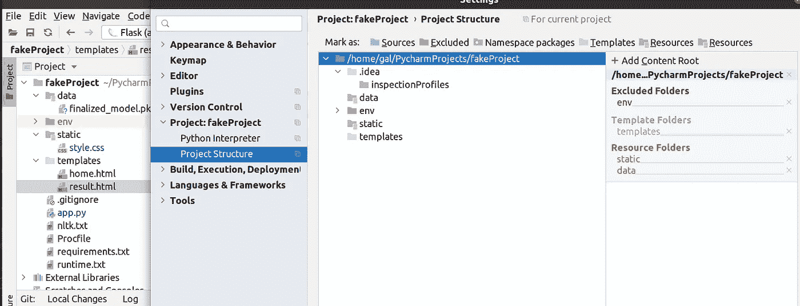
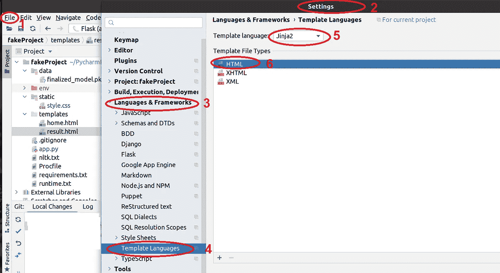

# 部署 NLP 管道。烧瓶+Heroku+Bert。

> 原文：<https://towardsdatascience.com/deploy-an-nlp-pipeline-flask-heroku-bert-f13a302efd9d?source=collection_archive---------16----------------------->

## 逐步指南

## 部署 NLP 项目的简单、快速的解决方案，以及您在部署过程中可能面临的挑战。


皮查拜在[Pexels.com](https://www.pexels.com/photo/flight-sky-earth-space-2159/)拍摄的照片

# 介绍。

通常，作为一名数据科学家，您可能会面临一项包括完整管道的任务:从数据收集到在服务器上部署应用程序。我在找工作的面试过程中撞见了这样一份奇奇怪怪的工作。重点不是开发最准确或最复杂的模型，而是展示对机器学习和 NLP 概念的良好理解。
在本文中，我将向您展示如何部署 Bert 模型和预处理管道。为了部署应用程序，我使用了 Heroku 服务器和 Flask Python 框架。

# 任务和问题描述。

这个任务的基础是一篇名为[识别假新闻和讽刺的细微差别:使用语义和语言线索](https://arxiv.org/pdf/1910.01160.pdf)的论文。本文介绍了两种将文本内容分类为“讽刺”或“假新闻”的模型——一种基于 Google 的 [BERT](https://arxiv.org/abs/1810.04805) 模型，另一种基于 [coherence metrics](https://en.wikipedia.org/wiki/Coherence_%28linguistics%29) 模型。

这项任务的目标是:

*   发展一个新的模式来分类“讽刺”或“假新闻”；
*   构建一个演示 web 应用程序来服务于模型预测；
*   将其部署到云服务 [Heroku](https://www.heroku.com/)

您可以选择任何型号，该型号将具有以下特点:

1.BERT 嵌入(向量)——使用代表每个文本的[句子转换器](https://github.com/UKPLab/sentence-transformers)库。

2.每个文本的情感和形态—使用[模式库](https://github.com/clips/pattern/wiki/pattern-en)。

这个项目的简单结构是:

```
/web-app
|
|--data/
|   |--model_for_prediction.pkl
|--static/
|   |--style.css
|--templates/
|   |--home.html
|   |--result.html
|--.gitignore
|--app.py
|--nltk.txt
|--requirements.txt
|--runtime.txt
|--Procfile
```

假设您已经有了一个带标签的数据集，每个单元格中都有一篇文章/文章段落。标签“1”代表讽刺，“0”代表假新闻。

[句子转换文档](https://www.sbert.net/examples/applications/computing-embeddings/README.html#)推荐了几个预先训练好的模型和我们可以应用它们的各种任务。即使您是第一次看到这个库，带有清晰示例的文档也会大大节省您的时间。所以让我们开始吧！

# **第 1 部分——开发新模型。**

**伯特嵌入。**我从拥抱脸/句子变形金刚库里拿了一个[小伯特](https://huggingface.co/sentence-transformers/ce-ms-marco-TinyBERT-L-4)模型。大小对我们的任务至关重要。Heroku 有时间和大小限制——应用程序的大小应该小于 500Mb，每个操作最多 30 秒；因此，我们不想让我们的 web 应用崩溃。我选择了一个 light 57.4Mb 的型号，CPU(不是 GPU)选择了 PyTorch 版本。

当我试图安装 sentence-transformers 库并部署应用程序时，我的 web 应用程序崩溃了，出现了[错误 H12](https://devcenter.heroku.com/articles/error-codes#h12-request-timeout) (请求超时)。我决定以句柄的方式实现这一部分，以降低运行时的复杂性。CPU 的 PyTorch 版本也显著减小了应用程序的大小。不用安装整个库就可以使用句子嵌入模型。这样的一招节省了我的时间，web 应用也没有再崩溃。

[用变形金刚嵌入句子](https://www.sbert.net/examples/applications/computing-embeddings/README.html#sentence-embeddings-with-transformers)

[**各文本的情绪**](https://github.com/clips/pattern/wiki/pattern-en#sentiment) **。**任何文本我们都可以大致分为两类:事实和观点。观点承载着人们对世界的情感、评价和感受。pattern.en 模块捆绑了一个形容词词库(例如，*好的*、*坏的*、*惊人的*、*气人的*等)。)经常出现在文章/评论中，注释有情绪得分`polarity`(正面-负面)和`subjectivity`(客观↔主观)。极性是`-1.0`和`+1.0`之间的一个值，主观性是`0.0`和`1.0`之间的一个值。让我们提取这些值:

基于情感极性和主观性得分的特征工程。

**各文本的** [**情态**](https://github.com/clips/pattern/wiki/pattern-en#mood--modality) **。**模式库中的`modality()`函数返回一个介于`-1.0`和`+1.0`之间的值，其中值> `+0.5`代表事实。

基于确定度的特征工程。

特征工程的最后一步——串联成一个数据集:

通用特征矩阵的创建。

**模特培训。如上所述，我们可以选择任何型号。我从 sklearn 拿了一个 [Logistic 回归](https://scikit-learn.org/stable/modules/generated/sklearn.linear_model.LogisticRegression.html)。你可以自由选择你喜欢的。首先，我们创建一个模型。然后以 pickle 格式保存到`/data`文件夹中以备后用；**

**重要通知。在这个 POC 中，我使用 Pandas Python 库只是为了方便。Pandas 并不总是运行生产代码的最佳库。它有利于分析和数据探索，但速度很慢，因为它在后台做了一堆事情。**

# **第 2 部分——为模型服务的演示 web 应用程序。**

是时候创建一个 web 应用程序了。我们放在`/templates`文件夹中的`home.html`文件。看起来是这样的:

home.html—来自/templates 文件夹的主页文件。

页面显示我在一个单独的`result.html`文件中制作的预测结果，并放入同一个`/templates`文件夹:

result.html-显示模型预测的文件(也在/templates 文件夹中)。

UI 设计简单，在`/static/style.css`:

web 应用程序的 style.css。

***重要*** :将文件夹`/data` 和`/static`标记为资源。在 PyCharm for Linux 中，可以在文件- >设置- >项目结构中完成。将`/templates`文件夹标记为模板。很高兴从 Heroku 上传中排除一些文件夹，并减少应用程序的大小(虚拟环境文件夹)。不要忘记在您的项目中添加一个`.gitignore`文件:



图 1 文件→设置→项目结构。

由于我们使用 Flask 进行部署，我们需要指定一种模板语言:



图 2 文件→设置→语言和框架→模板语言

最后，在项目的目录中，我们可以创建我们的 app.py 文件。首先，我们放入所有需要的导入和预处理管道函数。然后，我们创建一个 Flask 应用程序实例(第 50 行),并添加主页和结果页面的功能。在 predict()函数中，我们打开一个保存的 before 模型并预测输入文本。

app.py:一个文件中的所有 NLP 管道和 Flask 功能。

在 main 中运行应用程序。恭喜你！现在你可以在本地主机 [http://127.0.0.1:5000/](http://127.0.0.1:5000/) 上查看你的 app 作品。

# **第 3 部分—云服务部署。**

首先，让我们创建一个 **requirements.txt** 文件。有两种方便的方法可以做到:

1.  通过 Pycharm IDE。右键单击项目名称→新建→文件→将文件命名为 requirements.txt。当您打开一个空的刚刚创建的 requirements.txt 文件时，PyCharm IDE 会让您自动记下所有导入。很方便的方式:)
2.  通过命令行和项目目录中的`'pip freeze > requirements.txt’`。

别忘了给 CPU 换个 [PyTorch 版本](https://download.pytorch.org/whl/torch_stable.html):

```
torch @ [https://download.pytorch.org/whl/cpu/torch-1.6.0%2Bcpu-cp36-cp36m-linux_x86_64.whl](https://download.pytorch.org/whl/cpu/torch-1.6.0%2Bcpu-cp36-cp36m-linux_x86_64.whl)
```

在当前项目中，我得到了一个很长的库列表:63 个。对于第一次面对这样一个任务的人，我要注意到:`requirements.txt`中的最后一行应该是空的。

关于 Heroku 和 NLTK 库的一个 ***重要提示*** :如果你的应用程序使用 NLTK 库，你应该创建一个额外的 **nltk.txt** 文件，其中包含内部导入。在我们的例子中，pattern.text.en 使用 NLTK 和`nltk.txt`应该包含两行:

```
wordnet
pros_cons
```

我们需要指出在服务器上使用哪个 Python 版本。您可以像创建 requirements.txt 文件一样创建它:通过 IDE 或命令行。它应该包含一行:

```
python-3.6.13
```

**Procfile。这个文件告诉 Heroku 当应用程序被部署时要做什么，并且包含一行代码:**

```
web: gunicorn app:app
```

确保你有一个 [Heroku CLI](https://devcenter.heroku.com/articles/heroku-cli) (和 Git CLI)。因为现在只有命令行操作:

```
heroku login
heroku create your_application_name
```

以下步骤与 Git CLI 几乎相同:

```
git init
git add .
git commit -m 'initial commit'
git push heroku master
```

就这些了，伙计们！你在 Heroku 服务器上部署了一个 WEB 应用。访问链接看起来像[https://your _ application _ name . heroku app . com/](https://your_application_name.herokuapp.com/)

# 结论。

在本教程中，您学习了如何创建 NLP 管道，包括基于 Bert 的和附加的功能工程。您还将熟悉如何使用 Flask 创建一个演示 WEB 应用程序，以及如何在 Heroku 服务器上部署它。

# 资源。

[Github 回购](https://github.com/Galina-Blokh/flask-heroku-app)。文章中的代码。

[我的 WEB 应用 URL](https://my-app-last.herokuapp.com/) 部署在 Heroku 上。

[文章](https://medium.com/analytics-vidhya/deploying-bert-on-heroku-7df1d23f9c43)为灵感。

特别鸣谢[莫迪凯作品](https://www.linkedin.com/in/mordechai-w/)。