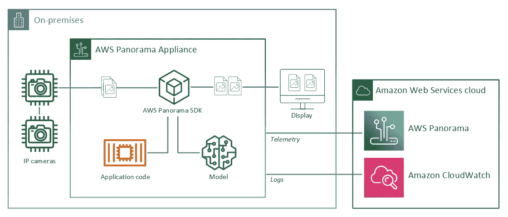
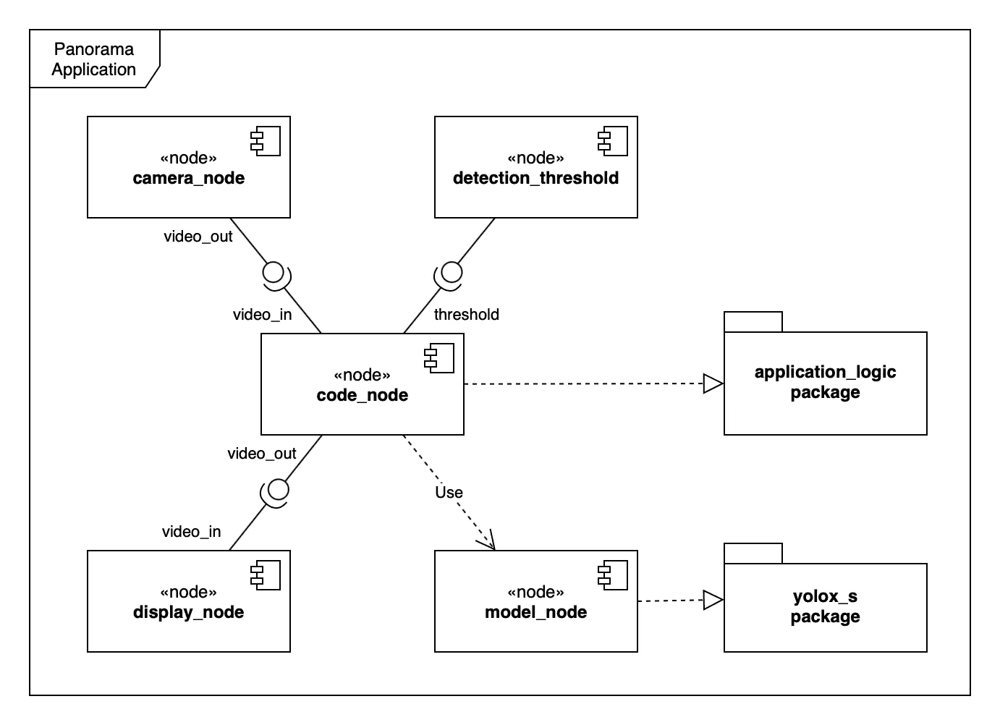

# 在 AWS Panorama 的边缘部署对象检测器模型

> 原文：<https://towardsdatascience.com/deploy-an-object-detector-model-at-the-edge-on-aws-panorama-9b80ea1dd03a?source=collection_archive---------6----------------------->

## [理解大数据](https://towardsdatascience.com/tagged/making-sense-of-big-data)，AWS PANORAMA 模型部署分步指南

## 了解如何在 AWS Panorama 上部署最先进的计算机视觉模型，这是一种功能强大的边缘设备，可实现在线和经济高效的对象检测。


由 [v2osk](https://unsplash.com/@v2osk?utm_source=medium&utm_medium=referral) 在 [Unsplash](https://unsplash.com?utm_source=medium&utm_medium=referral) 上拍摄

*本文由* [*雅诺斯·托尔斯泰*](https://medium.com/@janos.tolgyesi) *和* [*卢卡·比安奇*](https://medium.com/@aletheia) *共同撰写。*

近年来，计算机视觉已经成为深度学习最令人兴奋的应用领域之一:经过训练的卷积神经网络(CNN)模型可以达到类似人类的精度水平，在图像或视频流中检测对象。这些令人难以置信的进步开辟了广泛的应用领域，从零售客户行为分析到安全和工业质量保证。

在这个场景中，出现了几个不同的深度学习模型来解决计算机视觉的一个常见用例:对象检测。这本身就是一个理想的结果，也是诸如目标跟踪、姿态估计和环境监控等广泛应用的普遍基础。

此外，当摄像机产生输入图像时，现代计算机视觉能力提高了应用于安全和监控的对象检测深度学习模型的可实现性。然而，由于实时应用的短响应时间要求，这样的场景是非常具有挑战性的。警报应该在检测到危险的几秒钟内发出；否则就没用，甚至有害。

延迟在定义对可用计算类型的限制方面起着重要作用。由于有限的带宽和不可靠的网络，将大量视频流传输到云，通过在云实例上运行的快速准确的深度学习模型来处理视频通常不可行或成本过高。视频分析经常需要高配置计算能力，这种需求削弱了按需或类似无服务器的自动扩展基础设施的优势。此外，带宽从来都不划算，这使得这种解决方案在大多数使用情况下都是负担不起的。

边缘计算成为实现更好延迟和降低总系统成本的理想解决方案，打开了一个全新的市场。不幸的是，对于大多数数据科学家来说，用 GPU 构建可靠且不昂贵的硬件来运行计算机视觉模型并不是一件容易的事情。考虑到一些用例管理的视频流可能包含人们视频镜头的敏感信息，安全要求使得这项任务更加困难。

# 进入 AWS 全景

在亚马逊 re:Invent 的 2020 虚拟版中，亚马逊网络服务的前首席执行官 Andy Jassy [展示了一款名为 AWS Panorama 的新设备](https://aws.amazon.com/about-aws/whats-new/2020/12/introducing-aws-panorama-for-computer-vision-at-the-edge/)，完全是为边缘计算而设计的。Nvidia Jetson Xavier 图形处理单元采用紧凑设计和 IP5 外壳的小型封装，可以分析多达 16 个并发视频流。该设备的外观和设置在 AWS 机器学习英雄迈克·钱伯斯的[惊人视频](https://www.youtube.com/watch?v=xRxAWClUTZc)中有更详细的介绍。

简单的初始配置和配置体验使 Panorama 适合非技术用户安装。

# 发展理念

在引擎盖下，AWS Panorama 不仅部署了深度学习模型，还要求开发人员定义一个 *Panorama 应用*。一个 *Panorama 应用*是打包的深度学习模型、业务逻辑代码和清单结构(应用图)的集合，清单结构定义了这些组件之间的数据管道。

应用程序组件被称为*节点*。设备上的每个资源都由一个*节点*表示:深度学习模型、业务逻辑代码、摄像头流，甚至显示输出和参数。每个*节点*有一个或多个*接口*，定义其*输入*和*输出*。在部署之前，模型和代码类型的节点资源被归档到二进制*资产*中。*资产*连同*清单文件* ( `package.json`)被称为*包*。包的*清单文件*包含了关于其*资产*的所有信息，并定义了在*应用程序图*中使用的*接口*。可以在*包描述符*中提供额外的特定于节点的细节，例如，深度学习模型的输入张量的维度或应用可执行入口点。*包*被上传到由 AWS Panorama 服务管理的 S3 接入点，并向该服务注册。

当开发人员使用 AWS Panorama 服务部署应用程序时，应提供一个*应用程序清单*文件(`graph.json`)，将应用程序定义为由节点和边构建的图形。在部署时，Panorama 服务在*清单文件*中找到按名称引用的已注册*包*，并将它们下载到 Panorama 设备。

总而言之:

*   一个*全景应用*是连接的*节点*的集合。连接由*应用清单*(或*应用图*)描述。
*   *节点*可以有以下*类型*:深度学习模型、应用源代码、摄像头输入、显示输出、部署时参数。
*   *节点*也定义了它们的*接口*。一个*接口*是*输入*和*输出端口*的列表。*端口*是命名和键入的数据字段。支持数字、布尔、字符串和“媒体”类型。
*   应用代码和 ML 模型被归档到*资产*中。*资产、*及其清单文件被称为*包*。Panorama 服务会上传和注册包。
*   在部署时，用户应该指定*应用程序图*。Panorama 服务在图中查找与单个*节点*相关联的*包*，并将所需的包下载到设备。

有关更多信息，请参考 [AWS Panorama 开发人员指南](https://docs.aws.amazon.com/panorama/latest/dev/)。

# 为目标检测选择最先进的计算机视觉模型

你只看一次(YOLO)用于实时物体检测的深度学习模型在 CVPR 2016 上[亮相。从那时起，它就成了这类任务的标准基准。它提供了实时推理性能、通用对象表示理解(提高了以前从未见过的图像的准确性)以及沿模型大小/准确性轴的缩放。与早期基于区域的卷积神经网络(R-CNN)相比，YOLO 模型只需一步就能处理图像。在接下来的几年中，这些模型有了显著的改进，引入了广泛的增强功能，从 YoloV2、YoloV3、YoloV4 到 YoloV5。](https://arxiv.org/pdf/1506.02640v5.pdf)

YOLO 模型可以检测对象并识别它们在图像中的位置，绘制包围它们的边界框。在早期的实现中，模型使用一系列预定义的边界框，称为锚点，并预测它们在图像中的偏移。这种方法需要指定在给定图像区域内要检测的锚的数量，这在一些使用情况下是有限制的。

2021 年，随着 [YOLOX](https://arxiv.org/abs/2107.08430) 的崛起，该模型得到了进一步改进，采用了无锚方法。YOLOX 在 PyTorch 中实现，COCO 数据集上的预训练模型在 GitHub 上发布[。](https://github.com/Megvii-BaseDetection/YOLOX) [COCO 数据集](https://cocodataset.org/)包含 [80 个不同的对象类别](https://tech.amikelive.com/node-718/what-object-categories-labels-are-in-coco-dataset/)，包括人、车辆、一些动物、运动设备和日常物品，因此预先训练的模型已经准备好检测这些开箱即用的对象。

# 创建 Panorama 应用程序

## 先决条件

要遵循此分步指南，需要一个 AWS 帐户和一个 AWS Panorama 设备。应将 Panorama 设备调配到帐户中(请参考上面 Mike 的教程了解这些步骤)。

测试解决方案还需要 RTSP 流，Panorama 设备应该能够从其连接的网络访问它。该流可以由大多数 IP 摄像机或运行 RTSP 服务器的计算机提供。

部署步骤将使用 AWS 命令行界面(CLI)和 Panorama (CLI)执行，从 [AWS Panorama 开发人员指南](https://docs.aws.amazon.com/panorama/latest/dev/gettingstarted-deploy.html)中提供的示例应用程序开始。确保工作站上安装并配置了 AWS CLI、Panorama CLI 和 Docker。



全景示例应用程序。图来自 [AWS 全景开发者指南](https://github.com/awsdocs/aws-panorama-developer-guide/blob/main/docs-source/gettingstarted-sample.md) (CC BY-SA 4.0)。

本教程还附带了一个 [GitHub 库](https://github.com/mrtj/yolox-panorama-tutorial)，在这里你可以一个提交一个提交地跟踪项目的进展，如果你遇到困难，可以把它作为参考。我们将在每个步骤后提供一个带有书签图标的相关提交的链接:🔖。

## Panorama 应用程序的包

首先，使用 AWS Panorama CLI 的`init-project`命令初始化一个项目:

```
$ panorama-cli init-project --name yolox-panorama
```

该命令将生成一个空的项目模板。它只是一个脚手架，上面有名为`assets`和`packages`的空文件夹，以及`graphs/yolox-panorama/graph.json`中的一个 JSON 文件。 [GitHub 检查点:🔖](https://github.com/mrtj/yolox-panorama-tutorial/commit/88ba525)

要部署 Panorama 应用程序，必须至少定义以下节点:

*   摄像机输入，
*   模型(将包裹 YOLOX)，
*   应用程序代码(业务逻辑)，以及
*   显示输出(HDMI，用于调试)。

AWS Panorama 定义了一个特殊的概念，即“抽象节点”，因为在应用程序开发期间，确切的 RTSP URI 是未知的，因为它取决于源摄像机流。

这种抽象允许相同的应用程序被发布到不同的设备，处理不同的流(使用不同的 RTSP URIs)。Panorama SDK 提供了一个“抽象摄像机”，这是一个摄像机的占位符节点，其连接 URI 将在部署时定义。

抽象摄像机节点是使用

```
add-panorama-package --type camera
```

Panorama CLI 的命令。为相机定义抽象节点不是强制性的:可以使用命令添加特定的 RTPS 相机流

```
create-package --type camera
```

然后在生成的文件`packages/${AWS_ACCOUNT_ID}-[camera_name]-1.0/package.json`的“接口”字段中提供摄像机 RTSP·URI、用户名和密码。

AWS Panorama 还提供了另一种类型的抽象节点来映射 HDMI 显示输出。使用该媒体接收器，可以在连接到 Panorama 设备的 HDMI 监视器上显示带注释的视频。需要考虑的一点是，该显示用于调试目的，一次只有一个应用程序可以使用它，即使用这种资源部署的第一个应用程序。

将到目前为止的所有命令包装在一起，通过以下方式实现配置:

向 Panorama 应用程序添加包。 [GitHub 检查点🔖](https://github.com/mrtj/yolox-panorama-tutorial/commit/415ebae)

## 关于 AWS 帐户 id 的说明

每个 Panorama 项目都在许多项目工件中使用所有者的 AWS 帐户 ID。它用于文件夹名称以及多个 JSON 配置文件中。帐户 ID 通常被认为是一条不希望公开的敏感信息。在本教程中，在命令行示例中，帐户 ID 被替换为`${AWS_ACCOUNT_ID}`。这个表达式引用了一个变量，这个变量可以用真正的 AWS 帐户 ID 初始化，这样 shell 就会自动替换它。在 JSON 代码片段中，我们将使用虚拟帐户 ID `123456789012`,应该总是用实际的 AWS 帐户 ID 手动替换。

## 定义应用程序的节点

AWS Panorama CLI 不会在*应用程序图*中为业务逻辑和深度学习模型创建节点，因此开发人员必须手动添加它们。

这可以通过打开`graphs/yolox-panorama/graph.json`并在`nodeGraph.nodes`数组中添加以下对象来完成:

代码和模型节点。 [GitHub 检查点:🔖](https://github.com/mrtj/yolox-panorama-tutorial/commit/20ce1c8)

*参数*可以添加到 Panorama 应用程序中，它们的值将在部署时指定。应用程序逻辑可以在运行时访问这些参数的值。参数有一系列用途:定义与模型相关的参数(例如，检测阈值)或应用程序设置(例如，S3 存储桶名称)。AWS Panorama 支持以下参数类型:`int32`、`float32`、`boolean`和`string`。

在该部署中，单个`float32`参数代表物体检测器的置信度阈值。低于该阈值的检测置信水平使得相关对象被丢弃。*参数*需要手动添加到*应用图*中作为参数型*节点*。可以指定默认值和覆盖配置，以及在部署时向用户显示的可读文本。将以下对象添加到`nodes`数组中:

参数类型节点。 [GitHub 检查点:🔖](https://github.com/mrtj/yolox-panorama-tutorial/commit/9890f9d)

关于此处参数的更多信息可在 Panorama 开发者指南的[相关章节](https://docs.aws.amazon.com/panorama/latest/dev/applications-manifest.html#applications-manifest-parameters)中找到。

## 建立计算机视觉管道

每个*节点*在*应用*中扮演一个特定的角色:一些节点发出信息(`camera_node`、`detection_threshold`，另一些节点消费数据(`display_node`，还有一些节点发出并消费数据，如`code_node`和`model_node`。

边缘引导流经应用程序的信息，将一个*节点*的*输出端口*连接到下一个节点的*输入端口*。*输入*和*输出端口*有特定的类型，只有兼容的类型才能连接。



正在开发的应用程序的组件图。来源:作者本人作品。

检测阈值参数和摄像机节点链接到代码节点。然后，代码节点的输出被链接到显示节点。模型节点没有连接到图中的其他节点，因为应用程序逻辑处理去往/来自模型的信息流。我们将在后面看到如何在预处理后将输入数据发送到模型，并从模型中读出推理结果进行后处理。

节点通过`graphs/yolox-panorama/graph.json`中的边连接:

应用程序图的边。 [GitHub 检查点:🔖](https://github.com/mrtj/yolox-panorama-tutorial/commit/6906b83)

## 添加机器学习模型神器

YOLOX 模型必须转换为 TorchScript，这是 AWS Panorama 支持的格式之一。完整的工作流程在*yolox-torch script*[Jupyter 笔记本](https://github.com/mrtj/yolox-panorama-tutorial/blob/main/yolox-torchscript.ipynb)中有概述。

一个重要的方面是记住导出模型的预期输入形状，这在稍后编写推理代码时是需要的。对于图像处理模型，输入形状的格式为`[batch_size, channel_size, width, height]`。这里的`batch_size`是`1`，`channel_size`等于`3`(红、绿、蓝)，型号规格定义`width`和`height`。对于 *yolox-s* 型号，输入形状为`[1, 3, 640, 640]`。

在 Jupyter 笔记本的最后几个步骤中，TorchScript 模型被保存为一个`.tar.gz`包。这个档案将用于创建模型节点的*包*。

Panorama CLI 将归档添加为项目*资产*，采用`--model-local-path`参数中`.tar.gz`文件的路径。在发出任何这些命令之前，重要的是导出本地 AWS 帐户 ID，以具有可重复和可移植的步骤。

向 Panorama 应用程序添加模型。 [GitHub 检查点:🔖](https://github.com/mrtj/yolox-panorama-tutorial/commit/6b3c522)

结果是一个新的*节点*在`graph.json`中，命名为`yolox_s_asset`，它应该被合并到已经创建的`model_node`中。编辑`nodes`列表，使得只有一个节点保留该内容:

合并的模型节点

`interface`字段是指`yolox_s` *包*中的`interface`属性。Panorama CLI 创建的接口名称可以更改为更合适的名称，只需将`name`属性编辑为`packages/${AWS_ACCOUNT_ID}-yolox_s-1.0/package.json`内`nodePackage.interfaces`数组中的“interface”。

修正了模型界面。 [GitHub 检查点:🔖](https://github.com/mrtj/yolox-panorama-tutorial/commit/761d34c)

`packages/${AWS_ACCOUNT_ID}-yolox_s-1.0/descriptor.json`处的模型描述符应该包含关于您的模型的额外的必需元数据。编辑这个文件并添加框架名`PYTORCH`和输入名称和形状。模型描述符的最终版本应该如下所示:

模型描述符。 [GitHub 检查点:🔖](https://github.com/mrtj/yolox-panorama-tutorial/commit/f380ee4)

## 实现计算机视觉管道

部署在 AWS Panorama 上的计算机视觉应用程序应至少实现以下功能:

*   连续查询视频流中的最后一帧，
*   预处理该帧并将其转换成与深度学习模型的输入具有相同形状的 NumPy 数组，
*   将预处理后的帧传递给模型(它已经被模型节点初始化了)，
*   读取推理结果并最终对其进行后处理，
*   用推理结果边界框注释该帧，
*   将带注释的帧发送到下游显示节点。

除了这些基本的视频管道处理步骤，一个模型通常实现一些业务逻辑，例如:

*   计算人数并测量他们之间的距离，
*   如果某些条件得到验证，例如，这些人不遵守社交距离规则，
*   使用消息协议(例如 MQTT 或 AWS SNS)将这些警报发送给相关方，
*   生成业务指标并持久化它们(例如，在 CloudWatch 中或通过 Amazon Kinesis Data Firehose 在 S3 桶中),以便以后用于分析目的。
*   通常，与下游业务应用程序集成，或者
*   拍摄一个有趣的帧的“截图”,并将其上传到数据存储服务。

在本教程中，我们只实现媒体管道，不特别强调业务逻辑。主要重点是在 HDMI 监视器上显示视频流，然后集成 YOLOX 对象检测器模型。

## 使用开放容器图像格式构建全景应用程序

AWS Panorama 使用开放容器图像(OCI)格式，为在设备上运行的应用程序提供上下文。一个最小的 docker 文件，与 OpenCV 和 NumPy 捆绑在一起，分别处理 Python 中的图像和数组，可以从 Panorama CLI 在`packages/${AWS_ACCOUNT_ID}-application_logic-1.0/Dockerfile`中创建的存根文件中创建。

生成的文件应该类似于:

应用程序节点的 Dockerfile。 [GitHub 检查点:🔖](https://github.com/mrtj/yolox-panorama-tutorial/commit/536eda1)

上面的 Dockerfile 文件执行以下步骤:

1.  建立在`panorama-application`基础图像之上(这是所有 Panorama 应用程序必须具备的)。这个基础映像包含 Panorama SDK，它是与其他节点通信的基础设施。
2.  更新 pip 并安装 OpenCV 和 NumPy。
3.  将主机的`src`文件夹中的内容复制到容器的`/panorama`文件夹中。

其他所需的依赖项也可以安装在同一个 Other 文件中。

## 定义应用程序节点的接口

在编写用于推理的应用程序代码之前，要做的第一步是定义代码*节点* *:* 的*接口*一个构造，它列出了*输入*和*输出端口*，提供了与其他节点通信的方法。接口在`packages/${AWS_ACCOUNT_ID}-application_logic-1.0/package.json`中定义。将这些对象添加到`nodePackage.interfaces`数组中:

应用程序节点的接口。 [GitHub 检查点:🔖](https://github.com/mrtj/yolox-panorama-tutorial/commit/cb7fae9)

这定义了媒体流的`video_in`输入，作为`float32`参数的`threshold`输入，以及下游媒体消费者的`video_out`输出。关于这些输入和输出如何与其他节点连接，请参考`graph.json`的边缘部分。

## 日志记录设置

由于无法直接在 Panorama 设备上调试应用程序逻辑，因此需要使用诊断日志消息来实现应用程序的可观察性。对 Panorama 上运行的容器的标准输出的访问被禁用，这意味着将消息打印到 stdout 或使用 Python logger 的简单配置将不起作用。日志需要与 Panorama SDK 的日志基础设施集成。

Panorama 守护进程监视设备上运行的容器的`/opt/aws/panorama/logs`文件夹:写入该文件夹的任何文本文件都将被增量发送到 AWS CloudWatch 日志。这意味着向该文件夹中的文件添加日志条目会将新行直接推送到云中。

通过以下方式实现此目的的标准 Python 记录器配置:

配置记录器

## 创建应用程序存根

可以在一个名为
`packages/${AWS_ACCOUNT_ID}-application_logic-1.0/src/application.py`的新文件中创建一个应用程序的存根，其内容如下:

Panorama 应用程序存根

`Application`类的初始化器将记录器保存为实例属性，并初始化`threshold`属性，稍后将使用节点参数值填充该属性。实际上，没有办法从模型节点本身检索模型的名称和预期的输入大小。由于这个原因，在这个例子中它们被硬编码。

然后，`init`函数读取节点参数值。代码节点的输入在节点*接口*中定义，可通过`self.inputs`属性访问。输入的名称来自代码节点*接口*定义。这里，threshold 参数的值被读取并保存为实例属性。

每当有一个以上的摄像机连接到应用程序时，`process_streams`方法就会遍历所有的输入流，并为每一个输入流调用`process_media`。最后，它将修改后的(带注释的)媒体流发送到`video_out`输出，由下游节点处理，这里是 HDMI 显示。

`process_media`方法计算每个流的每一帧。它将帧传递给`preprocessor`方法，用预处理后的帧调用模型节点，最后对推理结果进行后处理。

`preprocess`和`postprocess`核心函数在这里就不赘述了。

最后，应该启动主应用程序循环，实现应用程序的入口点。在`application.py`的末尾增加以下内容:

主视频处理循环

关于应用程序执行的最后一件事是在应用程序的包描述符中指定处理容器的入口点脚本。打开`packages/${AWS_ACCOUNT_ID}-application_logic-1.0/descriptor.json`并修改如下:

应用程序描述符。 [GitHub 检查点:🔖](https://github.com/mrtj/yolox-panorama-tutorial/commit/e8874f6)

## 构建应用程序框架

使用 Panorama CLI 工具可以轻松构建 docker 容器:

构建应用程序容器。 [GitHub 检查点:🔖](https://github.com/mrtj/yolox-panorama-tutorial/commit/a3b7b55)

运行此命令后，编辑`graphs/yolox-panorama/graph.json`的节点部分，删除除以下之外的所有`code_node`，并将接口名称更改为`interface`:

在应用程序图中只留下一个有效的代码节点

有时，Panorama CI 会在`packages/${AWS_ACCOUNT_ID}-application_logic-1.0/package.json`中添加第二个界面。应该只有一个，所以在删除多余的一个后，按如下方式更新另一个:

修复应用程序节点的接口。 [GitHub 检查站:🔖](https://github.com/mrtj/yolox-panorama-tutorial/commit/4f51ea0)

## 打包应用程序

AWS Panorama 设备从由 S3 接入点实施并由 AWS 维护的中央包存储库中下载应用包。必须使用以下命令将编译后的包上传到这个中央存储库:

```
panorama-cli package-application
```

Panorama CLI 使用罩下的 [AWS CLI](https://aws.amazon.com/cli/) 来部署应用程序的资产，这意味着它将使用默认配置的 AWS 区域。确保默认区域与配置 Panorama 设备的区域相同。

## 部署基本管道

如 [Panorama 开发人员指南](https://docs.aws.amazon.com/panorama/latest/dev/gettingstarted-deploy.html)中所述，可将应用程序部署到 Panorama 设备。因为应用程序不使用任何 AWS 服务，所以不需要为应用程序提供 IAM 角色。在部署阶段之后，应用控制 HDMI 显示器(只要它是部署到设备的唯一应用)。来自摄像机的 RTSP 视频流随即显示在屏幕上。对于这么多的工作来说，这显然不是一个很大的成就，但是它为进一步的开发设置了基线，并结束了部署的循环。

# **将 YOLOX 物体探测器模型部署到 AWS 全景图**

YOLOX 模型要求输入帧以特定格式发送，并输出原始预测。这意味着必须对图像进行预处理和后处理。预处理包括将输入帧调整到正确的尺寸。后处理是对象检测的基本步骤，因为它将预测数组投影到边界框和检测到的对象类。这些预处理和后处理可以直接从 [YOLOX 库](https://github.com/Megvii-BaseDetection/YOLOX)中选取，仔细检查 Docker 映像中的所有依赖项。

最初的 *yolox-s* pytorch 模型有一个动态计算图，允许使用动态大小的输入，但这有一些推理时间性能缺点。AWS Panorama 要求模型采用优化的 TorchScript 格式，使用静态图形。

预处理就是将输入帧的大小调整为 640 x 640 像素的输入大小。调整大小是使用“适合+填充”策略实现的，该策略不会裁剪图像的任何部分，而是以图像的长边适合 640 x 640 正方形的方式来调整图像的大小。最后剩下的空白空间用灰色填充。该逻辑在 YOLOX 存储库中的`[yolox/data/data_augment.py](https://github.com/Megvii-BaseDetection/YOLOX/blob/dd5700c24693e1852b55ce0cb170342c19943d8b/yolox/data/data_augment.py)`脚本的`[preproc](https://github.com/Megvii-BaseDetection/YOLOX/blob/dd5700c24693e1852b55ce0cb170342c19943d8b/yolox/data/data_augment.py#L144)`函数中实现，应该添加到`packages/${AWS_ACCOUNT_ID}-application_logic-1.0/src/application.py`中:

为 YOLOX 检测器预处理帧

该模型输出 8400 个被检测对象的边界框候选，并且单个检测可以具有多个候选。在后处理方法中使用[非最大抑制(NMS)算法](/non-maximum-suppression-nms-93ce178e177c)，可以找到最大概率包含实际物体的候选。YOLOX 存储库包含这个函数和一些其他的助手，可以添加到一个新创建的`packages/${AWS_ACCOUNT_ID}-application_logic-1.0/src/yolox_postprocess.py`文件中。将 YOLOX 库中的`[yolox/utils/demo_utils.py](https://github.com/Megvii-BaseDetection/YOLOX/blob/2c2dd1397ab090b553c6e6ecfca8184fe83800e1/yolox/utils/demo_utils.py)`中的以下函数添加到`yolox_postprocess.py` 文件中:

*   `demo_postproces`
*   `nms`
*   `multiclass_nms`
*   `multiclass_nms_class_aware`
*   `multiclass_nms_class_agnostic`

在导入 NMS 函数并将它们连接到`process_results`方法后，生成的`application.py`文件应该包含:

后处理功能

process_results 方法迭代模型的输出，并调用后处理器方法来提取检测的边界框。如 Panorama SDK 的`stream`类所预期的，这些框被缩放到`[0; 1]`间隔。然后为输出流的每个检测添加一个矩形。后处理方法(取自 YOLOX 库中的`[demo/ONNXRuntime/onnx_inference.py](https://github.com/Megvii-BaseDetection/YOLOX/blob/2c2dd1397ab090b553c6e6ecfca8184fe83800e1/demo/ONNXRuntime/onnx_inference.py#L73)`)将模型输出转换为非最大值抑制算法的预期格式。

将`process_media`方法改为调用`process_results`而不是`preprocess`:

最终的 process_media 方法。 [GitHub 检查站:🔖](https://github.com/mrtj/yolox-panorama-tutorial/commit/b987471)

现在，可以按照前面章节中描述的步骤构建应用程序并将其部署到 Panorama 设备。AWS Panorama 使用上述配置向 CloudWatch 控制台发送应用程序日志。可以发现过滤带有`/aws/panorama/devices/`日志前缀的日志。

# **何去何从？**

这篇文章只是触及了计算机视觉在 edge 上所能实现的表面，AWS Panorama 提供了一个很好的生产环境来实现这一点。本分步指南是关于如何部署最先进的对象检测模型的第一个示例，允许识别 COCO 数据集的 80 个不同对象类，并使用边界框定位它们，在 HDMI 显示器上显示带注释的视频流。

从这里，可以使用自定义图像数据集训练自定义 YOLOX 模型，然后将其部署到 Panorama 应用程序以实现非常具体的分类。

上述结果是为 Neosperience Cloud Services(以前的 Mikamai)和 Cogen 的联合项目开发的，旨在改进视频监控的 PeopleAnalytics 技术。这些结果可以进一步提高边缘设备的应用门槛。

在“开发者端”,可以添加许多业务逻辑来围绕模型构建完整的服务，因为有了适当的 IAM 角色，Panorama 设备中运行的应用程序可以直接访问 AWS 资源，如 S3 桶、MQTT 主题、SNS 通知或 CloudWatch 指标。

## 关于作者

Janos Tolgyesi 是 Neosperience 的 AWS 社区构建者和机器学习解决方案架构师。他在 ML technologies 工作了五年，在 AWS infrastructure 工作了八年。他喜欢构建东西，让它成为边缘的[视频分析应用](https://www.neosperience.com/solutions/people-analytics/)或基于点击流事件的[用户分析器](https://www.neosperience.com/solutions/user-insight/)。你可以在 [Twitter](https://twitter.com/jtolgyesi) 、 [Medium](https://medium.com/@janos.tolgyesi) 和 [LinkedIn](http://linkedin.com/in/janostolgyesi) 上找到我。

卢卡·比安奇博士是 AWS 的英雄，也是 Neosperience 的首席技术官。他热爱无服务器和机器学习，负责 Neosperience 的研发。对技术、ML、计算机视觉有热情，可在 [Twitter](https://twitter.com/bianchiluca) 、 [Medium](https://medium.com/@aletheia) 、 [LinkedIn](https://www.linkedin.com/in/lucabianchipavia/) 联系。

Neosperience 通过软件解决方案释放同理心的力量，这些解决方案利用人工智能使品牌能够理解、参与和发展他们的客户群。在[www.neosperience.com](http://www.neosperience.com)伸出手。