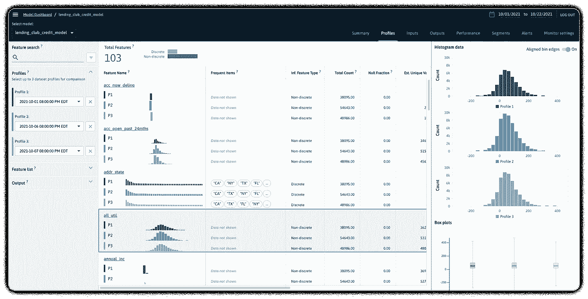
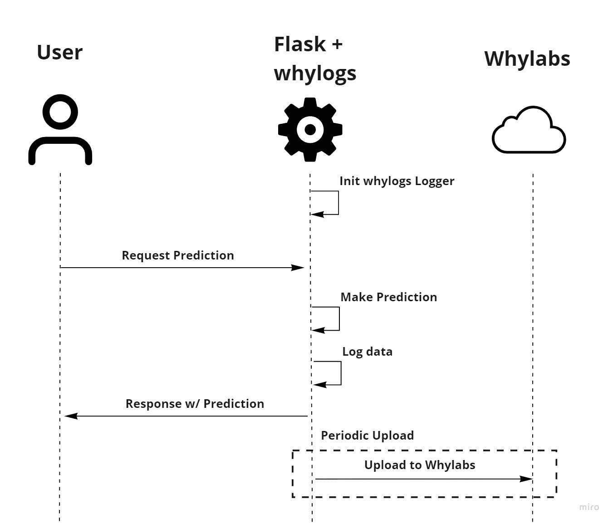
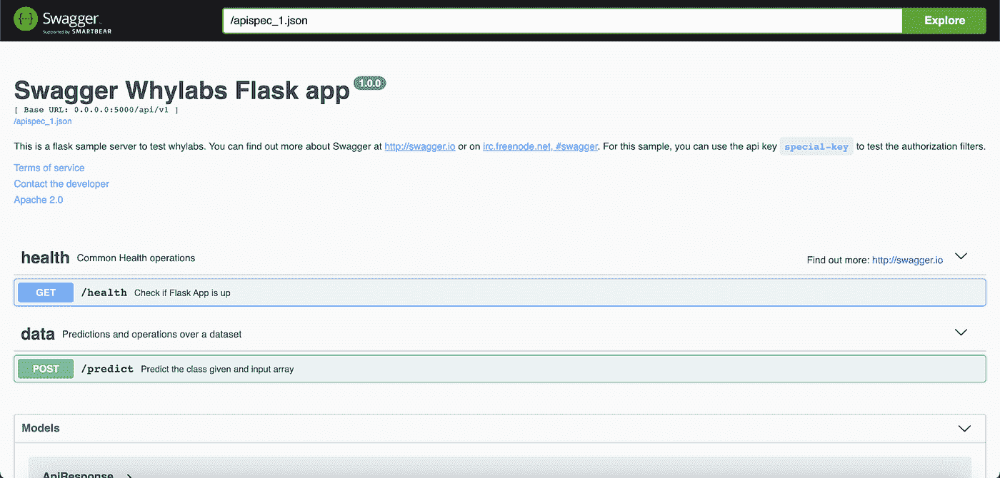
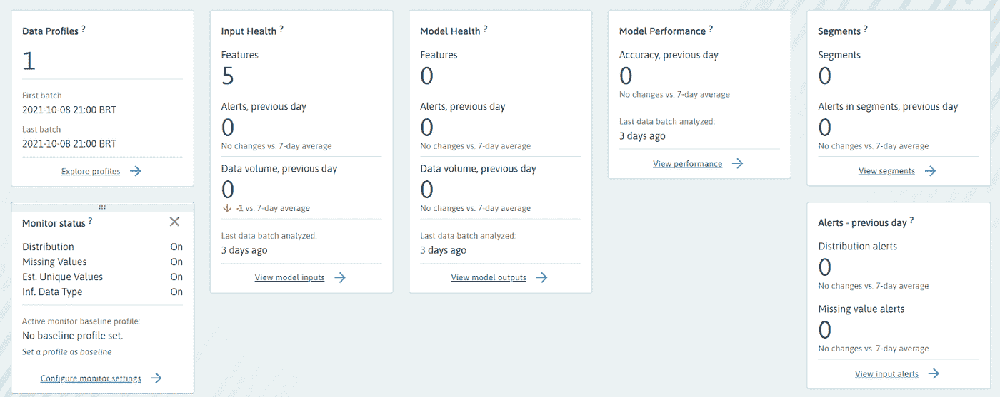
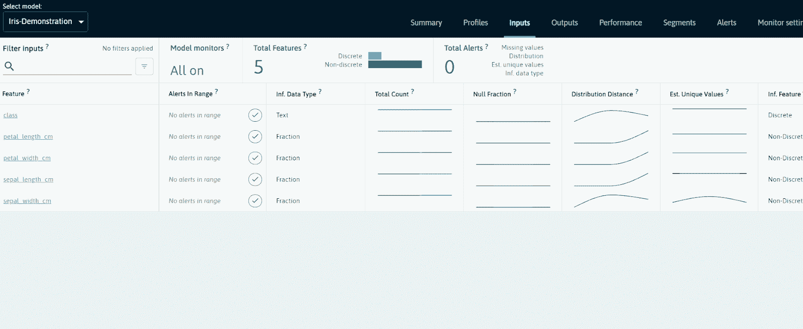
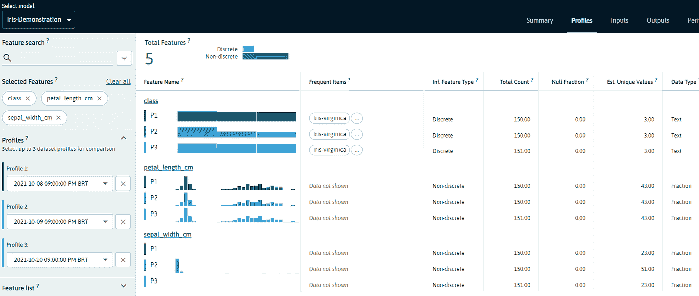

# 使用 Flask 和 WhyLabs 部署和监控您的 ML 应用程序

> 原文：<https://towardsdatascience.com/deploy-and-monitor-your-ml-application-with-flask-and-whylabs-4cd1e757c94b?source=collection_archive---------17----------------------->

## 提高你的人工智能系统的可观察性



作者图片

在每个人工智能构建者的旅程中，最好的里程碑之一是模型准备好从培训中毕业并投入生产的那一天。根据 Algorithmia 最近做的一项调查[，大多数组织已经有超过 25 个模型投入生产。这强调了企业是如何越来越多地依赖 ML 来提高实验室之外的性能的。然而，部署后阶段对于您的 ML 模型来说可能是一个困难的阶段。数据科学家可能认为一旦模型部署完毕，困难的部分就结束了，但事实是问题才刚刚开始。数据错误、管道破裂和模型性能下降总有一天会出现，当这一天到来时，我们必须准备好有效地调试和解决这些问题。为了拥有一个可靠和健壮的 ML 系统，可观测性是绝对必须的。](https://info.algorithmia.com/2021)

在本文中，我想分享一种方法，通过有效地记录和监控您的模型来提高您的 ML 应用程序的可观察性。为了演示，我们将部署一个 Flask 应用程序，用于基于众所周知的[虹膜数据集](https://archive.ics.uci.edu/ml/datasets/iris)的模式识别。在监控部分，我们将探索免费的入门版[why labs](https://whylabs.ai/)Observability Platform，以便建立我们自己的模型监控仪表板。从仪表板上，我们可以访问从 ML 管道的每个部分收集的所有统计数据、指标和性能数据。为了与平台交互，我们将使用由 WhyLabs 开发的开源数据日志库 [whylogs](https://github.com/whylabs/whylogs) 。

监控仪表板的一个关键用例是当我们的数据质量和/或一致性发生意外变化时。因此，我们模拟了最常见的模型失败场景之一，即特征漂移，这意味着我们的输入分布发生了变化。然后，我们使用一个监控仪表板来查看如何检测和调试这类问题。虽然特征漂移可能会也可能不会影响模型的性能，但观察生产中的这种变化应该始终是进一步检查和模型再训练的理由。

总之，我们将一步一步地介绍:

*   部署集成了 WhyLabs 的 Flask API
*   测试应用程序
*   注入特征漂移并浏览模型操控板

如果这是一个让你产生共鸣的问题，我们已经将本教程的完整代码放在[这里](https://github.com/whylabs/whylogs/tree/mainline/examples/flask_whylabs_example)供你重用。您需要将它复制到您的机器上，以便遵循这个示例。您还需要一个 Docker，最好还需要一个 Python 环境管理工具，比如 Conda 或 pipenv。对于那些对细节感兴趣的人，我们已经包括了一个非常详细的描述和一个 Jupyter 笔记本作为指南。

# 1.概观

让我们看看系统的不同组件是如何相互作用的。



作者图片

我们将在本地部署一个 Flask 应用程序，它负责通过 REST 端点向用户提供所请求的预测。我们的应用程序还将使用 whylogs 库来创建生产过程中应用程序的输入和输出特性的统计概要。这些统计特性将在固定的时间间隔内以微批次的形式发送到 WhyLabs。WhyLabs 会自动合并它们，每天创建统计数据。

有多种方法可以将您记录的指标上传到平台。在本例中，我们定期在微批次中上传它们，如图所示。另一种选择是在每个日志步骤上传它们。

# 2.设置您的 WhyLabs 帐户

为了监控我们的应用程序，让我们首先设置一个 WhyLabs 帐户。具体来说，我们需要两条信息:

*   API 令牌
*   组织 ID

前往 https://whylabs.ai/free 的[获取一个免费账户。如果您愿意，您可以跟随示例，但是如果您只对跟随本演示感兴趣，您可以跳过快速入门说明。](https://whylabs.ai/free)

之后，系统会提示您创建一个 API 令牌，您将使用它与您的仪表板进行交互。创建令牌后，复制它并将其存储在安全的地方。这里的第二个重要信息是您的组织 ID。把它也记下来。WhyLabs 为您提供了如何创建会话并将数据发送到仪表板的示例代码。你也可以测试它，检查数据是否通过。否则，在你获得 API 令牌和 Org ID 后，你可以去 https://hub.whylabsapp.com/models 的[看看你闪亮的新模型的仪表板。为了进行到这一步，我们使用了 WhyLabs API 文档](https://hub.whylabsapp.com/models)，它也提供了关于令牌创建的附加信息以及如何使用它的基本示例。

# 3.部署 Flask 应用程序

一旦仪表板启动并运行，我们就可以开始部署应用程序本身了。我们将使用 Gunicorn 提供一个 Flask 应用程序，打包到 Docker 容器中以方便部署。

## WhyLabs 配置

第一步是配置与 WhyLabs 的连接。在这个例子中，我们通过`.whylogs_flask.yaml`文件来完成。可以将写入器设置为在本地输出数据或输出到不同的位置，例如 S3、MLFlow path 或直接输出到 WhyLabs。在这个文件中，我们还将设置项目的名称和其他附加信息。

## 环境变量

应用程序假设存在一组变量，所以我们将在一个`.env`文件中定义它们。这些稍后使用 **dotenv** 库加载。复制以下内容，并将`WHYLABS_API_KEY`和`WHYLABS_DEFAULT_ORG_ID`值替换为创建 WhyLabs 帐户时获得的值。您可以保持其他变量不变。

让我们谈谈其他一些现有的变量。

*   **why labs _ DEFAULT _ DATASET _ ID**—数据集的 ID。模型-1 是默认值，在您创建帐户后自动创建。如果您尚未向 WhyLabs 发送任何内容，请保持不变。但是如果它已经被填充，您可以将其更改为 model-2。记得在 https://hub.whylabsapp.com/models 设置新模型。一个新的模型 id 将被分配给新创建的模型，您可以在您的。环境文件。
*   **ROTATION_TIME** —用于向 WhyLabs 发送数据的周期。在实际的应用程序中，我们可能不需要如此频繁的更新，但是对于这个例子，我们将它设置为一个较低的值，这样我们就不必等待那么长时间来确保它正常工作。

## 创造环境

该应用程序将从 Docker 容器内部运行，但是我们还将运行一些前脚本(下载数据和训练模型)和后脚本(发送请求)，所以让我们为本教程创建一个环境。如果您正在使用 Conda，您可以从`environment.yml`配置文件中创建它:

```
conda env create -f environment.yml
```

如果没有达到预期效果，您还可以从头开始创建一个环境:

```
conda create -n whylogs-flask python=3.7.11conda activate whylogs-flask
```

然后从需求中直接安装:

```
python -m pip install -r requirements.txt
```

## 训练模型

如果你仔细观察，我们的一个环境变量叫做`MODEL_PATH`。我们还没有模型，所以让我们创建它。我们将使用 **sklearn** 从[虹膜数据集](https://archive.ics.uci.edu/ml/machine-learning-databases/iris/)中训练一个简单的 SVC 分类模型，并将其保存为`model.joblib`。从我们示例的文件夹的根，我们可以简单地调用[训练例程](https://github.com/whylabs/whylogs/blob/mainline/examples/flask_whylabs_example/train.py):

```
python train.py
```

## 建立码头工人形象

现在我们已经具备了实际运行应用程序的一切。为了构建映像，我们定义了下面的 Dockerfile 文件:

然后构建图像并运行我们的容器:

```
docker build --build-arg PYTHON_VERSION=3.7 -t whylabs-flask:latest .docker run --rm -p 5000:5000 -v $(pwd):/app  whylabs-flask
```

这将在本地端口 5000 上启动我们的应用程序。在这个例子中，我们使用 **Gunicorn** 将 Flask 应用程序作为 WSGI HTTP 服务器运行。通过设置`reload`变量，我们能够更有效地调试，当代码发生变化时，自动重新加载工人。

您应该会看到来自 gunicorn 的启动服务器的消息:

```
[2021-10-12 17:53:01 +0000] [1] [INFO] Starting gunicorn 20.1.0
[2021-10-12 17:53:01 +0000] [1] [INFO] Listening at: http://0.0.0.0:5000 (1)
[2021-10-12 17:53:01 +0000] [1] [INFO] Using worker: sync
[2021-10-12 17:53:01 +0000] [8] [INFO] Booting worker with pid: 8
[2021-10-12 17:53:01 +0000] [20] [INFO] Booting worker with pid: 20
```

## 4.测试 API

一旦 Docker 容器运行，我们应该检查 API 是否正常工作。该应用程序有两个端点:

*   **/api/v1/health** :如果 api 启动并运行，则返回 200 状态响应。
*   **/api/v1/predict** :给定输入特征向量，返回预测类。

Swagger 对该 API 进行了适当的文档化，因此您可以前往**http:127 . 0 . 0 . 1:5000/API docs**浏览文档:



作者图片

从 **/apidocs** 中，您将能够看到尝试两个端点的请求示例，以及 **curl** 片段，如:

```
curl -X GET "http://127.0.0.1:5000/api/v1/health" -H "accept: application/json"curl -X POST "http://127.0.0.1:5000/api/v1/predict" -H "accept: application/json" -H "Content-Type: application/json" -d "{ \"petal_length_cm\": 0, \"petal_width_cm\": 0, \"sepal_length_cm\": 0, \"sepal_width_cm\": 0}"
```

您应该从第一个命令中获得“健康”的响应。同样，来自预测请求的响应应该是:

```
{
  "data": {
    "class": "Iris-virginica"
  }, 
  "message": "Success"
}
```

好了，我们的应用程序正恰当地服务于我们的请求。现在，我们可以检查数据是否安全可靠地到达我们的仪表板。

重要的是要记住，数据不会随着每个请求的完成而立即发送。根据在`.env`文件中定义的`ROTATION_TIME`环境变量，它被定期发送。在本例中，它被设置为 5 分钟，这意味着在信息被发送到我们的仪表板之前，我们必须等待 5 分钟。然后，我们应该会从 whylogs 中看到一条消息，表明上传已经完成。

上传完成后，收到的信息将在几分钟内显示在您的模型的仪表板上。从您的[型号的仪表板](https://hub.whylabsapp.com/models)中，您可以检查是否记录了任何配置文件，并访问您的摘要仪表板:



作者图片

到目前为止，我们已经记录了 1 个配置文件和 5 个特征，这意味着数据正在通过。现在，让我们通过一个用例更深入地探索这个平台:我们将向我们的数据分布中添加一些异常值，并看看这是如何反映在我们的仪表板中的。

# 5.检测特征漂移

当事情出错时，任何可观察性平台的真正价值就会显现出来。事情可能以许多不同的方式出错，但是对于这个演示，让我们选择一个特定的方式:特性漂移。

机器学习环境中的漂移现象可能是一个冗长的主题，因此在这种情况下，我们将限制自己对特征漂移的基本定义:当模型输入的分布发生变化时。

我们将使用 Iris 数据集中的 150 个未改变的样本来表示每日批次的正态分布。然后，为了表示异常批次，我们将采用相同的样本集，除了我们将这些样本中的 30 个样本替换为一个随机输入要素的随机异常值。我们将继续请求具有如下输入要素的预测:

*   **第 1 天** —正常数据
*   **第 2 天** —修改数据(改变分布)
*   **第三天** —正常数据

下面的代码片段将在不改变输入特性的情况下发出 150 个请求。第二天，我们简单地修改代码以传递`data_mod`作为有效载荷，而不是`data`(第 35 行)，然后重复这个过程。在这个演示中，离群值被添加到了`sepal_width`特征中。

让我们简要地看一下我们控制面板中的一些部分。从**输入**页面，有许多有用的信息，如每批记录的数量、空分数和推断的特征类型。



作者 Gif

一条特别有用的信息是**分布距离**。这是一个时间序列，它显示了在所选日期范围内该特征与前一批数据的平均统计距离，使用 [Hellinger 距离](https://en.wikipedia.org/wiki/Hellinger_distance)来估计分布之间的距离。通过在`sepal_width`特征中添加异常值，我们不仅看到了`sepal_width`特征本身的分布距离的变化，还看到了预测结果的变化。

> 注意:对于剩余的特征，距离似乎在最后一天增加。这实际上是我的一个错误，因为我多发送了 1 条记录，总共 151 条记录。由于图中各要素之间的比例不同，因此这种变化的影响似乎很大，但是当检查值本身时，附加记录产生的分布距离为 0.02。

我们可以通过单击来进一步检查各个功能。从分布图中，我们可以看到漂移对`class`和`sepal_width`特征的影响。

在**配置文件**部分，我们可以选择多达 3 个数据集配置文件进行比较，这是一个非常酷的功能。在下面的图片中，我选择了一些特征进行比较。如前所述，添加异常值引起的变化也非常明显。



作者图片

虽然我们不可能在这里讨论所有可用的特性，但我最喜欢的一些特性是:

*   每个功能监视器的手动阈值配置
*   电子邮件/松弛时间的通知计划
*   上传训练集作为基线参考集
*   分析期间分段数据

请自行探索它们吧！

# 6.结论

ML 应用程序的部署后阶段给我们带来了无数的挑战，这些应用程序的故障排除过程仍然是非常手动和繁琐的。在这篇文章中，我们介绍了一个例子，说明如何通过 WhyLabs 提高系统的可观测性来减轻这一负担。

我们讲述了一个简单的例子，基于众所周知的 Iris 数据集部署 Flask 应用程序进行分类，并使用 whylogs 数据记录库将其与 WhyLabs 平台集成。我们还通过在输入中注入异常值来模拟一个特性漂移场景，以便查看它是如何反映在我们的监控仪表板中的。尽管这是一个非常简单的用例，但是这个例子可以很容易地被修改以涵盖更多定制的场景。

感谢您的阅读，如果您有任何问题/建议，请随时联系我们！如果你试用后有问题，我发现 Slack 上的 [WhyLabs 社区非常有帮助，反应也很快。](https://communityinviter.com/apps/whylabs-community/whylabs-community)