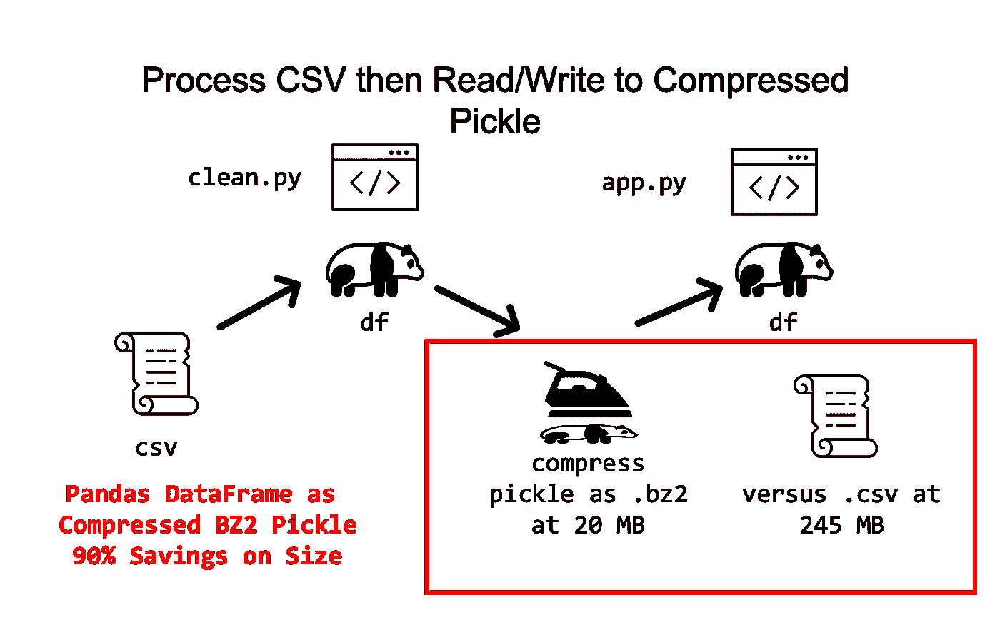
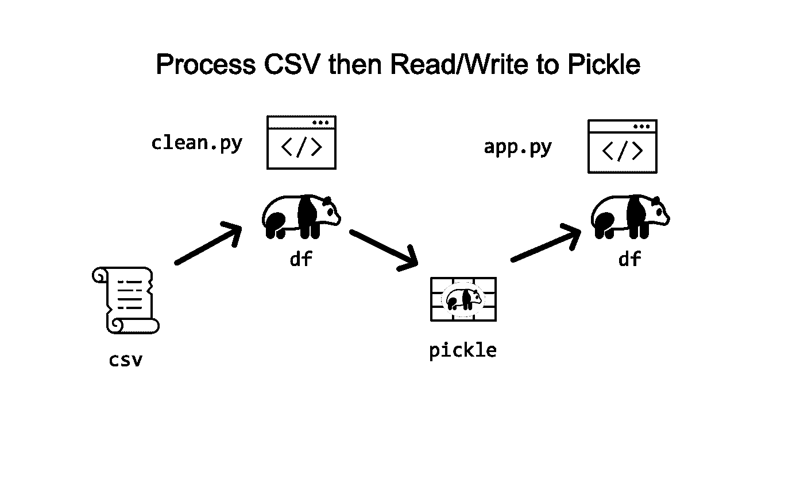
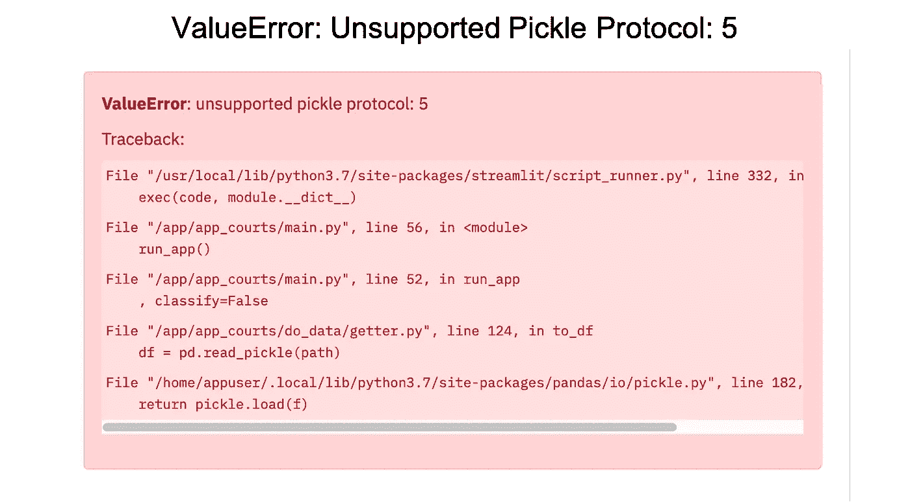
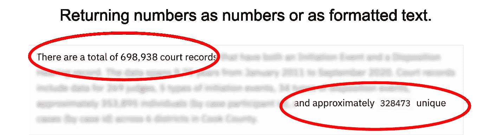
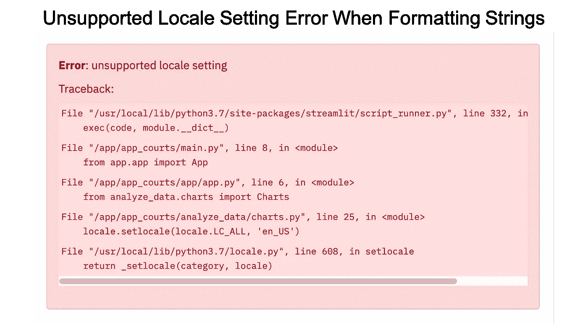
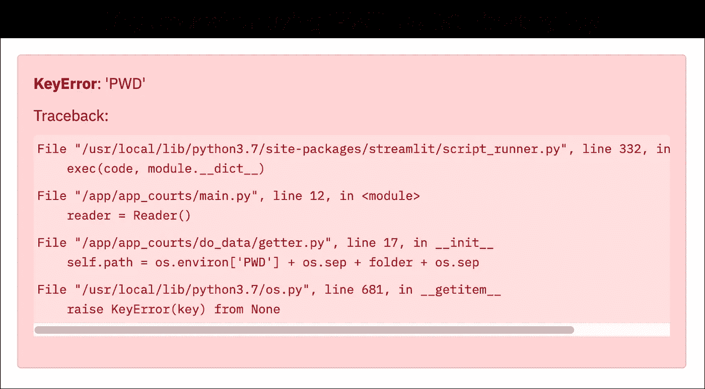

# 使用 Streamlit 部署代码

> 原文：<https://towardsdatascience.com/deploy-code-with-streamlit-90090b611f3c?source=collection_archive---------38----------------------->

## 为什么要简化 it 以及关于从 Python 部署数据仪表板应用程序的一些提示。


马克·克鲁兹在 [Unsplash](https://unsplash.com?utm_source=medium&utm_medium=referral) 上的照片

> 我最近在 Mac 上使用 Python 构建并部署了一个数据应用程序，没有编写一行 HTML、CSS 或 JavaScript 代码——所有这些都是通过一个叫做 Streamlit 的漂亮包实现的。

## 本文包含一些注释，说明在使用 Streamlit 部署代码时哪些有效，哪些无效。

我最近用 Steamlit 部署了一个数据仪表板的早期 alpha 版本。虽然这款应用还处于起步阶段，但我很高兴它能处于某种生产状态，我很高兴能继续对它进行改进。根据我的经验，这篇文章包含了一些最大的陷阱和技巧，可以帮助您突破在部署 Streamlit 时可能会遇到的一些最终问题。这篇文章不是一个完整的指南，为此，只需查看一下 [Streamlit](https://www.streamlit.io/) 网站，它在一步一步的过程中做得很好。

# 死亡之谷

很长一段时间以来，我一直想知道部署我的数据分析的最佳方式。例如，我们做了所有这些工作，并埋头于代码，但似乎总是有差距。就好像有一个山谷，项目在我们分享它们之前就死去了。

> 在我们分享项目之前，有些项目会夭折。

可能的解决方案包括 [Jupyter](https://jupyter.org/) notebooks 和 [Deepnote](https://deepnote.com/) ，它们非常适合共享代码和分析。另一个是 ObservableHQ，它非常擅长将 D3 视觉效果推出门外。还有许多其他方法可以完成这项工作。然而，尽管有这些选项，我从来没有能够连接到一个具有合适特性的部署方法。幸运的是，我的导师给了我一些建议，让我尝试 Plotly 和 Streamlit 的结合。

虽然我知道 [Plotly](https://plotly.com/) ，但我之前从未听说过 Streamlit。Streamlit 号称是“[构建和共享数据应用程序的最快方式](https://www.streamlit.io/)”，它承诺在几分钟内将您的代码转化为 web 应用程序，而无需任何前端工作。我认为这好得难以置信，但事实证明，Streamlit 确实有效。

## 为什么选择 Streamlit？

*   自由的
*   可通过 pip 安装获得
*   良好的文档
*   GitHub 回购集成
*   处理前端
*   仅需要 Python

如果这一切听起来很有趣，请查看 Streamlit 页面。文档和说明非常清楚；但是，我认为在您的代码中有几个重要的设计特性值得考虑。请继续阅读了解更多信息。

# 部署压缩的大数据

有时你有一吨数据，50 万或 100 万行数据——如何最好地部署指向如此大数据集的数据应用程序？尽管有很多答案，包括首先避免拥有一个庞大的表，让我们继续解决这个特定的问题。现在怎么办？

## 大文件的问题

处理单个大型数据表有三个主要问题。首先，在磁盘上，这种大小的文件可能有数百兆字节。其次，如果使用 Streamlit 部署，您必须使用 GitHub，这意味着大约 50 MBs 的硬限制。第三也是最后一点，加载大型数据集可能会导致应用程序崩溃。因此，考虑将数据帧压缩为压缩的 BZ2 pickle 文件，而不是 CSV 文件。



项目通常从某种 csv 数据表开始。在最初摄取后，考虑继续压缩 BZ2 泡菜文件，以节省时间和内存。来自作者 Justin Chae。

> 大数据，大问题:245 MB。csv 文件还是 20 MB .bz2 文件？

**插入于 2020 年 1 月 13 日** — *尽管这种压缩方法作为一种生产手段适用于大量数据，但作为下一步，您当然应该采取额外的步骤来尽可能减小每个文件的大小。在下面链接的后续文章中会有更多关于优化的内容。*

[](/optimize-streamlit-deployment-1b9bb0e415b) [## 优化简化 it 部署

### 使用 Streamlit 从 Python 部署数据应用程序时要避免的陷阱。

towardsdatascience.com](/optimize-streamlit-deployment-1b9bb0e415b) 

## 大型数据帧的解决方案

为了处理大型数据帧，在读取初始 csv 文件后，设计您的工作流，使用 [BZ2 压缩](https://en.wikipedia.org/wiki/Bzip2)来读写经过酸洗的数据。BZ2 泡菜组合在两个方面对你有好处。首先，pickled 格式保留了所有列的状态，并且比 CSV 文件占用更少的磁盘空间。第二，BZ2 高效地将数据压缩成微小的字节，并在后端进行了非常好的解压缩。

幸运的是，熊猫让这个任务变得简单。您所需要的只是将“. bz2”作为文件扩展名。

```
import pandas as pd**# given a dataframe of 600,000 records..**path = 'data/product_sales.bz2'df.to_pickle(path)***# pandas writes compressed pickle .bz2 based on filename
# to_pickle() has parameter of compression=infer*****# read back in to dataframe** df = pd.read_pickle(path)
```

# Pickle 协议 5 值错误

像大多数项目一样，工作流从 CSV 格式的数据开始；然而，在应用程序内部，我设计的程序可以读写 pickle 格式的数据帧。使用 [pickled DataFrames](https://pandas.pydata.org/pandas-docs/stable/reference/api/pandas.DataFrame.to_pickle.html) 的一个主要原因是序列化文件保留了各种元数据——如果您将 ***dtypes*** 设置为字符串、整数或类别，那么每当您读入数据时，这些 dtypes 都会被保留。另一方面，对于 CSV 文件，您必须将数据重新处理回合适的数据帧。



以 csv 文件开始的简单工作流。不要总是从后续的 csv 文件中写入和读取，而是尝试从 pickle 文件中 pickle 和读取，以保留数据状态。来自作者[贾斯汀蔡](https://medium.com/u/d9cf1c8c597d?source=post_page-----90090b611f3c--------------------------------)。

尽管 pickle 文件非常可爱，但在使用 Streamlit 进行部署的最后几步，我遇到了 pickle 协议错误的阻碍。



不支持的 pickle 协议错误。通过将协议从 5 改为 2 解决。

## 有这个误差吗？

显然，Pandas[***to _ pickle()***](https://pandas.pydata.org/pandas-docs/stable/reference/api/pandas.DataFrame.to_pickle.html)方法默认为版本 5 的协议，该协议并未得到普遍支持。因此，尽管一个标准的 Pandas paged data frame 可以在本地机器上进行测试，但是部署到服务器上就另当别论了。

```
**ValueError: unsupported pickle protocol: 5
Traceback:**File "/usr/local/lib/python3.7/site-packages/streamlit/script_runner.py", line 332, in _run_script
    exec(code, module.__dict__)File "/app/app_courts/main.py", line 56, in <module>
    run_app()File "/app/app_courts/main.py", line 52, in run_app
    , classify=FalseFile "/app/app_courts/do_data/getter.py", line 124, in to_df
    df = pd.read_pickle(path)File "/home/appuser/.local/lib/python3.7/site-packages/pandas/io/pickle.py", line 182, in read_pickle
    return pickle.load(f)
```

## Pickle 协议 5 错误的解决方案

当面对一个错误时，我有时会选择另一种解决方案，也就是说，某种东西也能产生同样的结果。然而，由于各种限制，我对数据文件没有什么选择。在寻找答案的过程中，我发现解决方案相当简单——将 Pandas to_pickle()协议从默认的改为版本 2。当熊猫泡菜与 BZ2 压缩相结合，结果是一个超级小，超级方便，非常兼容的数据文件。

```
**# to avoid pickle protocol error
# change params from 5 to 2**path = 'data/product_sales.bz2'df.to_pickle(path, protocol=2)
```

> 当熊猫泡菜与 BZ2 压缩相结合，结果是一个超级小，超级方便，非常兼容的数据文件。

# 不支持的区域设置错误

除了可视化之外，该应用程序还向用户展示了数据集高级数字的叙述。例如，有几个句子以书面形式解释了计数和频率。为了让读者跟上叙述的节奏，我想将数字格式化为带有千位分隔符的字符串，而不是纯整数。将数字格式化为文本的一种方法是使用[区域库](https://docs.python.org/3/library/locale.html)。



用格式化字符串形式的数字(左)和数字形式的数字(右)生成关于数据的叙述。来自作者 Justin Chae。

```
**# one way to format numbers as strings**import locale
locale.setlocale(locale.LC_ALL, 'en_US')case_id = 8456981formatted = locale.format_string("%d", case_id, grouping=*True*)*# formatted -> '8,456,981'*
```

不幸的是，虽然这种方法在我的本地机器上工作得很好，但是部署却因为一个 ***不支持的区域设置错误*** 而夭折了。



格式化字符串时出现不受支持的区域设置错误。通过使用 F 字符串来解决。

## 有这个误差吗？

不管出于什么原因，locale 给部署带来了巨大的困难。虽然可能有一些其他选项来解决区域设置，但我意识到可能有更好的替代方法。

```
**Error: unsupported locale setting
Traceback**:File "/usr/local/lib/python3.7/site-packages/streamlit/script_runner.py", line 332, in _run_script
    exec(code, module.__dict__)File "/app/app_courts/main.py", line 8, in <module>
    from app.app import AppFile "/app/app_courts/app/app.py", line 6, in <module>
    from analyze_data.charts import ChartsFile "/app/app_courts/analyze_data/charts.py", line 25, in <module>
    locale.setlocale(locale.LC_ALL, 'en_US')File "/usr/local/lib/python3.7/locale.py", line 608, in setlocale
    return _setlocale(category, locale)
```

> 解决方法总是 f 弦，这是一个奇妙而漂亮的发明，它会在你最需要帮助的时候帮助你。

## Python 不支持区域设置的解决方案

f 弦是一个奇妙的发明。虽然语法可能看起来吓人(需要一些时间来适应)，但它是有效的。要返回带有千位分隔符的整数格式，请尝试以下语法。

```
case_id = 8456981formatted = f"{case_id:,d}"*# formatted -> '8,456,981'*
```

# 操作系统和 PWD 出现键盘错误

管理文件路径和目录是一件痛苦的事情。例如，语法可能会根据您是 Mac、PC、虚拟环境还是其他任意组合而变化。为了处理这种不确定性，像许多其他人一样，我养成了用 [OS 库](https://docs.python.org/3/library/os.html)编写文件路径分隔符的习惯，以确保跨不同环境的兼容性。

```
**# an example of creating a cross-platform file path**import osfolder = 'data'
self.path = os.environ['PWD'] + os.sep + *folder*""" a go-to approach given a root and some sub-folders
-root/
app.py
----analysis/
----data/
----figures/
"""
```

不管出于什么原因，尽管该应用程序在我的本地机器上工作，但当我试图访问“PWD”或*打印工作目录*时，在线 Streamlit 部署会返回一个 **KeyError** 。



使用“PWD”作为文件路径的操作系统密钥时出现密钥错误。通过使用相对路径来解决。

## 有这个误差吗？

虽然我不确定为什么***OS . environ[' PWD ']***无法工作，但我最终改变了方法，依靠相对路径。

```
**KeyError:'PWD'
Traceback:**File "/usr/local/lib/python3.7/site-packages/streamlit/script_runner.py", line 332, in _run_script
    exec(code, module.__dict__)File "/app/app_courts/main.py", line 12, in <module>
    reader = Reader()File "/app/app_courts/do_data/getter.py", line 17, in __init__
    self.path = os.environ['PWD'] + os.sep + folder + os.sepFile "/usr/local/lib/python3.7/os.py", line 681, in __getitem__
    raise KeyError(key) from None
```

## Streamlit 中 Python KeyError 的解决方案

如果 Streamlit 从项目根目录运行，即 main.py 或 app.py，那么可以考虑简单地引用带有相对路径的子文件夹。考虑下面的设置，streamlit 在其中运行 app.py(从根目录)。

```
**# from terminal, run app.py**
>>> streamlit run app.py""" project structure
-root/
**app.py**
----analysis/
----data/'product_sales.csv'
----figures/
"""
```

在这种情况下，如果应用程序需要从数据子文件夹中读取文件，请使用***OS . sep . join()***并记住相对位置。在测试这个解决方案时，我注意到它在我的本地机器和部署中都工作得很好。

```
**# an alternative to using OS with PWD**
path = os.sep.join([self.root, *filename*])*# path -> data/product_sales.csv*
```

# 结论

使用 Streamlit，可以将基于 Python 的项目部署为 web 应用程序，只需很少甚至不需要前端工作。尽管这一过程需要的时间不仅仅是几分钟，但在几个小时或一天的工作中是可行的。我分享这篇文章是为了传递关于 Streamlit 的信息，并分享一些解决一些问题的技巧。

至于问题，我希望我从一开始就设计好了这些路障。尽管每个问题都相当小，但每个问题都会妨碍应用程序的部署，并且需要大量的时间来研究和重构。希望这些关于我的错误的笔记能对你的下一个项目有所帮助。

> 感谢阅读。如果您正在考虑使用 Streamlit 进行部署或者正在进行故障排除，我希望这篇文章能够帮助*。*

# 资源

*   [我的 GitHub 回购](https://github.com/justinhchae/app_courts)
*   [我的应用](https://share.streamlit.io/justinhchae/app_courts/main/main.py)