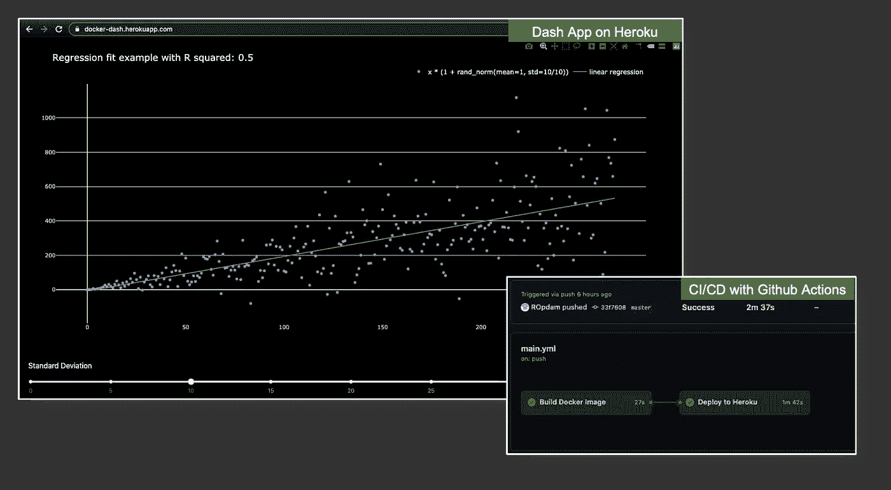
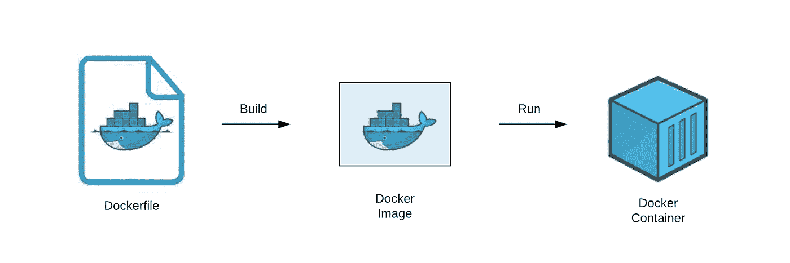
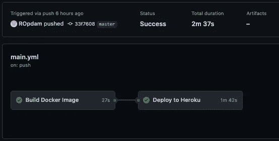
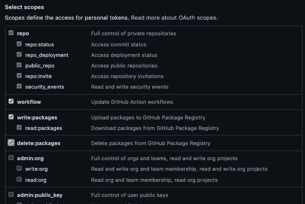
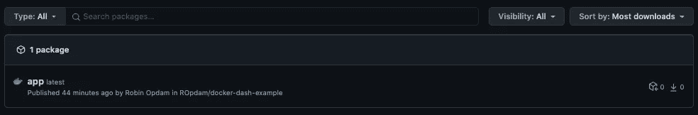
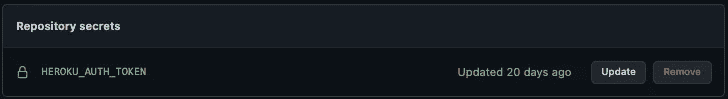
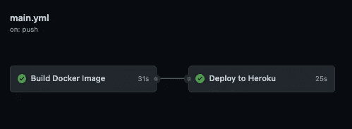

# 部署带有 CI/CD 的容器化 Plotly Dash 应用程序(P1: Heroku)

> 原文：<https://towardsdatascience.com/deploy-containerized-plotly-dash-app-to-heroku-with-ci-cd-f82ca833375c?source=collection_archive---------12----------------------->


在 [Unsplash](https://unsplash.com?utm_source=medium&utm_medium=referral) 上由 [Bernd Dittrich](https://unsplash.com/@hdbernd?utm_source=medium&utm_medium=referral) 拍摄的照片

假设您在本地开发了一个很酷的应用程序，并希望与全世界分享。此外，一旦您的应用上线，您希望轻松地做出直接反映在网上的更改。这可能是一项艰巨的任务，涉及选择云提供商、将您的应用程序容器化以及自动化部署流程。如果这似乎是一项艰巨的任务，那么请继续阅读，因为本文提供了每个组件的分解。

**编辑:**我已经将部署管道更改为 [Google Cloud Run](https://cloud.google.com/run) ，关于通过 CI/CD 部署到 Google Cloud Run 的完整概述，请查看 P2。

更具体地说，本文是如何使用 Github actions for CI/CD 在 Heroku 上构建和部署容器化 Plotly Dash 应用程序的分步指南。请注意，Dash 和 Heroku 部分可以由其他应用框架和其他云平台交换，而整体结构保持不变。在本指南结束时，您只需对 repo 的主要分支进行更改，并观察 Dash 应用程序如何部署到 Heroku！

我的回购示例可以在 Github 的[这里](https://github.com/ROpdam/docker-dash-example)找到。这些步骤大部分是我从[这门 testdriven.io 课程](https://testdriven.io/courses/tdd-fastapi/)中学到的。我假设你知道什么是 [Plotly Dash](https://plotly.com/dash/) 并且你知道 Github 是如何工作的。

该应用程序的一个工作示例可以在谷歌云上找到。我们正在构建的内容概述:



使用 [Github Actions CI/CD 管道](https://github.com/ROpdam/docker-dash-example/actions)部署在 [Heroku](https://docker-dash.herokuapp.com/) 上的示例应用，图片由作者提供

步骤:

1.  文件结构
2.  创建 Plotly Dash 应用程序
3.  创建一个 Dockerfile 文件，在本地运行
4.  用 Github 动作构建 Docker 图像
5.  创建 Heroku 帐户和应用程序
6.  通过 Github 操作部署到 Heroku

# 初始化

创建一个 Github 存储库，最好带有一个自述文件，并在您的本地机器上设置它( [git-guide](https://docs.github.com/en/github/getting-started-with-github/quickstart/set-up-git) )。

# 1.文件结构

我们将在父文件夹中构建以下文件结构(在我的例子中为 [docker-dash-example](https://github.com/ROpdam/docker-dash-example) ):

```
├── .github
│   └── workflows
│        └── main.yml
│
├── project
│   ├── app
│   │   ├── __init__.py
│   │   ├── app.py
│   │   ├── functions.py
│   │   └── assets
│   ├── Dockerfile
│   ├── Dockerfile.prod
│   └── requirements.txt
│
├── release.sh
├── setup.cfg
├── .pre-commit-config.yaml
├── .gitignore
│
└── README.md
```

该结构可分为 4 个部分，稍后将详细解释:

1.  的。github 文件夹包含我们的工作流 *main.yml* 文件，该文件用于 CI/CD 管道的 Github 操作(步骤 4 和 6)。
2.  项目文件夹包含一个带有 Plotly Dash 应用程序的文件夹，其资产(*)。css* 文件)、包含必要包的 *requirements.txt* 文件、用于本地部署的 *Dockerfile* 和用于在 Heroku 上部署的 *Dockerfile.prod* (步骤 2 和 3)。
3.  *release.s* h 用于最后一步(步骤 6)在 Heroku 上发布 app。
4.  (可选)*。pre-commit-config.yaml* 和 *setup.cfg* 文件用于代码样式和林挺，但还可以用于更多用途(步骤 2 的一部分)。

# 2.创建 Plotly Dash 应用程序

在这里，我将在项目文件夹的 app 文件夹中共享 *app.py* 文件。在创建自己的应用程序时，不要让这个示例应用程序限制了您的创造力！

这里需要注意两件重要的事情:

1.  我们将 **app.server** 放入一个 **server** 变量中。
2.  没有什么比 **app.run_server** 更能运行 *app.py* 文件了，就像你在开发过程中在本地所做的那样(参见下面的代码块)。这段代码被排除在外，因为我们将使用来自 *Dockerfile* 的命令来运行该应用程序，以便使用 [Gunicorn WGSI 服务器](https://build.vsupalov.com/what-is-gunicorn/)来运行它。
3.  我们从[*functions . py*](https://github.com/ROpdam/docker-dash-example/blob/master/project/app/functions.py)*导入 plot_regression 函数。*

```
if __name__ == "__main__":
    app.run_server(host="0.0.0.0", port=8050, debug=True)
```

请注意，这个应用程序组件可以与许多 Python 或非 Python web 框架互换。

## 预提交挂钩(可选)

在将代码提交到存储库之前，预提交挂钩可以执行多项检查并识别简单的问题。安装很简单，而且[很多钩子](https://pre-commit.com/hooks.html)都很容易找到。这个库中使用的预提交钩子可以在[这里](https://github.com/ROpdam/docker-dash-example/blob/master/.pre-commit-config.yaml)找到，它由[薄片 8](https://github.com/PyCQA/flake8) 、[黑色](https://github.com/psf/black)和 [isort](https://github.com/PyCQA/isort) 组成。我使用这些钩子来保持代码格式良好(black 和 isort)，并确保没有多余的代码或简单的错误(flake8)。

# 3.创建 Dockerfile 文件

Docker 是一种封装应用程序的好方法，使它们独立于本地机器的配置，并且容易部署到各种平台上。在继续之前，确保您的本地机器上安装了 Docker([下载&安装 Docker](https://docs.docker.com/get-docker/) )。

为了在容器中运行 Plotly Dash 应用程序，我们在项目文件夹中创建了一个 *Dockerfile* 。这个 *Dockerfile* 看起来如下:

这些命令具有以下功能:

*   **来自**:拉标签为 *3.8.6-slim-buster* 的 Python 镜像，这是 Python 3.8.6 的精简版，包含运行 Python 所需的最少的包，这里简单解释一下。
*   **标签**:可选。维护者的姓名和电子邮件。
*   **工作目录**:设置容器内的工作目录。
*   **复制** *requirements.txt:* 将 *requirements.txt* 文件复制到容器中。
*   **运行** pip 安装—升级:升级 pip 以确保您运行的是最新版本。
*   **运行** pip install -r:安装 *requirements.txt* 文件中的所有包。
*   **复制** /app:将/app 文件夹复制到容器的**工作目录**中。
*   **运行** useradd:添加一个用户来代替 root 使用(遵循 [Heroku 指南](https://devcenter.heroku.com/articles/container-registry-and-runtime#testing-an-image-locally))。
*   **用户**:切换到新创建的用户。
*   **CMD** :使用 [Gunicorn WSGI 服务器](https://build.vsupalov.com/what-is-gunicorn/)运行 Plotly Dash 应用程序，从 *app.py* 文件中调用服务器变量。Gunicorn 处理 web 服务器和我们的 Dash 应用程序之间的一切。请注意，这个 *Dockerfile* 现在可以用于本地部署。

## 本地运行

要使用上面的 *Dockerfile* 在您的本地机器上运行您的 Plotly Dash 应用程序(或[我的示例之一](https://github.com/ROpdam/docker-dash-example)),您必须构建映像并运行容器，将之前指定的端口分配给它。



运行 Docker 容器的步骤，从这个[Docker 文件分解](https://medium.com/swlh/understand-dockerfile-dd11746ed183)

在您的终端中，转到项目的父文件夹，运行以下命令，使用您的 *Dockerfile* 构建映像。

```
docker build -t docker-dash project/.
```

t 标志用于用正确的名称标记容器，在本例中是“docker-dash *”。*标记完容器后，我们指定包含您的 *Dockerfile* 和您的应用程序所需的其他文件的上下文(路径)。

现在，使用以下命令运行包含您的应用程序的映像:

```
docker run -p 8050:8050 docker-dash
```

这里-p 标志代表 [publish](https://docs.docker.com/engine/reference/commandline/run/#publish-or-expose-port--p---expose) ，它指示将主机的哪个端口绑定到容器的端口。请记住，容器使用您的本地机器作为资源，但是独立运行。要与 Plotly Dash 应用程序的 Gunicorn 服务器进行交互，您需要指定服务器正在使用的端口:8050(如我们的*docker 文件*中所示)。打开一个浏览器窗口，进入 [https://localhost:8050](https://localhost:8050) 查看你的应用程序在容器内运行的情况。

现在应用程序已经在本地运行了，我们将关注使用 Github Actions 中的 CI/CD 管道将应用程序容器部署到 Heroku。该管道将在 git 推送到主分支时触发，如下所示:



[Github 动作管道](https://github.com/ROpdam/docker-dash-example/actions)，图片作者

# 4.用 Github 动作构建 Docker 图像

Github Actions 是一种自动化工作流程的好方法，开启了一个充满可能性的世界。我们将利用 [Github 包](https://github.com/features/packages)来存储我们的 Docker 映像，并在稍后的 Heroku 部署步骤中使用它。

## 个人访问令牌

首先创建一个[个人访问令牌](https://github.com/settings/tokens)并选择这些范围:

*   写:包
*   删除:包
*   工作流程



在 [Github](https://github.com/settings/tokens) 上选择秘密范围，图片作者

这个令牌可以通过调用 GITHUB_TOKEN 在工作流中使用，如这里的[所述](https://docs.github.com/en/packages/working-with-a-github-packages-registry/working-with-the-docker-registry#authenticating-to-github-packages)。有了这个令牌，我们可以安全地使用我们的 Github 包。

## 工作流:构建

对于 CI/CD 管道的第一步，我们将在。github/workflows 文件夹，这个结构显示 github 这个文件是 Github 动作的[工作流](https://docs.github.com/en/actions/reference/workflow-syntax-for-github-actions)。一个 [*。yml* 文件](https://blog.stackpath.com/yaml/)常用于写配置文件。我们的 *main.yml* 文件如下所示。

“name:”和“on: push: branches:”应该是不言自明的。env:'为工作流设置全局环境变量，在本例中是我们的 Docker 图像在 Github 包中的(未来)位置。

在作业下，我们指定一个作业:“构建:”，该作业包含以下步骤:

*   name:'和' runs-on:'分别指定作业和运行环境的名称。

1.  '签出主节点':使用 [checkout@2.3.4](https://github.com/actions/checkout) 动作允许我们签出主节点分支并获取最新的提交。
2.  “登录到 Github 包”:使用之前创建的令牌，我们登录到 Github 包，确保 GITHUB_TOKEN 作为本地环境变量可用，如果创建了它，它将在我们的 [Github Secrets](https://docs.github.com/en/actions/reference/encrypted-secrets) 中可用。
3.  ' Pull image ':如果图像已经存在于全局' env '中，我们将提取该图像。“图像”位置。
4.  “构建映像”:我们使用缓存从提取的映像中构建映像，以加快构建过程。注意，这里我使用'- -file '标志指向我们的 *Dockerfile* 。在编写部署作业时，我们将把它改为指向一个 *Dockerfile.prod* ，这将在本指南的最后一部分解释。
5.  ' Push image ':最后，更新后的映像被推送到 Github 包，以覆盖(或创建)app 包。

当您将此文件推送到 repo 的主分支时，此管道将运行。请注意，第一次镜像不存在于您的 Github 包(容器注册表)中，因此它将从头开始创建并被推送到注册表中。工作完成后，您可以在 Github repo/packages 中看到新创建的映像，它应该是这样的:



Github 包中使用 main.yml 管道创建的图片示例，图片作者

# 5.创建 Heroku 帐户和应用程序

[Heroku](https://www.heroku.com/) 是一个云平台即服务，它为任何人托管低流量、低计算能力的应用程序提供了一个巨大的免费层。有了合适的基础架构，它还可以轻松扩展。您的应用程序将在他们的一个免费的 [Dynos](https://www.heroku.com/dynos) 上运行。

进入 [Heroku](https://id.heroku.com/login) ，创建账户，安装 [Heroku 命令行界面](https://devcenter.heroku.com/articles/heroku-cli)。现在我们将在正确的[区域](https://devcenter.heroku.com/articles/regions)创建一个命名的应用程序，使用:

```
heroku create YOUR_APP_NAME --region YOUR_REGION
```

现在你可以在 Heroku 仪表盘[这里](https://dashboard.heroku.com/apps)看到(空的)应用。为了让您的 Github 工作流能够访问您的 Heroku 帐户，您需要使用以下方法检索您的 Heroku 授权令牌:

```
heroku auth:token
```

现在我们希望能够像之前在构建步骤中从我们的秘密中获取的 GITHUB_TOKEN 一样安全地使用这个令牌。转到 Github repo 的设置，找到“机密”标签，点击“新建存储库机密”。添加您的 Heroku 令牌并将其命名为 HEROKU_AUTH_TOKEN，以便我们能够在部署步骤中使用它。



让您的 Heroku 授权令牌在回购的秘密中可用，图片由作者提供

# 6.通过 Github 操作部署到 Heroku

在这最后一步，我们将完成 *main.yml* 文件，并确保使用我们的管道*将应用程序部署到 Heroku。*

## Dockerfile.prod

在将部署步骤作为作业添加到我们的工作流之前，我们需要确保 Plotly Dash 应用程序可以使用 Heroku 上的可用端口。我们将利用他们环境中可用的 [Heroku 的端口变量](https://www.heroku.com/dynos)。制作一份 *Dockerfile* 的副本，并将其重命名为 *Dockerfile.prod* ，这样我们就知道哪个文件将用于生产。现在，将我们将 gunicorn 服务器绑定到的最后一行改为:

```
CMD gunicorn --bind 0.0.0.0:$PORT app:server
```

容器将使用 Heroku 的端口变量，因此可以通过 Heroku url 访问它。确保也将 *main.yml* 构建作业中的引用从 *Dockerfile* 更改为 *Dockerfile.prod. (* 示例[*docker file . prod*](https://github.com/ROpdam/docker-dash-example/blob/master/project/Dockerfile.prod)*)*

```
# In main.yml build job
- name: Build Image 
  run: | 
     docker build \ 
     --cache-from ${{ env.IMAGE }}:latest \
     --tag ${{ env.IMAGE }}:latest \ 
     --file ./project/Dockerfile.prod \ 
     “./project”
```

## 部署工作流程

让我们将部署作业添加到构建作业下面的工作流 *main.yml* 中。

请注意,' needs: [build]'命令告诉部署步骤等待构建步骤完成。在部署作业的环境中，我们存储我们的 Heroku 应用程序名称，并使用它来指定 Heroku 容器注册表中的映像位置(类似于在 Github 上的构建阶段指定映像位置)。

*   前三个步骤与构建工作相同，我们签出 master，登录到 Github 包(Github docker 注册表)并提取映像。接下来的步骤是将容器部署到 Heroku:

1.  ' Build Image ':我们构建容器，注意我们使用的不同标签，即[引用源图像](https://docs.docker.com/engine/reference/commandline/tag/#description)。
2.  “登录到 HEROKU 容器注册表”:使用您添加到 Github 机密中的 HEROKU_AUTH_TOKEN，工作流可以登录到 Heroku 容器注册表。
3.  ' Push to the registry ':将图像从 Github 推送到 Heroku 的注册表。
4.  设置环境变量':[设置环境变量](https://docs.github.com/en/actions/reference/workflow-commands-for-github-actions#setting-an-environment-variable)，以便在 *releash.sh* 文件中访问它们。
5.  ' release ':使用 Heroku 指定的[释放步骤释放容器(chmod +x 将 *release.sh* 文件更改为可执行)。](https://devcenter.heroku.com/articles/container-registry-and-runtime#releasing-an-image)

注意，我对 Heroku 建议的示例 [*release.sh*](https://github.com/ROpdam/docker-dash-example/blob/master/release.sh) 结构做了一些小的修改。为 curl 请求的非零状态添加“set -e”和“Authorization:……”立即退出[，并](https://www.computerhope.com/unix/uset.htm#:~:text=On%20Unix%2Dlike%20operating%20systems,values%20of%20the%20system%20environment.)[将请求授权给 HEROKU_AUTH_TOKEN 的持有者](https://swagger.io/docs/specification/authentication/bearer-authentication/)以确保安全。这里我们可以使用 HEROKU_REGISTRY_IMAGE 和 HEROKU_AUTH_TOKEN，因为它们是在“设置环境变量”中设置的。

## 推后坐

将代码中的更改推送到 repo 中，并导航到 Github 上的 Actions 选项卡，查看您的工作流程！您应该会看到在您的 *main.yml* 文件中定义的两个步骤:



两步工作流程，按作者排列图像

最初，工作流可能需要一些时间来安装软件包，因为它没有任何缓存来加速构建步骤。

## 查看您的应用程序！

前往[https://YOUR _ APP _ name . Heroku APP . com](https://YOUR_APP_NAME.herokuapp.com)查看您的应用程序运行情况，在您的 [Heroku 仪表盘](https://dashboard.heroku.com/apps)中，您也可以看到应用程序正在运行。

# 结论

最后，我们有 Github Actions，Dash，Docker 和 Heroku 共同合作，免费(不再免费)在线部署您的应用程序！Github Actions 和 Docker 使部署应用成为可能，而不管应用框架或云提供商。如果你想部署到不同的云平台，请确保查看这些关于 [Azure](https://docs.microsoft.com/en-us/azure/app-service/deploy-container-github-action?tabs=publish-profile) 、 [AWS](https://docs.github.com/en/actions/deployment/deploying-to-your-cloud-provider/deploying-to-amazon-elastic-container-service) 或 [GCP](https://cloud.google.com/community/tutorials/cicd-cloud-run-github-actions) 的介绍。

希望这篇文章能丰富您对整个管道及其各个部分的理解。

# 感谢阅读

希望对你有帮助！我从找出细节并尽可能地把它安排得有条理、紧凑和详细中学到了很多。请不要犹豫提出问题或给予反馈。

[第二部分](https://medium.com/towards-data-science/deploy-containerised-plotly-dash-app-with-ci-cd-p2-gcp-dfa33edc5f2f)阐述如何部署到 Google 云平台！

开心连线 [LinkedIn](https://www.linkedin.com/in/robinopdam/) ！

一些[我的其他项目](http://ropdam.github.io)。

## 需要改进的地方:

*   在 CI/CD 管道的构建和部署步骤之间可以(也应该)有一个测试步骤。
*   使用多步骤构建可以加快部署。
*   通过适当的调整，docker 映像可以变得更小，这意味着更快的构建和部署。

## **其他可以尝试的事情:**

*   部署到其他云平台(也有免费层/时段)，如: [Azure](https://docs.microsoft.com/en-us/azure/app-service/deploy-container-github-action?tabs=publish-profile) 、 [AWS](https://docs.github.com/en/actions/deployment/deploying-to-your-cloud-provider/deploying-to-amazon-elastic-container-service) 或 [GCP](https://cloud.google.com/community/tutorials/cicd-cloud-run-github-actions) 。
*   使用另一个选择的应用框架，比如 [Streamlit](https://streamlit.io/) 、 [Flask](https://flask.palletsprojects.com/en/2.0.x/) ，或者甚至不使用 Python。
*   [部署一个没有容器化的 Dash app](/deploying-your-dash-app-to-heroku-the-magical-guide-39bd6a0c586c)，本文还包含了更多关于 Gunicorn、Github 和 Heroku 的背景信息。
*   Testdriven.io FastApi Docker 课程，很棒的课程，从中我学到了本指南中描述的大部分流程。
*   [在 Flask app 内使用 Dash](https://hackersandslackers.com/plotly-dash-with-flask/)，解释 Dash 如何也能成为更大 Flask app 结构的一部分。