# 在 Amazon Sagemaker 上部署基于定制深度学习的算法 Docker 容器

> 原文：<https://towardsdatascience.com/deploy-custom-deep-learning-based-algorithm-docker-container-on-amazon-sagemaker-4c334190e278?source=collection_archive---------12----------------------->

在本文中，我将介绍如何在 Amazon Sagemaker 上部署定制的深度学习容器算法。Sagemaker 提供了两个选项，其中第一个选项是使用 Sagemaker 提供的内置算法，包括 KNN、Xgboost、线性学习器等。而另一种选择是使用来自 ECR(弹性容器注册中心)的自定义 docker 容器。在本文中，我们将看到如何部署我们的定制 docker 容器并将其托管在 Sagemaker 上。出于数据目的，我使用了著名的 Kaggle 的泰坦尼克号数据集。您可以参考我的 [Github 存储库](https://github.com/bhavesh0124/Deep-Learning-Container-Deployment-on-Amazon-Sagemaker---Titanic-Dataset)来查找部署和托管容器所需的所有文件。

# **先决条件:**

**Docker** :
Docker 提供了一种简单的方法将任意代码打包成一个完全独立的*映像*。一旦有了映像，就可以使用 Docker 运行基于该映像的*容器*。运行容器就像在机器上运行程序一样，只是容器为程序的运行创建了一个完全独立的环境。容器是相互隔离的，也与宿主环境隔离，所以不管在哪里运行，你设置程序的方式就是它运行的方式。
在某些方面，Docker 容器就像一个虚拟机，但是它的重量要轻得多。例如，在一个容器中运行的程序可以在不到一秒的时间内启动，并且许多容器可以在同一个物理机或虚拟机实例上运行。
Docker 使用一个名为 Dockerfile 的简单文件来指定如何组装图像。你可以基于你自己或者其他人构建的 Docker 映像来构建你的 Docker 映像，这可以简化很多事情。

**容器结构:**

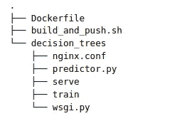

容器的文件结构。(decision_trees 是算法的名称，我们可以用我们的算法/用例名称来替换它)(图片来自 AWS github 资源库)

让我们逐一查看所有文件:

**Dockerfile:**
这个文件描述了如何构建你的 Docker 容器映像。它是一个文本文档，包含用户可以在命令行调用的所有命令，以组装映像，还包含安装各种软件包、设置活动工作目录、复制目录等命令。

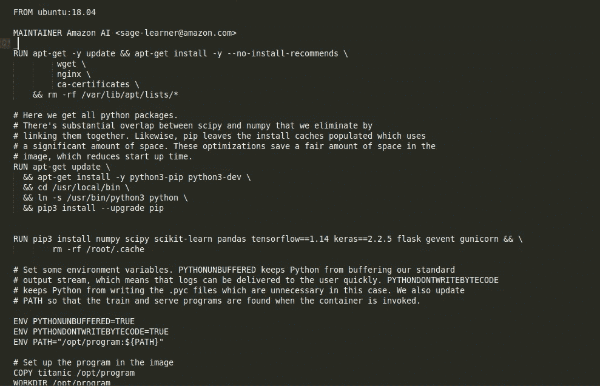

上图显示了我们的泰坦尼克号用例的 docker 文件(图片由作者提供)

上图是我们泰坦尼克号用例
的 docker 文件在 docker 文件中，我已经安装了 Tensorflow、Scikit-learn、Keras 等库。这将用于处理、训练训练数据上的模型，并用于对测试数据进行推断。我已经用 Ubuntu 18.04 做基础图了。

**Build_and_push.sh** 是一个脚本，它使用 docker 文件构建您的容器映像，然后将其推送到 ECR。

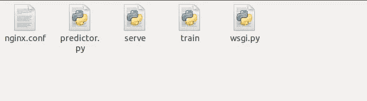

上图显示了容器中列出的文件(图片由作者提供)

1.  **nginx.conf** 是 nginx 前端的配置文件。一般来说，我们照原样接受这个文件。
2.  **predictor.py** 是实际实现 Flask web 服务器和这个应用程序的巨大预测的程序。我们将对其进行定制，以对测试数据执行预处理并执行推断。
3.  **serve** 是容器启动托管时启动的程序。它只是启动 gunicorn 服务器，运行 predictor.py 中定义的 Flask 应用程序的多个实例。
4.  **train.py** 是运行容器进行训练时调用的程序。在这个文件中，我们定义了预处理步骤、模型训练以及最终将模型保存到模型目录中。
5.  **wsgi.py** 是一个用于调用 Flask 应用的小包装器。我们不需要修改这个文件。

dockerfile 文件中设置的工作目录将是 opt/ml/。以下是该目录的文件夹层次结构。

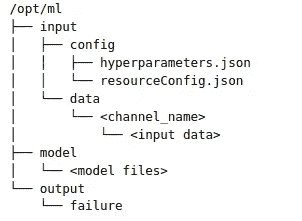

上图显示了 opt/ml 目录中的文件夹结构(图片来自 AWS github 资源库)

# 让我们从需要在各种文件中完成的更改开始:

**Step1** : **克隆仓库**
你可以从 [github](https://github.com/bhavesh0124/Deep-Learning-Container-Deployment-on-Amazon-Sagemaker---Titanic-Dataset) 克隆我的 repo 或者克隆官方 AWS 仓库

**步骤 2** : **编辑 docker 文件**
其次，我们需要对 docker 文件进行修改，我们需要在其中指定整个训练和推理过程所需的所有库。为了部署深度学习模型，您可能需要 Tensorflow、Keras 等库..
**注意-** 检查受支持的 Keras 和 Tensorflow 的正确版本。我们没有在 docker 文件中指定容器的入口点，所以 docker 将在训练时运行 train.py，在服务时运行 serve.py。
我们还需要将容器文件夹复制到 opt/ml 目录，并将其设置为容器的活动工作目录。参考下图:

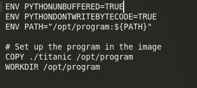

图中显示 Titanic 文件夹设置为活动工作目录(图片由作者提供)

**第三步:编辑 train.py 文件**
现在我们的 docker 文件已经准备好了，我们需要开始编辑训练和处理代码。对于当前的数据集来说，预处理并不多，因此我将它合并到了 train.py 文件本身中。我们需要做一些修改，尤其是在 train()函数中。请参考下图:

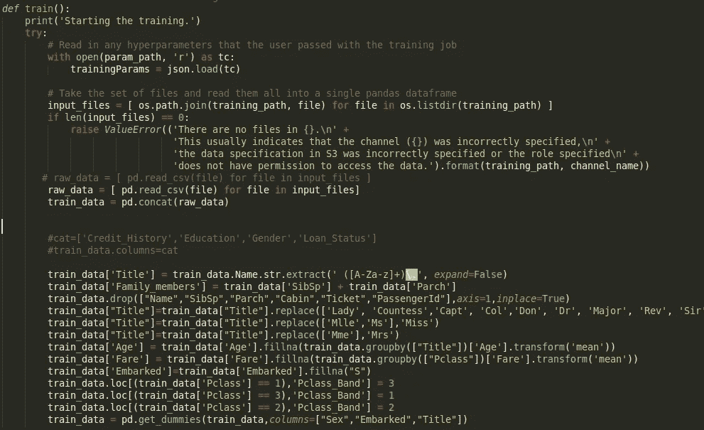

在将训练数据提供给模型进行训练之前，需要对训练数据进行预处理(图片由作者提供)

以下是我在 titanic 数据集上实现的预处理的一部分:
1 .将标题从名称中分离出来，并将其添加到不同的类别中，如稀有、错过等。
2。创建一个新功能“Family_members ”,增加了 SibSp 和 Parch。
3。通过对标题分组并取平均值来处理年龄列中的缺失值。
4。通过对 Pclass 分组并取平均值来处理 Fare 列中缺失的值。
5。通过用“S”(模式)
6 替换来处理 apollowed 中缺失的值。通过创建新列 Pclass_Band 来反转 Pclass 的值，以创建与票价的正相关。
7。一个热点编码的栏目“性别”，“已上市”和“标题”。

现在我们必须定义我们的模式架构。
对于 Titanic 数据集，我定义了两个隐藏层，分别具有 8 个和 4 个神经元，每个层中具有 Relu 激活函数，以及一个输出层，具有 1 个具有 Sigmoid 激活函数的神经元。
为了编译模型，我使用了 Adam optimizer、binary_crossentropy loss 和 accuracy 作为验证指标。
现在，我们使用 model.fit 函数对这个模型进行大约 200 个时期的训练，批次大小为 8。我没有为这个模型执行任何超参数调整，因此可以更改这些值以获得更好的精度。

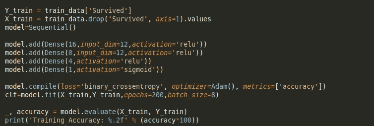

该图显示了用于训练模型的 Keras 连续层(图片由作者提供)

最后，我们将模型 pickle 文件保存在模型目录中。

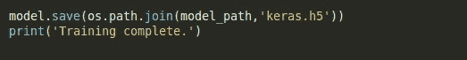

该图显示了在定义的模型路径中保存训练好的模型(图片由作者提供)

**步骤 4:编辑 predict.py 文件** 由于测试文件将类似于训练集，我们必须执行相同的预处理步骤，然后才能从训练好的模型中进行推断。我们必须在预测函数中添加所有这些步骤。

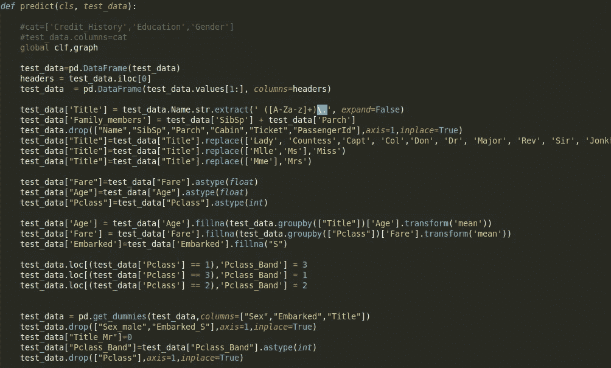

上面的截图显示了 predict 函数中的预处理步骤(图片由作者提供)

一旦我们定义了所有的预处理步骤，就该加载训练好的模型文件了。为此，我们需要定义 model_path 来定位文件。这里的路径是 opt/ml/model/keras.h5。为了加载模型，我使用了 keras .models 中的 load_model 命令。我们还需要初始化 Tensorflow 默认图，该图将用于从我们训练好的神经网络中获取预测。

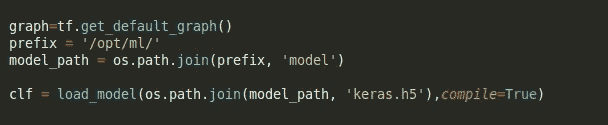

上图显示了训练好的模型的加载(图片由作者提供)

一旦加载了模型，处理了测试数据，就该进行预测了。预测代码也在预测函数中定义。

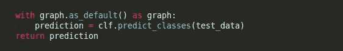

上面的快照显示了从训练好的模型中获取预测的命令(图片由作者提供)

# 容器的本地测试:

当我们第一次用 Amazon SageMaker 打包一个算法时，我们想自己测试它，以确保它工作正常。在目录 container/local_test 中，有一个框架可以做到这一点。它包括运行和使用容器的三个 shell 脚本和一个目录结构:

这些脚本是:

## **1。train_local.sh:**

用图像的名字运行这个，它将在本地树上运行训练。我们还需要修改目录 test_dir/input/data/…以便为算法设置正确的通道和数据。因此，在这个目录中，我们将放置泰坦尼克号列车的数据。

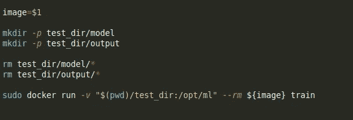

以上截图为 train_local.sh 脚本(图片由作者提供)

## 2. **serve_local.sh** :

一旦我们训练了模型，我们需要用图像的名称运行这个文件，它应该为模型服务。这个文件反过来运行容器中的 serve.py 文件。这基本上启动了一个监听端口 8080 的 python 应用程序，并启动了 ngnix 和 gunicorn。
Nginx 是来自互联网的请求首先到达的地方。它可以非常快速地处理它们，并且通常被配置为只让那些真正需要到达 web 应用程序的请求通过。
**Gunicorn** 将从 Nginx 获得的请求转换成您的 web 应用程序可以处理的格式，并确保您的代码在需要时执行。

## 3.预测. sh:

这个脚本以一个有效负载文件的名称和(可选的)我们想要的 HTTP 内容类型运行。内容类型将默认为文本/csv。例如，我们可以运行$。/predict.sh payload.csv 文本/csv。这里，我们需要粘贴 Titanic 测试文件，并将其重命名为 payload.csv。在本地测试模型时，我们会将该文件作为输入进行传递。

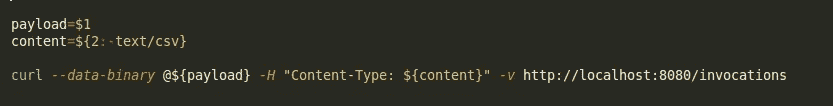

上面的快照描述了预测脚本(图片由作者提供)

# 本地测试的步骤:

> **第一步:构建 docker 映像:**
> *为了构建 docker 映像，我们需要移动到容器目录并运行以下命令:*
> **sudo docker build。-t 泰坦尼克 _ 图片**

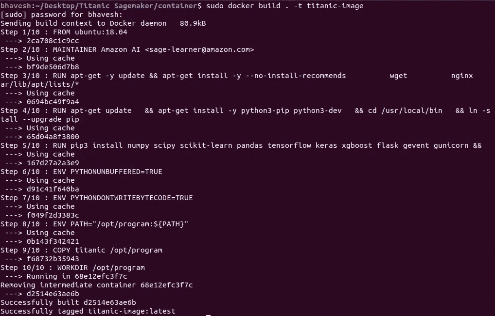

上面的截图显示了泰坦尼克号的成功建造

> **第二步:训练模型:** *在这一步我们需要训练模型，并将它的 pickle 文件保存在 model 目录下。为此，我们需要使用下面的命令运行 train_local.sh 脚本。*
> **CD local _ testsudo bash train _ local . sh 泰坦尼克-image**

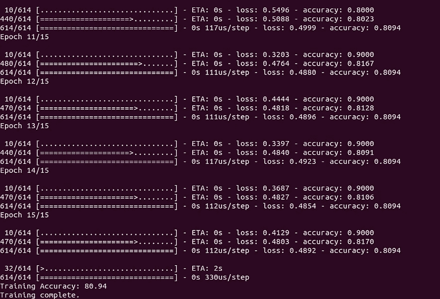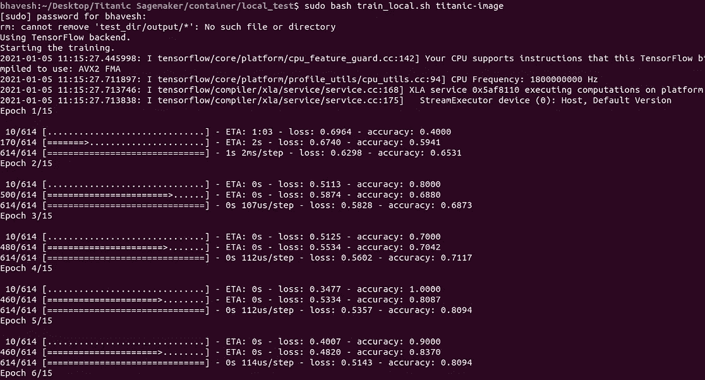

上面的快照显示了我们的神经网络在泰坦尼克号上的成功训练

> **步骤 3:运行 serve 脚本** *下一步是运行 flask 应用程序，为此我们需要使用以下命令运行 serve_local.sh 脚本:* **sudo bash serve _ local . sh titanic-image**

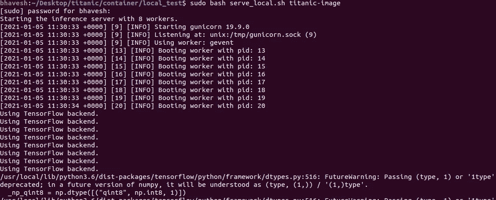

上图显示了有 8 个工作人员的运行服务器(图片由作者提供)

> **步骤 4:运行预测脚本** *我们必须让服务器脚本在一个选项卡中运行，而在另一个选项卡上，我们可以运行预测脚本来获得模型推断。Payload.csv 文件(Titaninc 测试数据集)将作为参数传递给模型，我们将使用 bash 命令传递该文件以运行 predict.sh 脚本。通过运行它，我们用有效负载文件在端口 8080 上攻击服务器，然后服务器返回预测值作为响应。这形成了一个请求响应范例。* **sudo bash predict . sh payload . CSV**

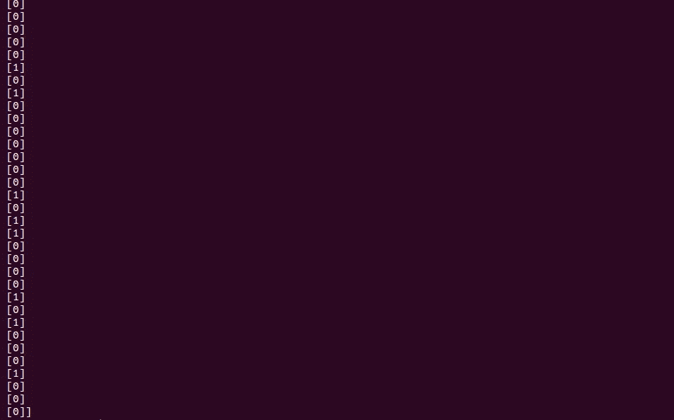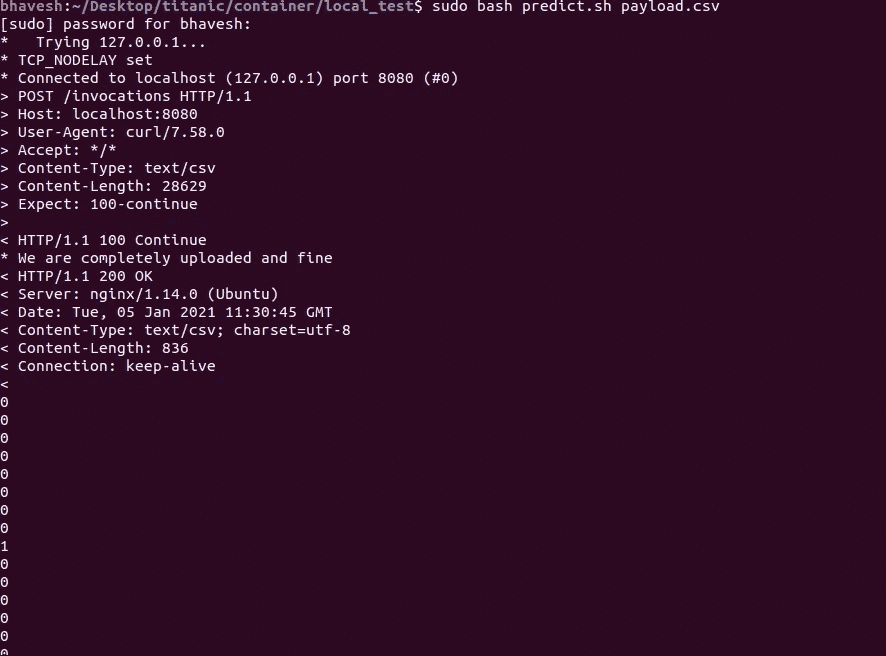

上面的快照显示了模型的输出预测值(图片由作者提供)

## 现在终于到了将我们的容器图像推送到 Amazon ECR 的时候了！！

# 构建和推动

现在是时候建立和推动我们的码头形象 ECR。最后一步可以使用 Sagemaker Notebook 实例来完成。确保实例具有 sagemaker 完全访问权限、输入文件和模型文件所在的 S3 存储桶访问权限、ECR 等。
首先，我们需要将 titanic 文件夹上传到笔记本实例中的 Sagemaker Jupyter 实验室。接下来，我们需要在笔记本内部构建 docker，并将图像本地推送至 ECR。
下面的代码可以在 build_and_push.sh 文件或者 Bring _ Your _ Own-Creating _ Algorithm _ and _ Model _ Package 笔记本里面找到。

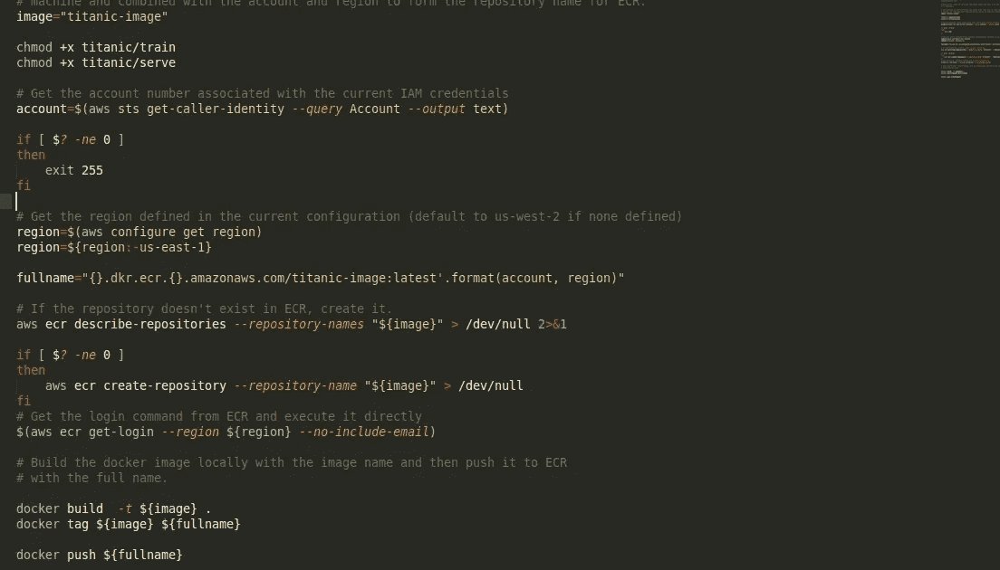

下面的代码将 docker 图像推送到带有标签“latest”的 ECR(按作者排序的图像)

一旦我们有我们的形象推到 ECR，我们可以训练模型。为此，第一步是将我们的训练和批量推理数据上传到 S3。然后，我们需要创建一个估计器并拟合模型。最后，我们可以运行批处理推理作业来测试模型输出。我们可以进一步将模型部署为 Sagemaker 端点。您可以在存储库内的 jupyter 笔记本中找到这些附加步骤。

这就是我们如何在 Amazon Sagemaker 上部署我们的模型容器。