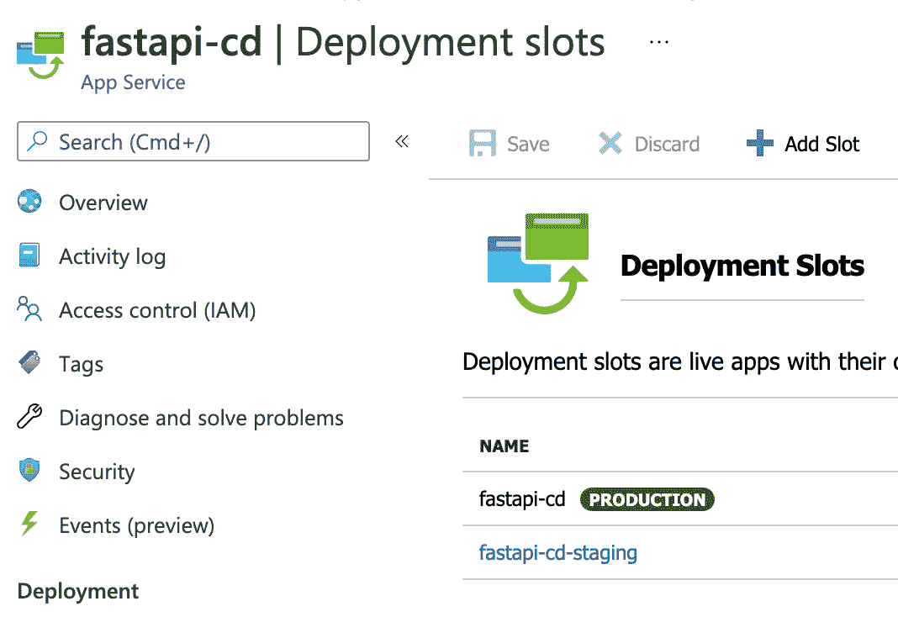

# 使用 Github 操作在 Azure 上部署 FastAPI

> 原文：<https://towardsdatascience.com/deploy-fastapi-on-azure-with-github-actions-32c5ab248ce3?source=collection_archive---------5----------------------->

## 使用 Github 动作自动化您的部署工作流程

# Github 操作

Github Actions 是一个新的工作流自动化工具，用于直接从 Github 构建、测试和部署您的代码。

如果您已经在使用 Github 作为代码库，那么就没有必要集成第三方工具来自动化常见的开发人员工作流。

只需在存储库中放置一个 Github Actions `.yml`文件，该文件设计为响应特定事件而运行。(推送、拉取请求等)

# 工作流程图

今天，我们将通过一个示例工作流，使用 Python 构建一个准系统 API，选择 FastAPI 作为框架。


Github 动作工作流程图。图片由[作者](https://natworkeffects.medium.com)提供。

我们将构建一个容器映像并将其推送到 Azure Container Registry，并将该映像拉入 Azure Web 应用程序进行部署。

请注意，本文假设您事先了解下面列出的技术。

给出的 shell 命令示例是在 macOS 上。但是如果您在 Windows 上开发，您应该能够找到等效的命令。

我们将利用的产品包和技术的完整列表包括:

*   [VS 代码](https://code.visualstudio.com/) —作为首选的 IDE。
*   pipenv——处理包依赖关系、创建虚拟环境和加载环境变量。
*   FastAPI— Python API 开发框架。
*   uvicon—FastAPI 应用程序的 ASGI 服务器。
*   [Docker 桌面](https://www.docker.com/products/docker-desktop) —在我们的本地机器上构建并运行 Docker 容器映像。
*   Azure Container Registry——用于在 Azure cloud 中存储我们的容器映像的存储库。
*   Azure 应用服务——托管 FastAPI 应用服务器的 PaaS 服务。
*   Github Actions —自动化 FastAPI 应用程序的持续部署工作流程。

继续从上面的链接下载 VS Code 和 Docker Desktop，因为我们在整个指南中都需要这两个程序。

# 本地计算机上的项目设置

## 创建您的项目文件夹

在终端中，导航到要创建项目的文件夹，并运行以下命令。

```
mkdir fastapi-cd
cd fastapi-cdcode .
```


创建项目文件夹。Gif by [作者。](https://natworkeffects.medium.com)

VS 代码应该从您创建的项目文件夹开始。

## 安装管道

pipenv 是一个多功能包，它消除了 Python 应用程序中常见的对`requirements.txt`文件的需求。

点击`Ctrl + ~`打开 VS 代码终端，输入命令:

```
sudo -H pip install -U pipenv
pipenv install fastapi uvicorn
```


pipenv 安装包。Gif 作者[作者](https://natworkeffects.medium.com)。

pipenv 将继续在虚拟环境中安装库，并在`Pipfile`中为您管理依赖关系。


Pipfile 包管理。图片由[作者](https://natworkeffects.medium.com)提供。

因为 pipenv 为您的项目创建了一个虚拟环境，所以您也不需要使用常规的`venv / virtualenv`命令。

只需使用`pipenv shell`激活虚拟环境。

```
pipenv shell
uvicorn --versionexit
uvicorn --version
```

使用`exit`命令退出虚拟环境。

请注意，在环境之外无法再访问 uvicorn。它仅安装在使用`pipenv shell`可访问的虚拟环境中。


用 pipenv shell 激活虚拟环境。Gif 作者[作者](https://natworkeffects.medium.com)。

## 创建项目文件

在项目目录中创建以下文件。

```
touch main.py .env .gitignore .dockerignore Dockerfile
```

在`.gitignore`和`.dockerignore`文件中，将`.env`列为项目文件夹中要忽略的文件。

## 开源代码库

创建一个没有任何文件的裸 Github repo 并复制 repo URL。

开始跟踪本地回购的变化。在 VS 代码终端中，运行:

```
git init
git add .
git commit -m "first commit"git remote add origin <github repo url>
git push -u origin main
```

## 码头工人

前往 [Docker 桌面](https://www.docker.com/products/docker-desktop)安装程序。

这允许您在本地机器上运行 Docker 命令。

<https://www.docker.com/products/docker-desktop>  

# 密码

我们终于完成了设置。该编码了。回到 VS 代码。在`.env`中，设置`PORT=8000`。

在`main.py`中，输入以下代码:

main.py 文件。Github gist 作者[作者](https://natworkeffects.medium.com)。

默认地址路由现在将向您返回一条成功消息。

在 VS 代码终端运行`pipenv run python main.py`启动 uvicorn 服务器:

然后转到`[http://localhost:8000/docs](http://localhost:8000/docs)`查看 FastAPI 是否在运行。


FastAPI swagger 文档。图片由[作者](https://natworkeffects.medium.com)提供。

注意，在运行`main.py`之前，pipenv 会为您加载环境变量`PORT=8000`。

## 构建并运行容器映像

不要将我们的应用程序部署为一个包，让我们将我们的应用程序构建为一个 Docker 映像，这样构建过程将在`Dockerfile`中概述。

`Dockerfile`使构建过程无缝且可重复。

在`Dockerfile`中，写下以下内容:

Dockerfile。Github gist 作者[作者](https://natworkeffects.medium.com)。

构建您的容器，并检查图像是否是用`docker images`命令创建的。

```
docker build . -t fastapi-cd:1.0
docker images
```

在端口 8000 上使用您之前指定的图像标签运行您的容器。

```
docker run -p 8000:8000 -t fastapi-cd:1.0
```

前往`[http://localhost:8000/docs](http://localhost:8000/docs)`查看您的集装箱化申请。

您应该看到同一个 FastAPI 应用程序正在运行。

恭喜你！您刚刚构建了一个简单的 FastAPI 应用程序，并在本地机器上使用 Docker 容器对其进行了容器化。

# 基础设施设置

## Azure 容器注册表

是时候在 Azure 中部署我们的应用了。首先，创建一个 Azure 容器注册表。


创建 Azure 容器注册表。图片由[作者提供。](https://natworkeffects.medium.com)

在访问键窗格中启用管理员用户选项。


启用管理员用户。图片由[作者提供。](https://natworkeffects.medium.com)

回到你的 VS 代码终端，用你的账号登录 Azure。

```
az login
az acr login --name fastapicd
```

构建 Docker 映像并将其推送到注册服务器。

```
docker build . -t fastapicd.azurecr.io/fastapi-cd:1.0docker images
docker push fastapicd.azurecr.io/fastapi-cd:1.0
```


将容器映像推送到 Azure 容器注册服务器。Gif 作者[作者](https://natworkeffects.medium.com)。

检查您的 Docker 映像是否已成功推送到注册表中的 repo。


验证 Azure 容器注册表报告中的容器映像。图片由[作者](https://natworkeffects.medium.com)提供。

## Azure 应用服务

接下来，创建一个 App 服务资源。


创建应用服务。图片由[作者提供。](https://natworkeffects.medium.com)

对于应用服务计划，在生产工作负载选项卡下，将大小更改为标准 S1 SKU。


标准 S1 应用服务计划。图片由[作者](https://natworkeffects.medium.com)提供。

在 Docker configuration 选项卡上，确保您之前推送的容器映像被选中。


将应用程序服务配置为使用容器映像。图片由[作者提供。](https://natworkeffects.medium.com)

资源部署完成后，请转至`[https://<your-webapp-name>.azurewebsites.net/docs](https://<your-webapp-name>.azurewebsites.net/docs)`，检查您的 web 应用程序是否正在运行。

您应该会看到 FastAPI swagger 文档页面呈现。

# Github 操作

现在我们已经准备好创建我们的 Github 动作了。yml 文件，它将自动部署我们的 FastAPI 应用程序。

在 VS 代码中，创建一个`.github/workflows` *目录*和一个`prod.workflow.yml`文件。

```
mkdir .github
cd .githubmkdir workflows
cd ..touch .github/workflows/prod.workflow.yml
```

建立你的`prod.workflow.yml`文件，如下所示:

prod.workflow.yml 文件。Github gist 作者[。](https://natworkeffects.medium.com)

现在，每当我们对主分支进行 git 推送时，Github Actions 将运行一个部署作业，该作业由上面的 5 个步骤组成，每个步骤都有自己的名称。

使用 git 命令将这个新文件推送到 Github:

```
git add .
git commit -m "github actions deployment workflow"
git push
```

## 服务主体

为了用 Github 操作自动化我们的部署工作流，我们需要给操作运行者一个服务主体来认证 Azure，并执行应用部署。

在 VS 代码终端中，运行:

```
az ad sp create-for-rbac --name "github-actions" --role contributor --scopes /subscriptions/<GUID>/resourceGroups/fastapi-cd --sdk-auth
```

您可以从用于创建资源组的订阅中获取订阅 GUID。

您将得到如下响应:

创建服务主体 JSON 响应。Github gist 作者[作者](https://natworkeffects.medium.com)。

复制响应并保存。你再也看不到它了。

前往 Github 设置，创建 3 个 Github 秘密:

*   AZURE 凭证:上面的完整 JSON 响应。
*   来自 JSON 响应的 clientId 值。
*   来自 JSON 响应的 clientSecret 值。


创建 Github 秘密。图片由[作者](https://natworkeffects.medium.com)提供。

## 将应用服务配置为使用 Github 操作进行持续部署

在 App Service 的部署中心窗格中，链接您的 Github repo 主分支，并配置部署以使用 Github 操作。


将应用程序配置为使用 Github 操作持续部署。图片由[作者](https://natworkeffects.medium.com)提供。

## 创建临时部署插槽

当前应用程序正在生产插槽中运行。为了保证更高质量的部署，我们将创建一个暂存槽。



创建临时部署插槽。图片由[作者提供。](https://natworkeffects.medium.com)

插槽非常有用，原因有很多:

*   可以将变更发布给登台槽中更少%的用户，以便在将登台槽与生产交换之前验证新的版本。
*   暂存槽应用程序实例在交换到生产环境之前会预热，以确保应用程序能够响应请求。
*   如果新版本出现问题，可以再次执行交换来回滚更改。

转到`[https://<your-webapp-name>-staging.azurewebsites.net/docs](https://<your-webapp-name>-staging.azurewebsites.net/docs)`，检查暂存应用是否像生产应用一样运行。

为临时插槽配置与生产插槽相同的部署中心设置。

## 将新版本推送到暂存槽。

在您的 *main.py* 文件中，对返回消息进行修改。

```
return {"data": "Application ran successfully - FastAPI release v2.0"}
```

对主分支进行 git 推送，以触发 Github 操作工作流。

```
git add .
git commit -m "FastAPI v2.0 release"
git push
```

Github Actions 将自动构建并部署新版本的应用程序到 staging slot。


Github 操作部署作业。图片由[作者](https://natworkeffects.medium.com)提供。

前往`[https://<your-webapp-name>-staging.azurewebsites.net/docs](https://<your-webapp-name>-staging.azurewebsites.net/docs)`查看应用程序的新版本。

向默认路由发送请求以检查响应。您应该在返回消息中看到 2.0 版。


验证新应用程序发布到暂存槽。图片由[作者](https://natworkeffects.medium.com)提供。

当您准备好将暂存应用程序切换到生产时，只需在应用程序服务的部署插槽窗格中单击 Swap。


将暂存应用程序换成生产应用程序。图片作者[作者](https://natworkeffects.medium.com)。

通过转到生产 URL `[https://<your-webapp-name>.azurewebsites.net/docs](https://<your-webapp-name>.azurewebsites.net/docs)`，对新应用版本进行与上面相同的验证。

# 结论

开发软件应用程序时，速度很重要。

作为开发人员，有很多事情我们必须跟上——供应基础设施、构建新环境、应用程序测试等。

如果我们将无聊的事情自动化，我们可以将时间集中在最关键的任务上——构建新功能。

在本文中，我们用 Github 动作自动化了 DevOps 生命周期的发布和部署阶段。这让我们有信心经常发布到产品中，而不会出现部署失败。


DevOps 生命周期。

# 资源

本文中的所有代码都可以在 Github repo:

<https://github.com/natworkeffects/fastapi-cd>  

我想对所有帮助完成这篇文章的大量文档和 YouTube 视频大声欢呼:

*   [使用 Github 操作将自定义容器部署到应用服务](https://docs.microsoft.com/en-us/azure/app-service/deploy-container-github-action?tabs=service-principal)
*   [Github 动作报告—部署到 App 服务](https://github.com/Azure/webapps-deploy)
*   [在应用服务中设置暂存槽](https://docs.microsoft.com/en-us/azure/app-service/deploy-staging-slots)
*   [通过 7 个简单步骤学习 Docker 完全初学者教程](https://www.youtube.com/watch?v=gAkwW2tuIqE&ab_channel=Fireship)
*   [用 Docker 封装 FastAPI 应用](https://www.youtube.com/watch?v=2a5414BsYqw&t=146s&ab_channel=incompetent_ian)
*   [将 Docker 图像推送到 Azure 容器注册中心](https://docs.microsoft.com/en-us/azure/container-registry/container-registry-get-started-docker-cli?tabs=azure-cli)
*   [pipenv 教程视频](https://www.youtube.com/watch?v=zDYL22QNiWk&t=1320s&ab_channel=CoreySchafer)
*   [如何在 Docker 容器中运行 pipenv](https://stackoverflow.com/questions/46503947/how-to-get-pipenv-running-in-docker)