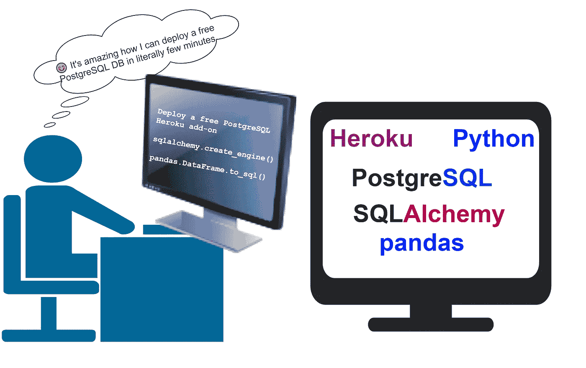
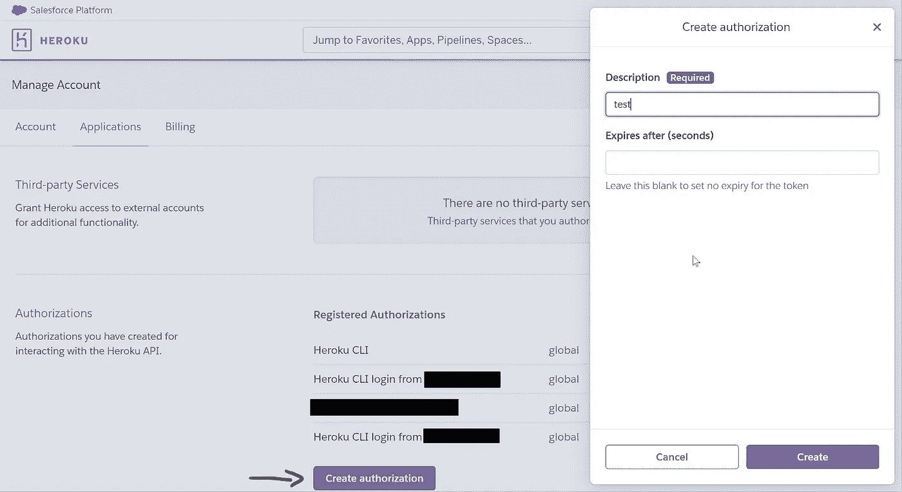
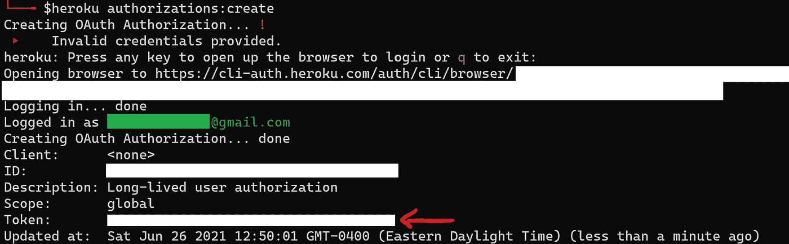

# 免费 PostgreSQL 数据库的逐步部署和数据接收

> 原文：<https://towardsdatascience.com/deploy-free-postgresql-database-in-heroku-and-ingest-data-8002c574a57d?source=collection_archive---------17----------------------->

## 实践教程

## 在 Heroku 中免费部署 PostgreSQL 数据库，并使用 Pandas 和 SQLAlchemy 接收数据



# 在这篇文章中，你将学会如何…

*   *在 Heroku* 部署免费的 PostgreSQL 数据库
*   *生成一个 Heroku API 令牌(以两种方式)*
*   *动态检索 Heroku 数据库 URL(有助于克服免费计划的缺点)*
*   使用 Pandas 和 SQLAlchemy 将数据摄取到数据库中的一个表中
*   **使用 SQLAlchemy 数据类型指定表格中列的数据类型**

# *相关技术的一行摘要*

*PostgreSQL :一个免费的开源对象关系数据库管理系统，强调可扩展性和 SQL 兼容性。*

*[Heroku](https://www.heroku.com/) :平台即服务(PaaS)适合快速部署，只需极少的开发运维经验。*

*[SQLAlchemy](https://www.sqlalchemy.org/):Python SQL 库和对象关系映射器(ORM)，用于与数据库交互。*

*[Pandas](https://pandas.pydata.org/) :一个用于数据分析和操作的开源 Python 库。*

# *先决条件*

*您将需要以下 Python 库*

*   *[熊猫](https://pandas.pydata.org/)*
*   *[心理战 2](https://pandas.pydata.org/)*
*   *[SQLAlchemy](https://www.sqlalchemy.org/)*

*此外*

*   *Heroku CLI (通过在终端输入`heroku --version`来验证您的安装)*

# *Heroku 注册和部署*

*Heroku 是一个平台即服务(PaaS ),使开发人员能够完全在云中构建和运行应用程序。Heroku 提供了一个随时可用的环境，使得在几乎没有开发经验的情况下尽快部署代码变得非常简单。这对于初学者和中小型公司来说是一个极好的选择，不像 AWS 通常需要有经验的开发人员，并且有复杂的部署过程。*

## *1.注册 Heroku 并部署您的第一个 PostgreSQL 数据库*

*你可以免费注册 Heroku。注册并登录到您的帐户后，您将被引导到 Heroku 仪表板。然后，您可以按照以下剪辑中的说明创建一个新的应用程序并添加一个 PostgreSQL 数据库。*

*部署新的 Heroku 应用程序并添加 PostgreSQL 驱动程序*

*免费计划允许您拥有最多 20，000 行数据和最多 20 个到数据库的连接。这个计划对于一个小型的个人项目来说通常是足够的。*

> *注意:在免费计划中，数据库凭证偶尔会改变，因为 Heroku 会定期轮换凭证，有时会执行维护。*

*为了解决数据库凭证偶尔更改的问题，我们可以使用 Heroku CLI 动态检索数据库 URL。但是首先，让我们回顾一下通过 Heroku CLI 登录您的帐户的步骤。*

# *2.使用令牌访问您的 Heroku 帐户*

**👉本节所涵盖的内容通常适用于通过****Heroku CLI****使用任何 Heroku 应用程序。**

# *2.1.生成 Heroku API 令牌*

*您可以通过以下两种方式生成令牌:*

***2.1.1。Heroku 账户(浏览器)***

*进入**账户设置→应用**。在**授权**部分，点击**创建授权**。您必须在打开的窗口中给出描述，并设置到期时间，或者只设置令牌没有到期时间(通过将该框留空)。*

**

*从 Heroku 仪表板创建 Heroku API 令牌*

***2.1.2。Heroku CLI(终端)***

*安装 Heroku CLI 后，首次尝试使用需要访问您的帐户的命令时，系统会提示您在浏览器上登录 Heroku 帐户。一旦登录，你可以通过 Heroku API 做几乎任何事情。例如，我们可以通过运行以下命令来创建令牌:*

```
*$heroku authorization:create*
```

*以上命令将为您生成一个长期令牌。第一次运行上述命令时，会在浏览器中提示您登录您的帐户。一旦您成功登录到您的帐户，您就可以返回到终端并查看生成的令牌，如下所示。*

**

*通过 Heroku CLI 生成 Heroku API 令牌*

# *2.2.在您的环境中存储您的 Heroku 令牌*

*现在您已经有了 Heroku API 令牌，您需要在您的终端/环境中将它设置为`HEROKU_API_KEY`。您可以通过在终端中运行以下命令来实现这一点:*

```
*$export HEROKU_API_KEY=<your_token>*
```

***关于 shell 终端变量作用域的提示:**在 shell 终端中设置的变量将只在您运行的终端中可用，并且在关闭它后会死去。相反，你可以把上面的命令放在你的`~/.bash`或`~/.bashrc`文件中，这样这个变量就可以在你打开的任何新终端中使用。这样就不需要再担心设置这个变量了！*

*一旦您在终端中设置了`HEROKU_API_KEY`变量，您就不再需要使用基于 web 的身份验证或用户名和密码来登录。如果您想将 Heroku CLI 用作自动化流程或 CI/CD 的一部分，这一点尤为重要。这样，您不需要每次登录并在任何不同的终端中使用令牌。*

# *2.3 检索 Heroku PostgreSQL 数据库 URL*

*您可以通过运行以下命令来获取数据库 URL:*

```
*$heroku config:get DATABASE_URL --app <your-app-name>*
```

*这将以如下格式输出数据库 URL*

*`postgres://<db_user>:<db_password>@<db_host>/<db_name>`*

*我们可以使用 Python 的标准库[子进程](https://docs.python.org/3/library/subprocess.html)来运行上述命令并检索数据库凭证。这样我们就可以用 Python 编写所有的代码。*

*使用子进程库从 Python 中检索 Heroku 应用程序的数据库 URL*

***注意:**您的 Python (iPython)终端/环境应该设置了`HEROKU_API_KEY`。您可以通过运行`os.environ["HEROKU_API_KEY"]`并验证输出中的令牌来验证这一点。*

# *将数据摄取到表中*

## *创建 SQLAlchemy 引擎*

*在我们使用 Pandas 将数据接收到已部署的 PostgreSQL 数据库的表中之前，我们必须创建一个 SQLAlchemy 引擎，它将被传递给 Pandas 方法。可以使用以下代码片段创建 SQLAlchemy 引擎/连接:*

*检索数据库 URL 并创建 SQLAlchemy 引擎*

*正如您在上面可能注意到的，在创建 SQLAlchemy 引擎之前，需要进行一些字符串操作。*

# *使用 Pandas & SQLAlchemy 摄取数据*

*我们可以通过简单地使用 pandas `to_sql()`函数并将 SQLAlchemy 引擎/连接对象传递给它，将数据摄取到一个表中。*

*使用 Pandas [to_sql()](https://pandas.pydata.org/pandas-docs/stable/reference/api/pandas.DataFrame.to_sql.html) 函数填充 PostgreSQL 表*

*在上面的示例中，指定了几列的数据类型。您可以通过传递一个字典来确定列的 dtype，字典中的键应该是列名，值应该是 SQLAlchemy 类型。对于所有可用的 dtypes，您可以查看 SQLAlchemy [文档](https://docs.sqlalchemy.org/en/14/core/type_basics.html)以了解它支持的数据类型。*

# *其他提示*

*使用 pandas `[read_sql_table()](https://pandas.pydata.org/pandas-docs/stable/reference/api/pandas.read_sql_table.html)`将数据读入 Pandas 数据帧。*

```
*df = pd.read_sql_table(
	"covid19",  # table name
	con=engine
)*
```

*您可以使用 SQLAlchemy 的`[.execute(“SQL Query”)](https://docs.sqlalchemy.org/en/14/core/engines.html#sqlalchemy.create_engine)`函数运行原始 SQL 查询。例如，如果您想通过运行 SQL 查询删除上面的表，可以通过执行以下操作来实现:*

```
*engine.execute("DROP TABLE covid19")*
```

*上面将创建一个 SQLAlchemy 游标。*

# *结论*

*在这篇文章中，我们使用 Heroku free plan 部署了一个免费的 PostgreSQL 数据库。我们还通过 Heroku CLI 动态检索数据库凭证，解决了 Heroku 在自由计划中更改数据库凭证的问题。使用 Pandas 的`to_sql()`函数，我们快速创建了一个表，甚至通过 SQLAlchemy 数据类型指定了列的数据类型。*

*感谢阅读🙏*

> *[***加入我的邮件列表接收类似帖子***](https://www.ealizadeh.com/subscribe/) 。也可以关注我上 [***中***](https://medium.com/@ealizadeh)[***LinkedIn***](https://www.linkedin.com/in/alizadehesmaeil/)，[**Twitter**](https://twitter.com/intent/follow?screen_name=es_alizadeh&tw_p=followbutton)。*

# *有用的链接*

*[](https://devcenter.heroku.com/articles/authentication) [## Heroku CLI 认证

### 对 Heroku 的身份验证使用以下机制之一，具体取决于具体情况:基于 Web 的身份验证…

devcenter.heroku.com](https://devcenter.heroku.com/articles/authentication)  [## 熊猫。DataFrame.to_sql - pandas 1.2.5 文档

### 将存储在数据帧中的记录写入 SQL 数据库。支持 SQLAlchemy [1]支持的数据库。桌子可以…

pandas.pydata.org](https://pandas.pydata.org/pandas-docs/stable/reference/api/pandas.DataFrame.to_sql.html)  [## SQLAlchemy 1.4 文档

### SQLAlchemy 为最常见的数据库数据类型提供了抽象，并提供了一种机制来指定您自己的自定义…

docs.sqlalchemy.org](https://docs.sqlalchemy.org/en/14/core/type_basics.html)* 

**原载于*[*https://ealizadeh.com*](https://ealizadeh.com/blog/deploy-postgresql-db-heroku)*。**