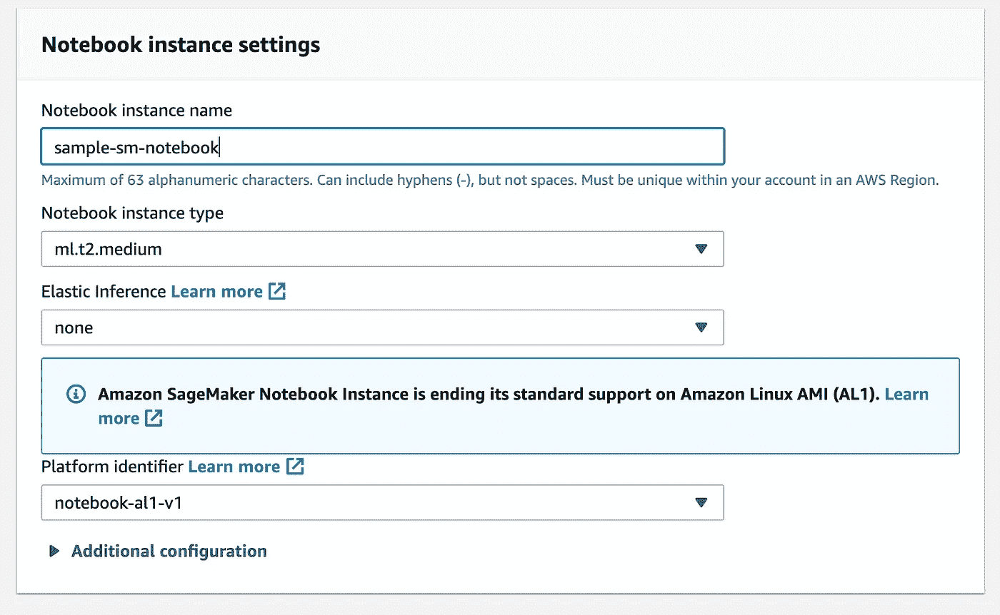
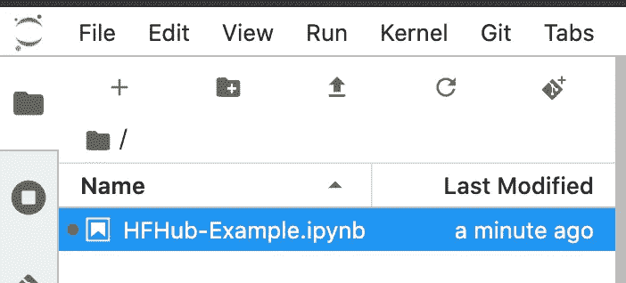
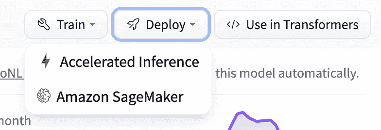
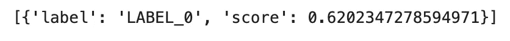

# 10 分钟内在亚马逊 SageMaker 上部署 HuggingFace 模型

> 原文：<https://towardsdatascience.com/deploy-huggingface-models-on-amazon-sagemaker-under-10-minutes-d52ee8b2cd25?source=collection_archive---------23----------------------->

## 使用 HuggingFace Hub 大规模部署 NLP 模型

图片来自 [Unsplash](https://unsplash.com/photos/Oaqk7qqNh_c)

我通常讨厌点击诱饵标题，所以我将保证这不是一个开始这篇文章。[hugging face Hub](https://huggingface.co/models)包含数千种不同的自然语言处理模型，适用于从摘要到文本生成的各种自然语言处理任务。今年早些时候，[亚马逊 SageMaker](https://huggingface.co/blog/the-partnership-amazon-sagemaker-and-hugging-face) 与 HuggingFace 合作发布了 AWS 管理的 HuggingFace 容器，使得将 HF 模型和脚本带到云上比以往任何时候都更容易。在本文中，我们将探索一个简单的例子，用几行简单的代码从 AWS SageMaker 上的 **HF Hub** 部署 **bert-base-uncased** **预训练模型**。在继续这篇文章之前，AWS 的一些**先验知识**和 SageMaker 是如何操作的，有望完全理解所有的内容。

# 目录

1.  设置
2.  SageMaker 上的高频部署
3.  结论/额外资源

# 设置

对于这个例子，我们将使用传统的 SageMaker 笔记本实例。首先转到 AWS 控制台上的 SageMaker，然后点击**笔记本实例**。在笔记本实例中，您可以选择创建笔记本实例。在这里，您可以选择一个具有适当计算能力的实例，这个例子并不太密集，所以我们可以使用更便宜的 ml.t2.medium。

作者截图

接下来，您将被要求创建一个角色，该角色将在必要时授予您的实例使用其他服务的权限。**对于这个用例，保留默认的执行角色**和 SageMaker 完全访问权限，因为我们不会使用任何其他 AWS 服务。接下来创建 Notebook 实例，您应该可以选择访问 Jupyter 实验室环境，您可以在其中工作。在这里你可以创建一个合适内核的笔记本。Python3 内核对于这个例子来说已经足够了。现在我们有了一台笔记本电脑，可以在上面部署我们的 HF 模型。

作者截图

# SageMaker 上的高频部署

要访问我们正在使用的模型，请转到下面的 HF [Hub link](https://huggingface.co/bert-base-uncased) 。这个模型是预先训练好的，可以完成各种任务，我们将专门用它来进行**文本分类**。使用来自 Hub 的预训练模型的令人惊叹之处在于，当它们集成在一起时，它们已经为我们提供了在 SageMaker 上部署的指导。一旦进入高频集线器链接，在右上角的**中**你会注意到**展开**。如果你点击选项，你会看到亚马逊 SageMaker。

作者截图

点击 SageMaker 后，您可以选择任务类型(文本分类)并为**配置**选择 **AWS** 。这将提供样板代码，您可以在您的笔记本实例中利用它来部署这个特定的模型。

导入和集线器配置

HF 模型 ID 和任务是 HuggingFace 容器如何理解我们正在处理的模型和它试图解决的问题。我们现在可以通过 SageMaker 定义内置的 [HuggingFace 模型](https://sagemaker.readthedocs.io/en/stable/frameworks/huggingface/sagemaker.huggingface.html)。

创建 HF SageMaker 模型

创建 HuggingFace 模型后，最后一步也是最简单的一步是使用 [SageMaker 实时](https://docs.aws.amazon.com/sagemaker/latest/dg/realtime-endpoints.html)端点部署它以进行推理。

将 HuggingFace 模型部署到实时端点

在端点成功部署后，我们可以快速测试一些示例推断。

SageMaker 推理

这样，我们应该可以看到文本分类结果与多数类一起显示。

作者截图

如果当前不使用端点，请确保将其删除，以免产生任何额外费用。

删除端点

# 结论

HuggingFace 拥有大量的 NLP 资源，SageMaker 有助于将这些模型扩展到令人难以置信的规模。从 HuggingFace Hub 部署只是 SageMaker 的一种部署方法。您还可以从 S3 的模型数据中部署 HuggingFace 模型。您还可以训练 HuggingFace 估计器，然后部署一个[定制推理脚本](https://github.com/aws/sagemaker-huggingface-inference-toolkit)，让您管理输入和输出。为了进一步探索，我在附加资源类别中附加了一些例子和文章。

我希望这篇文章对使用 Amazon SageMaker 和 HuggingFace 的人有用。如果你对 ML & AWS 感兴趣，欢迎在评论中留下任何反馈或在 [LinkedIn](https://www.linkedin.com/in/ram-vegiraju-81272b162/) 上与我联系。如果对我的更多作品感兴趣，请务必关注我的[媒体](https://ram-vegiraju.medium.com/)。感谢您的阅读。

# 额外资源

[SageMaker 拥抱脸文档](https://docs.aws.amazon.com/sagemaker/latest/dg/hugging-face.html)

[用 SageMaker 笔记本拥抱脸示例](https://github.com/huggingface/notebooks/tree/master/sagemaker)