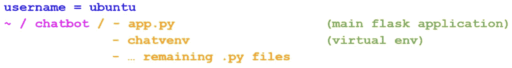

# 使用 Nginx 和 Gunicorn 部署多个 Flask 应用程序

> 原文：<https://towardsdatascience.com/deploy-multiple-flask-applications-using-nginx-and-gunicorn-16f8f7865497?source=collection_archive---------7----------------------->

来自 [Pexels](https://www.pexels.com/photo/close-up-photo-of-mining-rig-1148820/?utm_content=attributionCopyText&utm_medium=referral&utm_source=pexels) 的 [panumas nikhomkhai](https://www.pexels.com/@cookiecutter?utm_content=attributionCopyText&utm_medium=referral&utm_source=pexels) 的照片

这篇博文是关于如何使用 Nginx 和 Gunicorn 在 Linux 服务器上部署多个 Flask 应用程序的分步教程。

在本教程中，我假设您已经有了一个可以使用 IP 地址 ssh 到的服务器。我还假设你对创建 Flask 应用程序有基本的了解，因为我不会详细讨论。

我在本教程中使用的 VPS 运行在 Ubuntu 上。其实，如果你想知道如何购买和配置一个 VPS，你可以查看这个[视频](https://www.youtube.com/watch?v=goToXTC96Co&ab_channel=CoreySchafer)。此外，如果您不熟悉创建 Flask 应用程序，您可以查看此[文档](https://flask.palletsprojects.com/en/1.1.x/quickstart/)。

我们开始吧！

# 本地机器:

在我的本地机器上，我有一个 Flask 应用程序，我想把它部署在我的远程 VPS 上，(实际上我有两个应用程序，但是现在让我们只关注一个应用程序)。

图片来自 memegenerator.net

我的应用程序位于一个名为*“chatbot”*的目录下，其中包含了主 Flask app 文件 *(app.py)* ，我的虚拟环境 *(chatvenv)* ，以及一些帮助文件。因此，在我的本地机器上，我使用`scp`命令将我项目的所有文件复制到远程服务器上。

`$ scp -r Desktop/chatbot ubuntu@IP_ADDRESS:~/`

⚠️请记住，根据您的服务器配置，可能会要求您提供密码。此外，请确保您更改了本地路径，以及远程服务器的用户名和 IP 地址！

# 虚拟专用服务器

让我们现在连接到我们的副总裁，以便做肮脏的工作

`$ ssh ubuntu@IP_ADDRESS`

现在我们已经在服务器上了，让我们安装 python 和虚拟环境包。然后，在我们的项目文件夹中创建一个虚拟环境。

`~$ sudo apt install python3-pip`

`~$ sudo apt install python3-venv`

`$ python3 -m venv chatvenv`

下面是我们目录树结构的概述:

现在，我们将使用以下命令激活虚拟环境:

`$ source chatvenv/bin/activate`

如果您已经有了一个 *requirements.txt* 文件，那么您可以简单地使用下面这个不言自明的命令来安装您项目的需求。相反，您必须手动安装您的应用程序所依赖的包。

`(chatvenv)$ pip install -r requirements.txt`

之后，尝试执行以下两个命令来运行您的应用程序。

`(chatvenv)$ export FLASK_APP=app.py`

`(chatvenv)$ flask run --host=0.0.0.0`

最后，您可以通过浏览器访问您的应用程序来检查一切是否正常:`[http://IP_ADDRESS:5000/](http://IP_ADDRESS:5000/)`

# Nginx 和 Gunicorn

虽然到目前为止你对你的工作很满意，但是我们的方法有两个问题。首先，正如您在终端中看到的，Flask 运行在开发模式下。第二，应用程序在前台运行，如果我们点击`^C`来取回我们的终端，应用程序将不再可达。

为了解决这个问题，我们将使用一个 web 服务器( *Nginx* )、一个 Web 服务器网关接口( *Gunicorn* )，并将我们的执行妖魔化，以便应用程序将在后台运行。

让我们首先在我们的虚拟环境中安装 *Nginx* 和 *Gunicorn*

`(chatvenv)$ sudo apt install nginx`

`(chatvenv)$ pip install gunicorn`

现在，您可以使用这个命令将`http://IP_ADDRESS:5000`和您的 Python 逻辑绑定在一起

`(chatvenv)$ cd ~/chatbot`

`(chatvenv)$ gunicorn --bind 0.0.0.0:5000 app:app`

然后在`[http://IP_ADDRESS:5000](http://ip_address:5000)`查看你的应用

⚠️注意，在最后一个命令中，第一个 *app* 指的是 flask app 文件的名称，而第二个 *app* 指的是您在该文件中用来创建应用程序的名称:`app = Flask(__name__)`

现在是时候让 Ubuntu 的 *init* 系统在服务器启动时自动启动 Gunicorn 并为 Flask 应用提供服务了。

首先，让我们退出虚拟环境。

`(chatvenv)$ deactivate`

然后，用下面的代码创建一个项目名为*“chatbot”*的服务文件。别忘了更改用户名( *ubuntu* )、项目名( *chatbot* )和虚拟环境名( *chatvenv* )。

`$ sudo nano /etc/systemd/system/chatbot.service`

`[Unit]`
`Description=Gunicorn instance to serve **chatbot**`

`[Service]`
`User=**ubuntu**`
`Group=www-data`
`WorkingDirectory=/home/**ubuntu**/**chatbot**`
`Environment="PATH=/home/**ubuntu**/**chatbot**/**chatvenv**/bin"`
`ExecStart=/home/**ubuntu**/**chatbot**/**chatvenv**/bin/gunicorn --workers 3 --bind unix:**chatbot**.sock -m 007 **app:app**`

`[Install]`
`WantedBy=multi-user.target`

然后启动、启用并测试 Gunicorn 服务:

`$ sudo systemctl start chatbot`

`$ sudo systemctl enable chatbot`

`$ sudo systemctl status chatbot`

你可能已经注意到了，我不会在这里解释每一行代码。然而，如果你有兴趣了解更多，查看这篇[博客文章](https://www.digitalocean.com/community/tutorials/how-to-serve-flask-applications-with-gunicorn-and-nginx-on-ubuntu-18-04)了解更多细节。

# 将 Nginx 配置为代理请求

在这一节中，我们将通过修改配置文件来配置 Nginx 传递 web 请求。首先，我们在站点可用目录中创建*聊天机器人*文件，然后将它链接到启用了站点的目录。

当你复制/粘贴这段代码时，再次仔细检查名字；否则你会遇到一些麻烦，很明显！

`$ sudo nano /etc/nginx/sites-available/chatbot`

`server {`
`listen 80;`
`server_name **IP_ADDRESS**;`

`location / {`
`include proxy_params;`
`proxy_pass http://unix:/home/**ubuntu**/**chatbot**/**chatbot**.sock;`
`}`
`}`

`$ sudo ln -s /etc/nginx/sites-available/chatbot /etc/nginx/sites-enabled`

运行以下命令检查语法错误

`$ sudo nginx -t`

如果一切顺利，重启 Nginx 服务器；然后配置防火墙，允许完全访问 Nginx 服务器:

`$ sudo systemctl restart nginx`

`$ sudo ufw allow 'Nginx Full'`

最后，你可以在`[http://IP_ADDRESS](http://ip_address:5000)`查看你的应用。恭喜你！现在可以自豪地说，你知道如何使用 Nginx 和 Gunicorn 部署 Flask 应用程序😅。

# 添加另一个烧瓶应用程序

即使我们退出 VPS 环境并关闭本地机器，我们的 Flask 应用程序现在也在上述地址启动并运行。在本节中，我们将做一些更改，以便能够在同一台服务器上同时运行多个应用程序。

首先，让我们将第二个 Flask 应用程序移动到 VPS。然后，正如我们之前所做的，我们开始创建一个虚拟环境( *betavenv* )并安装您的项目的任何需求。因此，文件夹树的新结构现在看起来像这样:

其次，我们用新项目的名称*“beta PP”*创建另一个服务文件，代码如下。再来一次:别忘了更改用户名( *ubuntu* )、项目名( *betapp* )、虚拟环境名( *betavenv* )！

`$ sudo nano /etc/systemd/system/betapp.service`

[Unit]
Description = guni corn instance to serve**beta PP**
After = network . target

【服务】
User =**Ubuntu**
Group = www-data
working directory =/home/**Ubuntu**/**beta PP**
Environment = " PATH =/home/**Ubuntu**/**beta PP**/**beta venv**/bin】
ExecStart =/home/**ubsock-m 007**beta run**:**app****

[安装]
wanted by = multi-user . target

然后启动并启用 Gunicorn 服务:

`$ sudo systemctl start betapp`

`$ sudo systemctl enable betapp`

就像第一个项目一样，我们将配置 Nginx 来传递 web 请求，首先，在站点可用目录中创建 *app2* 文件，然后将它链接到启用了站点的目录。但是，为了让我们的新应用程序正常工作，我们应该选择 80 以外的另一个端口(这里是 5000)。

`$ sudo nano /etc/nginx/sites-available/app2`

服务器{
监听**5000**；
服务器名称 **IP 地址**；

location / {
包含 proxy _ params
proxy _ pass[http://UNIX:/home/**Ubuntu**/**beta PP**/**beta PP**。袜子；](http://unix:/home/ubuntu/betapp/betapp.sock;)
}

`$ sudo ln -s /etc/nginx/sites-available/app2 /etc/nginx/sites-enabled`

检查语法错误:

`$ sudo nginx -t`

重启 Nginx 服务器，在 `[http://IP_ADDRESS](http://ip_address:5000/)`和`[http://IP_ADDRESS:5000](http://ip_address:5000/)`访问你的两个应用

`$ sudo systemctl restart nginx`

# 结论

Flask APIs 是将你训练过的*机器学习*模型投入*生产*[【2】](/machine-learning-in-production-keras-flask-docker-and-heroku-933b5f885459)的优秀工具。在本教程中，我们介绍了如何使用 Nginx 和 Gunicorn 部署 Flask 应用程序的过程。

*原载于 2021 年 7 月 3 日 https://aienthusiasts.com***。**