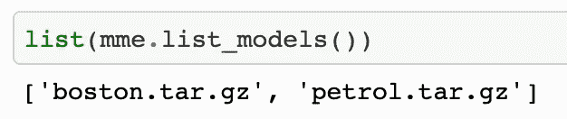
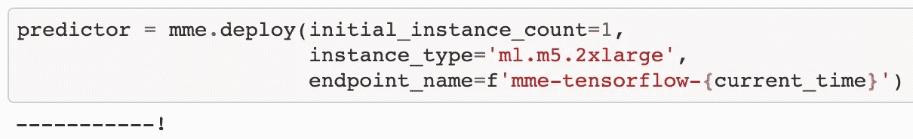
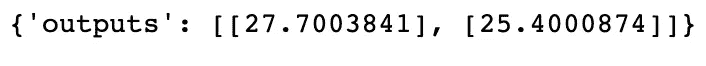
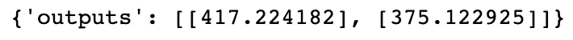

# 将多个 TensorFlow 模型部署到一个端点

> 原文：<https://towardsdatascience.com/deploy-multiple-tensorflow-models-to-one-endpoint-65bea81c3f2f?source=collection_archive---------22----------------------->

## 使用 Amazon SageMaker 的多型号终端

图片来自 [Unsplash](https://unsplash.com/photos/6QWdecFKyYA)

假设您正在处理多个模型，并希望根据应用程序的用例选择一个来调用。引入 [SageMaker 多模型端点](https://docs.aws.amazon.com/sagemaker/latest/dg/multi-model-endpoints.html)作为您的可扩展、经济高效的解决方案。使用 SageMaker 多模型端点(MME)，您可以将**数千个模型集中到一个端点**，并指定您希望根据您的用例调用哪个模型。这个推断选项的主要约束是**模型**所有**都需要在**相同框架**中成为**，因此所有 TensorFlow 或所有 PyTorch 都不是两者的混合。如果想要一个众多框架的**组合**，你会想要查看 [SageMaker 多容器端点](https://docs.aws.amazon.com/sagemaker/latest/dg/multi-container-endpoints.html)。在本文中，为了简单起见，我们将介绍一个例子，其中我们使用了**两个定制的 TensorFlow 模型**。我们将遍历**端到端示例**，看看如何通过简单的 [Boto3 API 调用](https://docs.aws.amazon.com/pythonsdk/)来调用或定义每个不同的模型。在开始之前，请确保阅读先决条件/设置部分，因为有足够的 AWS & ML 知识来完全理解本演示。如果你想获取代码，请查看下面的[链接](https://github.com/RamVegiraju/SageMaker-Deployment/tree/master/Inference/Multi-Model-Endpoint/TensorFlow)。

# 目录

1.  先决条件/设置
2.  多模型端点概述
3.  示例演练
4.  整个代码和结论

# 先决条件/设置

本文将假设您对 AWS 服务有中等程度的了解，特别是那些与 SageMaker 功能高度集成的 [S3](https://aws.amazon.com/s3/) 和 [ECR](https://aws.amazon.com/ecr/) 的服务。了解 [SageMaker containers](https://docs.aws.amazon.com/sagemaker/latest/dg/docker-containers.html) 的一般运作方式以及幕后发生的事情也很重要。幸运的是，SageMaker 已经提供了它管理的 TensorFlow 容器，因此我们可以通过一个更简单的功能来训练我们的模型，这个功能被称为[脚本模式](https://aws.amazon.com/blogs/machine-learning/bring-your-own-model-with-amazon-sagemaker-script-mode/)。使用脚本模式，我们可以在训练脚本中传递自定义模型，我们将该脚本提供给[SageMaker tensor flow estimator](https://sagemaker.readthedocs.io/en/stable/frameworks/tensorflow/using_tf.html)，它在幕后有一个托管容器。要使用自定义模型跟踪 TensorFlow 脚本模式的端到端示例，请查看这篇文章。在本例中，我们将使用脚本模式和两个不同的 TensorFlow 模型进行多模型端点设置。

关于设置和实例类型，请确保为 S3 和 ECR 创建具有适当权限的 IAM 角色。对于实例类型，一个自由层 ml.t3.medium 实例应该足够了，但对于更复杂或计算密集型的模型，请查看 SageMaker 提供的不同的[计算实例。](https://aws.amazon.com/sagemaker/pricing/)

我们将使用的数据集是基于表格和**回归**的。第一个是**波士顿房产**，第二个是来自 Kaggle 的[汽油消耗](https://www.kaggle.com/harinir/petrol-consumption)数据集。

# 多模型端点概述

对于多模型端点，仍然只有一个容器/实例。你用脚本模式训练你的模型，然后把**训练好的模型工件**推到一个**普通 S3 桶**位置。注意，模型数据必须是 SageMaker 的**tar.gz 格式**。然后，您可以用这些不同的模型填充您的端点，并在您的端点调用中指定您正在使用的模型。

# 示例演练

## S3 设置和导入

在开始任何训练或推理代码之前，我们需要确保所有必要的导入和**设置我们将在这个例子中使用的 S3 桶**。

导入+ S3/IAM 设置

注意，我们的 S3 时段设置是必不可少的，因为我们的多模型端点期望所有的模型工件都在同一个 S3 位置。我们将使用这个带有不同前缀的桶来指定输入数据、输出数据、MME 位置等等。

## 波士顿住房培训和模型创建

下一步涉及到我们将在波士顿住宅区使用的第一个数据集。使用 Sklearn，我们可以下载数据集，并在准备好用于训练的数据时将其推送到 S3。

波士顿数据集准备

现在，我们已经在 S3 准备好了我们的波士顿数据集，我们可以构建我们的训练脚本，并将其输入到 TensorFlow 估计器中。训练脚本将包含我们建立的 **TensorFlow ANN** 模型，以及我们正在通过 TensorFlow 估计器传递的其他**超参数**。

波士顿住房培训脚本

我们现在可以将这个脚本传递给 TensorFlow 估计器，它将适合我们准备开始训练的输入数据。

TF 估计器波士顿培训

训练将需要几分钟来完成，但是一旦成功完成，我们需要通过一个简单的调用从这些训练工件中创建一个模型。然而，在我们这样做之前，我们需要准备一个**推理脚本**。这个脚本让我们指定要传递给端点的数据类型(JSON、JSONline、CSV 等)。推理文件将使我们的**端点清楚我们接受和输出什么类型的数据**，我们可以将这个推理文件用于我们将要创建的两个模型。

帮助输入/输出数据格式的推理脚本

现在我们可以创建我们的模型，并传入这个推理脚本。

创建波士顿模型

## 汽油消耗培训和模型创建

现在，我们可以用汽油消耗量数据集重复同样的过程。我将跳过数据上传过程，因为这是完全相同的程序，但请确保将数据正确上传到 S3 或遵循[代码库](https://github.com/RamVegiraju/SageMaker-Deployment/blob/master/Inference/Multi-Model-Endpoint/TensorFlow/tf2-MME-regression.ipynb)获取指导。

我们将再次构建一个[训练脚本](https://github.com/RamVegiraju/SageMaker-Deployment/blob/master/Inference/Multi-Model-Endpoint/TensorFlow/Scripts/petrol.py) t，这次是为汽油数据集定制的，并将它传递给我们的估计器，然后创建一个模型。

石油模型培训和模型创建

## 多模型端点创建

太棒了，我们已经准备好将两个模型添加到我们的端点。现在，为了创建端点，我们需要指定我们两个模型数据所在的 S3 位置，并确保它采用适当的 tar.gz 格式以及相同的存储桶。

多模型端点创建

使用多数据模型估计器，我们可以输入包含两个模型的模型工件的模型数据前缀。如果您为模型信息传入 model_1 或 model_2 并不重要，因为两者都在**相同的容器**中操作。我们可以通过下面的 Boto3 调用来确保我们的两个模型都存在。

MME 模型(作者截图)

然后，我们可以像部署单模型端点一样部署我们的端点。

## 多模型端点调用

现在我们可以用相同的端点测试我们的两个模型。

波士顿住房测验

波士顿房屋祈求(作者截图)

现在，让我们对汽油房屋数据集做同样的操作，看看两个模型的工作情况。

汽油消耗试验

汽油调用(作者截图)

通过初始参数，我们可以传入我们想要调用的模型，我们可以看到多模型端点的惊人功能。

# 整个代码和结论

<https://github.com/RamVegiraju/SageMaker-Deployment/tree/master/Inference/Multi-Model-Endpoint/TensorFlow>  

要访问该示例的完整代码，请查看上面的链接。**库**还包含**我构建和编译的各种其他 SageMaker 推理示例**，你可以参考使用。多模型端点非常强大且经济高效，因为您可以将多个模型加载到一个端点中，而不是将一个端点与每个模型相关联。如果你有这些框架的用例，还有更多关于 [SKLearn](https://github.com/aws/amazon-sagemaker-examples/tree/master/advanced_functionality/multi_model_sklearn_home_value) 和 [PyTorch](https://github.com/aws/amazon-sagemaker-examples/tree/master/advanced_functionality/multi_model_pytorch) 的例子。

我希望这篇文章对使用 Amazon SageMaker 的人有用。如果你对 ML AWS 感兴趣，欢迎在评论中留下你的反馈或者在 LinkedIn 上联系我。如果对我的更多作品感兴趣，请务必关注我的 [Medium](https://ram-vegiraju.medium.com/) 。感谢您的阅读。