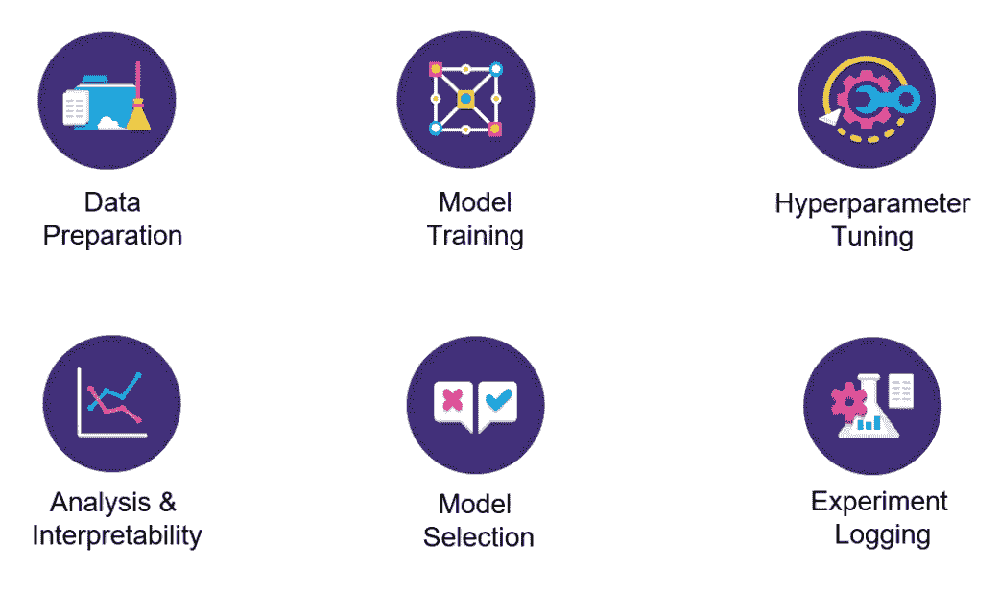
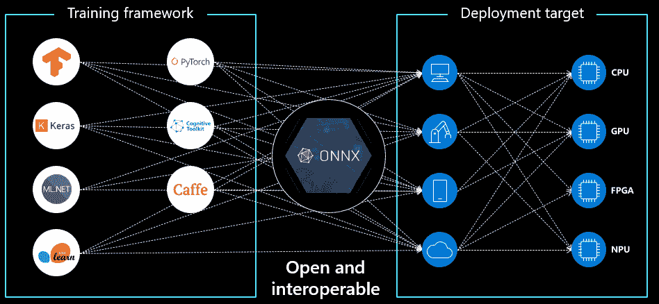
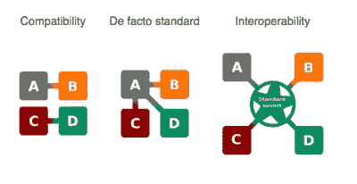
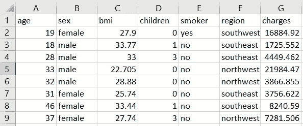
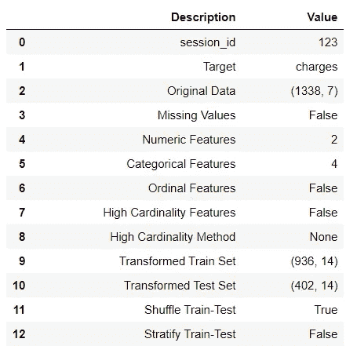
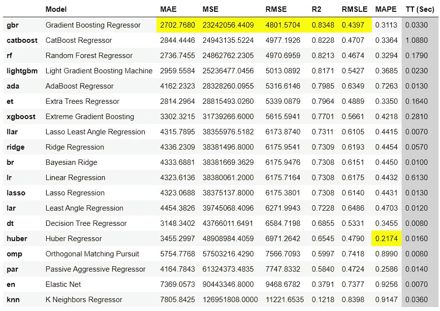
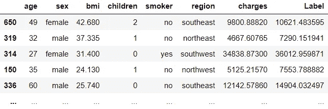
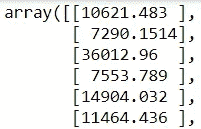

# 使用 ONNX 运行时在边缘设备上部署 PyCaret 模型

> 原文：<https://towardsdatascience.com/deploy-pycaret-models-on-edge-devices-with-onnx-runtime-c6d060a2e1a6?source=collection_archive---------16----------------------->

## 关于如何将使用 PyCaret 训练的 ML 模型转换为 ONNX 以实现高性能评分(CPU 或 GPU)的分步教程


在 [Unsplash](https://unsplash.com?utm_source=medium&utm_medium=referral) 上由 [Austin Distel](https://unsplash.com/@austindistel?utm_source=medium&utm_medium=referral) 拍摄的照片

# 介绍

在本教程中，我将向您展示如何使用[py caret](https://www.pycaret.org/)(Python 中的开源低代码机器学习库)训练机器学习模型，并将它们转换为 ONNX 格式，以便部署在边缘设备或任何其他非 Python 环境中。例如，您可以在 Python 中使用 PyCaret 训练机器学习模型，并在 R、Java 或 c 中部署它们。本教程的学习目标是:

👉PyCaret 是什么，如何入门？

👉有哪些不同类型的模型格式(pickle，onnx，pmml 等。)

👉ONNX ( *读作 ONEX* )是什么，有什么好处？

👉使用 PyCaret 训练机器学习模型，并在 ONNX 中转换，以便在 edge 上部署。

# PyCaret

[PyCaret](https://www.pycaret.org/) 是一个开源、低代码的机器学习库和端到端的模型管理工具，内置于 Python 中，用于自动化机器学习工作流。PyCaret 以其易用性、简单性以及快速高效地构建和部署端到端机器学习管道的能力而闻名。要了解更多关于 PyCaret 的信息，请查看他们的 GitHub。

**功能:**



py caret——Python 中的开源、低代码机器学习库

# skl2onnx

[skl2onnx](https://github.com/onnx/sklearn-onnx) 是一个将 scikit-learn 模型转换为 onnx 的开源项目。一旦采用 ONNX 格式，您就可以使用 ONNX Runtime 之类的工具进行高性能评分。这个项目是由微软的工程师和数据科学家在 2017 年启动的。要了解这个项目的更多信息，请查看他们的 GitHub。

# 安装

对于本教程，您需要安装以下库。安装只需几分钟。

```
**# install pycaret** pip install pycaret**# install skl2onnx** pip install skl2onnx**# install onnxruntime** pip install onnxruntime
```

# 不同的模型格式

在我介绍 ONNX 及其优点之前，让我们看看目前有哪些不同的模型格式可用于部署。

# 👉**泡菜**

对于包括 PyCaret 在内的许多 Python 库来说，这是将模型对象保存到文件中最常见的格式和默认方式。 [Pickle](https://docs.python.org/3/library/pickle.html) 将一个 Python 对象转换成一个比特流，并允许它存储到磁盘上，以后再重新加载。它提供了一种存储机器学习模型的良好格式，前提是推理应用程序也是内置的 python。

# 👉PMML

预测模型标记语言(PMML)是机器学习模型的另一种格式，相对来说没有 Pickle 那么常见。PMML 自 1997 年就已经存在，因此有大量应用程序利用这种格式。SAP 和 PEGA CRM 等应用能够利用 PMML 的某些版本。有一些开源库可以将 scikit-learn 模型(PyCaret)转换成 PMML。PMML 格式的最大缺点是它不支持所有的机器学习模型。

# 👉ONNX

[ONNX](https://github.com/onnx) ，开放神经网络交换格式是一种开放格式，支持机器学习模型跨库、跨语言的存储和移植。这意味着你可以使用任何语言的任何框架来训练你的机器学习模型，然后将其转换为 ONNX，可以用于在任何环境中生成推理(无论是 Java，C，.Net，Android 等。).与其他格式相比，ONNX 的这种与语言无关的能力使它非常强大(例如，除了 Python 之外，您不能使用任何其他语言保存为 Pickle 文件的模型)。

# ONNX 是什么？

[ONNX](https://onnx.ai/) 是一种开放的格式，可以表示深度学习和传统模型。有了 ONNX，AI 开发人员可以更容易地在最先进的工具之间移动模型，并选择最适合他们的组合。ONNX 由微软、脸书和 AWS 等合作伙伴社区开发和支持。

ONNX 得到了广泛的支持，可以在许多框架、工具和硬件中找到。实现不同框架之间的互操作性，简化从研究到生产的路径，有助于提高人工智能社区的创新速度。ONNX 有助于解决与人工智能模型相关的硬件依赖性挑战，并支持将相同的人工智能模型部署到多个硬件加速目标。

***来源:微软***



[https://microsoft.github.io/ai-at-edge/docs/onnx/](https://microsoft.github.io/ai-at-edge/docs/onnx/)

各种语言有很多优秀的机器学习库——py torch、TensorFlow、scikit-learn、PyCaret 等。其思想是，您可以使用任何工具、语言或框架来训练模型，然后使用另一种语言或应用程序来部署它，以进行推理和预测。例如，假设您有一个用。Net、Android 应用程序，甚至是边缘设备，并且您希望将您的机器学习模型预测集成到那些下游系统中。你可以通过将你的模型转换成 ONNX 格式来实现。Pickle 或 PMML 格式无法做到这一点。

# **主要优势:**

## 👉互用性

在您喜欢的框架中开发，而不用担心下游推理的影响。ONNX 使您能够将您喜欢的框架与您选择的推理引擎一起使用。

## 👉硬件访问

ONNX 使得访问硬件优化更加容易。使用 ONNX 兼容的运行时和库来最大限度地提高硬件性能。这意味着，如果延迟是您关心的事情，您甚至可以在 GPU 上使用 ONNX 模型进行推断。



兼容性与互操作性

# 👉我们开始吧

# 资料组

对于本教程，我使用 PyCaret 的存储库中的一个名为 ***insurance*** 的回归数据集。你可以从[这里](https://github.com/pycaret/pycaret/blob/master/datasets/insurance.csv)下载数据。



样本数据集

```
**# loading dataset** from pycaret.datasets import get_data
data = get_data('insurance')**# initialize setup / data preparation** from pycaret.regression import *
s = setup(data, target = 'charges')
```



设置功能的输出(为显示目的而压缩)

# 👉模型训练和选择

既然数据已经为建模做好了准备，让我们使用`compare_models`函数开始训练过程。它将训练模型库中所有可用的算法，并使用 k-fold 交叉验证评估多个性能指标。

```
**# compare all models**
best = compare_models()
```



compare_models 的输出

基于交叉验证指标，最佳模型是 ***梯度推进回归器。*** 您可以使用`save_model`功能将模型保存为 Pickle 文件。

```
**# save model to drive** save_model(best, 'c:/users/models/insurance')
```

这将会以 Pickle 格式保存模型。

# 👉使用 Pickle 格式生成预测

您可以使用`load_model`函数将保存的模型加载回 Python 环境，并使用`predict_model`函数生成推理。

```
**# load the model** from pycaret.regression import load_model
loaded_model = load_model('c:/users/models/insurance')**# generate predictions / inference** from pycaret.regression import predict_model
pred = predict_model(loaded_model, data=data) # new data
```



在测试集上生成的预测

# 👉ONNX 转换

到目前为止，我们看到的是以 Pickle 格式(PyCaret 的默认格式)保存和加载训练好的模型。但是，使用 skl2onnx 库，我们可以在 onnx 中转换模型:

```
**# convert best model to onnx**
from skl2onnx import to_onnx
X_sample = get_config('X_train')[:1]
model_onnx = to_onnx(best, X_sample.to_numpy())
```

我们还可以将`model_onnx`保存到本地驱动器:

```
**# save the model to drive**
with open("c:/users/models/insurance.onnx", "wb") as f:
    f.write(model_onnx.SerializeToString())
```

现在，为了从`insurance.onnx`生成推理，我们将使用 Python 中的`onnxruntime`库(只是为了演示这一点)。本质上，你现在可以在任何其他平台或环境中使用这个`insurance.onnx`。

```
**# generate inference on onnx**
from onnxruntime import InferenceSession
sess = InferenceSession(model_onnx.SerializeToString())
X_test = get_config('X_test').to_numpy()
predictions_onnx = sess.run(None, {'X': X_test})[0]**# print predictions_onnx** print(predictions_onnx)
```



预测 _onnx

请注意，当我们使用 PyCaret 中的`predict_model`函数时，`predictions_onnx`的输出是一个 numpy 数组，但如果您匹配这些值，数字都是相同的(*使用 ONNX 时，有时您会发现小数点后第四位有微小的差异——很少使用*)。

> **任务完成！**

# 即将推出！

下周我将深入探讨 ONNX 转换，并讨论如何将整个机器学习管道(*包括估算器和转换器*)转换为 ONNX。如果你想自动收到通知，你可以在 [Medium](https://medium.com/@moez-62905) 、 [LinkedIn](https://www.linkedin.com/in/profile-moez/) 和 [Twitter](https://twitter.com/moezpycaretorg1) 上关注我。


PyCaret —作者图片


PyCaret —作者图片

使用 Python 中的这个轻量级工作流自动化库，您可以实现的目标是无限的。如果你觉得这很有用，请不要忘记给我们 GitHub 库上的⭐️。

想了解更多关于 PyCaret 的信息，请关注我们的 LinkedIn 和 Youtube。

加入我们的休闲频道。邀请链接[此处](https://join.slack.com/t/pycaret/shared_invite/zt-p7aaexnl-EqdTfZ9U~mF0CwNcltffHg)。

# 重要链接

[文档](https://pycaret.readthedocs.io/en/latest/installation.html)
[博客](https://medium.com/@moez_62905)
[GitHub](http://www.github.com/pycaret/pycaret)
[stack overflow](https://stackoverflow.com/questions/tagged/pycaret)
[安装 PyCaret](https://pycaret.readthedocs.io/en/latest/installation.html) [笔记本教程](https://pycaret.readthedocs.io/en/latest/tutorials.html) [贡献于 PyCaret](https://pycaret.readthedocs.io/en/latest/contribute.html)

# 更多 PyCaret 相关教程:

[](/machine-learning-in-alteryx-with-pycaret-fafd52e2d4a) [## 用 PyCaret 在 Alteryx 中进行机器学习

### 使用 PyCaret 在 Alteryx Designer 中训练和部署机器学习模型的分步教程

towardsdatascience.com](/machine-learning-in-alteryx-with-pycaret-fafd52e2d4a) [](/machine-learning-in-knime-with-pycaret-420346e133e2) [## 用 PyCaret 实现 KNIME 中的机器学习

### 使用 PyCaret 在 KNIME 中训练和部署端到端机器学习管道的分步指南

towardsdatascience.com](/machine-learning-in-knime-with-pycaret-420346e133e2) [](/easy-mlops-with-pycaret-mlflow-7fbcbf1e38c6) [## 使用 PyCaret + MLflow 轻松实现 MLOps

### 一个初学者友好的，一步一步的教程，使用 PyCaret 在你的机器学习实验中集成 MLOps

towardsdatascience.com](/easy-mlops-with-pycaret-mlflow-7fbcbf1e38c6) [](/write-and-train-your-own-custom-machine-learning-models-using-pycaret-8fa76237374e) [## 使用 PyCaret 编写和训练您自己的自定义机器学习模型

towardsdatascience.com](/write-and-train-your-own-custom-machine-learning-models-using-pycaret-8fa76237374e) [](/build-with-pycaret-deploy-with-fastapi-333c710dc786) [## 用 PyCaret 构建，用 FastAPI 部署

### 一步一步，初学者友好的教程，如何建立一个端到端的机器学习管道与 PyCaret 和…

towardsdatascience.com](/build-with-pycaret-deploy-with-fastapi-333c710dc786) [](/time-series-anomaly-detection-with-pycaret-706a6e2b2427) [## 基于 PyCaret 的时间序列异常检测

### 使用 PyCaret 对时间序列数据进行无监督异常检测的分步教程

towardsdatascience.com](/time-series-anomaly-detection-with-pycaret-706a6e2b2427) [](/supercharge-your-machine-learning-experiments-with-pycaret-and-gradio-5932c61f80d9) [## 使用 PyCaret 和 Gradio 增强您的机器学习实验

### 快速开发机器学习管道并与之交互的循序渐进教程

towardsdatascience.com](/supercharge-your-machine-learning-experiments-with-pycaret-and-gradio-5932c61f80d9) [](/multiple-time-series-forecasting-with-pycaret-bc0a779a22fe) [## 基于 PyCaret 的多时间序列预测

### 使用 PyCaret 预测多个时间序列的分步教程

towardsdatascience.com](/multiple-time-series-forecasting-with-pycaret-bc0a779a22fe)