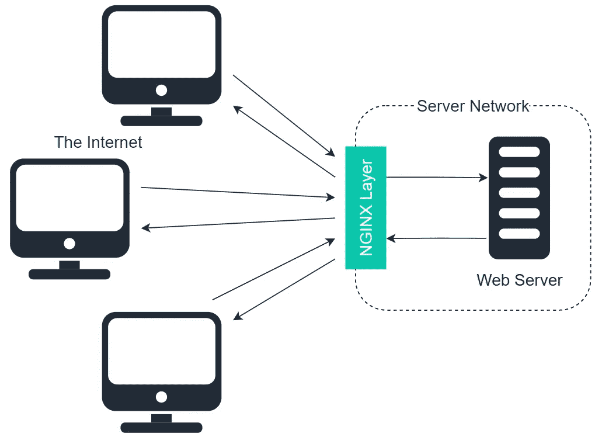
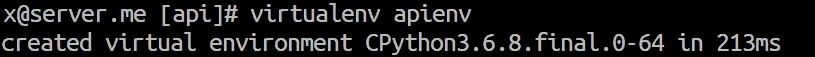
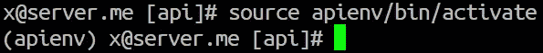
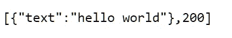
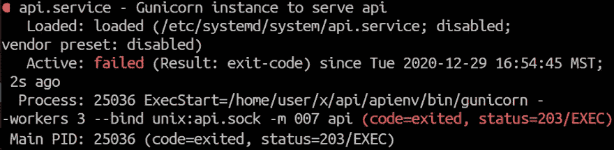
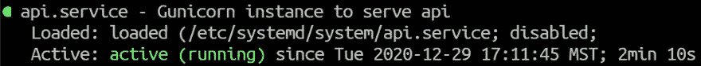
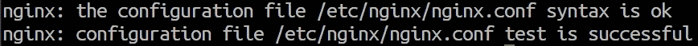
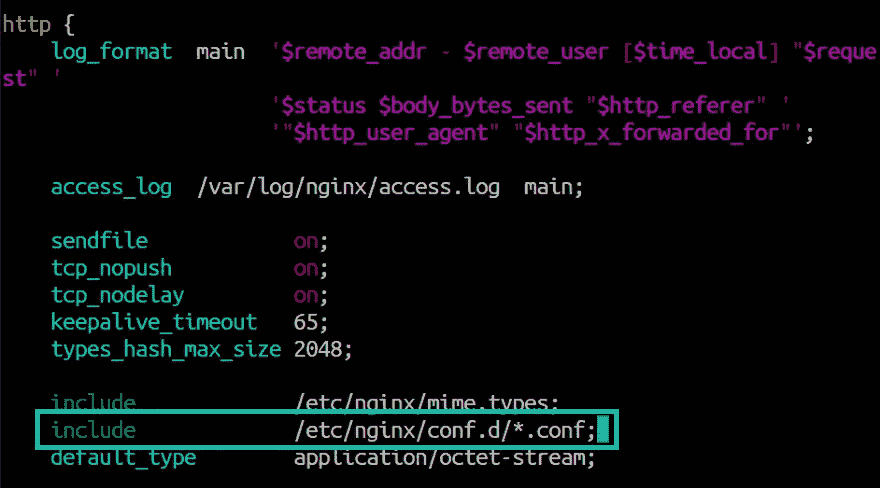

# 使用 Linux 将 Python APIs 部署到 Web

> 原文：<https://towardsdatascience.com/deploy-python-apis-to-the-web-with-linux-2f4c7be8a76d?source=collection_archive---------8----------------------->

## 使用 FastAPI、Gunicorn、Nginx 和 CentOS 的完整 API 演练


菲利普·卡岑伯格在 [Unsplash](https://unsplash.com?utm_source=medium&utm_medium=referral) 拍摄的照片

web 运行在 Linux 上，我们现在生活在 API 时代。这两个事实加上 Python 是世界上最流行的编程语言，使得知道如何通过 Linux 部署 Python API 成为一项无价的技能。

Python 中的 API 开发通常被规范为 Django、Flask 或 FastAPI，以及其他一些框架。API 开发中最快的是名副其实的 FastAPI 库。

在本文中，我们将使用 FastAPI 生成一个简单的 API，并学习如何使用 Uvicorn、Gunicorn、systemd 和(可选的)NGINX 在 Linux webserver (CentOS)上部署它。我们将涵盖:

```
**> Prerequsites**
  1\. EPEL
  2\. Python
  3\. NGINX**> Creating a Python Environment****> Python Setup**
  - pip install
  - API Code**> Systemd**
  - The Gunicorn Service
  - Common Errors**> NGINX Setup (Bonus)
**  - Before We Start
  - NGINX**> Other Useful Articles**
```

# 先决条件

在设置和部署我们的 API 之前，我们需要在 Linux 机器上安装一些东西。这些是:

1.  EPEL
2.  计算机编程语言
3.  NGINX

## EPEL

EPEL 安装了:

```
sudo yum install epel-release
```

EPEL 代表用于企业 Linux 的*额外软件包*。它是一个管理和维护一组用于 Fedora(及其衍生工具，如 CentOS)的 Linux 包的组织。

我们想要 EPEL 的原因是因为它允许我们通过`yum`安装大量开源软件包。

## 计算机编程语言

现在我们已经安装了 EPEL，我们可以继续快速安装 Python，只需:

```
sudo yum install python36
```

我们可以通过键入`python3 -V`来确认 Python 已经正确安装:


## Nginx

要安装 nginx，我们只需要:

```
sudo yum install nginx
```



NGINX 层充当了我们的“原点”(我们的服务器)和互联网之间的中间人。

我们使用 NGINX 作为服务器的“反向代理”。这意味着 NGINX 创建了一个屏障，作为互联网和我们的服务器之间的网关。

我们的应用程序可以在没有 NGINX 的情况下工作，但是使用 NGINX 有几个好处，即:

*   我们可以隐藏“原始”服务器的特征。
*   更好地抵御 DoS/DDoS 和恶意软件。

[https://www.nginx.com/resources/glossary/nginx/](https://www.nginx.com/resources/glossary/nginx/)

[https://en.wikipedia.org/wiki/Reverse_proxy](https://en.wikipedia.org/wiki/Reverse_proxy)

# 创建 Python 环境

理想情况下，我们希望将用于 API 的 Python 安装与服务器上的其他 Python 版本分开。我们通过在虚拟环境(venv)中使用单独版本的 Python 来实现这一点。

我们需要先安装`virtualenv`,它可能已经安装了——但是我们通过尝试安装来检查:

```
python3 -m pip install virtualenv
```

一旦`virtualenv`安装完毕，我们就可以创建目录来存放我们的 venv(和代码):

```
mkdir ~/project-dir
cd ~/project-dir
```

现在，我们安装一个 venv(以及它自己的 Python 版本),带有:

```
virtualenv <env-name>
```



每当我们想要切换到这个*虚拟*env——我们输入`source apienv/bin/activate`。我们需要为 Python 包的安装激活环境。



我们可以看到 apienv 环境是活动的，在控制台输入之前有 **(apienv)** 。

# Python 设置

## pip 安装

一旦我们有了我们的 venv 并且用`source <env-name>/bin/activate`激活了它，我们就可以`pip install`运行我们的 API 所需的包:

```
pip install fastapi gunicorn uvicorn uvloop httptools
```

## API 代码

现在我们可以为我们的 API 编写代码了。当然，如果您有自己的 API 脚本，就使用它。我们将通过打开 Vim 在本地文件`api.py`中输入代码:

```
vim api.py
```

接着按`i`开始编辑文件。我们希望它看起来像这样:

一旦完成，我们通过键入`ESC`然后键入`:wq`和`ENTER`来保存并退出。这样，我们的 API 就建立起来了，并将使用 Uvicorn 运行。

我们还需要 Gunicorn 来处理我们的 Uvicorn workers 的多个实例，这将允许我们的 API 的多个实例并行运行。回到终端，我们可以初始化 Gunicorn 处理我们的 Uvicorn 工人:

```
gunicorn api:app -w 2 -k uvicorn.workers.UvicornWorker -b "0.0.0.0:5000"
```

这里，我们用我们在`api`中的代码和 API 实例`app`初始化 Gunicorn。

`-w 2`指定了两个工人。要使用的工人类型由 Uvicorn 提供，我们用`-k uvicorn.workers.UvicornWorker`指定。

最后，我们用`-b “0.0.0.0:5000”`将 Gunicorn 实例绑定到我们的外向端口`5000`。



前往您的服务器地址`example.com:5000`应该会在您的浏览器中显示 API 响应。在这一点上，你可以叫它一天，离开它。

虽然我很抱歉地说，我们还没有完全达到。

继续使用您的 API——之后，我们还有一些事情要做:

*   设置 Gunicorn 实例在后台运行并在引导时初始化。
*   为 Gunicorn 和 NGINX 创建一个套接字(类似于另一个内部信息网关)来进行通信。
*   正在设置 NGINX！

# 系统 d

我们使用 systemd 将 Gunicorn 实例设置为在后台运行。一旦服务器启动，我们的 API 就会启动并运行。

名称`systemd`指的是 Linux 中使用的一个软件套件，它作为一个统一的系统和服务管理器。我们将使用它来运行我们的 API，它将在我们的服务器后台发出嗡嗡声。可以在以下位置找到 systemd 服务目录:

```
/etc/systemd/system
```

## Gunicorn 服务

在这里，我们创建一个新文件来运行 Gunicorn 实例。键入`sudo vim <service-name>.service`开始编辑新服务。


在这里，我们想写这样的东西:

这里发生了很多事情，让我们来分析一下。

我们保存并再次退出`ESC`，然后是`:wq`和`ENTER`。接下来，我们使用以下命令初始化并检查服务的状态:

```
sudo systemctl start api
systemctl status api
```

## 常见错误

如果您遇到这样的错误:



失败的服务状态将是这样的——希望您永远不会看到它。

有几个常见问题。最有可能的是:

*   服务文件语法不正确。
*   指定的路径是错误的(您的路径是`/home/user/<user>`还是仅仅是`/home/<user>`？).
*   Gunicorn 文件权限错误。

要解决后者，您可能需要返回到`~/api/apienv/bin`并使用以下命令更改`gunicorn`文件的所有者:

```
sudo chown <user> gunicorn
```

运行后，您应该会看到以下内容:



活动服务状态。

此时，我们的代码将会运行。您应该能够前往`example.com:5000`并看到来自您的 API 的响应！

本文的其余部分是一个额外的收获，我们将设置 NGINX，我们可以认为它本质上是一个网络连接管理器——它非常有用，但可能会根据您当前的设置而变得复杂。选择权在你。

# NGINX 设置

NGINX 充当我们面向外部的网关——NGINX 反向代理。这个设置看起来很吓人，但是相信我，它真的不太难。

## 开始之前

首先，我们需要对 API 使用的端口进行一些修改，以便它们可以与 NGINX 通信。

首先，我们需要创建一个内部套接字，NGINX 将使用它与 Gunicorn 通信。它本质上充当 NGINX 和 Gunicorn 之间的内部网关。

我们需要做的就是修改`api.service`中的 Gunicorn 命令来创建它。我们添加`-m 007`，并绑定到`unix:api.sock`而不是`"0.0.0.0:5000"`。这将在工作目录`/home/user/api`中创建 websocket:

```
ExecStart=/home/user/api/apienv/bin/gunicorn -w 3 **-b unix:api.sock -m 007** -k uvicorn.workers.UvicornWorker api:app
```

编辑我们的服务文件后，我们需要重新加载并重新启动它:

```
sudo systemctl daemon-reload
sudo systemctl restart speculate_api
```

## NGINX

我们 API 的外向入口由`/etc/nginx/conf.d/<domain>.conf`中的`server: server_name`给出，如下所示:

一旦准备好，保存并退出(`ESC`、`:wq`、`ENTER`)。我们现在设置 NGINX 权限，允许`nginx`用户访问我们的用户目录:

```
sudo usermod -a -G <user> nginx
chmod 710 /home/<user>
```

然后，我们测试我们的新 NGINX 配置是否适用于:

```
sudo nginx -t
```

希望你会看到这个:



成功的信息

同样值得检查的是，这个新的配置文件包含在主`nginx.conf`文件中。在`/etc/nginx/nginx.conf`内，检查包含在`/conf.d`目录内的所有`.conf`文件:

```
include /etc/nginx/conf.d/*.conf;
```

在`http {...}`部分内:



如果一切正常，我们可以使用以下命令重启 NGINX:

```
sudo systemctl daemon-reload
sudo systemctl restart nginx
```

您现在应该能够在`example.com:5000`再次访问 API 了！


关于用 Python 将 API 部署到 web 的这篇文章到此结束！我们涵盖了很多内容，包括:

*   API 中 EPEL、Python 和 NGINX 的基本知识
*   Python 环境
*   API 包和代码
*   Gunicorn 和 Uvicorn
*   Linux 系统 d
*   NGINX 配置

所有这些都是很多的，不是一次就能完成的(对大多数人来说)。

当你阅读这篇文章的时候，我肯定会推荐你阅读我在下面列出的其他几篇文章。这些内容涵盖了我们在这里讨论的大部分内容，但是或者更深入，或者针对不同的设置/场景。

我希望你喜欢这篇文章！如果您有任何问题，请通过 [Twitter](https://twitter.com/jamescalam) 或在下面的评论中告诉我。如果你想要更多这样的内容，我也会在 YouTube 上发布。

感谢阅读！

# 其他有用的文章

[如何编辑 Sudoers 文件](https://www.digitalocean.com/community/tutorials/how-to-edit-the-sudoers-file)

[使用 Uvicorn 和 Nginx 部署 Django > 3.1(异步)](https://www.valentinog.com/blog/uvicorn-django/#configure-nginx)

[如何在 CentOS 7 上使用 Gunicorn 和 Nginx 服务烧瓶应用](https://www.digitalocean.com/community/tutorials/how-to-serve-flask-applications-with-gunicorn-and-nginx-on-centos-7)

[配置 NGINX 托管多个子域](https://dev.to/on_stash/configure-nginx-to-host-multiple-subdomains-2g0b)

[如何在 Ubuntu 15.10 上安装 NGINX 作为 Apache 的反向代理](https://www.howtoforge.com/tutorial/how-to-install-nginx-as-reverse-proxy-for-apache-on-ubuntu-15-10/)

[🤖《变形金刚》NLP 课程 70%的折扣](https://bit.ly/nlp-transformers)