# 在 SageMaker 实时端点上部署数千个模型，并提供自动再培训管道

> 原文：<https://towardsdatascience.com/deploy-thousands-of-models-on-sagemaker-real-time-endpoints-with-automatic-retraining-pipelines-4eef7521d5a3?source=collection_archive---------16----------------------->

## 艾米莉·韦伯和埃里克·托宾的联合文章

本帖也是 [SageMaker 月的一部分！查看我们的日历](https://aws.amazon.com/sagemaker/sagemaker-month/),了解 SageMaker 的所有入门知识——以前所未有的速度构建、培训和部署模型。利用实践研讨会、专用工具和资源来提高团队的工作效率。

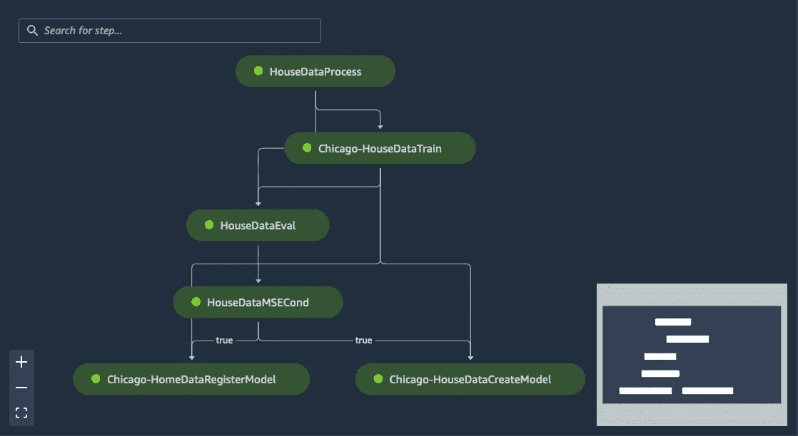

在 SageMaker Studio 中创建自动再培训管道

你正在开发一个应用程序，向全美各城市推荐下一个最好的食品配送。在过去的两年中，您已经研究出了一个基于 XGBoost 的大型多分类模型，它推荐城市级别的餐馆。芝加哥、纽约、旧金山、西雅图，所有这些都由专门的 SageMaker 终端托管。它们从你的应用程序接收请求，处理数据，并在一位数毫秒内返回建议的餐馆。突然，一个实习生进来演示了在你的数据集中为每个客户训练一个模型的可能性。您的准确性突飞猛进，但从成本角度来看，您担心这种做法的可行性。在你的数据库中，有成千上万个不同的买家，你怎么可能为每个人提供一个模型呢？你如何让这些模型跟上最新的购买趋势？

在亚马逊 SageMaker 上输入[多型号端点。

说到底，从 SageMaker 的角度来看，一个模型是两件事。它是坐落在 S3 的训练有素的模型人工制品，它是你包装在图像中的推理脚本。无论您是使用云中的 spot 实例廉价地训练该模型，从您的笔记本电脑加载它，从您办公桌下的 NVIDIA 设备编译它，还是从 H20 或 DataRobot 移植它，只要您可以定义该模型的计算要求，您就可以在 SageMaker 上托管它。

现在，让这笔交易更加划算的是**您可以从一个 SageMaker 端点托管任意多的模型。**你实际上有两个选择。如果您正在考虑一个场景，其中您有一个建模框架，比如 XGBoost，并且您想要在该框架内将它扩展到成千上万个模型，您将想要选择“多模型端点”或者，如果您有几个不同的建模容器想要在单个端点上托管，您会看到我们刚刚推出的多容器方法](https://github.com/aws/amazon-sagemaker-examples/blob/master/advanced_functionality/multi_model_xgboost_home_value/xgboost_multi_model_endpoint_home_value.ipynb)。

在这篇文章中，我们将关注“多模型端点”我们还将讨论如何通过自动再培训渠道保持这些信息的更新。

你问 SageMaker 到底是怎么处理托管上万个模型的？很简单。我们用 S3。

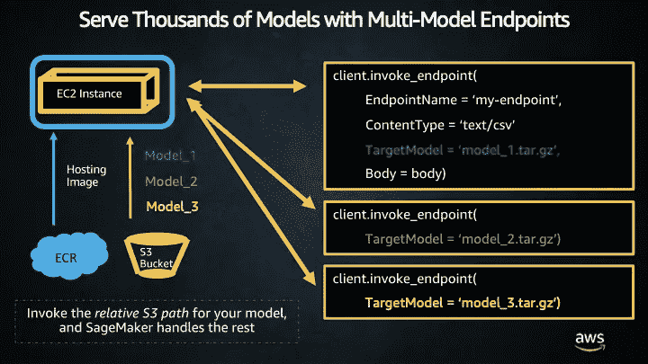

您要做的第一件事是选择**将托管您的模型的容器。**

在大多数情况下，最简单的方法是使用我们称之为“脚本模式”或托管容器。

[脚本模式](https://sagemaker.readthedocs.io/en/stable/frameworks/index.html)让你从 [SageMaker Python SDK](https://sagemaker.readthedocs.io/en/stable/) 和*导入估算器，绕过 Docker 构建步骤*。您可以使用我们的[深度学习容器](https://aws.amazon.com/machine-learning/containers/)作为基础并扩展它们，直接引入您的代码，指定框架版本，并定义您需要的任何自定义需求。SageMaker 从一个*计算* *和一个容器视角*管理后端，两者都在云中为您构建一个专用实例，并帮助运行您的代码。

您完全可以在 SageMaker 的脚本模式下运行完整的培训任务。您还可以用您的工件和推理脚本[托管一个预训练的模型](https://aws.amazon.com/blogs/startups/how-startups-deploy-pretrained-models-on-amazon-sagemaker/)。首先在 SageMaker SDK 中定义您的模型，就像这样。

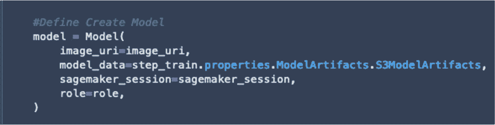

注意，您正在使用您自己的训练图像，并且指向您自己的存储在 S3 的模型工件。这意味着在 SageMaker 上部署模型之前，你可以在任何地方训练你的模型！

接下来，我们将使用相同的 SageMaker SDK 来*创建多模型端点。*

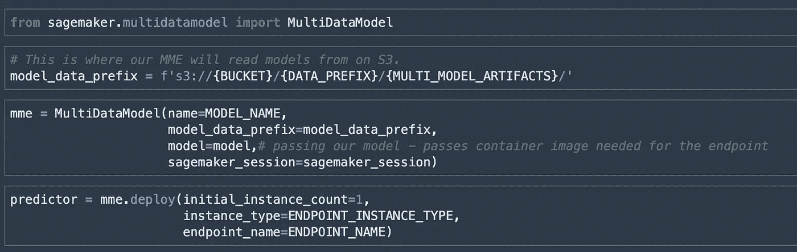

通过 SageMaker 上的多模型端点服务数千个模型

创建多模型端点*的最大区别在于，模型工件在调用后只出现在端点* ***上。SageMaker 完全管理哪些工件在磁盘上，哪些工件在你的桶中。我们根据请求将这些数据从 S3 拷贝到端点，并将它们放入 RAM 以响应您的端点请求。

多模型端点非常适合您训练和部署数千个模型的情况，在您的客户群中每个单元可能有一个模型。而这几千个模型需要在同一个软件框架里，所以所有 TensorFlow 模型，或者所有 XGBoost，所有 SKLearn 模型等等。[另一方面，多容器端点](https://docs.aws.amazon.com/sagemaker/latest/dg/multi-container-endpoints.html)是当你总共有 5-6 个模型时，但是这些模型在不同的软件框架中，并且有不同的推理脚本。例如，如果您为一个 TensorFlow、一个 XGBoost 和一个 PyTorch 模型提供服务，那么多容器端点是一个不错的选择。这里我们将关注多模型端点。

现在，您仍然需要考虑针对该端点的流量。如果你真的在为数以万计的客户服务，实际上最好的办法就是[直接联系我们](https://aws.amazon.com/contact-us/aws-sales/)。作为亚马逊人和机器学习专家解决方案架构师，我们工作的很大一部分是直接与客户迭代他们的最终架构计划，以确保它符合最佳实践。你不必单干！我们可以帮忙。

所以我们已经旋转了我们的端点。我们如何与它互动？***

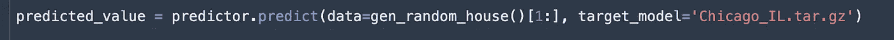

*注意，我们可以在这个推理请求中传递模型工件的名称。*这意味着我们可以动态地确定我们想要使用哪个模型进行推理*。

最常见的生产方式是**将推理代码包装在 Lambda 函数中。然后你可以从你的应用程序逻辑中调用你的 Lambda 函数，不管它在哪里。***

# *自动再训练管道*

*我们已经了解了在 SageMaker 多模型端点上托管数千个模型，但是我们如何建立一个自动再培训管道呢？就像托管一样，你的再培训管道的核心其实是位于 S3 的对象，以及打包在 SageMaker 中的图像。有了再培训管道，在高层次上你想完成几个关键步骤。*

1.  *指向您的新数据集*
2.  *重新培训您的模型*
3.  *评估这个，如果好，部署！*

*就编排所有这些组件而言，您有多种选择。如果你刚刚开始，一般我们推荐 SageMaker-native 接手这个， [**管道**](https://aws.amazon.com/sagemaker/pipelines/) 。Pipelines 是一种直接从 SageMaker Studio 构建第一个 MLOps 工作流的简单方法，它使用了 SageMaker 用户体验中的所有相同结构。您可以在 ide 中构建一个非常好的 DAG。

如果你已经熟悉编排工作流，你可能会选择一些与现有企业编排策略很好地配合的东西，如 Apache Airflow、Jenkins、Code Pipeline 或 KubeFlow。SageMaker 可以很好地处理所有这些问题，并且为气流和库伯流都提供了本地插件。

**我们将在下面的管道中一步一步地这样做:***

1.  *为住房数据定义数据预处理脚本、培训和模型评估脚本*
2.  *将脚本导入 SageMaker pipelines API，创建一个有向无环图*
3.  *实现一个 Lambda 函数来启动管道执行*
4.  *测试解决方案，执行新的管道，将模型加载到[模型注册中心](https://docs.aws.amazon.com/sagemaker/latest/dg/model-registry.html)，并将它们部署到我们的多模型端点上。*

*首先，我们来看看火车步。注意，虽然这个例子使用了一个内置算法，但是您可以很容易地指向您自己的图像和/或脚本。我们构建了一个*估计量*，并使用它来定义我们的超参数。*

*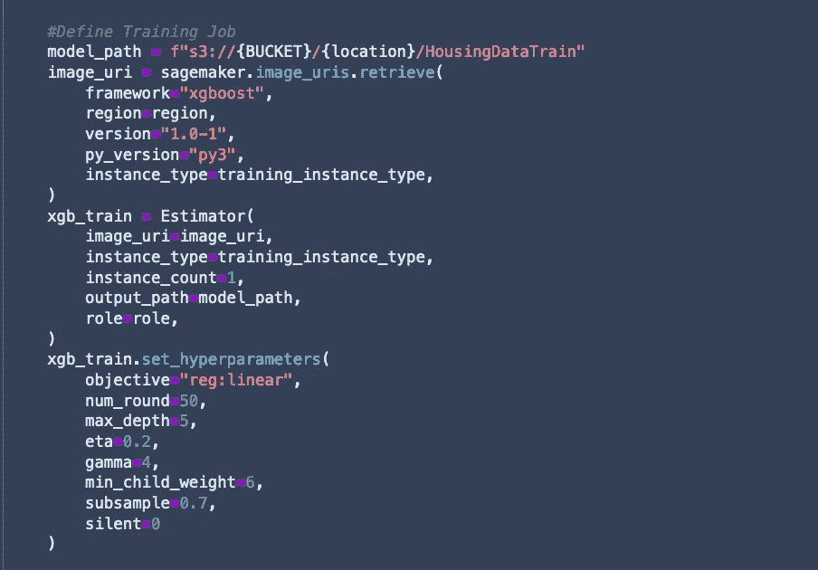*

*有了估计器，我们将把对象*传递到管道 API* 。这发生在我们定义*训练步骤时。**

*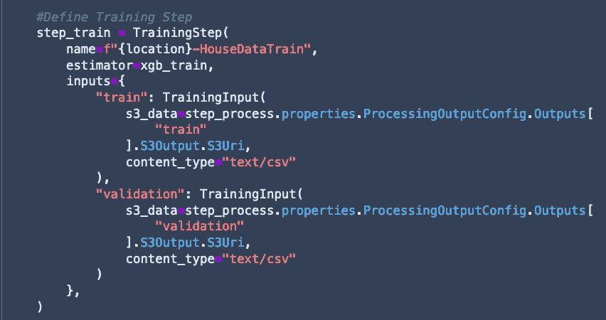*

*接下来，我们将清洗并重复*管道中的所有剩余步骤。*这意味着我们正在创建预处理、训练、评估和有条件加载到模型注册中心的步骤。*

*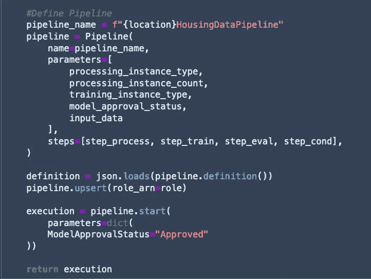*

*现在我们有了一条管道！您可以在 Studio 中查看这个管道并启动执行。*

*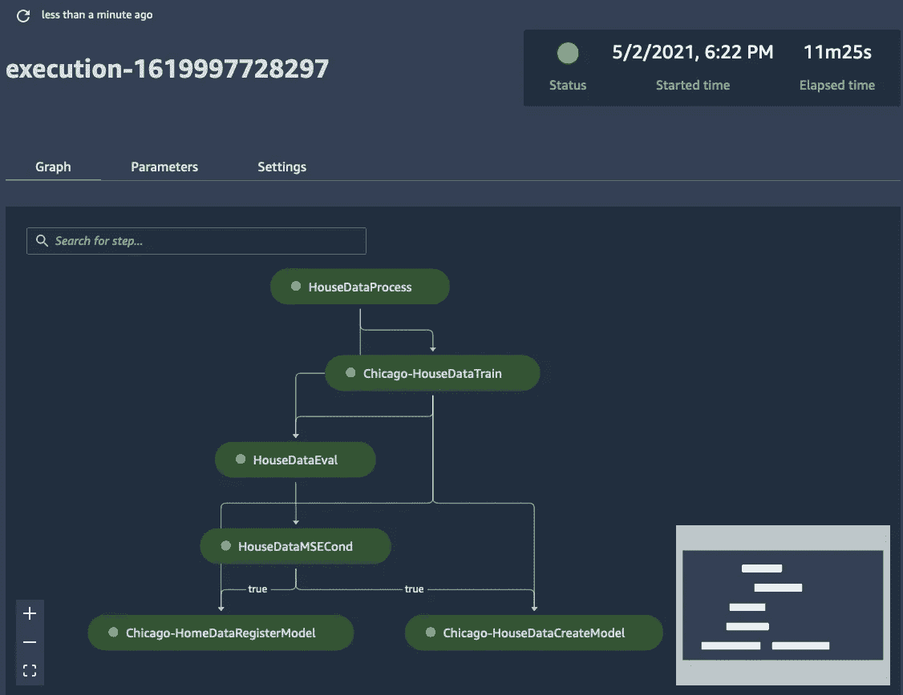*

*我们选择为每个型号创建*独特的渠道。*这意味着有一条通往芝加哥、圣地亚哥、洛杉机、休斯顿等地的管道。虽然从 MLOps 的角度来看，这听起来像是很大的开销，但是它确实给了您分别训练和处理每个模型的灵活性。因此，如果突然一个 KNN 模型开始在一个地区更好地工作，而一个深度学习模型在另一个地区更好，你可以在你认为合适的时候将这些组件添加到每个管道中。您还可以分别管理这些数据的处理，以适应独特的数据流、见解和利益相关者。*

*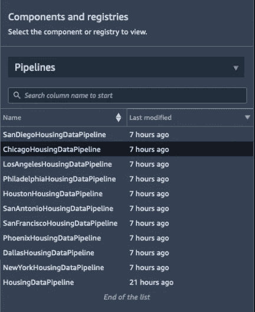*

*一旦这些管道执行，它们将模型放入模型注册中心。这是 Studio 中的一个附加层，它让您可以看到您已经创建的模型，以及这些模型的版本，因此您可以更容易地部署它们。*

*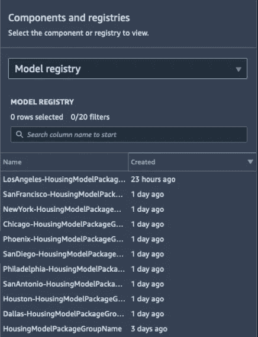*

*这是我们所有管道的截图，可以在 Studio 中看到。*

*这里有一个我们模型包组的截图，加载在模型注册表中。*

*这是单个模型包组的视图——尤其是所有版本都很容易看到！*

*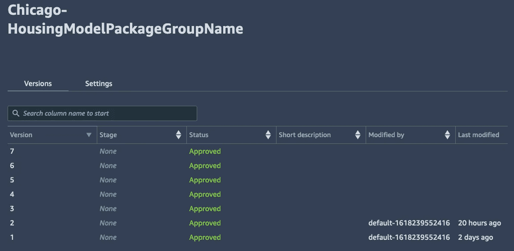*

*对于每个版本，您可以查看这是否被批准。*

*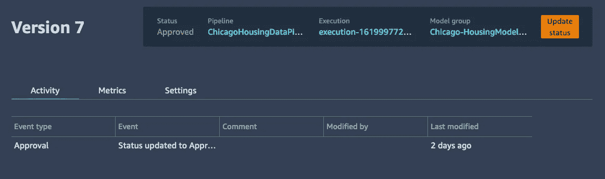*

*就这样结束了！您可能会想，*哎呀，这比我预期的要多得多*，但事实是，这实际上比一些客户开发的要简单得多。特别是当您大规模地投入复杂的数据操作时，除了最先进的模型之外，这些项目可以很容易地扩大范围。*

*这就是为什么把你的平台开发卸载到 AWS 上是如此重要**。这是使用托管服务的核心—通过将您的基础架构管理和开发卸载到云上的专用服务，您的团队可以专注于真正使您的业务脱颖而出的功能。所有的功能请求、平台增强、错误修复和低级软件开发都可以推给 Amazon 团队，优先考虑您最关心的数据科学结果。***

**所有图片均由作者制作**