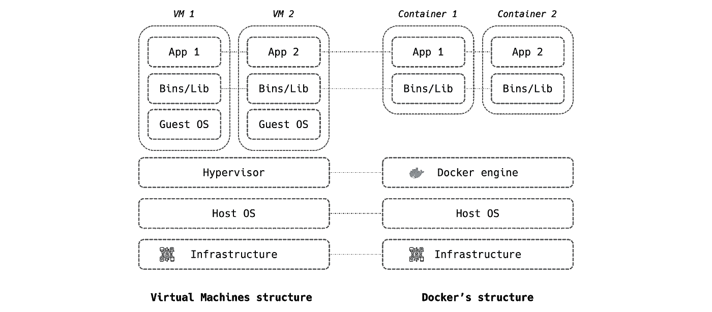
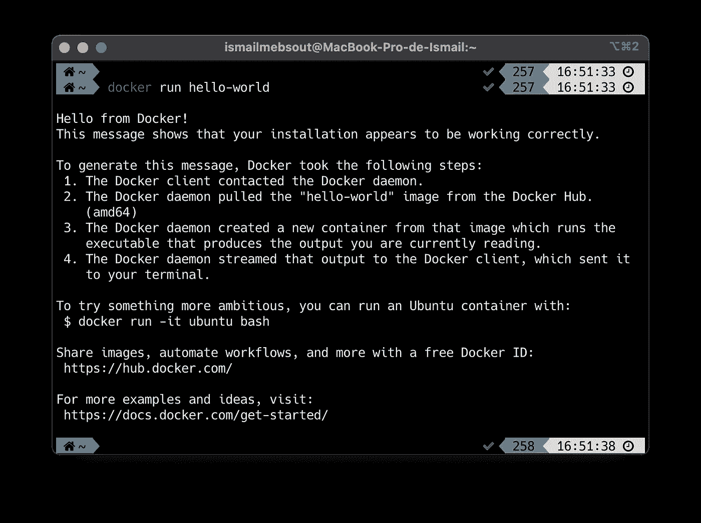
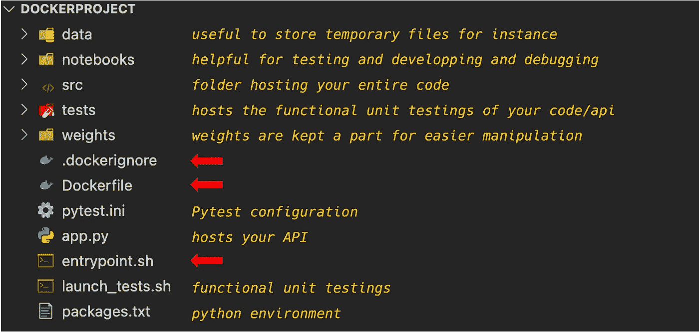
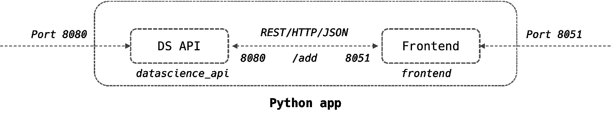
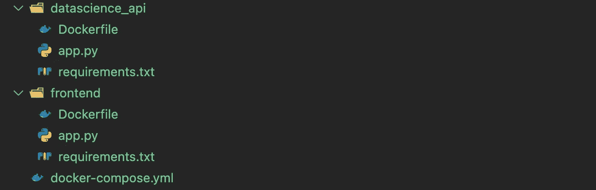
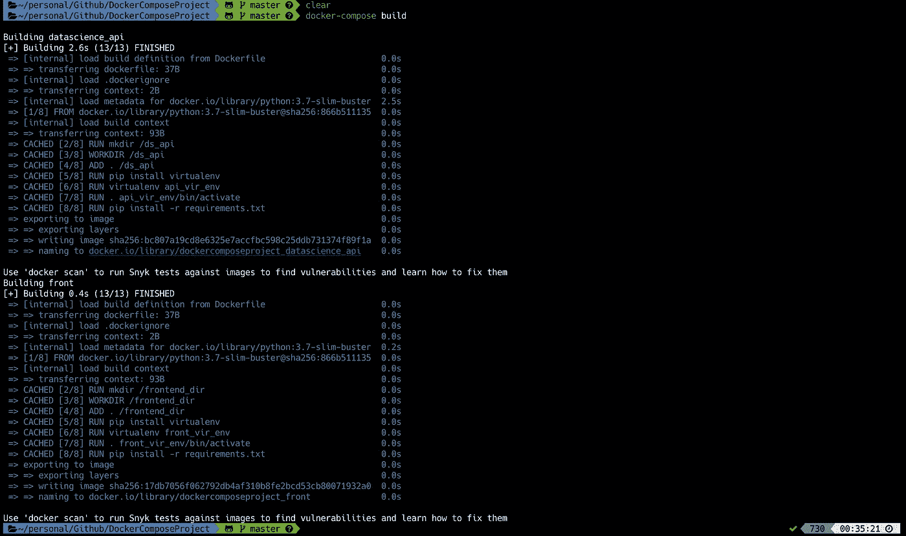
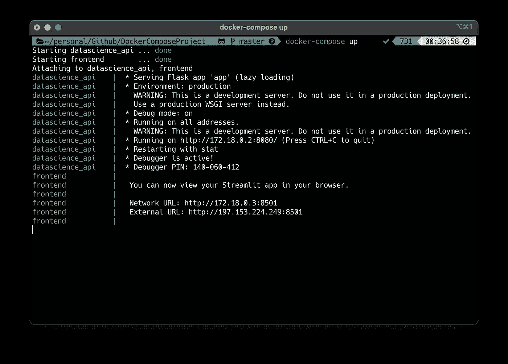
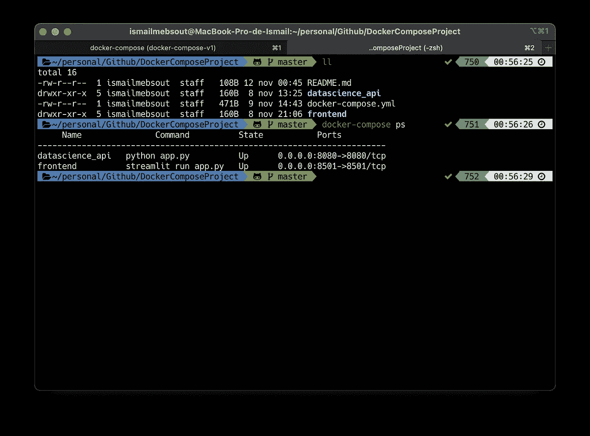
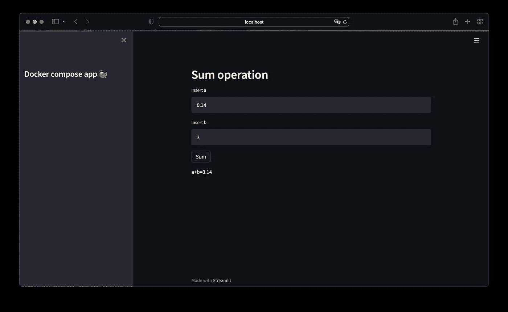

# 使用 Docker 和 Docker Compose 在任何其他机器上部署您的 AI 引擎

> 原文：<https://towardsdatascience.com/deploy-your-ai-engine-in-any-other-machine-using-docker-docker-compose-1691e57cb866?source=collection_archive---------16----------------------->


照片由[像素](https://www.pexels.com/)上的 [Pixabay](https://www.pexels.com/fr-fr/@pixabay) 拍摄

## 数据科学家入门包——第 3 部分(如果它能在我的笔记本电脑上运行，那它肯定也能在你的笔记本电脑上运行！)

当从事人工智能项目时，我们倾向于在笔记本电脑上进行所有的初始开发，然后与客户沟通。可能会发生这样的情况，客户端不共享相同的操作系统，这意味着代码可能不会在客户端运行。这就是 Docker 发挥作用的地方！

在本文中，我们将探讨 Docker 背后的主要动机，以及它如何允许构建支持更快开发和部署的与操作系统无关的产品。

# 目录

摘要如下:

## **1-什么是 Docker？
2-安装** 3-从人工智能项目到 Docker 映像
4- Docker 撰写
5-最佳实践

# 什么是 Docker

Docker 是一个进程隔离器工具，允许在受限环境中运行应用程序。它经常与虚拟机混淆，虚拟机“虚拟化”物理资源，而 Docker 虚拟化执行环境，因此启动和运行起来更轻、更快。



作者图片

Docker 的发明主要是为了使程序与操作系统无关，以便于开发和部署。例如，一个数据科学家可以在 macOS 上编写他的程序，并在客户端的 it 基础设施上使用 Docker 运行它，而不管它的操作系统是什么(macOS、linux、Windows 等等)。


作者图片

Docker 引入了不同的概念:
**【Dockerfile】**:以书面顺序缓存执行的一组动作
**【Docker image:**文件和安装系统(来自 Docker file)您将需要在没有任何附加进程的情况下运行您的程序
**【Docker container:**是一个映像实例，它托管所有文件和所需程序的副本，并通过终端
**附加一个交互进程。dockerignore:** 一个文件，它包含了您不想在 docker 映像上包含的所有元素的路径
**entry point . sh:**一个 cmd 文件，它决定了运行容器时要启动的命令

Docker 还提供了 [**Dockerhub**](https://hub.docker.com/) ，云服务，可以托管共享的 Docker 图片，可以由团队进行推送和拉取。它还托管官方语言图像，如 Python 的图像。

# 装置

你可以通过选择你机器上安装的操作系统，使用 Docker 的官方[网站](https://docs.docker.com/get-docker/)来安装 Docker。

安装完成后，启动 Docker 并运行以下命令行来检查是否一切正常:

```
docker run hello-world
```



作者图片

# 从人工智能项目到 Docker 图像

## **设置**

一旦开发稳定下来，你的人工智能项目的“dockerization”就开始了，我们假设它是用 **python** 语言编写的。

文件 *Dockerfile，。dockerignore* 和 *entrypoint.sh* 被放在资源库的根目录下，如下所示(查看我以前的[文章](/python-projets-structure-p2c-b2f92ab15c55)了解项目组织):



作者图片

+我们将**入口点. sh** 定义如下:

```
#!/bin/bash
set -xe
case $1 in

    test)
    python -m pytest -v --tb=line tests/unit_testing.py     action_1)
    python app.py fonction_1;;

    action_2)
    python app.py fonction_2;;esac
```

+创建 **Dockerfile** 🐳：

*   从 Dockerhub 选择 python 版本，说[*python:3.7-slim-buster*](https://github.com/docker-library/python/blob/3691a11e6215c7cc1184277853910d7b7bfff5dd/3.7/buster/slim/Dockerfile)*带 debian OS:*

```
*FROM python:3.7-slim-buster*
```

*   *使用 apt-get 安装必要的模块(例如 liblept5):*

```
*RUN apt-get update -y\
    && apt-get install -y liblept5*
```

*   *创建文件夹 *data/* 作为工作目录:*

```
*RUN mkdir /data
WORKDIR /data*
```

*   *我们将本地存储库的所有文件和文件夹复制到 Docker 镜像的文件夹 */data* 中，除了*中提到的那些。dockerignore* :*

```
*ADD . /data*
```

*   *我们安装 [Virtualenv](https://virtualenv.pypa.io/en/latest/) ，创建 project_vir_env，激活它，然后在其中安装所有的 python 需求:*

```
*RUN pip install virtualenv
RUN virtualenv project_vir_env
RUN . project_vir_env/bin/activate
RUN pip install -r packages.txt*
```

*   *我们向入口点文件添加执行权限，并将其设置为:*

```
*RUN chmod +x /data/entrypoint.sh
ENTRYPOINT ["data/entrypoint.sh"]*
```

***文件**如下:*

```
*FROM python:3.7-slim-buster
RUN apt-get update -y \
    && apt-get install -y liblept5 \

RUN mkdir /data
WORKDIR /data
ADD . /data
RUN pip install virtualenv
RUN virtualenv project_vir_env
RUN . project_vir_env/bin/activate
RUN pip install -r packages.txt
RUN chmod +x /data/entrypoint.sh
ENTRYPOINT [ "/data/entrypoint.sh"]*
```

*+我们也定义**。dockerignore** :*

```
*project_vir_env/
notebooks/
.vscode/
**/__pycache__/
.DS_Store*
```

## *发动*

*为了**构建**docker 映像，首先**启动**docker 引擎**然后运行以下命令行:***

```
*docker build -t nameofdockerimage .*
```

*   *-t:用于命名图像*
*   *。:是 Dockerfile(当前文件夹)的位置*

*您可以使用以下命令行运行容器:*

```
*docker run -v $PWD:/data/ nameofdockerimage entrypointfunction*
```

*   *-v:用于定义卷并将您的当前目录(项目存储库)与您的容器的*数据/* 文件夹链接起来*
*   **文件名称*:与构建阶段使用的名称相同*
*   **entrypointfunction*:entry point . sh(test，action_1 或 action_2)中定义的函数之一*

*你可以检查这个 [cheat shee](https://www.docker.com/sites/default/files/d8/2019-09/docker-cheat-sheet.pdf) t 中可能的 docker 命令。*

# *Docker 撰写*

*当处理一个复杂的项目时，最终产品可能由不同的服务组成，比如一个**前端**，一个 **DS AP** I，和一个**数据库**。Docker-compose 是一个 docker orchestrator，它帮助你“dockerize”并以多容器格式组织你的所有服务。*

*为了便于说明，我们将考虑一个带有[**Streamlit**](https://streamlit.io/)**前端**的 python 应用程序，它调用一个[**Flask**](https://flask.palletsprojects.com/en/2.0.x/)**API**来计算两个数之和。其结构如下:*

**

*作者图片*

*该项目的结构如下:*

**

*作者图片*

*每个服务都有自己的 Dockerfile 文件:*

*   *数据科学 API 的 Dockerfile:*

```
*FROM python:3.7-slim-buster
RUN mkdir /ds_api
WORKDIR /ds_api
ADD . /ds_api
RUN pip install virtualenv
RUN virtualenv api_vir_env
RUN . api_vir_env/bin/activate
RUN pip install -r requirements.txt
EXPOSE 8080
ENTRYPOINT ["python"]
CMD ["app.py"]*
```

*   *前端的 Dockerfile:*

```
*FROM python:3.7-slim-buster
RUN mkdir /frontend_dir
WORKDIR /frontend_dir
ADD . /frontend_dir
RUN pip install virtualenv
RUN virtualenv front_vir_env
RUN . front_vir_env/bin/activate
RUN pip install -r requirements.txt
EXPOSE 8501
ENTRYPOINT ["streamlit", "run"]
CMD ["app.py"]*
```

*DS API 暴露在端口 **8080** 上，而前端暴露在端口 **8501** 上*

*为了同时管理这两个服务，我们需要创建一个 **docker-compose.yml** 🐳：*

*   *我们首先设置 docker-compose 版本*
*   *然后，我们定义将在不同容器中启动的应用程序的服务。在每个服务器中，我们定义:
    +容器名
    +主机名
    +构建(服务 Dockerfile 的文件夹和名称)
    +端口(exposition): *机器 _ 端口:容器 _ 端口*
    +重启(方法)*

```
*version: '3'
services:
  datascience_api:
    container_name: datascience_api
    hostname: datascience_api
    build:
      context: ./datascience_api
      dockerfile: Dockerfile
    ports:
      - 8080:8080
    restart: unless-stopped front:
    container_name: frontend
    hostname: frontend
    build:
      context: ./frontend
      dockerfile: Dockerfile
    ports:
      - 8501:8501
    restart: unless-stopped
    depends_on:
      - datascience_api*
```

***NB1** :前端服务*依赖于*data science API，首先需要运行。*

***NB2** :前端通过 http 协议使用其容器名调用 DS API:*

```
*requests.post(“http://datascience_api:8080/add", params=query).json()*
```

*docker-compose 文件完成后，我们在项目的根目录下运行以下命令行:*

```
*docker-compose build*
```

**

*作者图片*

```
*docker-compose up*
```

**

*作者图片*

*可以使用以下命令行来可视化正在运行的容器:*

```
*docker-compose ps*
```

**

*作者图片*

*因为容器和本地机器使用相同的端口，所以我们可以在我们机器的浏览器上打开前端:*

**

*作者图片*

*你可以在 [github 库](https://github.com/ismail-mebsout/DockerComposeProject)中找到所有的脚本。*

# *最佳实践*

*   *冻结所有提取图像的版本(python、java)，使用最新版本会使生产环境不稳定*
*   *启动带有测试入口点的第一个容器，以检查所有的安装都正确执行了*
*   *将 docker 容器与卷进行映射，以便进行实时开发，而无需在每次更改时进行重建*
*   *将每个服务单独归档，以便于开发和调试*

# *结论*

*我希望您喜欢阅读这篇文章，并获得 docker 的第一手经验。它将使您能够更快、更有效地部署您的产品，无论开发是在哪里进行的。*

*请随时查看我以前的 DS Starter pack 文章:*

*   *[数据科学项目中的必备工具](/data-scientists-starter-pack-32ef08f7829c)*
*   *[关于 Git，GitHub & GitLab](/all-you-need-to-know-about-git-github-gitlab-24a853422ff3) 你需要知道的一切*