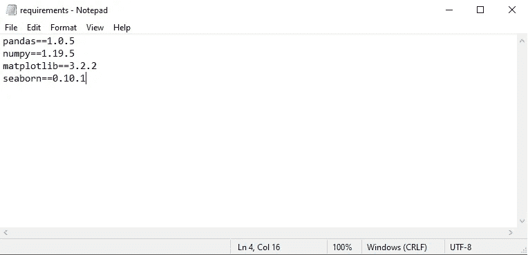
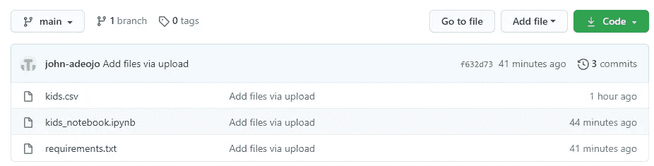
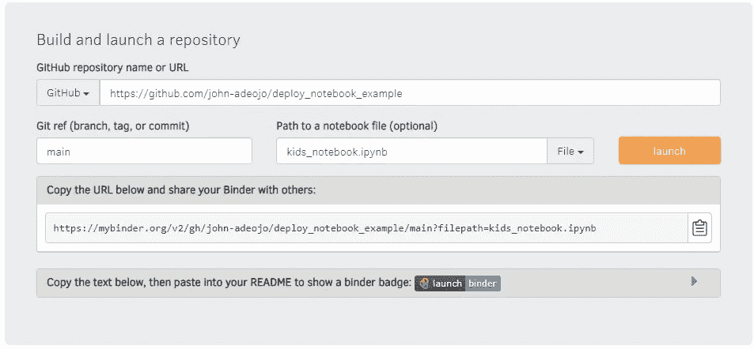

# 轻松部署您的 Jupyter 笔记本电脑— Python 版

> 原文：<https://towardsdatascience.com/deploy-your-jupyter-notebooks-the-easy-way-python-edition-f831400c1905?source=collection_archive---------23----------------------->

## 使用活页夹 Repos 部署笔记本电脑

## 通过 7 个简单的步骤，让您的 Jupyter 笔记本在其他人的机器上运行

在 [Unsplash](https://unsplash.com?utm_source=medium&utm_medium=referral) 上由 [Lidya Nada](https://unsplash.com/@lidyanada?utm_source=medium&utm_medium=referral) 拍摄的照片

# 介绍

在这篇文章中，我要帮助你永远不要说—

“但是……它在我的笔记本电脑上运行正常😥“再也不会了。

我将向您展示如何通过 7 个简单的步骤部署您的笔记本电脑😄。

想象一下。你已经花时间在 Jupyter 笔记本上构建了一个很棒的机器学习管道。它在你的电脑上首尾相连地运行，现在你想把它分享给你的老板或 LinkedIn 网络，以显示你有多棒。

“这是容易的部分”，你天真地对自己说。

> “我会把它附在一封邮件里，或者发布一个指向 GitHub 知识库的链接。瞧。

如果你曾经遇到过这种情况，你就会知道试图分享工作的挫败感。

您可能面临的复杂情况如下:

😡笔记本中的代码因库依赖而出错。

😡用户不能与笔记本进行交互。

😡笔记本中使用的数据存储在您的本地机器上。

好消息是，实际上有一种非常简单(而且免费)的方法来部署您的 Jupyter 笔记本电脑，并避免所有这些常见问题。而且，你也不必是一个软件工程专家。

👍我们可以使用活页夹存储库部署我们的笔记本电脑。

在进入细节之前，让我们简单地谈论一下绑定器存储库。

# **什么是活页夹存储库？**

绑定器是一个代码库，至少包含两个元素:

☑️Code 或者你希望人们能够运行的内容。出于我们的目的，这将是一个 Jupyter 笔记本

环境的☑️配置文件。绑定器使用这些来构建代码运行所需的环境。

最棒的是，有在线、开源、活页夹回购服务，可以让你轻松部署 Jupyter 笔记本。

在本教程中，我们将使用我的活页夹。由 binder 社区维护的一个易于使用的服务，既作为 Binder 服务，也作为 BinderHub 技术的演示。

我们开始吧！

# **先决条件**

本教程的重点是部署基于 python 的 Jupyter 笔记本。因此，我假设读者已经熟悉 Jupyter 笔记本。

[你需要一个 GitHub 账户](https://github.com/)来存储你的项目，包括任何使用的 CSV/数据。如果您没有 GitHub 帐户，您应该在继续之前创建一个。

# 部署您的笔记本电脑

我已经创建了一个小的 Jupyter 笔记本，为我们的部署教程绘制了一些数据。我会把这个放到 GitHub 上。

## 步骤 1——创建一个 GitHub 存储库来保存项目，您可以随意命名您的 GitHub repo。

我把我的名字叫做“部署 _ 笔记本 _ 示例”(…非常有创意，我知道)。

## 步骤 2 —使用以下代码创建一个 Jupyter 笔记本:

从 GitHub 读取 CSV

绘图条形图

第一段代码是从 GitHub 存储库中读取 CSV 文件的函数。您需要将 url 更改为存储库中数据文件的位置。

## 步骤 3——创建一个需求文本文件并上传到 GitHub。

该文件包含 Jupyter 笔记本的所有库依赖项。这就是活页夹如何知道安装什么库来重新创建您的笔记本在其他人的机器上顺利运行所需的环境。

最简单的方法是在你的 Jupyter 笔记本上运行“ *pip freeze* ”。这将显示您环境中安装的所有库。只需将您在笔记本中使用过的库复制粘贴到记事本中，并另存为“需求”。

> **注意，库也包含版本是很重要的。**

如果操作正确，您的需求文件应该如下所示:

作者图片:需求文件

⭐You 应该只复制你已经导入到笔记本的库！

## 步骤 4——将您的 Jupyter 笔记本、csv 文件和需求文本文件上传到 GitHub repo。

你的 GitHub repo 应该是这样的。

图片作者:GitHub repo:

## 第 5 步——找到我的活页夹

⭐ [我的活页夹链接此处](https://mybinder.org/)

将包含项目的资源库的 GitHub URL 粘贴到窗口中。

这里写着 Git ref type in***main***。

其中在笔记本文件名中显示笔记本类型的路径。您可以通过点击 GitHub 存储库中的笔记本并复制文件路径来获得笔记本文件名。

一旦完成，只需点击 ***启动*** 按钮。我的活页夹将在几分钟内构建您的活页夹回购。

一旦完成，你就可以和任何你想在他们的机器上运行你的项目的人分享这个链接。

**🚀点击活页夹按钮获取您的链接！**

作者图片:活页夹示例

## **第 6 步——获取您的活页夹链接，与世界分享！**

[这是我之前准备的一张](https://gesis.mybinder.org/binder/v2/gh/john-adeojo/deploy_notebook_example/f632d73bb03b9859fa549f4078b915f8f5d39f59?filepath=kids_notebook.ipynb)

## 庆祝

看，这很容易，希望你再也不用说“但是……它在我的笔记本上工作了”。

🌈如果您觉得这很有帮助，请留下一些反馈或与想要展示其 Jupyter 笔记本的朋友分享。

谢谢

<https://www.linkedin.com/in/john-adeojo/>  <https://github.com/john-adeojo/deploy_notebook_example> 