# 使用 AWS Fargate 部署您的 Python 应用程序—教程

> 原文：<https://towardsdatascience.com/deploy-your-python-app-with-aws-fargate-tutorial-7a48535da586?source=collection_archive---------13----------------------->


*AI 创作了作者的艺术。在 opensea 上看到的 as NFT:[https://opensea . io/assets/0x 495 f 947276749 ce 646 f 68 AC 8 c 248420045 cb7b5e/88390065957809873863678979246400438929541864483832853795295379539539537953795395379537953795379953953953953795379 受到雅各布·欧文斯的启发【https://unsplash.com/photos/1HFzTWbWA-A 的 ](https://opensea.io/assets/0x495f947276749ce646f68ac8c248420045cb7b5e/88390065957809873866367897922463892968640043892905418644832853799529051324417)

# 目录

*   [关于本文](https://github.com/Createdd/Writing/blob/master/2021/articles/deployingFargate.md#about-this-article)
*   [我应该使用哪种 AWS 基础设施类型](https://github.com/Createdd/Writing/blob/master/2021/articles/deployingFargate.md#what-aws-infrastructure-type-should-i-use)
*   [AWS 账户](https://github.com/Createdd/Writing/blob/master/2021/articles/deployingFargate.md#aws-account)
*   [设置 AWS 凭证](https://github.com/Createdd/Writing/blob/master/2021/articles/deployingFargate.md#set-up-aws-credentials)
*   [使用 IAM 中的用户和角色设置凭证](https://github.com/Createdd/Writing/blob/master/2021/articles/deployingFargate.md#set-up-credentials-with-users-and-roles-in-iam)
*   [在弹性容器注册表(ECR)中创建一个存储库](https://github.com/Createdd/Writing/blob/master/2021/articles/deployingFargate.md#create-a-repository-in-elastic-container-registry-ecr)
*   [配置一个集群](https://github.com/Createdd/Writing/blob/master/2021/articles/deployingFargate.md#configure-a-cluster)
*   [创建任务以在 AWS 中运行 Docker 容器](https://github.com/Createdd/Writing/blob/master/2021/articles/deployingFargate.md#create-task-to-run-docker-container-in-aws)
*   [执行任务](https://github.com/Createdd/Writing/blob/master/2021/articles/deployingFargate.md#execute-task)
*   [在网页中暴露定义的端口](https://github.com/Createdd/Writing/blob/master/2021/articles/deployingFargate.md#expose-defined-port-within-webpage)
*   [在线观看您的应用程序](https://github.com/Createdd/Writing/blob/master/2021/articles/deployingFargate.md#watch-your-app-online)
*   [奖励:调查错误](https://github.com/Createdd/Writing/blob/master/2021/articles/deployingFargate.md#bonus-investigate-errors)
*   [免责声明](https://github.com/Createdd/Writing/blob/master/2021/articles/deployingFargate.md#disclaimer)
*   [关于](https://github.com/Createdd/Writing/blob/master/2021/articles/deployingFargate.md#about)

# 关于这篇文章

在本文中，我将介绍在 AWS 中启动一个示例 web 应用程序的步骤。在我的上一篇文章中，我谈到了用 python 创建自己的 web 应用程序，以及如何用 AWS Lambda 部署它:

*   [开发并销售一款机器学习 app](/develop-and-sell-a-machine-learning-app-from-start-to-end-tutorial-ed5b5a2b6b2b)
*   [开发并销售一款 python 应用](/develop-and-sell-a-python-api-from-start-to-end-tutorial-9a038e433966)

现在我想测试另一种基础设施类型。本文假设您熟悉构建和容器化 web 应用程序。在 python 设置中，我总是使用 Flask 和 Docker(参见以前的文章)。然而，本文主要关注部署这样一个应用程序的“devops”视角。我将在下面的文章中介绍更多的方面，比如设置一个合适的域名和使用额外的服务，比如负载平衡。

我使用 AWS 是因为我已经在我的上一个项目中使用了它，并发现它有很好的文档记录，操作起来很直观，即使有如此多的选项可供选择。

从目录中可以看出，本文的主要部分包括:

*   使用 AWS 凭证设置和连接本地开发
*   在弹性容器注册表(AWS ECR)中创建一个存储库
*   创建集群和任务，以便在云中运行 docker 容器

# 我应该使用什么类型的 AWS 基础设施

这里有一篇很棒的文章我想推荐:[https://medium . com/thundra/getting-it-right-between-ec2-fargate-and-lambda-bb 42220 b 8 c 79](https://medium.com/thundra/getting-it-right-between-ec2-fargate-and-lambda-bb42220b8c79)

他在我看来总结得很完美。因此，我想要的是部署我的容器，但不想更深入地了解基础设施。这就是我选择 AWS Fargate 的原因。

# AWS 帐户

首先，您需要创建一个 AWS 帐户。他们会指导你完成整个过程，不会有任何困难。

# 设置 AWS 凭据

如果您在证书部分遇到问题，请查看本文以供参考。

# AWS 凭据

首先，你需要得到一个 AWS `access key id`和`access key`

## 使用 IAM 中的用户和角色设置凭据

我尽可能简单地分解它:

1.  在 IAM 仪表板上，单击“添加用户”按钮。
2.  为用户提供一个名称，并选择编程访问的访问类型。
3.  在“设置权限”屏幕中，选择 amazone C2 containerregistryreadonly、amazone C2 containerregistryfull access、amazone C2 containerregistrypower user 的权限。
4.  标签是可选的。
5.  查看用户详细信息。
6.  复制用户密钥并将其保存在安全的位置，因为在以后的阶段会用到它们。

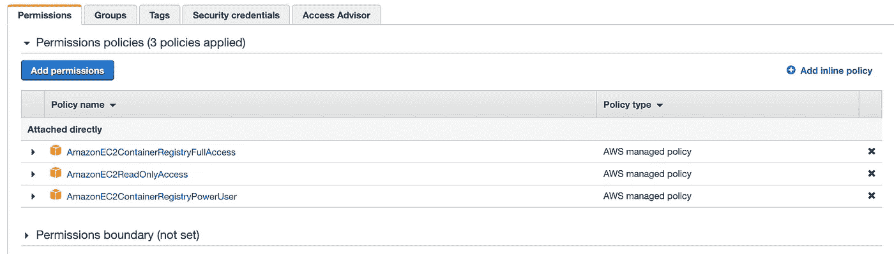

添加权限；作者截图

## 在项目中添加凭据

在你的根目录下创建一个`.aws/credentials`文件夹

```
mkdir ~/.aws
code ~/.aws/credentials
```

并从 AWS 粘贴您的凭据

```
[dev]
aws_access_key_id = YOUR_KEY
aws_secret_access_key = YOUR_KEY
```

与`config`相同

```
code ~/.aws/config[default]
region = YOUR_REGION (eg. eu-central-1)
```

注意，`code`是用我选择的编辑器 vscode 打开一个文件夹。

将分配给用户的 AWS 访问密钥 id 和秘密访问密钥保存在文件~/中。AWS/凭据。请注意。aws/ directory 需要在您的主目录中，并且凭据文件没有文件扩展名。

# 在弹性容器注册中心(ECR)中创建一个存储库

搜索 ECR，然后您将进入可以创建新存储库的页面。

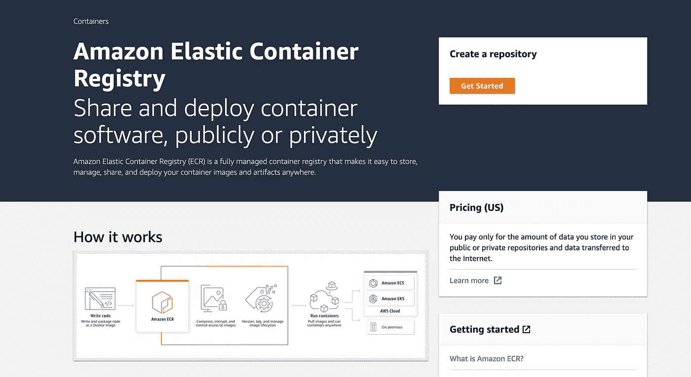

创建存储库；作者截图

之后，您可以看到新的回购协议:

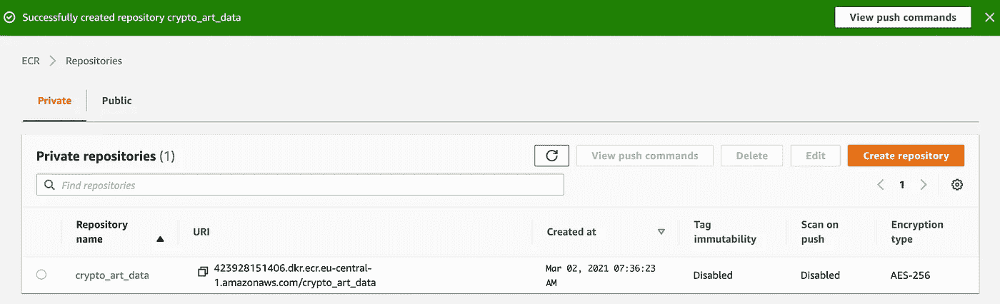

存储库概述；作者截图

接下来，我们要获取推送命令:

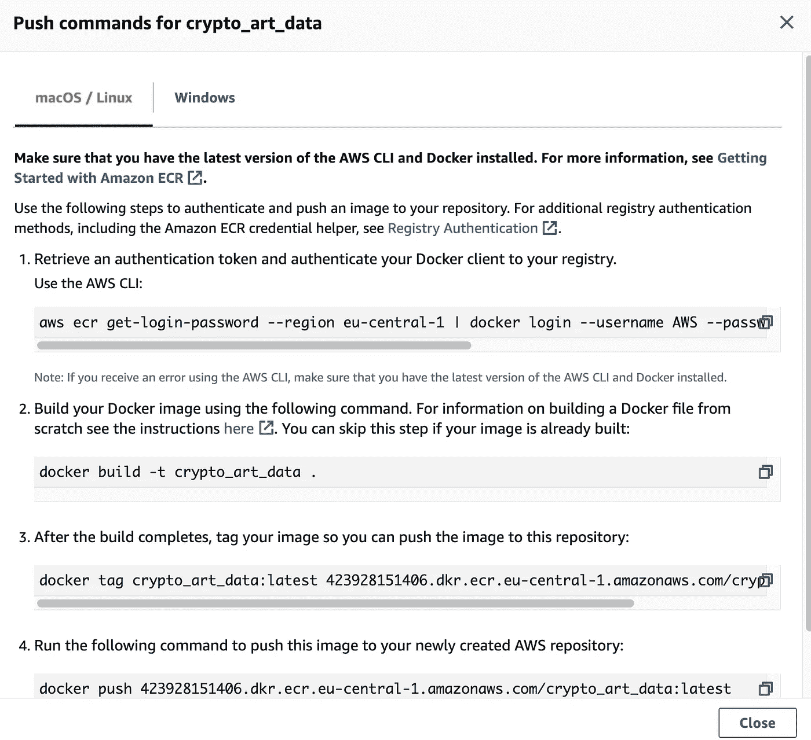

推送命令；作者截图

只需按照这些说明为 AWS 连接设置本地 repo。要意识到你是项目的根本，这样一切都会顺利进行。

确保您已经安装了 AWS CLI，或者按照[官方文档](https://docs.aws.amazon.com/cli/latest/userguide/install-macos.html)进行安装。

如果你在这里有问题，只需谷歌错误信息。通常，策略和您的用户会有问题。这个 SO 问题帮了我:[https://stack overflow . com/questions/38587325/AWS-ECR-getauthorizationtoken](https://stackoverflow.com/questions/38587325/aws-ecr-getauthorizationtoken)

执行推送命令后，您将拥有在线映像:

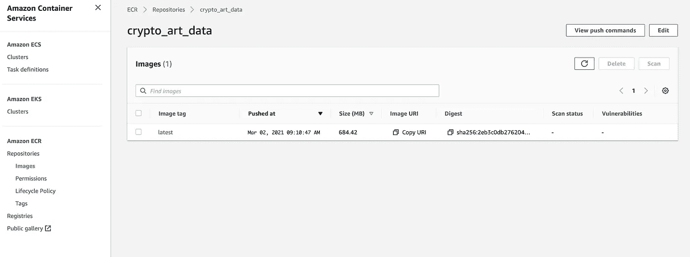

知识库中的 Docker 图像；作者截图

# 配置集群

接下来，转到“集群”(在亚马逊 ECS 下，不是 EKS！)在菜单里。

*   选择“仅网络”模板
*   添加姓名
*   创造

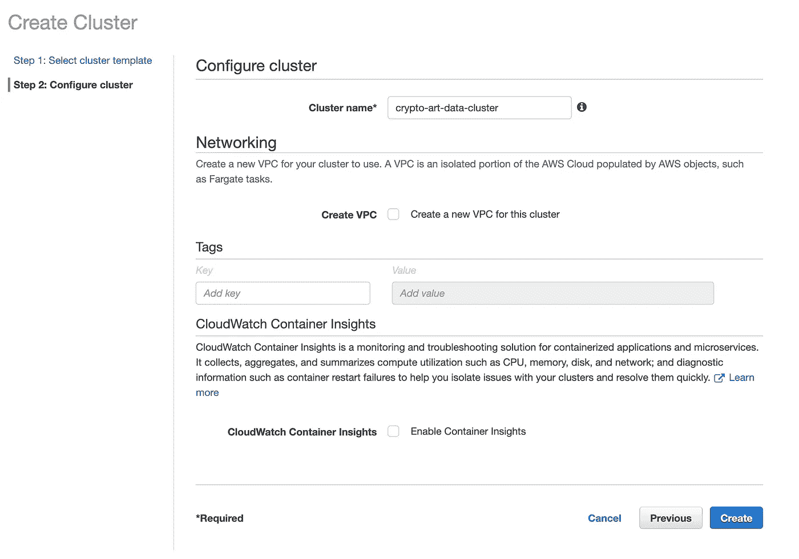

创建一个集群；作者截图

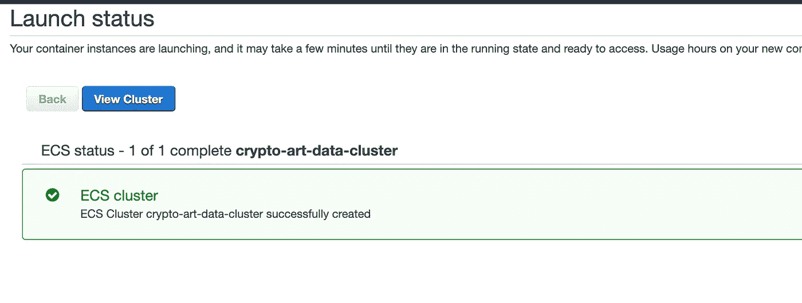

启动集群；作者截图

在这一部分，我有时会得到错误消息。如果您遇到这种情况，您可以简单地重新创建集群。如果一切都设置正确，它应该工作。

# 创建一个任务以在 AWS 中运行 Docker 容器

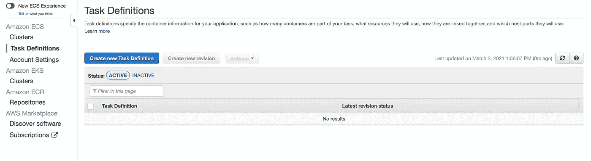

定义任务；作者截图

转到“任务定义”并创建一个与 Fargate 兼容的新任务。

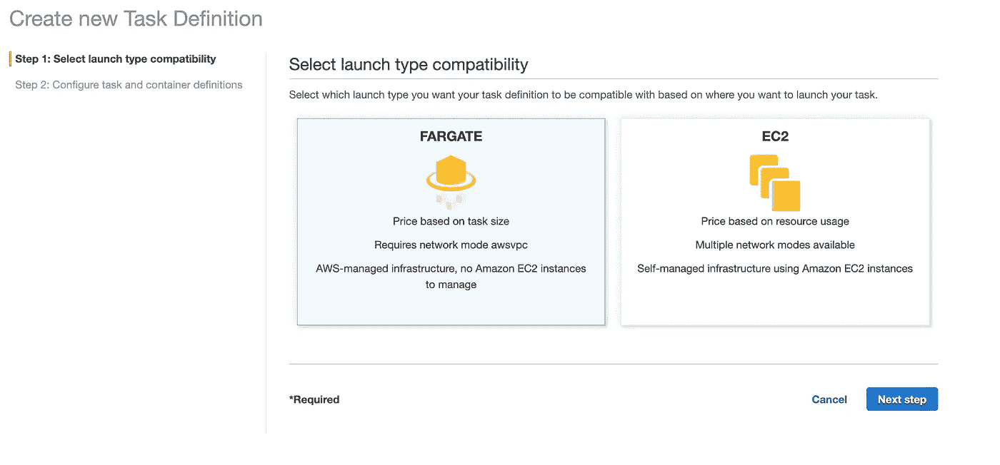

选择 Fargate 任务；作者截图

然后

*   添加姓名
*   指定任务大小(我使用最小的选项)
*   添加容器

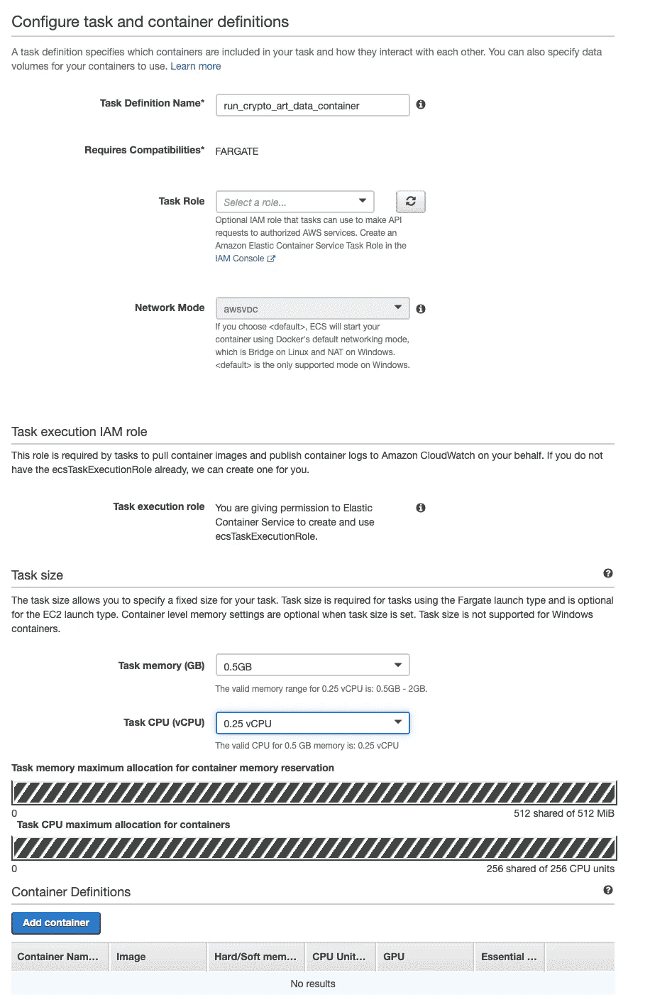

配置任务；作者截图

*   添加容器的名称
*   将从 CLI 命令获得的映像地址复制到映像被推送的位置
*   添加暴露的端口(在您的 docker 文件中指定)

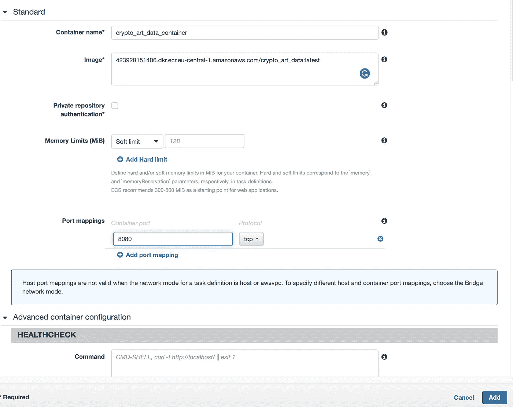

设置容器；作者截图

然后创建任务

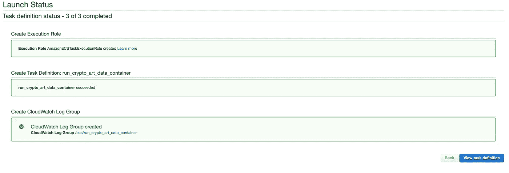

已完成的任务；作者截图

现在，您应该已经在 Fargate 中定义了一个任务，并连接了您的容器。

# 执行任务

现在，您可以运行您定义的任务:

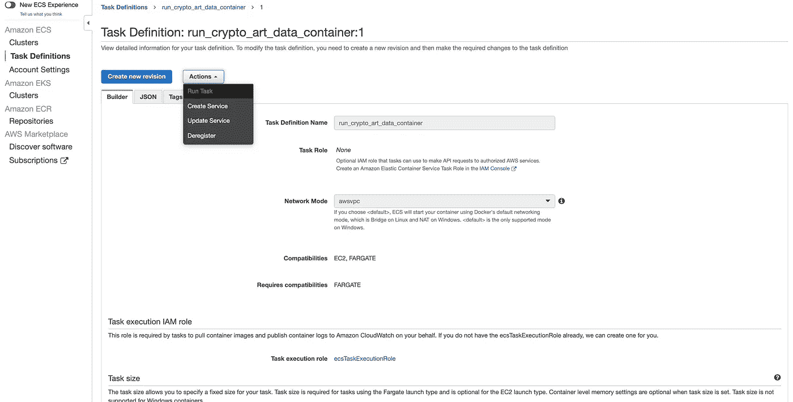

运行任务；作者截图

选择 Fargate 作为午餐类型，并在表单中添加提供的下拉选项(集群 VPC 和子网)

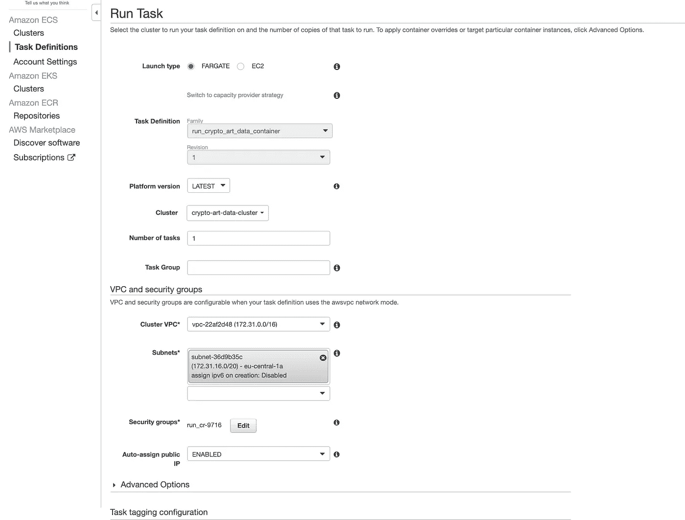

运行任务；作者截图

之后，您可以运行该任务，它应该是这样工作的:

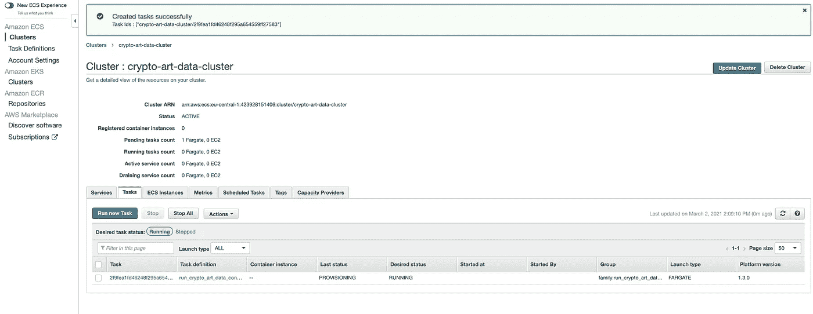

成功的任务；作者截图

# 在网页中显示定义的端口

由于我们定义了一个特定的端口，现在我们需要通过 security 选项卡公开它。

*   单击您定义的任务
*   点击 ENI Id 进入网络界面
*   点击您的网络 ID
*   转到“安全组”
*   将您的端口作为自定义 tcp 添加到入站规则中

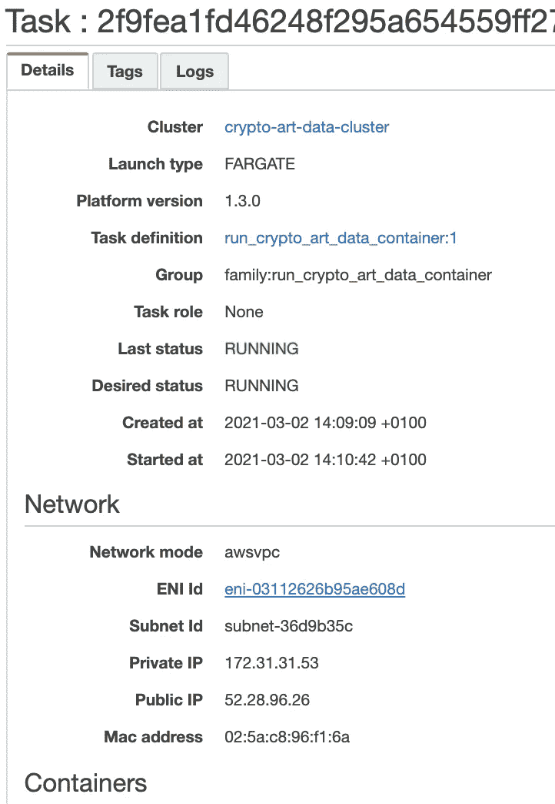

任务概述；作者截图

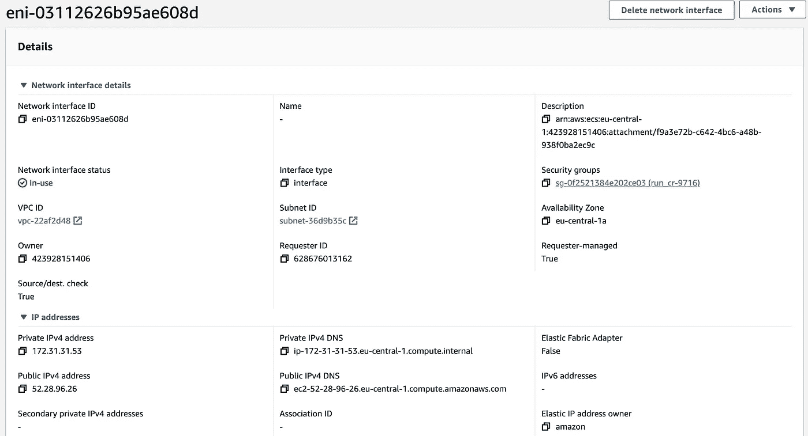

ENI 身份证概述；作者截图

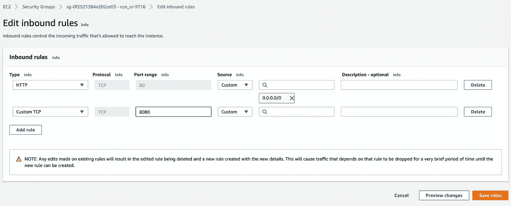

编辑入站规则；作者截图

# 在线观看您的应用

在任务选项卡中，您将看到您的公共 IP 显示。只需导航到相应端口的页面，您就会看到您的网站

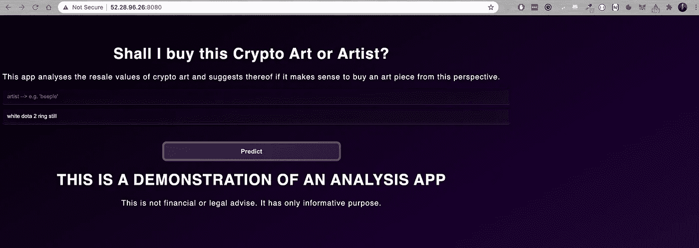

静态网站

截图中显示的 IP 地址不再工作，以避免 AWS 成本。然而，这篇文章是一个更大项目的一部分，我将在[www.shouldibuycryptoart.com](http://www.shouldibuycryptoart.com/)下发布这个项目。该应用程序正在开发中。如果你想关注它的发展，请随时联系我或关注我的社交媒体账户。

# 奖励:调查错误

由于一些特定的标志，我在本地容器开发上运行时，我的应用程序中的特定函数出现了一些错误。

在容器下的任务概述中，您可以检查 cloudwatch 中的日志。点击链接，它会显示你的应用崩溃的原因:

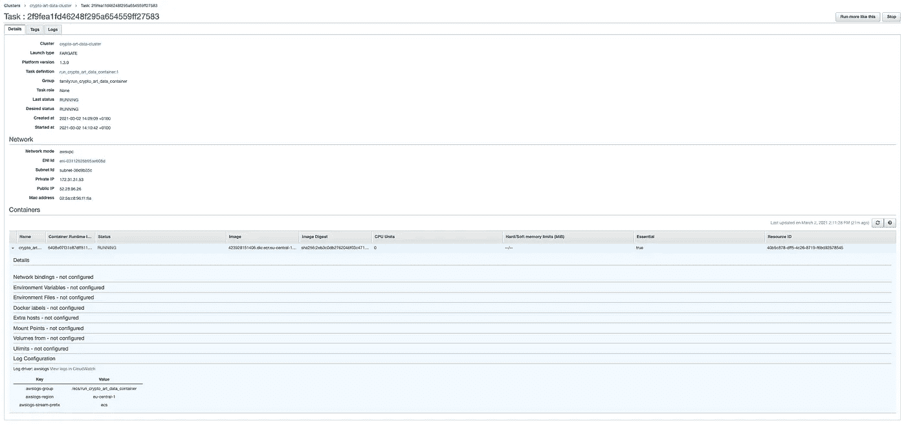

链接到 Cloudwatch 的任务概述；作者截图

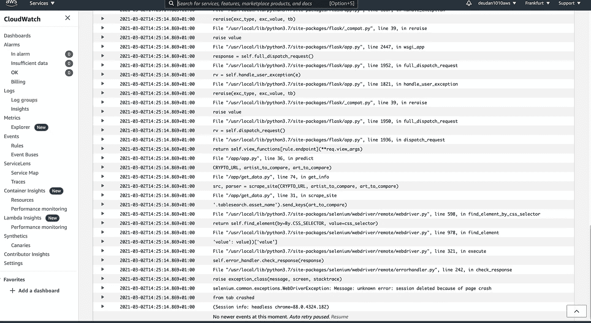

调查 Cloudwatch 日志；作者截图

现在你可以调试你的程序了。

编码快乐！

# 放弃

我与本文中使用的任何服务都没有关联。

我不认为自己是专家。除了做其他事情，我只是记录事情。因此，内容并不代表我的任何专业工作的质量，也不完全反映我对事物的看法。如果你觉得我错过了重要的步骤或者忽略了什么，可以考虑在评论区指出来或者联系我。

这写于 2021 年 3 月 6 日**。我无法监控我的所有文章。当你阅读这篇文章时，提示很可能已经过时，过程已经改变。**

**我总是乐于听取建设性的意见以及如何改进。**

# **关于**

**丹尼尔是一名艺术家、企业家、软件开发人员和商业法毕业生。他的知识和兴趣目前围绕着编程机器学习应用程序及其所有相关方面。从本质上说，他认为自己是复杂环境的问题解决者，这在他的各种项目中都有所体现。**

****

**连接到:**

*   **[Allmylinks](https://allmylinks.com/createdd)**

**直接:**

*   **[领英](https://www.linkedin.com/in/createdd)**
*   **[Github](https://github.com/Createdd)**
*   **[中等](https://medium.com/@createdd)**
*   **[推特](https://twitter.com/_createdd)**
*   **[Instagram](https://www.instagram.com/create.dd/)**
*   **[createdd.com](https://www.createdd.com/)**

**艺术相关:**

*   **中等/最先进的**
*   **[Instagram/art_and_ai](https://www.instagram.com/art_and_ai/)**
*   **稀有的**
*   **[公海](https://opensea.io/accounts/createdd?ref=0xc36b01231a8f857b8751431c8011b09130ef92ec)**
*   **[已知产地](https://knownorigin.io/profile/0xC36b01231a8F857B8751431c8011b09130ef92eC)**
*   **[魔鬼艺术](https://www.deviantart.com/createdd1010/)**