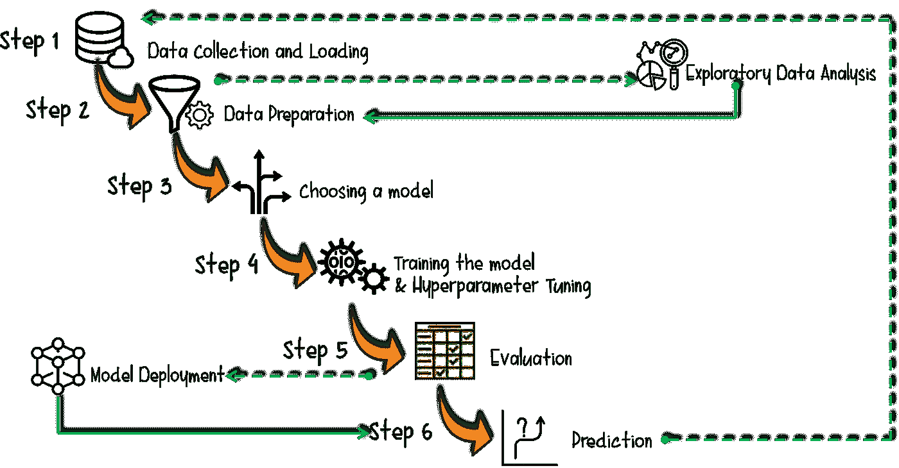
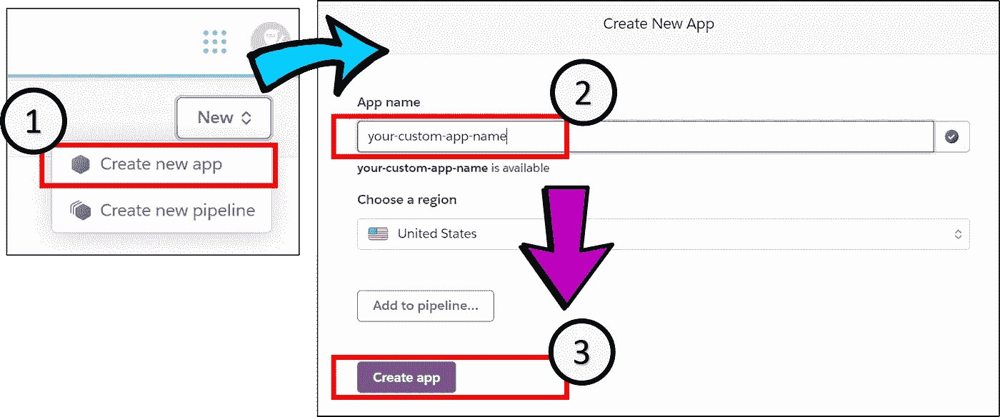
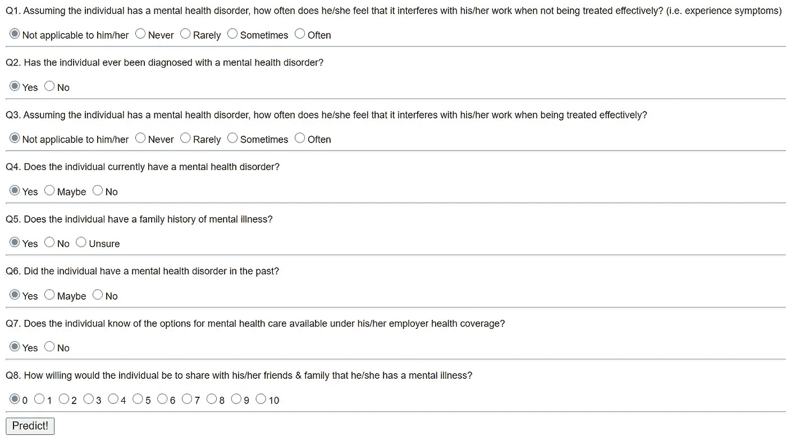
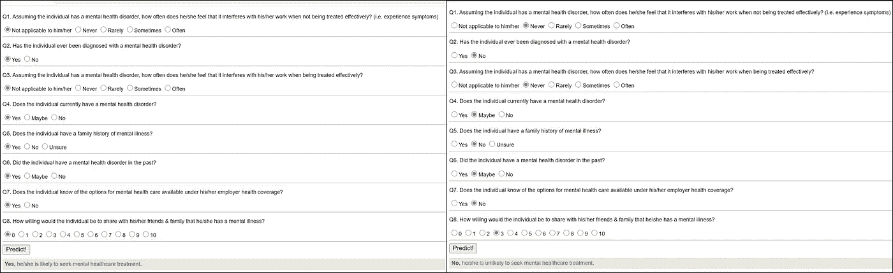
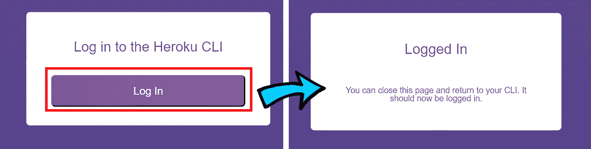

# 分三步在 Heroku 上部署您的 Python 机器学习模型

> 原文：<https://towardsdatascience.com/deploy-your-python-machine-learning-models-on-heroku-in-3-steps-dc5b6aca73d9?source=collection_archive---------19----------------------->

## 在 Flask Web 应用程序上部署 ML 模型以供公共使用的说明性教程。

**先决条件:**

1.  **Heroku** 账号(如果你还没有的话，在【https://www.heroku.com/】的注册)
2.  **GIT** 安装在本地 PC 上(免费在[https://git-scm.com/downloads](https://git-scm.com/downloads)安装 GIT)
3.  一个用 python 开发的经过训练的 **ML 模型**(本教程中将其命名为 *model.pkl* )。

## 本教程的目的

因此，在您的本地开发环境中，您有一个工作的 ML 模型，并且您停留在“模型部署”阶段，如下面的 ML 生命周期所示:

作者图片|展示 ML 生命周期

那你来对地方了！本文的其余部分将关注于**模型部署步骤**。完整的源代码可以在我位于 https://GitHub.com/incubated-geek-cc/your-custom-app-name 的 github 获得，你可以随意把它作为你自己的☺使用

## 注:**本教程中使用的样本** ML 模型**用于预测一个人基于几个特征(逻辑回归模型)选择寻求精神保健治疗的可能性。根据您的 ML 模型的用例，在下面的演示文件中相应地调整参数。**

# **第一步。在 Heroku 上创建一个新的应用程序**

图片作者| **第一步:**登录 [Heroku](https://www.heroku.com/) 账户后，在选择“创建新应用”。**第二步**:输入你想要的 web app 名称。**第三步**。选择“创建应用程序”。

# **第二步。启动本地电脑上的项目文件夹**

作者的代码片段|将 ML 模型( **model.pkl** )和以 JSON 格式( **X_test.json)** 存储的模型输入的列参数放在“models”文件夹中。

## **每个文件内的内容(requirements.txt，runtime.txt，Procfile，app.py，X_test.json，index.html，run_app.bat):**

## 解释和注意事项:

*   **requirements.txt** —包含设置 Flask web 应用程序和加载 ML 模型的所有 python 依赖项。*建议:为了避免本地 PC 上的 python 库版本冲突，建议在 python 虚拟环境中进行开发工作。*

创建一个 python 虚拟环境—(将其命名为**)。env【本教程中的 ，打开命令提示符并运行以下命令:**

作者代码片段|请注意，上述命令适用于 Windows 操作系统。对于 MacBook/Unix 用户，运行`**source env/bin/activate** in your shell terminal instead to activate your python virtual environment.`

**重要: **requirements.txt** 中的** Python 包依赖应该包括用于开发你的 ML 模型的*包以及用于 web app 部署的*Flask+guni corn**。**

> *要自动提取 python 依赖项，运行命令:*pip freeze>requirements . txt**

*   ***runtime . txt**-指定用于开发模型的 Python 版本。*

> **例如对于 python 3 . 7 . 9 版本，文件内容应该是:* python-3.7.9*
> 
> **对于 python 3 . 7 . 2 版本，文件内容应为:* python-3.7.2*

***重要提示:**请注意，本文件*区分大小写*和*精确*。关键是“python-3.7.x”要用小写字母输入，不能有空格。如果另外指定，Heroku 版本将*失败*，例如“ **P** ython-3.7.9”(大写字母“P”)或“python 3.7.9”(无 hypen“-”)。*

*   ***X_test.json** —您的 ML 模型的输入参数名称的 json 数组。*
*   ***index.html**—为用户选择输入和检索模型输出结果而设置的极简用户界面。*

***重要提示:**务必注意在**index.html**中找到的表单*输入名称*与 **X_test.json** 中陈述的*特征*相对应*

*要在 localhost 上测试 web 应用程序，请继续运行 **run_web.bat** 文件，并打开浏览器导航到 [http://localhost:5000/](http://localhost:5000/) 。您应该能够查看以下用户界面:*

**

*作者图片|通过 **run_app.bat** 文件从本地主机运行 Flask app 时**index.html**文件的预览*

## *通过选择以下表格输入，输出 ML 模型的结果:*

**

*图片作者|注意，在左边，预测的答案是“是”，而在右边，预测的结果是“否”，这取决于用户的选择。*

# *第三步。在项目文件夹中启动 GIT*

*确保 web 应用程序在本地 PC 上顺利运行后，右键单击并打开项目文件夹中的 Git Bash 终端。运行以下命令:*

**

*作者图片|网络浏览器应自动打开，并选择如上所示的“登录”。在您的 Git Bash 终端上，应该会出现**heroku:Waiting to log in…，log in…done**。*

*最后，打开另一个 Git Bash 终端(在项目根文件夹中)并运行以下命令:*

*作者代码片段|根据您的 heroku web 应用程序的名称，相应地更改参数。*

*Heroku 应根据 **requirements.txt** 文件中规定的 python 依赖关系，使用 **runtime.txt** 中规定的特定 python 版本，继续构建应用程序。*

# *最后，所有的源代码都构建好了，部署也完成了！恭喜你！*

***(忽略)** *你现在有你的机器学习模型可供公众访问了:*[*https://your-custom-app-name.herokuapp.com/*](https://your-custom-app-name.herokuapp.com/)*

> *注意:由于 Heroku 托管平台的变化，web 应用程序没有迁移到 https://your-custom-app-name.onrender.com/。请忽略上面的 Heroku 应用程序(配置可以保持不变)*

*本教程中的所有源代码都可以在我的 GitHub 上找到:[https://github.com/incubated-geek-cc/your-custom-app-name](https://github.com/incubated-geek-cc/your-custom-app-name)*

## *请随意派生它，并相应地调整它以适合您的用例。玩得开心！☺*

* [## 通过我的推荐链接加入灵媒——李思欣·崔

### 获得李思欣·崔和其他作家在媒体上的所有帖子！😃您的会员费直接…

geek-cc.medium.com](https://geek-cc.medium.com/membership)*