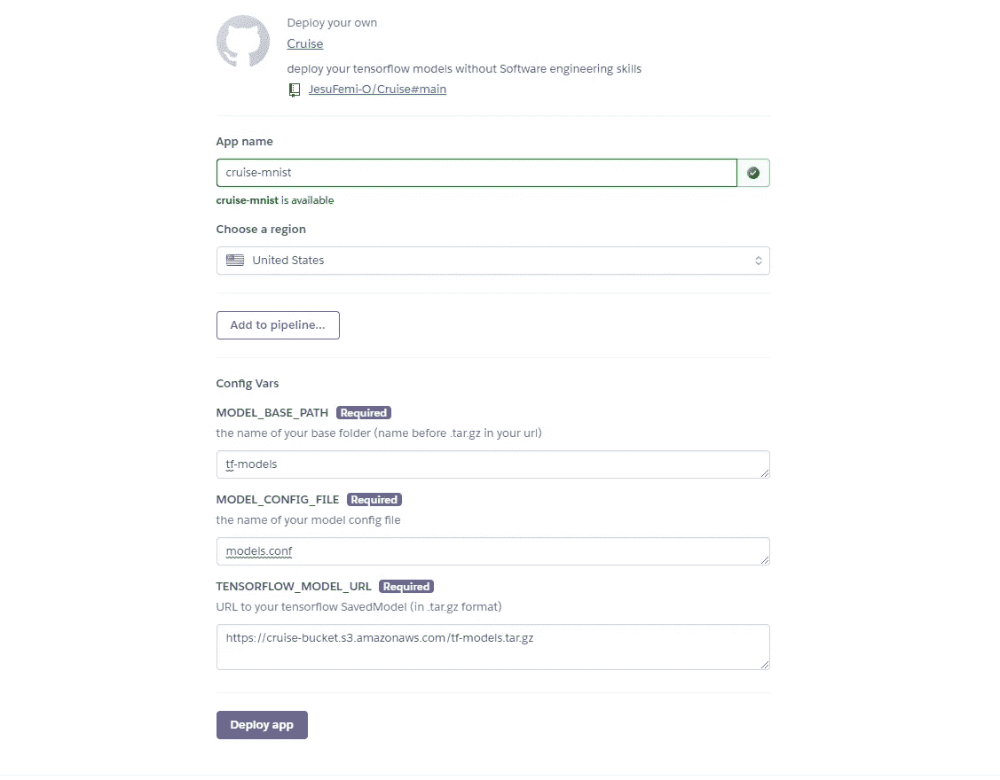
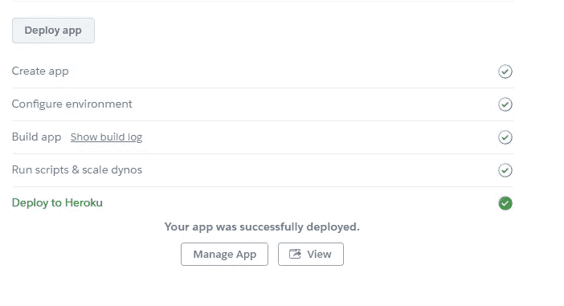
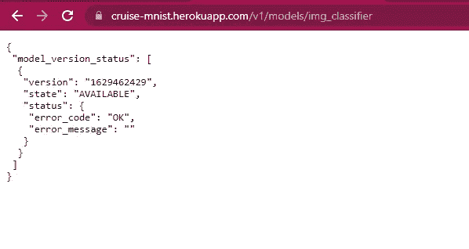

# 只需点击一下按钮，即可在 Heroku 上部署您的 Tensorflow 模型

> 原文：<https://towardsdatascience.com/deploy-your-tensorflow-models-on-heroku-with-a-button-click-4fbb0252f870?source=collection_archive---------25----------------------->

## *自动化您的 tensorflow 模型服务*

由[亚当·卢科姆斯基](https://unsplash.com/@anilinverse?utm_source=unsplash&utm_medium=referral&utm_content=creditCopyText)在 [Unsplash](https://unsplash.com/s/photos/rocket-animation?utm_source=unsplash&utm_medium=referral&utm_content=creditCopyText) 上拍摄

在建立了这个卓越的模型之后，接下来呢？你如何向你的朋友炫耀它？你如何添加额外的一层神奇之处，帮助你超越 Github 中的一堆 jupyter 笔记本，让其他人也能与之互动？服务于您的模型使您离构建产品更近了一步，而不仅仅是拥有代码。

对于希望快速完成概念验证的爱好者和数据科学家来说，如果有一种方法可以以最少的工作量自动化您的模型部署，那么可以节省大量时间。在本文中，我将向您介绍一个工具，它可以让您轻松地将 Tensorflow 模型作为 rest apis 使用！

## 先决条件

为了跟进，你需要一个 Heroku 账户和一个在 AWS 上的公开的 s3 bucket。

# 让我们和克鲁斯一起建造吧！

欢迎来到克鲁斯！Cruise 是一个简单的设置，它消除了在 Heroku 平台上部署和服务模型时需要了解 TensorFlow 服务和 docker 的顾虑。它让你只需点击一个按钮就能完成所有这些。

在本文中，我们将使用著名的 MNIST 数据集构建一个图像分类器模型，然后使用 Cruise 部署该模型。

## **步骤 1:使用 SavedModel 格式构建并保存您的模型**

Tensorflow SavedModel 使打包模型变得非常容易，以便使用 [TFLite](https://tensorflow.org/lite) 和 [TensorFlow Serving](https://www.tensorflow.org/tfx/serving/tutorials/Serving_REST_simple) 等工具进行共享或部署。它存储运行模型所必需的参数，而不需要训练代码，从而可以方便地重用模型。

在第 58 行，我们指定了保存模型的路径。我们还使用时间戳作为模型的名称，以确保每次运行时，我们都会保存模型的新版本。

## 步骤 2:创建 Tensorflow 服务器使用的配置文件。

选择具有 TensorFlow 服务的模型的一种方法是通过配置文件。配置文件允许您方便地为服务器提供多个模型，还可以控制应该提供哪个(些)版本的模型。在 ***tf-models*** 文件夹中，创建 ***models.conf*** 文件:

在配置文件中，我们已经指定了模型的名称，这个名称将在我们访问 Heroku 上的模型的最终 url 中使用。基本路径告诉 Tensorflow 服务在哪里可以找到我们模型的所有可能版本。模型版本策略有助于我们控制对可以提供哪些模型的访问。更多相关信息可在[这里](https://www.tensorflow.org/tfx/serving/serving_config#serving_a_specific_version_of_a_model)找到。

## 第三步:压缩 tar.gz 格式的模型文件，并保存在一个公共 S3 桶

为了使用 cruise，我们必须首先将我们保存的模型作为一个压缩文件放在一个公开可用的 s3 bucket 上。下面是一个简单的代码，可以用来压缩模型文件:

## 第四步:和克鲁斯一起上菜！

访问 [Cruise Repo](https://github.com/JesuFemi-O/Cruise) ，点击 deploy 按钮，会将您重定向到 Heroku，您需要输入一些值:

巡航部署示例。(图片由作者提供)

应用程序名称是您的 heroku 应用程序的名称，必须是唯一的，否则 Heroku 会标记错误。您可以选择列表中离您最近的任何地区。 **MODEL_BASE_PATH** 指的是保存模型和配置文件的基本文件夹。在我们的例子中，我们将这个文件夹命名为 **tf-models** ，并将我们的压缩文件命名为**tf-models.tar.gz**。

**MODEL_CONFIG_FILE** 指的是我们给配置文件起的名字。在我们的例子中，我们称之为 **models.conf** 。

最后， **TENSORFLOW_MODEL_URL** 引用 s3 提供的 s3 bucket 对象 URL。请注意，我们必须使用 https url，因为 cruise 在内部使用 curl 来下载文件，如果协议不是 HTTP，就会标记一个错误。点击部署按钮，heroku 设置您的应用程序，最终完成后，您可以查看应用程序:

成功部署巡航导弹(图片由作者提供)

点击“查看”按钮可进入已部署应用程序的根页面，该页面返回“未找到”,因为 Tensorflow 服务器未使用该路径。要查看您部署的模型的健康状况，您可以导航到 https:[https://YOUR-APP.herokuapp.com/v1/models/img_classifier](https://cruise-cassava.herokuapp.com/v1/models/img_classifier)

将 **YOUR-APP** 替换为 Heroku app 的名称，将 image_classifier 替换为您在 models.conf 文件中为模型指定的任何名称，在我们的示例中，url 将是:【https://cruise-mnist.herokuapp.com/v1/models/img_classifier】T2

模型健康终点(图片由作者提供)

要对我们的模型进行预测，我们只需发出如下请求:

注意第 20 行的 url。我们已经将' ***:predict*** '添加到我们之前的 url 中，指定我们想要在模型上执行的操作。现在你知道了！您可以在其他应用程序中轻松使用互联网上的实时模型！

# 结论

我构建 Cruise 的动机是找到一种将 Tensorflow 模型作为 API 自动部署的方法。如果您在一个必须向不同的人或团队提供模型的环境中工作，例如，软件工程师或您在一个团队中工作，并且需要一个工具来在实验时快速共享您的模型，那么使用 Cruise 进行部署是一个值得考虑的好方法！如果你有任何问题或者想要联系，这是我的 LinkedIn。谢谢大家！