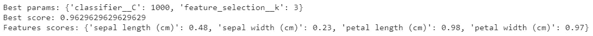
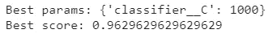
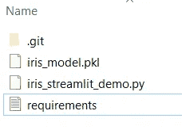
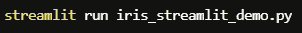
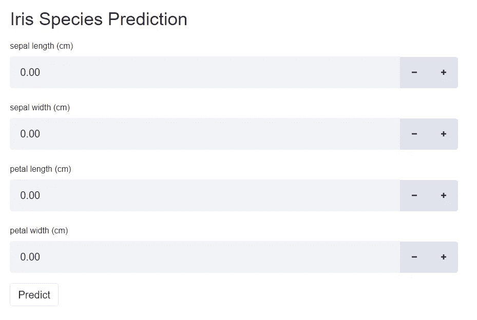
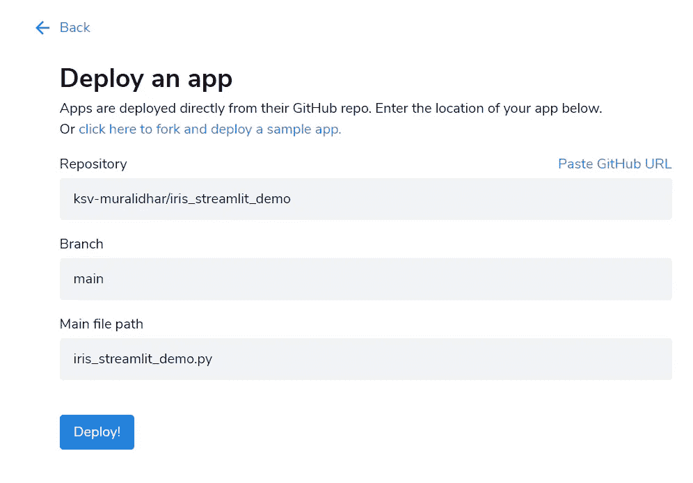
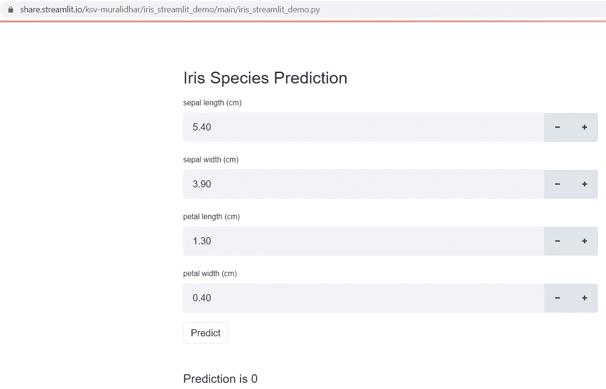
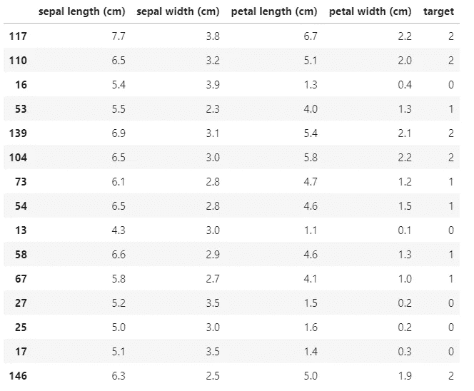

# 部署基本的 Streamlit 应用程序

> 原文：<https://towardsdatascience.com/deploying-a-basic-streamlit-app-ceadae286fd0?source=collection_archive---------12----------------------->

## 本文演示了一个基本的 Streamlit 应用程序(预测鸢尾的种类)的部署，以简化共享。


琼·加梅尔在 [Unsplash](https://unsplash.com/s/photos/application?utm_source=unsplash&utm_medium=referral&utm_content=creditCopyText) 上的照片

[Streamlit](https://streamlit.io/) 是一个应用框架，用于部署使用 Python 构建的机器学习应用。这是一个开源框架，类似于 r 中的 Shiny 包。本文假设读者具备 Conda 环境、Git 和 Python 机器学习的基础知识。

# 模型开发

## **型号 1**

我们将对 Scikit-Learn 软件包中的 Iris 数据集拟合一个逻辑回归模型。下面的代码将数据集分为训练集和测试集，以便在测试集上部署后评估模型。我们将使用互信息度量通过“选择最佳”方法进行特征选择。“SelectKBest”的超参数调整和逻辑回归的正则化参数是使用 GridSearchCV 的 3 倍来完成的。



作者图片

从上面的“GridSearchCV”结果来看，只有 3 个输入特征是重要的。我们使用从“GridSearchCV”中找到的最佳超参数重新调整了管道数据，发现“萼片宽度(cm)”并不重要。

## 模型 2

我们将通过消除管道中的“特征选择”步骤来构建另一个模型。此外，从训练数据中删除了“萼片宽度(cm)”列。



作者图片

上述“GridSearchCV”结果为模型 1 和 2 返回了相同的交叉验证分数。然而，为了简单起见，我们将部署“模型 1”。使用“joblib”将“模型 1”保存到名为“iris_model.pkl”的文件中。

# 应用部署可简化 it 共享

一旦模型被开发、评估和保存，我们需要导入“streamlit”包来开发我们的应用程序。使用我们用于模型开发的(上面的)代码是行不通的。我们需要为模型部署创建一个新的 Python 脚本(不是 Jupyter 笔记本)。我们将创建一个部署/项目文件夹，其中包含

1.  名为' iris_streamlit_demo.py '的部署 Python 脚本(按照惯例，文件名应该是' streamlit_app.py '，但不是强制的)。
2.  保存的模型(' iris_model.pkl ')。
3.  requirements.txt '文件，该文件指定要安装的软件包。必须指定软件包的版本，以避免“它在我的机器上工作”的问题。软件包的版本必须与我们 Conda 环境中的版本相匹配。我们将使用的“requirements.txt”文件和部署/项目文件夹结构如下所示。

```
streamlit==0.79.0
numpy==1.19.2
joblib==0.17.0
scikit-learn==0.23.2
```



部署文件夹结构(作者图片)

iris_streamlit_demo.py '如下所示。我们使用 Streamlit 的“numeric_input”方法添加了 4 个数字输入文本框。我们添加了一个“预测”按钮，当任何输入小于或等于 0 时，它会返回一个错误“输入必须大于 0”。如果所有输入都大于 0，那么结果将是一个预测。

我们将使用下面的命令从终端运行应用程序来测试它。在本地机器上运行的应用程序的屏幕截图如下所示。



作者图片



在本地机器上运行的应用程序(图片由作者提供)

要部署该应用程序来简化共享，我们需要创建一个 Streamlit 帐户。一旦创建了帐户，我们需要将部署文件夹(本地 repo)推送到‘Github’(远程 repo)中，剩下的就交给 Streamlit 了。下面是 streamlit.io 上[部署页面](https://share.streamlit.io/deploy)的截图。



https://share.streamlit.io/deploy

下面是[部署的应用](https://share.streamlit.io/ksv-muralidhar/iris_streamlit_demo/main/iris_streamlit_demo.py)的截图，以简化分享。



为简化共享而部署的应用程序的屏幕截图(图片由作者提供)

用于评估部署模型的测试集如下所示。发现看不见的数据的分数是 1(偶然的)。



评估已部署模型的不可见数据

这是部署基本应用程序以简化 it 共享的演示。需要注意的重要一点是，为简化 it 共享而部署的应用程序不是私有的。Streamlit 已经成为部署机器学习应用程序的 Flask 的替代方案。使用 Streamlit 构建的应用也可以部署在流行的云平台上(不仅仅是 Streamlit 共享)。