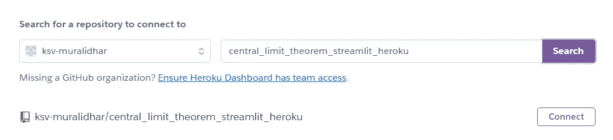
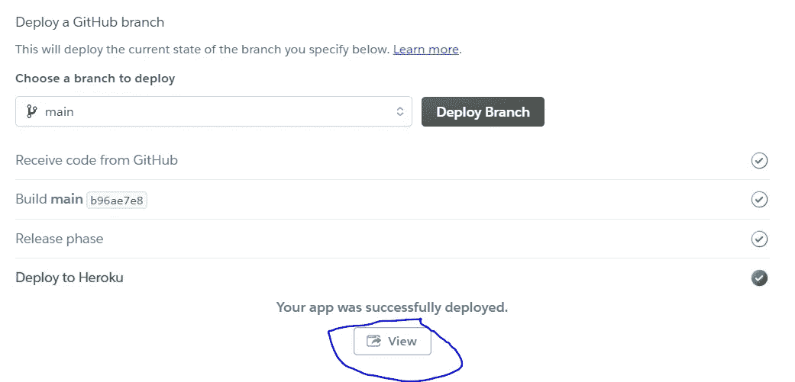

# 将基本的 Streamlit 应用程序部署到 Heroku

> 原文：<https://towardsdatascience.com/deploying-a-basic-streamlit-app-to-heroku-be25a527fcb3?source=collection_archive---------18----------------------->

## 本文展示了在 Heroku 上部署一个基本的 Streamlit 应用程序(模拟中心极限定理)


作者图片

[Streamlit](https://streamlit.io/) 是一个应用框架，用于部署使用 Python 构建的机器学习应用。它是一个开源框架，类似于 R. Heroku 中的 Shiny 包。Heroku 是一个平台即服务(PaaS ),支持在云中部署和管理用多种编程语言构建的应用程序。

根据中心极限定理，随着样本容量的增加，样本均值将越来越接近总体均值。如果从总体中抽取足够数量的样本，随着样本量的增加，样本均值的分布(也称为样本均值的抽样分布)看起来更接近高斯分布，而不考虑潜在的总体分布。样本均值的标准偏差(又称标准误差)将等于(总体标准偏差/样本大小的平方根)。

# 关于应用程序

这个 Streamlit 应用程序模拟了样本和总体特征变化时的中心极限定理。这个应用程序使用户能够玩人口范围，人口规模，样本大小和样本数量。改变总体和样本的这些特征会对总体参数、样本统计、总体分布和样本均值的分布产生影响。这个应用程序可视化了样本均值和人口分布的这些变化。

# 文件夹结构

下面是用于将应用程序部署到 Heroku 的部署文件夹结构。


作者图片

## **central_limit_theorem.py**

这个 Python 脚本(。py 文件，不是笔记本)包含了 Streamlit app 的代码。

## requirements.txt

“requirements.txt”文件指定了要安装的包。必须指定软件包的版本，以避免“它在我的机器上工作”的问题。软件包的版本必须与我们 Conda 环境中的版本相匹配。我们将使用的“requirements.txt”文件如下所示。

```
matplotlib==3.4.1
numpy==1.20.2
pandas==1.2.3
streamlit==0.79.0
```

## setup.sh

“setup.sh”指定在运行应用程序之前配置环境要执行的命令。在我们的' setup.sh '中，我们首先创建一个'。streamlit '目录来存储凭据和配置文件。然后，我们指定向 streamlit.io 注册的电子邮件，并将其写入“credentials.toml”文件。然后，我们将配置细节添加到“config.toml”文件中。这两个文件都位于。“简化”目录。

```
mkdir -p ~/.streamlit/

echo "\
[general]\n\
email = \"email@domain\"\n\
" > ~/.streamlit/credentials.toml

echo "\
[server]\n\
headless = true\n\
enableCORS=false\n\
port = $PORT\n\
" > ~/.streamlit/config.toml
```

## Procfile

“Procfile”列出了启动应用程序时要执行的命令。在我们的“Procfile”中，我们将首先运行创建所需配置文件的“setup.sh ”,然后使用“streamlit run”命令运行应用程序。

```
web: sh setup.sh && streamlit run iris_streamlit_demo.py
```

# 将应用程序部署到 Heroku

1.  登录你的 Heroku 账户，从右上角的“新建”菜单中选择“创建新应用”。


作者图片

2.输入您的应用程序的名称(基于可用性的任何名称)，然后单击“创建应用程序”。


作者图片

3.选择部署方法。因为我已经使用 GitHub 托管代码文件(远程回购)，所以我将选择那个选项。如果您是第一次进行连接，可能需要验证您的 GitHub 凭据。


作者图片

4.输入您要部署的 GitHub repo 的名称，单击“搜索”并单击“连接”



作者图片

5.然后选择要部署的分支，并单击“部署分支”。我不打算在未来修改应用程序，所以我没有启用自动部署。


作者图片

6.成功部署应用程序后，您将看到消息，并单击“查看”查看应用程序。



作者图片


已部署应用的屏幕截图(图片由作者提供)

部署到 Heroku 的 app 可以在 这里找到 [**。由于该应用程序仅用于演示目的，我使用免费的 dynos，这可能会导致应用程序性能不佳。有时，应用程序启动可能需要更长的时间，因为 dyno 可能会在较长时间不活动时进入睡眠模式。此外，这个应用程序通过滑块(不使用提交按钮)接受输入，并与大型 Numpy 数组一起工作，这可能会使应用程序崩溃，使其无法访问。然而，我使用了“@st.cache”装饰器，据说它可以在执行高资源要求的计算时提高应用程序的性能。您也可以从 Streamlit 共享**](https://clt-streamlit-heroku.herokuapp.com/)**[T5 这里](https://share.streamlit.io/ksv-muralidhar/central_limit_theorem/main/central_limit_theorem.py)** 访问应用程序。