# 使用 AWS Copilot 部署容器化的 Web 应用程序

> 原文：<https://towardsdatascience.com/deploying-a-containerized-web-app-with-aws-copilot-db5c90467fbd?source=collection_archive---------16----------------------->

## 使用 AWS Copilot 简化 AWS ECS 和 AWS Fargate 的部署

作者:[爱德华·克鲁格](https://www.linkedin.com/in/edkrueger/)和[迪伦·罗西](https://www.linkedin.com/in/dylan-rossi/)


约翰·麦克阿瑟在 [Unsplash](https://unsplash.com/s/photos/airplane?utm_source=unsplash&utm_medium=referral&utm_content=creditCopyText) 的照片

本文将向您展示如何使用 AWS Copilot 将容器化的 web 应用程序部署到 AWS。Copilot 极大地简化了 AWS 的部署，并提供了一个统一的框架来提供架构、构建映像和部署容器作为公共或私有服务。此外，Copilot 允许我们根据自己的需求创建负载平衡服务或请求驱动服务，而无需用户更改应用程序、配置或架构。

将逐步创建一个身份访问管理帐户，在 AWS 上通常称为 IAM。创建此帐户后，我们将连接到本地机器上的 AWS 和 Copilot CLI。

**注意:您需要 docker 运行才能成功完成这项工作。**

# 登录或注册 AWS

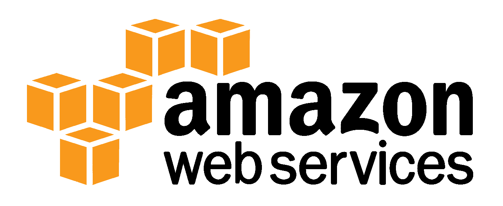

要在 AWS 上创建 IAM 帐户，您必须先注册一个 AWS 帐户。如果您尚未执行此操作，请在此处执行[操作。](https://portal.aws.amazon.com/billing/signup#/start)

# 在 AWS 上创建 IAM 帐户

创建帐户后，以 Root 用户身份导航到 AWS 管理控制台。

将会有一个标有“所有服务”的下拉列表点击这个，它会打开一个 AWS 提供的所有不同服务的大列表。IAM 将位于右上方的“安全、身份和合规性”部分。

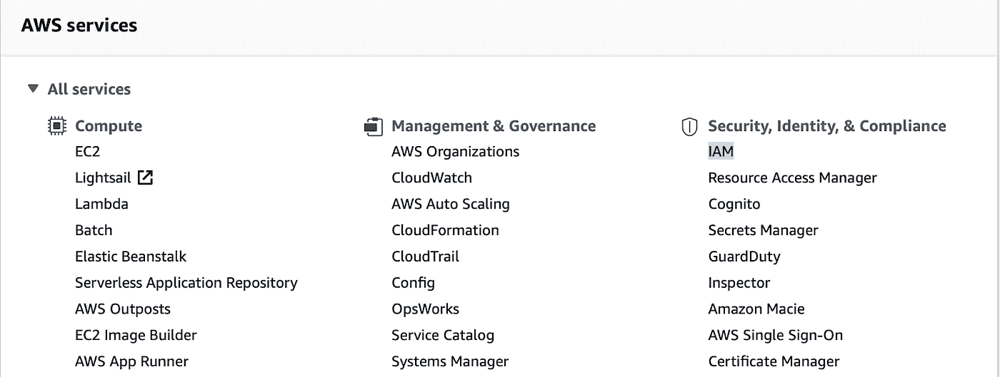

当您到达 IAM 控制面板时，会有大量的内容可供您点击。

您首先需要创建一个具有管理员访问权限的“用户组”。

为此，请点击“用户组”

如果您过去已经创建了一个用户组，它们将在这里列出。我们将假设您没有创建任何，然后一起创建一个。

首先单击“创建组”按钮。


然后会要求您为新用户组命名。您将称之为“管理员”

现在，您可以跳过向该组添加用户，因为您将在创建该组后执行此操作。

再向下滚动一点，您将看到“附加权限策略”部分。在文本框中，键入“admin ”,然后按回车键。这将进一步过滤结果，并允许我们更快地找到“AdministratorAccess”策略名称。继续并选中该策略旁边的框。

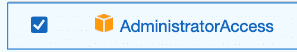

最后，单击“创建组”

现在，您已经成功创建了“管理员”用户组。

现在我们已经创建了管理员组，我们需要创建一个新用户并将他们添加到该组中。

返回 IAM 主页，单击 IAM 资源下的“用户”链接。

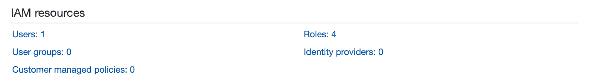

当页面加载时，您将单击“添加用户”按钮。


对于用户名，我们将称之为“copilot ”,因为这是我们将这个 IAM 帐户连接到的。

然后，我们希望选中“编程访问”旁边的框，因为我们将要求该用户使用 AWS CLI。

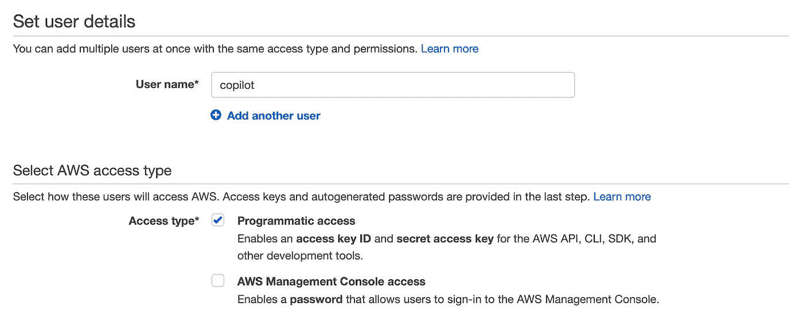

设置完成后，单击权限继续下一页。


您可以在这个页面上把我们的新用户添加到我们新创建的“管理员”用户组中。为此，请选中“管理员”用户组旁边的复选框。

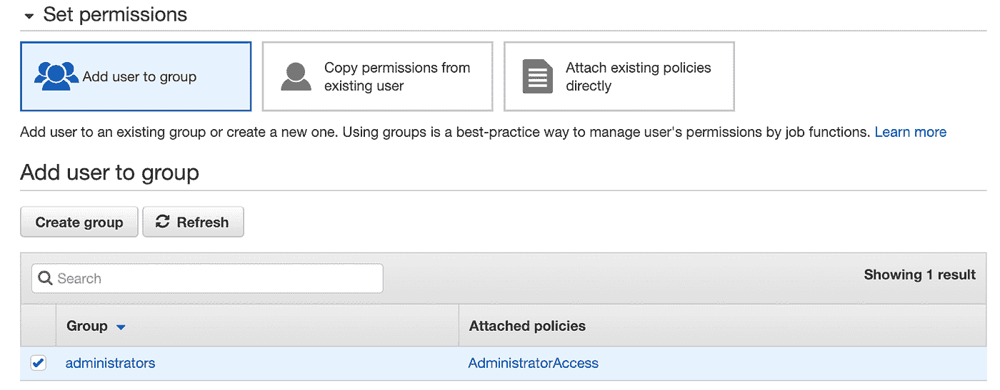

选中该框后，您可以点击进入下一页，标签。标签只是您可以添加给用户的一些附加信息，以便快速查找或收集信息。我们目前不关心添加任何标签，但是如果你愿意，你可以这样做。

如果您对添加(或未添加)的标签感到满意，请进入下一页查看新用户信息。如果一切正常，单击“创建用户”完成新用户的创建。

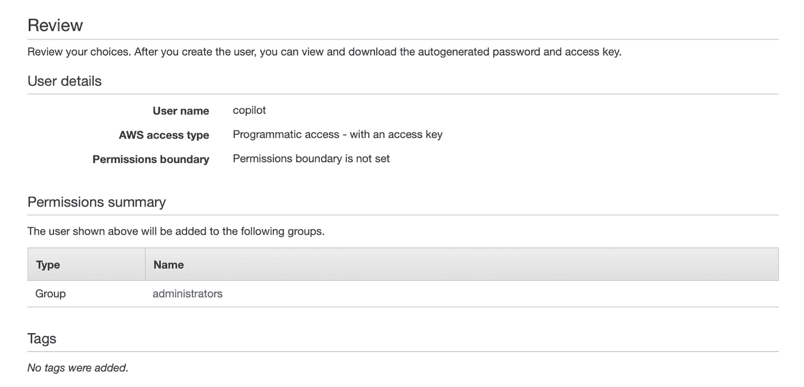

您应该会收到一条绿色消息，说明用户已成功创建，以及我们稍后将需要的关于用户的一些信息，特别是访问密钥 ID 和秘密访问密钥。要么留在此页面，要么保存此信息以备后用。

# 将 AWS CLI 安装到您的计算机上

成功创建用户后，我们现在可以安装 AWS CLI 并连接刚刚创建的 IAM 帐户。

要安装 AWS CLI，打开 Terminal(对于 Unix 机器)或 git-bash(任何其他命令行工具)for Windows。

从那里，根据您的操作系统运行以下命令之一:

## 马科斯

```
curl “https://awscli.amazonaws.com/AWSCLIV2.pkg" -o “AWSCLIV2.pkg”sudo installer -pkg AWSCLIV2.pkg -target /
```

## Linux 操作系统

```
curl “https://awscli.amazonaws.com/awscli-exe-linux-x86_64.zip" -o “awscliv2.zip”unzip awscliv2.zipsudo ./aws/install
```

## Windows 操作系统

```
msiexec.exe /i [https://awscli.amazonaws.com/AWSCLIV2.msi](https://awscli.amazonaws.com/AWSCLIV2.msi)
```

然后它会询问你的电脑密码并安装它。

完成后，您就成功地将 AWS CLI 安装到了本地计算机上。

# 下载示例存储库

现在您已经在我们的机器上安装了 AWS CLI，您现在可以使用 Copilot 推送一个示例 web 应用程序。

为了让我们开始，我创建了一个存储库，其中包含一个已经编码好的容器化 web 应用程序。你可以在这里下载库[。](https://github.com/edkrueger/spam-detector)

一旦克隆到您的机器上，继续在 terminal/git-bash 中打开这个目录。

# 使用 Copilot 部署应用程序

在终端的垃圾邮件检测器存储库中。然后，您就可以使用 Copilot 为部署准备这个 web 应用程序了。

这是通过简单的命令完成的

```
copilot init
```

运行时，系统会提示您回答一些关于项目的问题:

*   您是否希望使用现有的应用程序之一—否(如果您以前从未使用过 Copilot，您可能看不到此提示)
*   您希望如何命名您的应用程序—垃圾邮件检测器应用程序(您可以随意命名)
*   哪种工作负载类型最能代表您的架构？—负载平衡 Web 服务或请求驱动 Web 服务(如果您希望它面向公众)。
*   您希望将此负载平衡的 web 应用命名为什么？—垃圾邮件检测器应用程序(或任何您喜欢的应用程序)
*   你想将哪个 docker 文件用于垃圾邮件检测器应用程序？— ./Dockerfile.copilot

回答完所有这些问题后，它将开始部署您的应用程序！

一旦部署了这个实例，您将得到一个提示，询问您是否想要部署一个测试环境。

测试环境是应用程序的另一个实例，使用更少的资源。如果您将在完全部署项目之前进行大量测试和更改，这将非常有用。

这将开始构建我们的环境，然后是 docker 容器。一旦成功创建了这些，Copilot 就会将 docker 容器推送到 ECR，用 ECS 引导应用程序，并给我们一个 URL 来测试应用程序。

# 测试应用程序是否工作

## 测试 GET 请求

既然构建已经完成并部署好了，我们可以前往终端中返回的 URL。您可以将该 URL 复制/粘贴到您的浏览器中，或者按住 cmd 键单击该 URL 以自动打开它。

应用程序应该加载，并在窗口上有一些文字说:

“应用程序已启动”

## 测试 POST 请求

为了测试 POST 请求能否正常工作，我们将使用免费应用程序 Postman。

如果你没有安装 Postman，你可以在这里下载它。

打开 Postman，您将获得我们收到的 URL，并将其粘贴到“输入请求 URL”文本框中。然后，您将在 URL 的末尾添加“/predict ”,因为这是我们为处理 POST 请求而创建的路由。您还需要确保请求的类型设置为 POST。

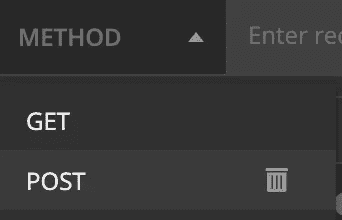

正确设置 URL 并选择 POST 后，单击“body”选项卡。

“body”选项卡将包含我们想要发送到 POST 端点的数据。

我们想要发送的数据类型是 JSON。所以从给定的选项中选择“raw ”,然后使用下拉菜单将类型从“Text”更改为“JSON”。

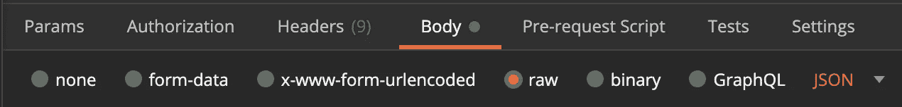

然后，您可以填充下面的 JSON。我们将简单地发送一个键/值对。

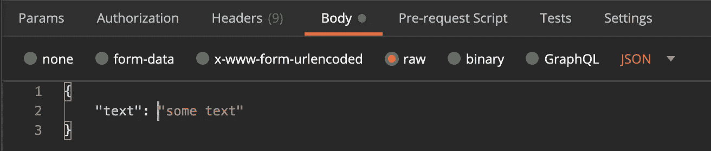

最后，您可以单击 send 并等待来自我们端点的响应。

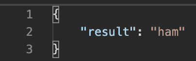

如果您按照正确的步骤操作，您应该会收到返回的结果“ham ”,从而确认我们的 POST 端点正在按预期工作。

# 关闭应用程序

Copilot 也使关闭您的部署相对容易。您可以通过 AWS CLI 一次关闭所有服务，而不是进入 AWS 并单独关闭每个服务。

因此，回到您的终端的同一个应用程序目录中，输入以下命令来关闭我们的部署:

```
copilot app delete
```

系统会提示您确认是否要删除该应用程序，只需键入“y”然后回车确认即可。

几分钟后，您的应用将成功关闭！

# 结论

正如你所看到的，AWS 的 Copilot 允许部署和关闭一个容器化的 web 应用程序，就像在终端上键入几个命令一样简单。

如果你想看这一过程的视频版本，请查看我的 YouTube 频道。