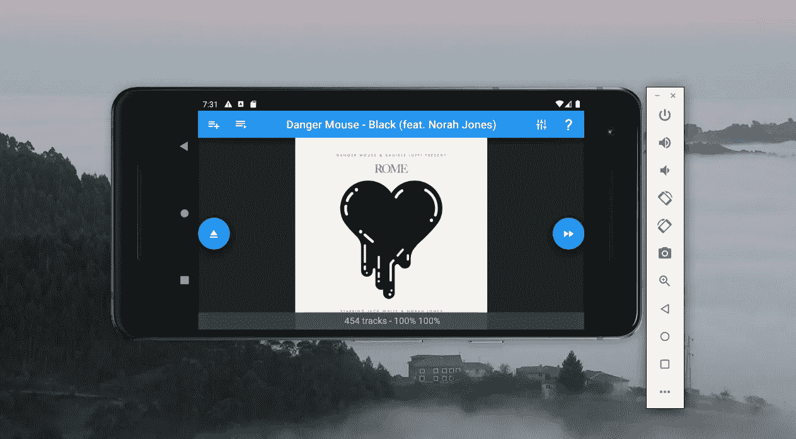

# 部署跨平台深度学习应用

> 原文：<https://towardsdatascience.com/deploying-a-cross-platform-deep-learning-application-a026da146d6?source=collection_archive---------20----------------------->

## 使用 Python 在 iOS、Android、MacOS、Windows 和 Linux 上运行 Tensorflow Lite 推理

作者图片

# TL；速度三角形定位法(dead reckoning)

向下滚动 Python 代码，使用 Tensorflow Lite 运行推理，它可以在 Android、iOS、Windows、MacOS 和 Linux 上运行。

# 为什么坚持用 Python？

Python 是一个奇妙的生态系统。有这么多高质量的开源库可以帮助你快速构建非常复杂的项目。这无疑有助于 Python 作为深度学习框架的流行。至关重要的是，pip(或 pipenv)为您处理依赖关系，这样您可以避免陷入*版本地狱*。这使得 Python 非常适合于原型开发，但是要得到一个易于使用的完美产品，有时可能比所有其他产品加在一起还要费力。正如笑话所说，答案可能是“我不会从这里开始”。

# Web app 还是手机 app？

通常，最好的选择是在 web 上部署应用程序，这样浏览器就能有效地处理平台细节。然后，您的 Python 代码可以作为服务运行，并集成到运行在云上的可扩展架构中。但是如果需要来回发送的数据量太大或者太敏感怎么办？鉴于我们大多数人口袋里都装着相当于 80 年代超级电脑的东西，利用手机的力量是有意义的。

作为一个例子，我使用深度学习开发了一个基于原始音频数据的[音乐推荐算法。给定一组 MP3，它会自动创建音乐播放列表，这些音乐可以很好地放在一起，或者从一首歌平稳地过渡到另一首歌。我希望能够在我的手机、平板电脑或电脑上运行它，而不必将我的所有曲目上传到云端进行分析。我认为 Tensorflow Lite 可以在几乎所有可以想象到的平台上使用，不需要重写大量代码就可以实现。](https://teticio.github.io/deej-ai/)

# Qt 对 Kivy

现在有很多跨平台的开发工具，但是很少能在桌面和移动设备上工作，并且很容易集成 Python 代码。我研究了两个声称能做到这一点的工具:Qt 和 Kivy。

[Qt](https://www.qt.io/) 以 [PyQt5](https://pypi.org/project/PyQt5/) 和 [pyqtdeploy](https://pypi.org/project/pyqtdeploy/) 的形式出现。特定于平台的东西，比如播放音频，被 Qt 抽象掉了，所以理论上，你只需要写一次代码。这种通用方法的缺点是，您可能无法充分利用目标设备的功能。我的经验是，在 Android 上使用 Numpy 非常困难，我甚至没有在 iOS 上尝试过。这真的感觉就像试图把一个圆钉塞进一个方孔。

[另一方面，Kivy](https://kivy.org/#home) 是用 Python 编写的，可以与像 [buildozer](https://buildozer.readthedocs.io/en/latest/) (用于在 iOS 和 Android 上构建)、 [PyInstaller](https://www.pyinstaller.org/) (用于打包桌面应用)、 [p4a](https://python-for-android.readthedocs.io/en/latest/quickstart/) (Python 用于 Android)和 [kivy-ios](https://github.com/kivy/kivy-ios) 这样的库一起工作。我使用 Numpy 获得了一个基本应用程序，运行非常快，能够使用 [KivyMD](https://kivymd.readthedocs.io/en/latest/) (材质设计)让它看起来很智能，同时使用 [pyobjus](https://pyobjus.readthedocs.io/en/latest/) (用于在 iOS 上从 Python 调用 Objective C)[pyjnius](https://pyjnius.readthedocs.io/en/stable/)(用于在 Android 上从 Python 调用 Java)和 [plyer](https://github.com/kivy/plyer) 完全控制平台特定的功能。由于 pyjnius 开发人员之一 [Tito](https://github.com/tito) 在 Android 上运行 Tensorflow Lite 的[示例](https://github.com/tito/experiment-tensorflow-lite)，我领先了一步。

我花了很长时间才让 iOS 版本工作，主要是因为我没有 Mac，所以我不得不使用模拟器，但也因为 Objective C 很糟糕，不容易从 Python 中调用。(我也尝到了版本地狱的滋味，kivy-ios 和 Cocoapod 都有音频库中的重复符号。)另一种方法是从 Swift 调用 Tensorflow Lite 和 Python，但这将意味着完全重写我的应用程序。

下面的代码片段扩展了 Kivy，允许您以独立于平台的方式在 Tensorflow Lite 上运行推理。它假设您的模型只有一个输入和输出张量——这是通常的情况——但是推广到多个输入和输出是非常简单的。

为了方便开始，我创建了一个可以在 Android、iOS、MacOS、Windows 和 Linux 上运行的[“Hello World”tensor flow Lite 应用](https://github.com/teticio/kivy-tensorflow-helloworld)。对您来说，根据自己的需要对其进行调整应该是相当简单的。现在，没有什么可以阻止您开发一个利用您设备的传感器和功能的深度学习应用程序！

<https://github.com/teticio/kivy-tensorflow-helloworld/tree/main>  

总之，我想说 Kivy 非常有前途，开发者们一直在忙于改进它。在我看来，它非常接近于能够生产出高质量的应用程序。