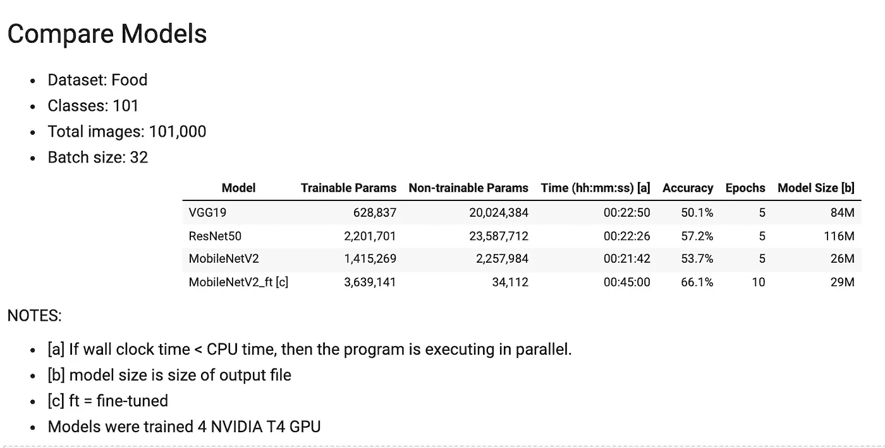
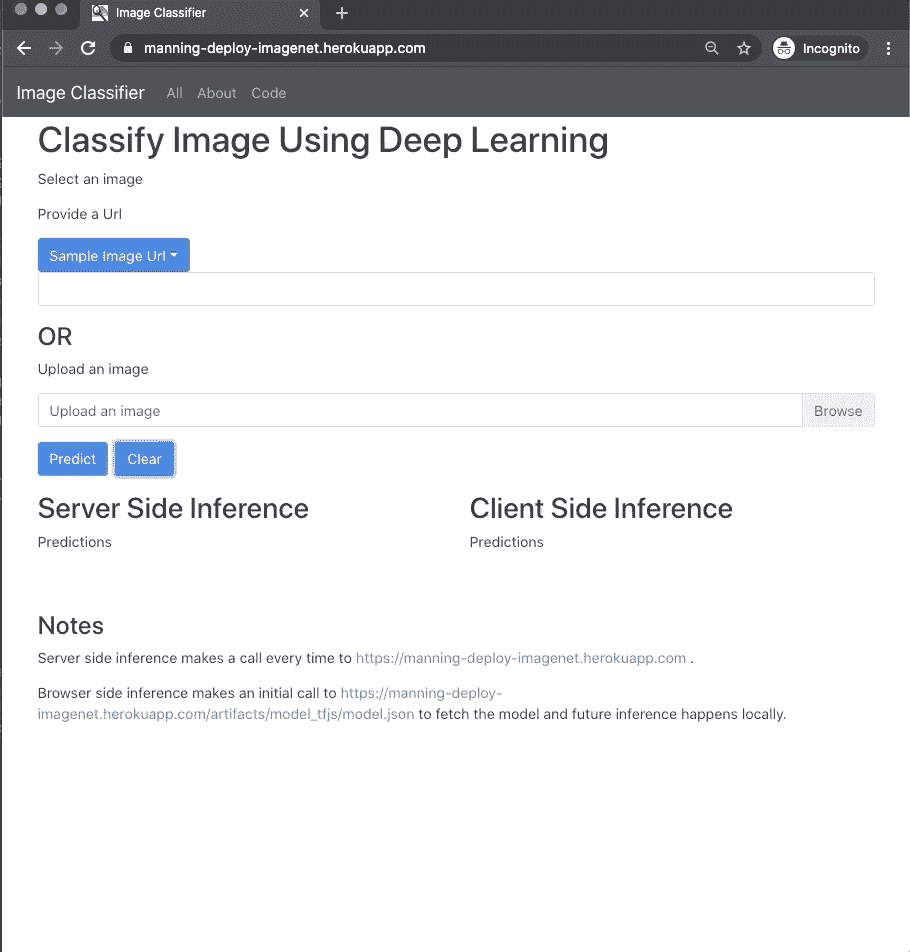
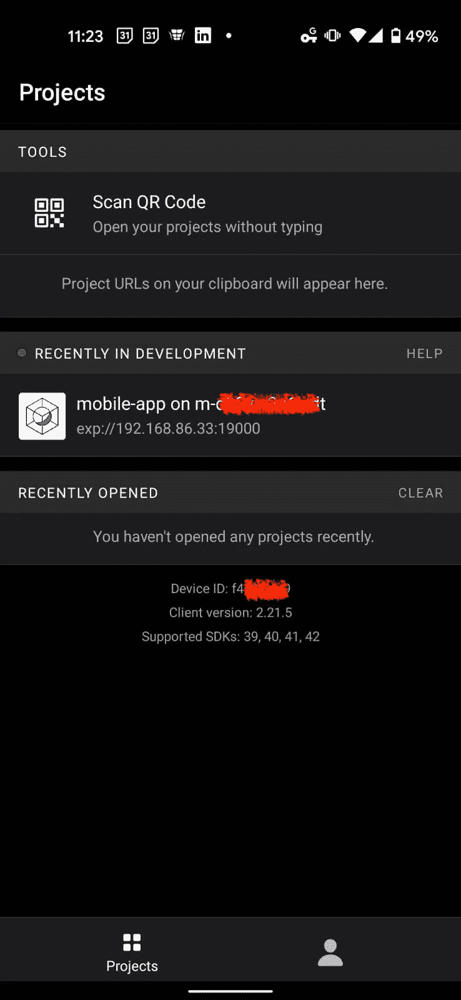
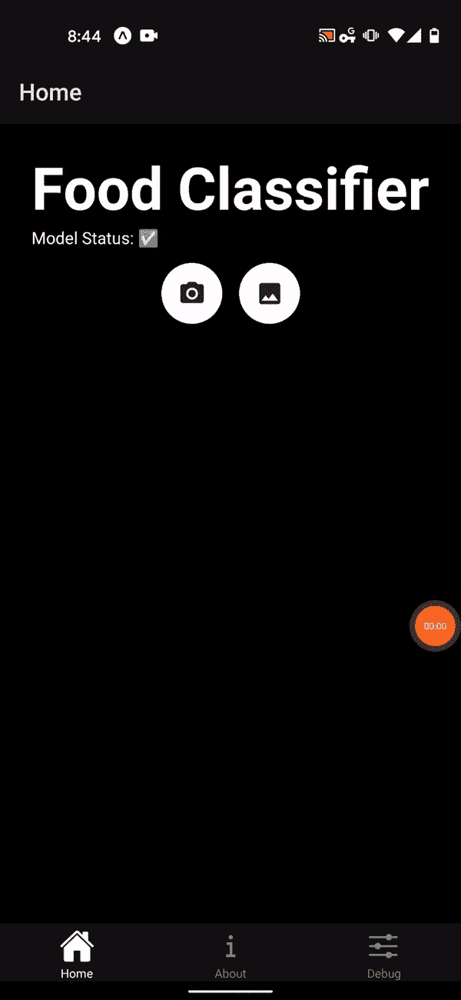
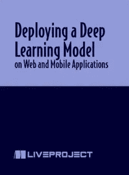

# 使用 TensorFlow 和 React 在移动设备上部署深度学习模型

> 原文：<https://towardsdatascience.com/deploying-a-deep-learning-model-on-mobile-using-tensorflow-and-react-4b594fe04ab?source=collection_archive---------1----------------------->

## 我们将介绍如何使用 React Native 和 TensorFlowJS React Native adaptor 构建一个跨平台的移动应用程序(适用于 iOS 和 Android)


安娜·佩尔泽在 [Unsplash](https://unsplash.com/s/photos/food-salad?utm_source=unsplash&utm_medium=referral&utm_content=creditCopyText) 上的照片

该项目由[尼丁·帕坦尼伊尔](https://medium.com/@npatta01)和[热沙玛·谢赫](https://medium.com/@reshamas)共同完成。

随着移动电话变得越来越普及，移动电话的使用也在增加。用户越来越频繁地在桌面上使用移动设备，移动应用需求旺盛。这些连接互联网的设备提供了一个让推理模型更接近用户的机会。

# 概述

*   关于数据:食物-101
*   第 1 部分:使用 TensorFlow 训练图像分类器
*   第 2 部分:转换模型
*   第 3 部分:推理的考虑事项:在服务器上运行还是在客户机上运行
*   第 4 部分:部署 Web 应用程序
*   第 5 部分:部署移动应用程序

# 关于数据:食物-101

本项目使用 [Food-101](https://www.tensorflow.org/datasets/catalog/food101) 数据，包括 101 个食品类别，共 101，000 张图像。因此，每个类有 1000 幅图像，其中 250 幅是人工检查的测试图像，750 幅是训练图像。ETHZ Food-101 的分类是来自食物图片分享网站 foodspotting.com 的 101 个最受欢迎的分类。


[食品-101 数据集](https://www.tensorflow.org/datasets/catalog/food101)

**数据引用**

Bossard，Lukas 和 Guillaumin，Matthieu 和 Van Gool，Luc，用随机森林挖掘 101 种食品歧视成分，欧洲计算机视觉会议，2014 年。

# 第 1 部分:使用 TensorFlow 训练图像分类器

使用 TensorFlow 2.3.4 训练图像分类器。代码可在 GitHub 上的[本笔记本](https://github.com/reshamas/deploying-web-app/blob/main/notebooks/2021_09_20_1_run_dl_model_101_classes.ipynb)中查阅。TensorFlow 2 / Keras 中有许多预训练的[模型](https://keras.io/api/applications/)。我们使用了 ResNet50 和 MobileNetV2 架构。MobileNet 模型系列是移动友好的，它将用于移动应用程序。

## 表 1:比较模型架构

我们在下面的表格中比较了模型的准确性、参数数量和模型大小。

MobileNetV2 是一个移动友好的架构，具有较少的参数。移动应用程序部署中使用的最终模型是 MobileNetV2 微调模型，精确度约为 66%。



作者图片

# 第 2 部分:转换模型(量化和优化)

我们将`model.h5`和`classes.json`(这是食品类别名称的列表)文件下载到本地计算机上一个名为`model_tf`的文件夹中，并在虚拟环境中进行模型转换。

我们创建的模型`model.h5`，格式为“TensorFlow Keras”。我们需要将其转换为“TensorFlow.js”格式，因为客户端推理需要这种格式。我们转换默认 tensorflow.js 模型有几个原因:

*   **模型碎片**:我们的模型文件很大，默认的 tensorflow.js 将模型分解成 5 MB 的碎片。为了部署移动应用程序，我们需要一个文件，所以我们指定 50，000，000 字节的`weight_shard_size_bytes`来获取该文件。
*   **推理-速度优化使用** `[**GraphModel**](https://livebook.manning.com/book/deep-learning-with-javascript/chapter-12/1#search)` [**转换**](https://livebook.manning.com/book/deep-learning-with-javascript/chapter-12/1#search)

> `GraphModel`转换如何提升 TensorFlow.js 模型的推理速度？这是通过利用 TensorFlow (Python)对模型的计算图进行精细粒度的提前分析来实现的。计算图分析之后是对图的修改，这些修改减少了计算量，同时保持了图的输出结果的数字正确性。

*   **使用量化的推理速度优化:**量化是一种减少模型大小的后训练技术。这里，我们使用量化将默认的 32 位精度降低到 16 位精度，这将使模型文件大小减半。

我们将所有 3 个转换步骤合并为:

我们保存了转换后的模型文件，并将其上传到移动 repo 的 GitHub releases 区域:[deploying-mobile-app/release](https://github.com/reshamas/deploying-mobile-app/release)

这些模型和类文件将在创建 web 应用程序时用作输入。

## 表 MobileNetV2 的型号大小

请注意，量化的模型大小减少了 50%，从 14MB 减少到 6.9MB。两种模型大小的推断时间相似。在大多数情况下，[文献](https://livebook.manning.com/book/deep-learning-with-javascript/chapter-12/1)表明 16 位量化不会显著影响精度。

```
Web App:  Compare Model Size Before & After Optimization and Quantization╔═════════════╦════════════════════╗
║ Model       ║ Model Size         ║ 
║             ║                    ║        
╠═════════════╬════════════════════╣
║ MobileNetV2 ║ 14MB               ║
║             ║                    ║                   
╠═════════════╬════════════════════╣
║ MobileNetV2 ║  6.9MB             ║             
║  (16-bit    ║                    ║                   
║   quantized)║                    ║                   
╚═════════════╩════════════════════╝
```

# 第 3 部分:推理的考虑事项:在服务器上运行还是在客户机上运行

## 用户的延迟/网络连接

在服务器端推理中，一旦接收到图片/文本，推理时间是一致的。但是，总时间是由用户的网络上传速度决定的。在*客户端*推理中，推理时间取决于用户运行的*硬件*。

## 隐私

对于敏感数据，用户可能不愿意将数据发送到服务器。客户端推理允许用户安全地运行他们的工作负载。

## 模型的未来更新

服务器端推理的一个好处是能够部署新的、最先进的模型并持续更新它们。在客户端推理中，新模型的部署受到用户表示的更新频率的限制。

## 最先进的模型与移动优化

由于客户端硬件和存储的限制，小型且针对推理优化的模型是理想的。web 上的大多数网站都是不到 2 MB 的 JavaScript 代码和 CSS。我们创建的最简单的模型大约为 20 MB，这对于在 web 上提供服务来说仍然不理想。因此，目前大多数模型都是在服务器上提供的。

# 第 4 部分:部署 Web 应用程序

我们使用这个模板库来部署 web。模板库是一个 web 应用程序，它同时执行服务器端和基于浏览器的推理:
[deploying-web-app](https://github.com/reshamas/deploying-web-app.git)

我们将模型复制到我们的分叉回购中。

这是来自 Colab 的原始文件:`model.h5`
这是转换后的 TensorFlow.js 文件:`model_tfjs`

包含模型文件的存储库的结构如下。我们将原始的和转换后的模型放在目录`backend/assets`中。

```
├── backend
│   ├── app.py
│   ├── assets
│   │   ├── classes.json
│   │   ├── model_tf
|   |   |──├──model.h5
│   │   └── model_tfjs
│   │       ├── group1-shard1of1.bin
│   │       └── model.json
```

## 在本地提供 Web 应用

在 Python 中提供 web 应用程序有多种选择，包括 Flask、Django 和 FastAPI。

我们使用 FastAPI 提供浏览器应用程序，并使用 React 作为前端框架。

首先，我们使用 Docker 在本地运行该应用程序。

repo 提供了一个 [Docker 文件](https://github.com/reshamas/deploying-web-app/blob/main/Dockerfile)来运行应用程序。运行这些命令来启动应用程序。第一次使用 Docker 运行时，可能需要 10 分钟。这个命令需要在您的 repo 的基础层运行，这里有`Dockerfile`文件。

运行以上两个命令会启动一个在本地机器上运行的 web 服务器。

可以在 [http://localhost:8000](http://localhost:8000/) 本地访问服务器。

瞧啊。我们有一个本地运行的 web 应用程序！它看起来像下面的演示。

## Web 应用程序演示

这款应用在[manning-deploy-imagenet.herokuapp.com](https://manning-deploy-imagenet.herokuapp.com/)生产



作者图片

## 向云平台提供 Web 应用(Heroku)

Heroku 是一个很好的免费应用部署选项。

一旦安装了 Heroku 命令行工具，就可以使用下面的命令运行它。

用独特的东西代替`APP_NAME`。根据您的互联网上传速度，以下步骤可能需要一些时间(5 到 10 分钟)。对于我们的项目，我们设置`APP_NAME="manning-deploy-imagenet"`。

这款应用可以在这里试用:[manning-deploy-imagenet.herokuapp.com](https://manning-deploy-imagenet.herokuapp.com/)

# 推理次数

我们测量了几个样本图像的延迟。我们实验了不同大小的图片，并在桌面和手机上访问了该网站。

## 表 Web 应用程序的推理时间

```
Web App:  Compare Inference Times╔═════════════╦════════════════════╦═══════════════════╦════════╗
║ Inference   ║ Desktop Browser    ║ Mobile Browser    ║ Model  ║
║ Source      ║ duration           ║ duration          ║ Size   ║
║             ║ (Inference in ms)  ║ (Inference in ms) ║        ║        
╠═════════════╬════════════════════╬═══════════════════╣════════╣
║ Server      ║ 559                ║ 594               ║ 29MB   ║
║ (Heroku)    ║ (202)              ║ (180)             ║        ║ 
╠═════════════╬════════════════════╬═══════════════════╣════════╣
║ Browser     ║ 50                 ║ 177               ║ 6.9MB  ║
║             ║                    ║                   ║        ║ 
╚═════════════╩════════════════════╩═══════════════════╩════════╝**NOTES** The above results show the latency cost associated with sending an image to the server for inference.* For the Server (Heroku) model, it is the h5 file, the keras model.
* For the Browser model, it is the post-training quantized and optimized model. (converted using TensorFlow.js)
```

# 第 5 部分:部署移动应用程序

让推理在移动应用上本地运行的好处是，它可以在没有互联网连接的情况下运行。因为模型运行在用户的设备上，所以延迟较低。在设备上本地运行的推理也保护了用户的隐私。

我们使用 React Native 和 TensorFlowJS React Native adaptor，因为它允许我们构建跨平台的移动应用程序。

我们使用这个模板库来部署移动网络；它适用于 iOS 和 Android: [部署移动应用](https://github.com/reshamas/deploying-mobile-app)

我们将`tfjs`转换后的模型文件上传到[发布](https://github.com/reshamas/deploying-mobile-app/releases)部分。

推理发生在文件`[ModelService.tsx](https://github.com/reshamas/deploying-mobile-app/blob/main/components/ModelService.tsx#L110)`中。为了初始化 TensorFlow.js 模型，`ModelService.tsx`在`create`方法中调用下面的代码。

下面是用于从`classifyImage`中使用的图像获得预测的核心代码。

[Expo](https://expo.io/) 是一个围绕 React Native 构建的免费开源工具链，帮助使用 JavaScript 和 React 构建跨平台的原生 iOS 和 Android 项目。通常用于构建应用程序的 JavaScript 环境是[节点](https://nodejs.org/en/)。为了运行这个应用，我们使用了 [yarn](https://classic.yarnpkg.com/en/docs/install) ，用于安装 Expo 之类的 JavaScript 包。安装`yarn`后，我们做了:

`yarn run start`

下一步是打开 Expo 应用程序，登录后，您应该会看到应用程序列表。



作者图片

## 移动应用程序演示

此移动应用程序在以下位置生产:



作者图片

## 表 4:比较移动应用程序的推理时间

注意:我们预计移动应用程序的推理时间会更快。这里有点慢。这可能是由于 React 本地适配器不成熟。

```
Mobile App:  Compare Inference Times
╔═════════════╦════════════════════╦═══════════════════╗
║ Inference   ║ Mobile Browser     ║ Mobile App        ║ 
║ Source      ║ duration           ║ duration          ║ 
║             ║ (Inference in ms)  ║ (Inference in ms) ║        
╠═════════════╬════════════════════╬═══════════════════╣ 
║ Pixel 1     ║ 310                ║ 411               ║ 
║ (2016)      ║                    ║                   ║ 
╠═════════════╬════════════════════╬═══════════════════╣ 
║ iPhone XS   ║ 220                ║ 327               ║       
║ (2019       ║                    ║                   ║        
╚═════════════╩════════════════════╩═══════════════════╝**NOTES** Both the mobile browser and app allow you to run inference in less than 1 second. This performance is acceptable for a mobile app.
```

# 摘要

本文概述了如何使用 TensorFlow 运行深度学习分类器，以及如何在 web 和移动设备上服务该模型。如需更多分步说明，请查看我们的 Manning liveProject: [**在 Web 和移动应用上部署深度学习模型**](https://www.manning.com/liveproject/deploying-a-deep-learning-model-on-web-and-mobile-applications?utm_source=dataumbrella&utm_medium=affiliate&utm_campaign=liveproject_pattaniyil_02_03_21&utm_content=published&a_aid=dataumbrella&a_bid=187b748d) (使用 TensorFlow 和 React)。这个项目的第一个里程碑，主要是训练模型，是公开的。



liveProject: [部署深度学习模型](https://www.manning.com/liveproject/deploying-a-deep-learning-model-on-web-and-mobile-applications?utm_source=dataumbrella&utm_medium=affiliate&utm_campaign=liveproject_pattaniyil_02_03_21&utm_content=published&a_aid=dataumbrella&a_bid=187b748d)

我们将重点放在使用 TensorFlow-serving 的演示上，因为用于部署移动应用程序的 TensorFlow 生态系统比 PyTorch 更加成熟。PyTorch Mobile 大约在 2019 年 10 月发布，TensorFlow Lite 在 2017 年 5 月发布。

# 录像

我们在 PyData Global 2021 上介绍了这个主题。有一个 30 分钟的视频，结尾有问答讨论。

# 参考

*   [在网络和移动应用上部署深度学习模型](https://www.manning.com/liveproject/deploying-a-deep-learning-model-on-web-and-mobile-applications) (TensorFlow，React)【Manning live project】
*   GitHub repo:[deploying-we b-app](https://github.com/reshamas/deploying-web-app)(tensor flow，React)
*   GitHub repo: [部署-手机-app](https://github.com/reshamas/deploying-mobile-app) (TensorFlow，React Native)
*   [在 Web 和移动上部署深度学习模型](https://reshamas.github.io/deploying-deep-learning-models-on-web-and-mobile/) (fastai，PyTorch，React)
*   [深度学习与 JavaScript:tensor flow . js 中的神经网络](https://livebook.manning.com/book/deep-learning-with-javascript/chapter-12)作者蔡、Stanley Bileschi、Eric D. Nielsenn 和 Francois Chollet 第十二章。测试、优化和部署模型